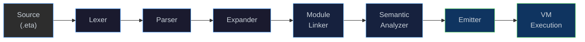

<p align="center">
  <strong>η (Eta)</strong><br>
  A Scheme-inspired language. 
</p>

<p align="center">
  <a href="docs/architecture.md">Architecture</a> ·
  <a href="docs/nanboxing.md">NaN-Boxing</a> ·
  <a href="docs/bytecode-vm.md">Bytecode &amp; VM</a> ·
  <a href="docs/runtime.md">Runtime &amp; GC</a> ·
  <a href="docs/modules.md">Modules &amp; Stdlib</a>
</p>

---

## What is Eta?

**Eta** is a Scheme-like programming language implemented entirely in modern
C++23. It features a multi-phase compilation pipeline that transforms
S-expression source code into compact bytecode and executes it on a
stack-based virtual machine with NaN-boxed values, closures, tail-call
elimination, first-class continuations (`call/cc`), a hygienic macro
expander with `syntax-rules`, and a module system.

The implementation ships as three executables — a **file interpreter**
(`etai`), an **interactive REPL** (`eta_repl`), and a **Language Server**
(`eta_lsp`) — along with a **VS Code extension** for syntax highlighting
and live diagnostics.

```scheme
;; Hello, Eta!
(module hello
  (import std.io)
  (begin
    (println "Hello, world!")

    (defun factorial (n)
      (if (= n 0) 1
          (* n (factorial (- n 1)))))

    (println (factorial 20))))
```

---

## Compilation Pipeline

Every Eta source file flows through six phases before execution.
The [`Driver`](eta/interpreter/src/eta/interpreter/driver.h) class
orchestrates the full pipeline and owns the runtime state:



| Phase | Input | Output | Header |
|-------|-------|--------|--------|
| **Lexer** | Raw UTF-8 text | Token stream | [`lexer.h`](eta/core/src/eta/reader/lexer.h) |
| **Parser** | Tokens | S-expression AST (`SExpr`) | [`parser.h`](eta/core/src/eta/reader/parser.h) |
| **Expander** | `SExpr` trees | Desugared core forms + macros | [`expander.h`](eta/core/src/eta/reader/expander.h) |
| **Module Linker** | Expanded modules | Resolved imports/exports | [`module_linker.h`](eta/core/src/eta/reader/module_linker.h) |
| **Semantic Analyzer** | Linked modules | Core IR (`Node` graph) | [`semantic_analyzer.h`](eta/core/src/eta/semantics/semantic_analyzer.h) |
| **Emitter** | Core IR | `BytecodeFunction`s | [`emitter.h`](eta/core/src/eta/semantics/emitter.h) |
| **VM** | Bytecode | Runtime values (`LispVal`) | [`vm.h`](eta/core/src/eta/runtime/vm/vm.h) |

> Every phase reports errors through a unified
> [`DiagnosticEngine`](eta/core/src/eta/diagnostic/diagnostic.h) with
> ANSI-coloured output and span information.

---

## Key Design Highlights

| Feature | Detail |
|---------|--------|
| **NaN-Boxing** | All values are 64-bit; doubles pass through unboxed while tagged types (fixnums, chars, symbols, heap pointers) are encoded in the NaN mantissa. [→ Deep-dive](docs/nanboxing.md) |
| **47-bit Fixnums** | Integers up to ±70 trillion are stored inline — no heap allocation. |
| **Mark-Sweep GC** | Stop-the-world collector with sharded heap, hazard pointers, and a GC callback for auto-triggering on soft-limit. [→ Deep-dive](docs/runtime.md) |
| **Tail-Call Elimination** | `TailCall` and `TailApply` opcodes reuse the current stack frame. |
| **First-Class Continuations** | `call/cc` captures the full stack + winding stack; `dynamic-wind` is supported. |
| **Hygienic Macros** | `syntax-rules` with ellipsis patterns, plus `defmacro` for procedural macros. |
| **Module System** | `(module …)` forms with `import`/`export`, `only`, `except`, `rename` filters. [→ Deep-dive](docs/modules.md) |
| **Arena Allocator** | IR nodes are block-allocated in a 16 KB arena for cache locality. |
| **Concurrent Heap** | `boost::unordered::concurrent_flat_map` with 16 shards for lock-free reads. |
| **LSP Integration** | JSON-RPC language server for real-time diagnostics in any editor. |

---

## Quick Start

### Prerequisites

| Tool | Version |
|------|---------|
| CMake | ≥ 3.28 |
| C++ compiler | C++23 (Clang 17+, GCC 13+, MSVC 17.8+) |
| Boost | ≥ 1.88 (`unit_test_framework`, `concurrent_flat_map`) |
| Node.js / npm | ≥ 18 *(for VS Code extension)* |

### Build & Run

**Linux / macOS**
```bash
chmod +x scripts/build-release.sh
./scripts/build-release.sh ./dist/eta-release
cd dist/eta-release
./install.sh
bin/eta_repl
```

**Windows (PowerShell)**
```powershell
.\scripts\build-release.ps1 .\dist\eta-release
cd dist\eta-release
.\install.cmd
bin\etai.exe examples\hello.eta
```

See [TESTING.md](TESTING.md) for full build, test, and release instructions.

### Bundle Layout

```
eta-<platform>/
  bin/
    etai(.exe)          # File interpreter
    eta_repl(.exe)      # Interactive REPL
    eta_lsp(.exe)       # Language Server (JSON-RPC over stdio)
  stdlib/
    prelude.eta         # Auto-loaded standard library
    std/
      core.eta  math.eta  io.eta  collections.eta  test.eta
  editors/
    vscode/             # VS Code extension (.vsix)
  install.sh / install.cmd
```

---

## Standard Library

The prelude auto-loads the following modules:

| Module | Highlights |
|--------|------------|
| **`std.core`** | `identity`, `compose`, `flip`, `constantly`, `iota`, `assoc-ref`, list utilities |
| **`std.math`** | `pi`, `e`, `square`, `gcd`, `lcm`, `expt`, `sum`, `product` |
| **`std.io`** | `println`, `eprintln`, `read-line`, port redirection helpers |
| **`std.collections`** | `map*`, `filter`, `foldl`, `foldr`, `sort`, `zip`, `range`, vector ops |
| **`std.test`** | `assert-equal`, `assert-true`, `run-tests` — lightweight test framework |

```scheme
(module my-app
  (import std.core)
  (import std.collections)
  (import std.io)
  (begin
    (define xs (iota 10))                    ;; (0 1 2 3 4 5 6 7 8 9)
    (println (filter odd? xs))               ;; (1 3 5 7 9)
    (println (foldl + 0 (filter even? xs)))  ;; 20
  ))
```

---

## Documentation

| Page | Contents |
|------|----------|
| **[Architecture](docs/architecture.md)** | Full system diagram, phase-by-phase walkthrough, Core IR node types |
| **[NaN-Boxing](docs/nanboxing.md)** | 64-bit memory layout, bit-field breakdown, encoding/decoding examples |
| **[Bytecode & VM](docs/bytecode-vm.md)** | Opcode reference, end-to-end compilation trace, call stack model, TCO |
| **[Runtime & GC](docs/runtime.md)** | Heap architecture, object kinds, mark-sweep GC, intern table, factory |
| **[Modules & Stdlib](docs/modules.md)** | Module syntax, linker phases, import filters, standard library reference |

---

## Project Structure

```
eta/
├── CMakeLists.txt              # Top-level build
├── eta/
│   ├── core/                   # Shared library: reader + semantics + runtime
│   │   └── src/eta/
│   │       ├── reader/         # Lexer, Parser, Expander, Module Linker
│   │       ├── semantics/      # Semantic Analyzer, Core IR, Emitter, Arena
│   │       ├── runtime/        # NaN-box, VM, Heap, GC, Types, Primitives
│   │       └── diagnostic/     # Unified error reporting
│   ├── interpreter/            # etai + eta_repl (Driver orchestration)
│   ├── lsp/                    # eta_lsp (Language Server Protocol)
│   ├── test/                   # Boost.Test unit tests
│   └── fuzz/                   # Fuzz testing (heap, intern table, nanbox)
├── stdlib/                     # Standard library (.eta files)
├── editors/vscode/             # VS Code extension (TextMate grammar)
├── scripts/                    # Build & install automation
└── docs/                       # Design documentation (you are here)
```

---

## License

See [LICENSE](LICENSE) for details.

