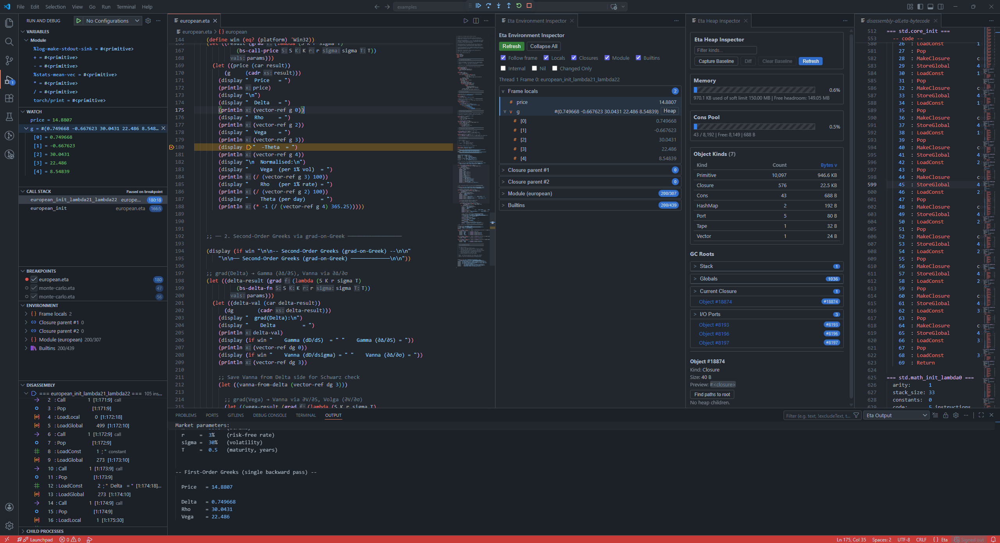
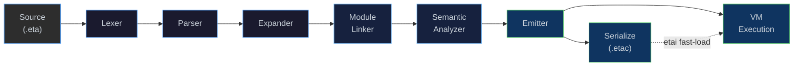

<!--[eta_logo.svg](docs/img/eta.svg) -->

<p align="center">
  
</p>


<p align="center">
  <strong>η (Eta)</strong><br>
  A Lisp/Scheme-inspired language. 
</p>

<p align="center">
  <a href="docs/architecture.md">Architecture</a> ·
  <a href="docs/nanboxing.md">NaN-Boxing</a> ·
  <a href="docs/bytecode-vm.md">Bytecode &amp; VM</a> ·
  <a href="docs/compiler.md">Compiler</a> ·
  <a href="docs/optimization.md">Optimization</a> ·
  <a href="docs/runtime.md">Runtime &amp; GC</a> ·
  <a href="docs/modules.md">Modules &amp; Stdlib</a> ·
  <a href="docs/next-steps.md">Next Steps</a>
</p>
<br>
<p align="center">
Language Guide</p>
<p align="center">
  <a href="docs/examples.md">Basics</a> ·
  <a href="docs/aad.md">Reverse Mode AAD Example w/XVA</a> ·
  <a href="docs/european.md">European Option Greeks with AAD</a> ·
  <a href="docs/sabr.md">SABR Volatility Model</a> ·
  <a href="docs/logic.md">Logic Programming – Unification and Backtracking</a> ·
  <a href="docs/clp.md">Constraint Logic Programming</a> ·
  <a href="docs/causal.md">Causal Inference &amp; Do-Calculus</a> ·
  <a href="docs/torch.md">Neural Networks with libtorch</a>
</p>
<br>
<p align="center">
<strong>Featured Examples</strong></p>
<p align="center">
  <a href="docs/causal_factor.md">Causal Neural Model</a> (Symbolic → Causal → Logic → Neural) Causal estimation pipeline
</p>


---

## What is Eta?

**Eta** is a Scheme-like programming language implemented in 
C++. It features a multi-phase compilation pipeline that transforms
S-expression source code into compact bytecode and executes it on a
stack-based virtual machine with NaN-boxed values, closures, tail-call
elimination, first-class continuations (`call/cc`), a hygienic macro
expander with `syntax-rules`, and a module system.

Eta also provides native structural unification as a first-class VM feature,
allowing Prolog-style pattern matching and type inference (see [Logic Programming](docs/logic.md)),
as well as built-in constraint logic programming with interval and finite-domain solvers (see [CLP](docs/clp.md)).

The implementation ships as five executables and a VS Code extension:

<p align="center">
  <strong>Bytecode Compiler</strong> (<code>etac</code>)<br>
  <strong>Interpreter</strong> (<code>etai</code>)<br>
  <strong>Interactive REPL</strong> (<code>eta_repl</code>)<br>
  <strong>Language Server</strong> (<code>eta_lsp</code>)<br>
  <strong>Debug Adapter</strong> (<code>eta_dap</code>)<br>
  <strong>VS Code Extension</strong>
</p>

```scheme
;; Hello, Eta!
(module hello
  (import std.io)
  (begin
    (println "Hello, world!")

    (defun factorial (n)
      (if (= n 0) 1
          (* n (factorial (- n 1)))))

    (println (factorial 20))))
```
 
---
 ## TLDR;

 Download the initial release and run examples in [VSCode](TLDR.md)



---

## Compilation Pipeline

Every Eta source file flows through six phases before execution.
The [`Driver`](eta/interpreter/src/eta/interpreter/driver.h) class
orchestrates the full pipeline and owns the runtime state:



| Phase | Input | Output | Header |
|-------|-------|--------|--------|
| **Lexer** | Raw UTF-8 text | Token stream | [`lexer.h`](eta/core/src/eta/reader/lexer.h) |
| **Parser** | Tokens | S-expression AST (`SExpr`) | [`parser.h`](eta/core/src/eta/reader/parser.h) |
| **Expander** | `SExpr` trees | Desugared core forms + macros | [`expander.h`](eta/core/src/eta/reader/expander.h) |
| **Module Linker** | Expanded modules | Resolved imports/exports | [`module_linker.h`](eta/core/src/eta/reader/module_linker.h) |
| **Semantic Analyzer** | Linked modules | Core IR (`Node` graph) | [`semantic_analyzer.h`](eta/core/src/eta/semantics/semantic_analyzer.h) |
| **Emitter** | Core IR | `BytecodeFunction`s | [`emitter.h`](eta/core/src/eta/semantics/emitter.h) |
| **VM** | Bytecode | Runtime values (`LispVal`) | [`vm.h`](eta/core/src/eta/runtime/vm/vm.h) |

> [!NOTE]
> Every phase reports errors through a unified
> [`DiagnosticEngine`](eta/core/src/eta/diagnostic/diagnostic.h) with
> span information.

---

## Key Design Highlights

| Feature | Detail                                                                                                                                                                            |
|---------|-----------------------------------------------------------------------------------------------------------------------------------------------------------------------------------|
| **NaN-Boxing** | All values are 64-bit; doubles pass through unboxed while tagged types (fixnums, chars, symbols, heap pointers) are encoded in the NaN mantissa. [→ Deep-dive](docs/nanboxing.md) |
| **AOT Compilation** | `etac` compiles `.eta` → `.etac` bytecode; `etai` loads `.etac` files directly, skipping all front-end phases. Supports `-O` optimization passes (constant folding, DCE). [→ Deep-dive](docs/compiler.md) |
| **47-bit Fixnums** | Integers up to ±70 trillion are stored inline — no heap allocation.                                                                                                               |
| **Mark-Sweep GC** | Stop-the-world collector with sharded heap, hazard pointers, and a GC callback for auto-triggering on soft-limit. [→ Deep-dive](docs/runtime.md)                                  |
| **Tail-Call Elimination** | `TailCall` and `TailApply` opcodes reuse the current stack frame.                                                                                                                 |
| **First-Class Continuations** | `call/cc` captures the full stack + winding stack; `dynamic-wind` is supported.                                                                                                   |
| **Hygienic Macros** | `syntax-rules` with ellipsis patterns.                                                                                                                                            |
| **Module System** | `(module …)` forms with `import`/`export`, `only`, `except`, `rename` filters. [→ Deep-dive](docs/modules.md)                                                                     |
| **Arena Allocator** | IR nodes are block-allocated in a 16 KB arena for cache locality.                                                                                                                 |
| **Concurrent Heap** | `boost::unordered::concurrent_flat_map` with 16 shards for lock-free reads.                                                                                                       |
| **LSP Integration** | JSON-RPC language server for real-time diagnostics in any editor.                                                                                                                 |
| **DAP Integration** | Debug Adapter Protocol server (`eta_dap`) enables breakpoints, step-through debugging, call-stack inspection, and REPL-style expression evaluation directly in VS Code.           |
| **libtorch Integration** | Optional native bindings to PyTorch's C++ backend for tensors, autograd, neural-network layers, optimizers, and GPU offload. [→ Deep-dive](docs/torch.md) |

---


## Documentation

| Page                                       | Contents                                                                                      |
|--------------------------------------------|-----------------------------------------------------------------------------------------------|
| **[Architecture](docs/architecture.md)**   | Full system diagram, phase-by-phase walkthrough, Core IR node types                           |
| **[NaN-Boxing](docs/nanboxing.md)**        | 64-bit memory layout, bit-field breakdown, encoding/decoding examples                         |
| **[Bytecode & VM](docs/bytecode-vm.md)**   | Opcode reference, end-to-end compilation trace, call stack model, TCO                         |
| **[Compiler (`etac`)](docs/compiler.md)**  | AOT bytecode compiler: CLI reference, `.etac` binary format, optimization passes, disassembly |
| **[Optimization](docs/optimization.md)**   | IR optimization pipeline architecture, built-in passes, writing custom passes                 |
| **[Runtime & GC](docs/runtime.md)**        | Heap architecture, object kinds, mark-sweep GC, intern table, factory                         |
| **[Modules & Stdlib](docs/modules.md)**    | Module syntax, linker phases, import filters, standard library reference                      |
| **[Language Guide](docs/examples.md)**     | Guided tour of the language using simple example programs with expected output                |
| **[AAD](docs/aad.md)**                     | Reverse-mode automatic differentiation walkthrough                                            |
| **[xVA](docs/xva.md)**                     | Finance use case: CVA, FVA, and sensitivities via AAD                                         |
| **[European Greeks](docs/european.md)**    | BS option Greeks (first & second order) with custom VJP and Schwarz check                     |
| **[SABR Volatility Model](docs/sabr.md)** | SABR Hagan implied vol, native Dual VM performance, Hessian via reverse-on-reverse            |
| **[CLP](docs/clp.md)**                     | Constraint Logic Programming: clp(Z) intervals, clp(FD) finite domains, `clp:solve`           |
| **[Causal Inference](docs/causal.md)**     | Do-calculus engine, back-door adjustment, finance factor analysis                             |
| **[Causal Neural Factor Analysis](docs/causal_factor.md)** | Demo: symbolic diff → do-calculus → logic/CLP → libtorch NN → ATE                             |
| **[Neural Networks](docs/torch.md)**       | libtorch integration: tensors, autograd, NN layers, training loops, GPU support               |
| **[Next Steps](docs/next-steps.md)**       | Roadmap: network stack, VS Code debugger improvements, performance                            |

---

## Quick Start

### Option 1 — Pre-built Release (recommended)

Download the latest release for your platform, unpack it, and run the installer:

| Platform | Archive                          |
|----------|----------------------------------|
| Windows x64 | `eta-v0.0.9-win-x64.zip`         |
| Linux x86_64 | `eta-v0.0.9-linux-x86_64.tar.gz` |

**Windows (PowerShell / Command Prompt):**
```console
cd eta-v0.0.9-win-x64
.\install.cmd
```

**Linux / macOS:**
```console
cd eta-v0.0.9-linux-x86_64
chmod +x install.sh && ./install.sh
```

The installer:
- Adds `bin/` to your `PATH`
- Sets `ETA_MODULE_PATH` so the runtime can locate the standard library
- Installs the VS Code extension automatically if VS Code is detected

> [!NOTE]
> Open a **new** terminal after running the installer for the environment changes to take effect.

**Try it out:**
```console
etai --help
eta_repl
etai examples/hello.eta
etac examples/hello.eta && etai examples/hello.etac
```

#### VS Code Setup

The VS Code extension is installed automatically by the installer. You only need to point it at the executables inside the release bundle. Open VS Code settings (`Ctrl+,`) and search for **Eta**, or add the following to your `settings.json`:

```json
{
  "eta.executablePath": "/path/to/eta-release/bin/etai",
  "eta.lspPath":        "/path/to/eta-release/bin/eta_lsp",
  "eta.dapPath":        "/path/to/eta-release/bin/eta_dap"
}
```

Then open the `examples/` folder (**File → Open Folder**), open any `.eta` file, and run it from the integrated terminal with `etai <file>.eta`.  To start a debug session press **F5** — the extension launches `eta_dap` automatically and connects VS Code's debugger, giving you breakpoints, step-through execution, call-stack inspection, and an inline expression evaluator.

See [TLDR.md](TLDR.md) for a step-by-step walkthrough with screenshots.

---

### Option 2 — Build from Source

#### Prerequisites

| Tool | Version |
|------|---------|
| CMake | ≥ 3.28 |
| C++ compiler | C++23 (Clang 17+, GCC 13+, MSVC 17.8+) |
| Boost | ≥ 1.88 (`unit_test_framework`, `concurrent_flat_map`) |
| Node.js / npm | ≥ 18 *(for VS Code extension)* |


**Linux / macOS**
```bash
chmod +x scripts/build-release.sh
./scripts/build-release.sh ./dist/eta-release
cd dist/eta-release
./install.sh
bin/eta_repl
```

**Windows (PowerShell)**
```powershell
.\scripts\build-release.ps1 .\dist\eta-release
cd dist\eta-release
.\install.cmd
etai examples\hello.eta
```

See [TESTING.md](TESTING.md) for full build, test, and release instructions.
See [Examples](docs/examples.md) for a guided tour of the example programs.

### Bundle Layout

```
eta-<platform>/
  bin/
    etac(.exe)          # Ahead-of-time bytecode compiler
    etai(.exe)          # File interpreter (also runs .etac files)
    eta_repl(.exe)      # Interactive REPL
    eta_lsp(.exe)       # Language Server (JSON-RPC over stdio)
    eta_dap(.exe)       # Debug Adapter (DAP over stdio, used by VS Code)
  stdlib/
    prelude.eta         # Auto-loaded standard library
    std/
      core.eta  math.eta  io.eta  collections.eta  test.eta
      logic.eta  clp.eta  causal.eta  torch.eta
  examples/
    hello.eta           # Hello world & factorial
    basics.eta          # Arithmetic, let, lists, quoting
    functions.eta       # defun, lambda, closures, recursion
    higher-order.eta    # map, filter, fold, sort, zip
    composition.eta     # compose, flip, currying, pipelines
    recursion.eta       # Fibonacci, Ackermann, Hanoi
    exceptions.eta      # catch/raise, dynamic-wind
    boolean-simplifier.eta  # Symbolic boolean rewriting
    symbolic-diff.eta       # Symbolic differentiation & simplification
    unification.eta         # Native structural unification primitives
    logic.eta               # Relational logic programming
    aad.eta                 # Reverse-mode automatic differentiation
    xva.eta                 # Finance example: CVA, FVA calculations with AAD
    european.eta            # European option Greeks (1st & 2nd order) with AAD
    sabr.eta                # SABR vol surface with tape-based AD
    torch.eta               # Tensor computing & neural network training (libtorch)
    causal_demo.eta         # Demo: symbolic + causal + logic/CLP + libtorch
    causal-factor/          # End-to-end causal factor analysis
    do-calculus/            # Do-calculus identification engine demos
  editors/
    vscode/             # VS Code extension (.vsix)
  install.sh / install.cmd
```

---

## Standard Library

The prelude auto-loads the following modules:

| Module | Highlights |
|--------|------------|
| **`std.core`** | `identity`, `compose`, `flip`, `constantly`, `iota`, `assoc-ref`, list utilities |
| **`std.math`** | `pi`, `e`, `square`, `gcd`, `lcm`, `expt`, `sum`, `product` |
| **`std.io`** | `println`, `eprintln`, `read-line`, port redirection helpers |
| **`std.collections`** | `map*`, `filter`, `foldl`, `foldr`, `sort`, `zip`, `range`, vector ops |
| **`std.logic`** | `==`, `copy-term`, `naf`, `findall`, `run1` — Prolog-style combinators |
| **`std.clp`** | `clp:domain`, `clp:in-fd`, `clp:solve`, `clp:all-different` — constraint solving |
| **`std.causal`** | `dag:*`, `do:identify`, `do:estimate-effect` — causal inference engine |
| **`std.torch`** | `tensor`, `forward`, `train-step!`, `sgd`, `adam` — libtorch neural networks |
| **`std.test`** | `assert-equal`, `assert-true`, `run-tests` — lightweight test framework |

```scheme
(module my-app
  (import std.core)
  (import std.collections)
  (import std.io)
  (begin
    (define xs (iota 10))                    ;; (0 1 2 3 4 5 6 7 8 9)
    (println (filter odd? xs))               ;; (1 3 5 7 9)
    (println (foldl + 0 (filter even? xs)))  ;; 20
  ))
```

---

## Project Structure

```
eta/
├── CMakeLists.txt              # Top-level build
├── eta/
│   ├── core/                   # Shared library: reader + semantics + runtime
│   │   └── src/eta/
│   │       ├── reader/         # Lexer, Parser, Expander, Module Linker
│   │       ├── semantics/      # Semantic Analyzer, Core IR, Emitter, Arena
│   │       ├── runtime/        # NaN-box, VM, Heap, GC, Types, Primitives
│   │       └── diagnostic/     # Unified error reporting
│   ├── compiler/               # etac (AOT bytecode compiler)
│   ├── interpreter/            # etai + eta_repl (Driver orchestration)
│   ├── lsp/                    # eta_lsp (Language Server Protocol, JSON-RPC over stdio)
│   ├── dap/                    # eta_dap (Debug Adapter Protocol, DAP over stdio)
│   ├── torch/                  # libtorch integration (optional, -DETA_BUILD_TORCH=ON)
│   ├── test/                   # Boost.Test unit tests
│   └── fuzz/                   # Fuzz testing (heap, intern table, nanbox)
├── stdlib/                     # Standard library (.eta files)
│   ├── prelude.eta             # Auto-loaded prelude
│   └── std/
│       ├── core.eta            # Combinators, list utilities, platform helpers
│       ├── math.eta            # Arithmetic, trig, gcd/lcm
│       ├── io.eta              # I/O primitives
│       ├── collections.eta     # map*, filter, foldl, sort, zip, range
│       ├── logic.eta           # Prolog-style unification & backtracking
│       ├── clp.eta             # Constraint Logic Programming: clp(Z), clp(FD)
│       ├── causal.eta          # DAG utilities & Pearl do-calculus engine
│       ├── torch.eta           # libtorch wrappers (tensors, NN, optimizers)
│       └── test.eta            # Lightweight test framework
├── examples/                   # Example programs
│   ├── hello.eta               # Hello world & factorial
│   ├── basics.eta              # Arithmetic, let, lists, quoting
│   ├── functions.eta           # defun, lambda, closures, recursion
│   ├── higher-order.eta        # map, filter, fold, sort, zip
│   ├── composition.eta         # compose, flip, currying, pipelines
│   ├── recursion.eta           # Fibonacci, Ackermann, Hanoi
│   ├── exceptions.eta          # catch/raise, dynamic-wind, re-raising
│   ├── boolean-simplifier.eta  # Symbolic boolean rewriting
│   ├── symbolic-diff.eta       # Symbolic differentiation & simplification
│   ├── unification.eta         # Native structural unification primitives
│   ├── logic.eta               # Relational logic programming (parento, findall)
│   ├── aad.eta                 # Reverse-mode automatic differentiation
│   ├── xva.eta                 # Finance: CVA, FVA with AAD sensitivities
│   ├── european.eta            # European option Greeks (1st & 2nd order) with AAD
│   ├── sabr.eta                # SABR vol surface with tape-based AD
│   ├── torch.eta               # Tensor computing & neural network training
│   ├── causal_demo.eta         # Flagship: symbolic + causal + logic/CLP + libtorch
│   ├── causal-factor/          # End-to-end causal factor analysis (finance)
│   └── do-calculus/            # Do-calculus identification engine demos
├── editors/vscode/             # VS Code extension (TextMate grammar)
├── scripts/                    # Build & install automation
└── docs/                       # Design documentation (you are here)
```

---

## License

See [LICENSE](LICENSE) for details.
