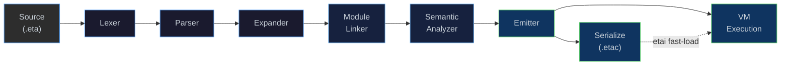

<!--[eta_logo.svg](docs/img/eta.svg) -->

<p align="center">
  
</p>


<p align="center">
  <strong>η (Eta)</strong><br>
  A Lisp/Scheme-inspired language with built-in logic programming,<br>
  automatic differentiation, neural networks, and causal inference.
</p>

<p align="center">
  <a href="docs/quickstart.md">Quick Start</a> ·
  <a href="docs/vscode.md">VS Code Extension</a> ·
  <a href="docs/jupyter.md">Jupyter Kernel</a> ·
  <a href="docs/build.md">Build from Source</a> ·
  <a href="docs/architecture.md">Architecture</a> ·
  <a href="docs/modules.md">Modules &amp; Stdlib</a> ·
  <a href="docs/index.md">All Documentation</a> ·
  <a href="docs/release-notes.md">Release Notes</a>
</p>
<br>
<p align="center"><strong>Language Guides</strong></p>

<div align="center">

| Area | Guides |
|---|---|
| **Foundations** | [Basics](docs/examples.md) · [Regex](docs/regex.md) · [Time](docs/time.md) · [CSV](docs/csv.md) · [Networking](docs/networking.md) · [Actors / Message Passing](docs/message-passing.md) |
| **Logic & Constraints** | [Logic Programming](docs/logic.md) · [CLP](docs/clp.md) · [Fact Tables](docs/fact-table.md) |
| **Numerics & ML** | [AAD](docs/aad.md) · [Eigen — Linear Algebra & Stats](docs/stats.md) · [LibTorch — Neural Networks](docs/torch.md) |
| **Causal** | [Causal Inference & Do-Calculus](docs/causal.md) |
</div>

<br>
<p align="center"><strong>Featured Examples</strong></p>

<p align="center">
  <a href="docs/portfolio.md">Causal Decision Engine for Portfolio Optimisation</a>
  (<a href="examples/notebooks/Portfolio.ipynb">Notebook</a>)
</p>
<p align="center">
  <a href="docs/xva-wwr.md">Wrong Way Risk via do(...) interventions</a>
</p>

<!--
  Binder launch badges will land here once the binder/ Dockerfile is
  verified end-to-end. See docs/eta_plan.md §2.
-->

---

## What is Eta?

**Eta** is a Scheme-like language designed for **symbolic reasoning,
differentiable programming, neural-network training, and causal
inference** — all from a single S-expression syntax.
It compiles to compact bytecode and runs on a stack-based VM implemented
in C++ (NaN-boxed values, closures, TCO, `call/cc`, hygienic macros,
module system — see [Architecture](docs/architecture.md) for the
full compilation pipeline).

### Headline Features

| Domain | What you get | Deep-dive |
|--------|-------------|-----------|
| **Scheme Core** | Closures, tail-call elimination, first-class continuations (`call/cc`), hygienic `syntax-rules` macros, module system with import filters | [Bytecode & VM](docs/bytecode-vm.md) · [Modules](docs/modules.md) |
| **Logic Programming** | VM-native structural unification & backtracking — seven dedicated opcodes give you Prolog-style pattern matching without leaving the language | [Logic](docs/logic.md) |
| **Constraint Logic Programming** | `clp(Z)` integer-interval and `clp(FD)` finite-domain solvers built on the unification layer | [CLP](docs/clp.md) |
| **Reverse-Mode AAD** | VM-native tape-based automatic differentiation — standard arithmetic is recorded transparently when a `TapeRef` operand is present; zero closure overhead | [AAD – Finance Examples](docs/aad.md) |
| **Linear Algebra & Statistics** | Eigen-backed multivariate OLS, covariance/correlation matrices, column quantiles over FactTables; plus `std.stats` descriptive stats, CIs, t-tests, and simple OLS over lists | [Stats](docs/stats.md) |
| **Neural Networks (libtorch)** | Native C++ bindings to PyTorch's backend — tensors, autograd, NN layers, optimizers, and GPU offload from Eta code | [LibTorch](docs/torch.md) |
| **Causal Inference** | Pearl's do-calculus engine, back-door / front-door adjustment, and end-to-end factor analysis | [Causal](docs/causal.md) |
| **Message Passing & Actors** | Erlang-style actor model via nng: `spawn` child processes, `send!`/`recv!` over PAIR sockets, `worker-pool` parallel fan-out, REQ/REP, PUB/SUB, SURVEYOR/RESPONDENT, and supervision trees (`one-for-one`, `one-for-all`) — network-transparent across machines | [Networking](docs/networking.md) · [Message Passing](docs/message-passing.md) · [Supervisors](docs/supervisor.md) |
| **End-to-End Pipeline** | All domains compose: symbolic differentiation → do-calculus identification → logic/CLP validation → libtorch neural estimation → AAD risk → CLP(R)+QP allocation | [Portfolio Engine](docs/portfolio.md) · [Causal Primer](docs/causal-factor.md) |

The implementation ships as seven executables, a VS Code extension, and a Jupyter kernel:

<p align="center">
  <strong>Bytecode Compiler</strong> (<code>etac</code>)<br>
  <strong>Interpreter</strong> (<code>etai</code>)<br>
  <strong>Interactive REPL</strong> (<code>eta_repl</code>)<br>
  <strong>Language Server</strong> (<code>eta_lsp</code>)<br>
  <strong>Debug Adapter</strong> (<code>eta_dap</code>)<br>
  <strong>Test Runner</strong> (<code>eta_test</code>)<br>
  <strong>Jupyter Kernel</strong> (<code>eta_jupyter</code>)<br>
  <strong>VS Code Extension</strong>
</p>


---

## Install & Run

Download the latest [release](https://github.com/lewismj/eta/releases)
for your platform, unpack it, and run the installer:

| Platform     | Archive                          |
|--------------|----------------------------------|
| Windows x64  | `eta-v0.4.0-win-x64.zip`         |
| Linux x86_64 | `eta-v0.4.0-linux-x86_64.tar.gz` |

```bash
# Windows                              # Linux / macOS
cd eta-v0.2.0-win-x64                  cd eta-v0.4.0-linux-x86_64
.\install.cmd                          chmod +x install.sh && ./install.sh
```

The installer adds `bin/` to your `PATH`, sets `ETA_MODULE_PATH`, and
installs the VS Code extension automatically if VS Code is detected.

> [!NOTE]
> Open a **new** terminal after running the installer for the
> environment changes to take effect.

<details>
<summary><strong>Run a script — <code>etai</code></strong></summary>

`etai` compiles a `.eta` file in-memory and executes it immediately:

```console
$ etai examples/hello.eta
Hello, world!
2432902008176640000
```

</details>

<details>
<summary><strong>Ahead-of-time compile — <code>etac</code></strong></summary>

`etac` compiles `.eta` source to compact `.etac` bytecode. `etai` then
loads `.etac` files directly, **skipping all front-end phases** (lex,
parse, expand, link, analyze, emit) for faster startup:

```console
$ etac examples/hello.eta
compiled examples/hello.eta → examples/hello.etac (3 functions, 1 module(s))

$ etai examples/hello.etac
Hello, world!
2432902008176640000
```

Key flags:

| Flag | Effect |
|------|--------|
| `-O` | Enable optimization passes (constant folding, dead code elimination) |
| `--disasm` | Print human-readable bytecode to stdout (no `.etac` written) |
| `--no-debug` | Strip source maps for a smaller output file |
| `-o <path>` | Custom output path (default: `<input>.etac`) |

```console
$ etac -O examples/hello.eta -o hello-opt.etac
$ etac --disasm examples/hello.eta
```

</details>

<details>
<summary><strong>Interactive REPL — <code>eta_repl</code></strong></summary>

```console
$ eta_repl
η> (+ 1 2 3 4 5)
=> 15
η> (exit)
```

</details>

<details>
<summary><strong>VS Code — debugging, heap inspector, disassembly</strong></summary>

The installer automatically sets up the VS Code extension. Configure
the paths in settings (`Ctrl+,` → search **Eta**):

```json
{
  "eta.lsp.serverPath":     "/path/to/eta-v0.2.0/bin/eta_lsp",
  "eta.dap.executablePath": "/path/to/eta-v0.2.0/bin/eta_dap"
}
```

Open the `examples/` folder, open any `.eta` file, and press **F5** to
debug. The extension provides:

- **Syntax highlighting** and **live diagnostics** (LSP)
- **Breakpoints & stepping** — F10 Step Over · F11 Step In · Shift+F11 Step Out · F5 Continue
- **Heap Inspector** — live memory gauge, per-kind object stats, GC root tree with drill-down (`Ctrl+Shift+P` → *Eta: Show Heap Inspector*)
- **Disassembly View** — live bytecode with current-PC marker in the Debug sidebar (`Ctrl+Shift+P` → *Eta: Show Disassembly*)
- **GC Roots Tree** — expandable root categories (Stack, Globals, Frames), module-grouped globals, object drill-down
- **Child Processes** — debug sidebar panel listing all spawned actor processes with PID, endpoint, and live/exited status


For the full feature tour with screenshots, see
[VS Code Extension](docs/vscode.md).

</details>

<details>
<summary><strong>Build from source</strong></summary>

```bash
# Linux / macOS
./scripts/build-release.sh ./dist/eta-release
cd dist/eta-release && ./install.sh

# Windows (PowerShell)
.\scripts\build-release.ps1 .\dist\eta-release
cd dist\eta-release; .\install.cmd
```

Full prerequisites, manual CMake steps, and CI details:
**[Building from Source](docs/build.md)**.
The release archive layout (`bin/`, `lib/`, `stdlib/`, `editors/`) is
documented in **[Quick Start](docs/quickstart.md)**.

</details>

> [!TIP]
> See [TLDR.md](TLDR.md) for a step-by-step walkthrough with
> screenshots, or [Quick Start](docs/quickstart.md) for the full
> reference. A guided tour of the example programs lives in the
> [Language Guide](docs/examples.md).

---

## Compilation Pipeline

Every Eta source file flows through six phases before execution.
The [`Driver`](eta/session/src/eta/session/driver.h) class
orchestrates the full pipeline and owns the runtime state:



| Phase                 | Input | Output | Header |
|-----------------------|-------|--------|--------|
| **Lexer**             | Raw UTF-8 text | Token stream | [`lexer.h`](eta/core/src/eta/reader/lexer.h) |
| **Parser**            | Tokens | S-expression AST (`SExpr`) | [`parser.h`](eta/core/src/eta/reader/parser.h) |
| **Expander**          | `SExpr` trees | Desugared core forms + macros | [`expander.h`](eta/core/src/eta/reader/expander.h) |
| **Module Linker**     | Expanded modules | Resolved imports/exports | [`module_linker.h`](eta/core/src/eta/reader/module_linker.h) |
| **Semantic Analyzer** | Linked modules | Core IR (`Node` graph) | [`semantic_analyzer.h`](eta/core/src/eta/semantics/semantic_analyzer.h) |
| **Emitter**           | Core IR | `BytecodeFunction`s | [`emitter.h`](eta/core/src/eta/semantics/emitter.h) |
| **VM**                | Bytecode | Runtime values (`LispVal`) | [`vm.h`](eta/core/src/eta/runtime/vm/vm.h) |

> [!NOTE]
> Every phase reports errors through a unified
> [`DiagnosticEngine`](eta/core/src/eta/diagnostic/diagnostic.h) with
> span information.

---

## Key Design Highlights

| Feature | Detail                                                                                                                                                                            |
|---------|-----------------------------------------------------------------------------------------------------------------------------------------------------------------------------------|
| **NaN-Boxing** | All values are 64-bit; doubles pass through unboxed while tagged types (fixnums, chars, symbols, heap pointers) are encoded in the NaN mantissa. [→ Deep-dive](docs/nanboxing.md) |
| **AOT Compilation** | `etac` compiles `.eta` → `.etac` bytecode; `etai` loads `.etac` files directly, skipping all front-end phases. Supports `-O` optimization passes (constant folding, DCE). [→ Deep-dive](docs/compiler.md) |
| **47-bit Fixnums** | Integers up to ±70 trillion are stored inline — no heap allocation.                                                                                                               |
| **Mark-Sweep GC** | Stop-the-world collector with sharded heap, hazard pointers, and a GC callback for auto-triggering on soft-limit. [→ Deep-dive](docs/runtime.md)                                  |
| **Tail-Call Elimination** | `TailCall` and `TailApply` opcodes reuse the current stack frame.                                                                                                                 |
| **First-Class Continuations** | `call/cc` captures the full stack + winding stack; `dynamic-wind` is supported.                                                                                                   |
| **Hygienic Macros** | `syntax-rules` with ellipsis patterns.                                                                                                                                            |
| **Module System** | `(module …)` forms with `import`/`export`, `only`, `except`, `rename` filters. [→ Deep-dive](docs/modules.md)                                                                     |
| **Arena Allocator** | IR nodes are block-allocated in a 16 KB arena for cache locality.                                                                                                                 |
| **Concurrent Heap** | `boost::unordered::concurrent_flat_map` with 16 shards for lock-free reads.                                                                                                       |
| **LSP Integration** | JSON-RPC language server for real-time diagnostics in any editor.                                                                                                                 |
| **DAP Integration** | Debug Adapter Protocol server (`eta_dap`) enables breakpoints, step-through debugging, call-stack inspection, and REPL-style expression evaluation directly in VS Code.           |
| **libtorch Integration** | Native C++ bindings to PyTorch's backend for tensors, autograd, neural-network layers, optimizers, and GPU offload. [→ Deep-dive](docs/torch.md) |
| **nng Networking** | Erlang-style actor model: `spawn` processes, `send!`/`recv!`, `worker-pool` for parallel fan-out, REQ/REP, PUB/SUB, SURVEYOR/RESPONDENT — network-transparent over IPC or TCP. [→ Deep-dive](docs/networking.md) · [Actor Model](docs/message-passing.md) |

---

## Standard Library

The prelude auto-loads the following modules:

| Module | Highlights |
|--------|------------|
| **`std.core`** | `identity`, `compose`, `flip`, `constantly`, `iota`, `assoc-ref`, list utilities |
| **`std.math`** | `pi`, `e`, `square`, `gcd`, `lcm`, `expt`, `sum`, `product` |
| **`std.io`** | `println`, `eprintln`, `read-line`, port redirection helpers |
| **`std.collections`** | `map*`, `filter`, `foldl`, `foldr`, `sort`, `zip`, `range`, vector ops |
| **`std.regex`** | `regex:compile`, `regex:match?`, `regex:search`, `regex:find-all`, `regex:replace`, `regex:split` |
| **`std.logic`** | `==`, `copy-term`, `naf`, `findall`, `run1`, `run*`, `run-n` — Prolog/miniKanren-style combinators |
| **`std.freeze`** | `freeze`, `dif` — suspended goals & structural disequality on attributed vars |
| **`std.db`** | `defrel`, `assert`, `retract`, `call-rel`, `tabled` — fact-table-backed relations with SLG-lite tabling |
| **`std.clp`** | `clp:domain`, `clp:in-fd`, `clp:solve`, `clp:all-different`, `clp:labeling`, `clp:minimize`/`maximize` — CLP(Z) and CLP(FD) |
| **`std.clpb`** | `clp:boolean`, `clp:and/or/xor/imp/eq/not`, `clp:card`, `clp:sat?`, `clp:taut?` — CLP(B) Boolean propagation |
| **`std.clpr`** | `clp:real`, `clp:r<=`, `clp:r=`, `clp:r-minimize`/`maximize`, `clp:rq-minimize`/`maximize` — CLP(R) linear + convex QP |
| **`std.causal`** | `dag:*`, `do:identify`, `do:estimate-effect` — causal inference engine |
| **`std.csv`** | `csv:open-reader`, `csv:read-record`, `csv:read-typed-row`, `csv:open-writer`, `csv:save-file` |
| **`std.fact_table`** | `make-fact-table`, `fact-table-insert!`, `fact-table-query`, `fact-table-fold` — columnar fact tables |
| **`std.stats`** | Descriptive stats, normal/t quantiles, CIs, t-tests, OLS regression (Eigen-backed) |
| **`std.time`** | Wall-clock + monotonic time, UTC/local parts, ISO-8601 formatting |
| **`std.torch`** | `tensor`, `manual-seed`, `cholesky`, `mvnormal`, `forward`, `train-step!`, `sgd`, `adam` — libtorch neural networks |
| **`std.net`** | `spawn`, `send!`, `recv!`, `monitor`, `worker-pool`, `with-socket`, `request-reply`, `pub-sub`, `survey` — Erlang-style actors & nng |
| **`std.supervisor`** | `one-for-one`, `one-for-all` — supervision trees over actor processes |
| **`std.test`** | `assert-equal`, `assert-true`, `run-tests` — lightweight test framework |

```scheme
(module my-app
  (import std.core)
  (import std.collections)
  (import std.io)
  (begin
    (define xs (iota 10))                    ;; (0 1 2 3 4 5 6 7 8 9)
    (println (filter odd? xs))               ;; (1 3 5 7 9)
    (println (foldl + 0 (filter even? xs)))  ;; 20
  ))
```

---

## Documentation

The most-clicked pages — see **[`docs/index.md`](docs/index.md)** for
the full index (architecture deep-dives, every stdlib module, runtime
internals, networking design, release notes, roadmap):

| Page                                          | Contents                                                                                      |
|-----------------------------------------------|-----------------------------------------------------------------------------------------------|
| **[Quick Start](docs/quickstart.md)**         | Installing, running `etai`/`etac`, REPL, modules, VS Code extension                           |
| **[VS Code Extension](docs/vscode.md)**       | Install, configure, debugging, heap/disassembly/child-process panels, Test Explorer           |
| **[Jupyter Kernel](docs/jupyter.md)**         | `eta_jupyter` install, notebook gallery, rich-display helpers (`jupyter:table`, `jupyter:plot`, `jupyter:dag`) |
| **[Build from Source](docs/build.md)**        | Prerequisites, one-script builds, manual CMake, CI, testing, project layout                   |
| **[Architecture](docs/architecture.md)**      | Full system diagram, phase-by-phase walkthrough, Core IR node types                           |
| **[Bytecode & VM](docs/bytecode-vm.md)**      | Opcode reference, compilation trace, call stack model, TCO                                    |
| **[Modules & Stdlib](docs/modules.md)**       | Module syntax, linker phases, import filters, standard library reference                      |
| **[Language Guide](docs/examples.md)**        | Guided tour of the language using simple example programs with expected output                |
| **[AAD – Finance Examples](docs/aad.md)**     | Reverse-mode AD walkthrough, xVA sensitivities, European Greeks, SABR vol surface             |
| **[Causal Inference](docs/causal.md)**        | Do-calculus engine, back-door adjustment, finance factor analysis                             |
| **[Portfolio Engine](docs/portfolio.md)**     | End-to-end demo: do-calculus + CLP(R) QP + AAD risk + actor-parallel scenarios                |

---

## License

See [LICENSE](LICENSE) for details.
