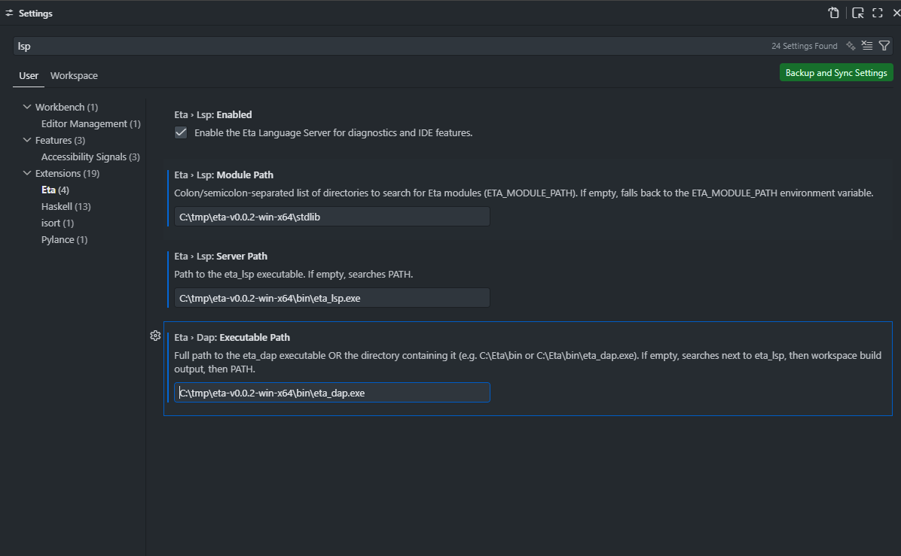

# Eta Quick Install & Run

The fastest way to get started is to download a pre-built release, run the installer, and try the examples.

> [!TIP]
> For the full reference — modules, import variants, all VS Code features,
> and `etac` CLI details — see [Quick Start](docs/quickstart.md).

---

## 1. Download & Unpack

Download the latest [release](https://github.com/lewismj/eta/releases) for your platform:

| Platform | Archive                          |
|----------|----------------------------------|
| Windows x64 | `eta-v0.2.0-win-x64.zip`         |
| Linux x86_64 | `eta-v0.2.0-linux-x86_64.tar.gz` |

Unzip the archive into a directory of your choice.

---

## 2. Run the Installer

The installer adds the `bin/` directory to your `PATH`, sets the `ETA_MODULE_PATH` environment variable so the runtime can find the standard library, and installs the VS Code extension (if VS Code is detected).

**Windows (PowerShell / Command Prompt):**
```console
cd eta-v0.2.0-win-x64
.\install.cmd
```

**Linux / macOS:**
```console
cd eta-v0.2.0-linux-x86_64
chmod +x install.sh && ./install.sh
```

Example output (Windows):
```console
C:\tmp\eta-v0.2.0-win-x64>.\install.cmd
+==============================================================+
|  Eta Installer (Windows)                                     |
+==============================================================+

  bin     : C:\tmp\eta-v0.5.0-win-x64\bin
  stdlib  : C:\tmp\eta-v0.5.0-win-x64\stdlib

> Eta already on user PATH -- skipping.
> ETA_MODULE_PATH already set -- skipping.
> Installing VS Code extension...
Installing extensions...
Extension 'eta-lang.vsix' was successfully installed.
  [OK] VS Code extension installed.

> Verifying...
  [OK] etac.exe
  [OK] etai.exe
  [OK] eta_repl.exe
  [OK] eta_lsp.exe
  [OK] eta_dap.exe

[OK] Done! Open a new terminal and try:

    etai --help
    eta_repl

C:\tmp\eta-v0.2.0-win-x64>
```

> [!NOTE]
> Open a **new** terminal after installation so the updated `PATH` and `ETA_MODULE_PATH` take effect.

---

## 3. Run the Examples

The `examples/` directory inside the release bundle contains several `.eta` programs.

### Interpret from Source — `etai`

`etai` compiles a `.eta` file in-memory (lex → parse → expand → link →
analyze → emit) and executes it immediately:

```console
C:\tmp\eta-v0.2.0-win-x64\examples> etai hello.eta
Hello, world!
2432902008176640000
```

```console
C:\tmp\eta-v0.2.0-win-x64\examples> etai aad.eta
f(x,y) = x*y + sin(x)
  grad at (2,3): (6.9093 #(2.58385 2))
g(x) = x^2 + 3x + 1
  grad at (4): (29 #(11))
h(x) = exp(2x)
  grad at (1): (7.38906 #(14.7781))
Rosenbrock f(x,y) = (1-x)^2 + 100(y-x^2)^2
  grad at (1,1): (0 #(0 0))
dot(v, [1,2,3])
  grad at (1,1,1): (6 #(1 2 3))
```

### Ahead-of-Time Compilation — `etac` + `etai`

`etac` compiles `.eta` source files into compact `.etac` bytecode.
`etai` then loads `.etac` files directly — **skipping all front-end
phases** for faster startup:

```console
C:\tmp\eta-v0.2.0-win-x64\examples> etac hello.eta
compiled examples\hello.eta → examples\hello.etac (3 functions, 1 module(s))

C:\tmp\eta-v0.2.0-win-x64\examples> etai hello.etac
Hello, world!
2432902008176640000
```

Enable optimization passes with `-O`:
```console
C:\tmp\eta-v0.2.0-win-x64\examples> etac -O hello.eta -o hello-opt.etac
```

Inspect the emitted bytecode without writing a file:
```console
C:\tmp\eta-v0.2.0-win-x64\examples> etac --disasm hello.eta
```

Key `etac` flags:

| Flag | Effect |
|------|--------|
| `-O` | Enable optimization passes (constant folding, dead code elimination) |
| `--disasm` | Print human-readable bytecode to stdout (no `.etac` written) |
| `--no-debug` | Strip source maps for a smaller output file |
| `-o <path>` | Custom output path (default: `<input>.etac`) |

> [!TIP]
> See [Compiler (`etac`)](docs/compiler.md) for the full CLI reference, binary format specification, and optimization pass details.

### Interactive REPL

```console
C:\tmp\eta-v0.2.0-win-x64> eta_repl
Loaded C:\tmp\eta-v0.2.0-win-x64\stdlib\prelude.eta
eta REPL - type an expression and press Enter.
Use Ctrl+C or (exit) to quit.
eta> (+ 1 2 3 4 5)
=> 15
eta> (exit)
```

---

## 4. VS Code Setup

The installer automatically installs the VS Code extension when VS Code is present. The extension provides syntax highlighting, live diagnostics via the Language Server (`eta_lsp`), and full debugging via the Debug Adapter (`eta_dap`).

### Configure the Extension

Open VS Code settings (`Ctrl+,` or `Cmd+,`) and search for **Eta**. The key settings are:

| Setting | Description | Example |
|---------|-------------|---------|
| `eta.lsp.serverPath` | Path to the `eta_lsp` executable | `C:\tmp\eta-v0.2.0-win-x64\bin\eta_lsp.exe` |
| `eta.dap.executablePath` | Path to the `eta_dap` executable | `C:\tmp\eta-v0.2.0-win-x64\bin\eta_dap.exe` |
| `eta.modulePath` | Module search path (`ETA_MODULE_PATH`) | `C:\tmp\eta-v0.2.0-win-x64\stdlib` |
| `eta.debug.autoShowHeap` | Auto-open Heap Inspector on debug start | `true` (default) |

Or add them directly to your `settings.json`:

```json
{
  "eta.lsp.serverPath":     "C:\\tmp\\eta-v0.2.0-win-x64\\bin\\eta_lsp.exe",
  "eta.dap.executablePath": "C:\\tmp\\eta-v0.2.0-win-x64\\bin\\eta_dap.exe"
}
```



### Open and Run an Example

1. In VS Code open the `examples/` folder from the release bundle (**File → Open Folder**).
2. Open any `.eta` file — syntax highlighting and diagnostics activate automatically.
3. Run the file with the interpreter from the integrated terminal: `etai hello.eta`


---

## 5. Jupyter Kernel

The installer automatically installs the Eta kernel into the current user's Jupyter kernel directory (no root / admin required).

**What the installer does:**
1. Smoke-tests that `eta_jupyter` (or `eta_jupyter.exe`) is present in `bin/`.
2. Runs `eta_jupyter --install --user` to register the kernelspec.
3. If `jupyter` is not yet on your `PATH`, prints the pip install command.

**To use the kernel after installation:**

```console
# If JupyterLab is not yet installed:
python -m pip install jupyterlab

# Launch JupyterLab:
jupyter lab
```

Then open or create a notebook and select **Eta** as the kernel.

> [!NOTE]
> If the auto-install step failed (the installer will warn you), run it manually:
> ```console
> # Windows
> eta_jupyter.exe --install --user
>
> # Linux / macOS
> eta_jupyter --install --user
> ```

The example notebooks live in `examples/notebooks/` inside the release bundle. Open `Portfolio.ipynb` to see a worked financial-modelling example using the built-in CLP(R), AAD, and causal-inference libraries.

---

## 6. Debugging

### Breakpoints & Stepping

1. Open a `.eta` file in VS Code.
2. Click the gutter to set a breakpoint (red dot).
3. Press **F5** (or **Run → Start Debugging**) — the DAP adapter launches the script.
4. When the VM hits a breakpoint it pauses. Use the standard controls:
   - **F10** Step Over · **F11** Step In · **Shift+F11** Step Out · **F5** Continue

Script output (`display`, `newline`, etc.) appears in the **Eta Output** panel (not the Debug Console).

### Heap Inspector

The Heap Inspector lets you visualise heap usage, per-object-kind statistics, and navigate GC roots while the VM is paused.

1. Set a breakpoint and start debugging (as above).
2. Open the Command Palette (`Ctrl+Shift+P`) and run **Eta: Show Heap Inspector**.
   (Also opens automatically if `eta.debug.autoShowHeap` is enabled.)
3. The inspector panel opens beside your editor showing:
   - **Memory gauge** — current heap usage vs. soft limit.
   - **Cons Pool** — pool utilisation (live/capacity/free/bytes).
   - **Object Kinds** — count and bytes per type (Cons, Closure, Vector, String, etc.), sorted by size.
   - **GC Roots** — expandable tree of root categories (Stack, Globals, Frames, etc.). Globals are grouped by module.
4. Click any **Object #N** link to drill into it — view kind, size, value preview, and child references.
5. The panel **auto-refreshes** each time the VM stops (breakpoint, step). You can also click **Refresh** manually.

### Disassembly View

The Disassembly View shows live bytecode while debugging:

- **Sidebar panel:** The **Disassembly** panel appears in the Debug sidebar when an Eta debug session is active. Each bytecode instruction is shown as a tree item with a `â—€ PC` marker highlighting the current program counter. It auto-refreshes on every step/breakpoint.
- **Full-document view:** Open the Command Palette (`Ctrl+Shift+P`) and run:
  - **Eta: Show Disassembly** — disassembly of the current function.
  - **Eta: Show Disassembly (All Functions)** — disassembly of every loaded function.

### GC Roots Tree

The **Memory** panel in the Debug sidebar provides an expandable tree of GC root categories (Stack, Globals, Frames, etc.):

- **Globals** are automatically grouped by module prefix for readability.
- Each root object is expandable — clicking it shows child fields (car/cdr, vector elements, upvalues, etc.).
- Click any object to open it in the Heap Inspector for detailed inspection.
- Auto-refreshes on each VM stop; manual refresh via the title bar button.
