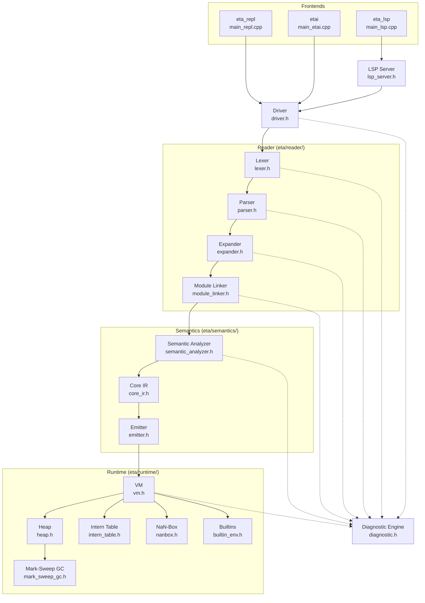

# Architecture

[← Back to README](../README.md)

---

## Overview

Eta's compiler is structured as a **six-stage pipeline** that transforms
UTF-8 source text into stack-based bytecode and executes it on a virtual
machine. All phases are orchestrated by the
[`Driver`](../eta/session/src/eta/session/driver.h) class, which
owns the full runtime state and supports incremental execution (each REPL
input shares the same VM globals and linker state).

```
Pipeline:  Source → Lex → Parse → Expand → Link → Analyze → Emit → Execute
```

---

## System Diagram



---

## Stage-by-Stage Walkthrough

### 1. Lexer

**File:** [`lexer.h`](../eta/core/src/eta/reader/lexer.h) /
[`lexer.cpp`](../eta/core/src/eta/reader/lexer.cpp)

The lexer converts raw UTF-8 source into a stream of `Token` values.
It handles:

- Parentheses, brackets, and dot notation
- Scheme number literals in binary, octal, decimal, and hexadecimal radixes
- Character literals (`#\a`, `#\newline`, `#\x03BB`)
- Strings with escape sequences
- Booleans (`#t` / `#f`)
- Block comments (`#| … |#`), line comments (`;`), and datum comments (`#;`)
- `#(` vector and `#u8(` byte-vector start tokens

Each token carries a `Span` with file ID, line, column, and byte offset
for precise diagnostic messages.

---

### 2. Parser

**File:** [`parser.h`](../eta/core/src/eta/reader/parser.h) /
[`parser.cpp`](../eta/core/src/eta/reader/parser.cpp)

The parser consumes tokens and produces an S-expression tree. The AST node
types form a variant (`SExpr`):

| Node | Description |
|------|-------------|
| `Nil` | The empty list `'()` |
| `Bool` | `#t` or `#f` |
| `Char` | Character literal |
| `String` | String literal |
| `Symbol` | Identifier |
| `Number` | `int64_t` or `double` |
| `List` | Proper or dotted list |
| `Vector` | `#(…)` vector literal |
| `ByteVector` | `#u8(…)` byte-vector |
| `ReaderForm` | `'`, `` ` ``, `,`, `,@` sugar |
| `ModuleForm` | `(module name …)` — parsed structurally |

---

### 3. Expander (Macro Expansion)

**File:** [`expander.h`](../eta/core/src/eta/reader/expander.h) /
[`expander.cpp`](../eta/core/src/eta/reader/expander.cpp)

The expander desugars high-level Scheme forms into a minimal core language.
After expansion, only these forms remain:

```
if  begin  set!  lambda  quote
define  defun  module
dynamic-wind  values  call-with-values  call/cc  apply
```

**Derived forms that are expanded away:**

| Surface form | Expands to |
|-------------|------------|
| `let` | Immediately-applied `lambda` |
| `let*` | Nested `let` chain |
| `letrec` | `let` + `set!` chain |
| `named let` | `letrec` + lambda |
| `cond` | Nested `if` |
| `and` / `or` | Nested `if` |
| `when` / `unless` | `if` + `begin` |
| `do` | Named `letrec` loop |
| `defun` | `define` + `lambda` |
| `define-record-type` | Constructor + predicate + accessor `define`s |
| `syntax-rules` macros | Pattern-matched template instantiation |

The expander also rewrites internal `define`s in lambda bodies into
`letrec` per R7RS semantics (controlled by `enable_internal_defines_to_letrec`).

For `syntax-rules`, literal keywords are matched by lexical binding identity
(not raw symbol text), and free template identifiers are rebound to their
definition-site context so use-site locals do not capture them.

---

### 4. Module Linker

**File:** [`module_linker.h`](../eta/core/src/eta/reader/module_linker.h) /
[`module_linker.cpp`](../eta/core/src/eta/reader/module_linker.cpp)

The linker resolves inter-module dependencies in two phases:

1. **Index** — scan all `(module …)` forms, collecting `define` and `export`
   names into a `ModuleTable`.
2. **Link** — resolve `import` clauses, applying `only`, `except`, and
   `rename` filters, populating each module's `visible` set.

Errors: `UnknownModule`, `CircularDependency`, `ConflictingImport`,
`ExportOfUnknownName`, `DuplicateModule`.

---

### 5. Semantic Analyzer

**File:** [`semantic_analyzer.h`](../eta/core/src/eta/semantics/semantic_analyzer.h) /
[`semantic_analyzer.cpp`](../eta/core/src/eta/semantics/semantic_analyzer.cpp)

The semantic analyzer walks the desugared S-expressions and produces a
**Core IR** graph ([`core_ir.h`](../eta/core/src/eta/semantics/core_ir.h)).
Key responsibilities:

- **Name resolution** — binds identifiers to `BindingId`s in nested `Scope`s
- **Closure conversion** — detects variables captured across `lambda`
  boundaries and assigns them `Address::Upval` slots
- **Address assignment** — every variable gets a concrete `Address` (Local /
  Upval / Global) with a numeric slot
- **Tail-position marking** — sets `Node::tail = true` on expressions in
  tail position so the emitter can generate `TailCall`
- **Builtin seeding** — pre-allocates global slots 0..N−1 for primitives
  from the `BuiltinEnvironment`

#### Core IR Node Types

All nodes are arena-allocated (`core::Arena`, 16 KB blocks) for pointer
stability and cache locality.

```
Node  =  Var | Const | Quote | If | Begin | Set
       | Lambda | Call | Values | CallWithValues
       | DynamicWind | CallCC | Apply
```

| Node | Semantics |
|------|-----------|
| `Var { addr }` | Variable read — `Local`, `Upval`, or `Global` |
| `Const { literal }` | Literal value — `bool`, `char32_t`, `string`, `int64_t`, `double` |
| `Quote { datum }` | Quoted data — arbitrary S-expression preserved at runtime |
| `If { test, conseq, alt }` | Conditional branch |
| `Begin { exprs }` | Sequencing |
| `Set { target, value }` | Mutation (`set!`) |
| `Lambda { params, rest, locals, upvals, body }` | Function with captured upvalues |
| `Call { callee, args }` | Function application |
| `Apply { proc, args }` | Variadic apply (last arg unpacked) |
| `Values { exprs }` | Multiple return values |
| `CallWithValues { producer, consumer }` | `call-with-values` |
| `CallCC { consumer }` | `call/cc` |
| `DynamicWind { before, body, after }` | Dynamic wind guards |

---

### 6. Emitter

**File:** [`emitter.h`](../eta/core/src/eta/semantics/emitter.h) /
[`emitter.cpp`](../eta/core/src/eta/semantics/emitter.cpp)

The emitter walks the Core IR tree and produces `BytecodeFunction` objects
containing sequences of `Instruction`s. Each module produces a top-level
`_init` function. Nested lambdas are emitted recursively and stored in a
thread-safe `BytecodeFunctionRegistry` (backed by `std::deque` for pointer
stability).

The emitter's key decisions:

- **Constants** are deduplicated per function (string literal caching)
- **Closures** use `MakeClosure` with upvalue sources pushed on the stack
- **Letrec self-references** are patched post-hoc with `PatchClosureUpval`
- **Quoted data** is recursively materialized into heap objects at emit time
- **Tail calls** emit `TailCall` / `TailApply` instead of `Call` / `Apply`

---

### 7. VM Execution

**File:** [`vm.h`](../eta/core/src/eta/runtime/vm/vm.h) /
[`vm.cpp`](../eta/core/src/eta/runtime/vm/vm.cpp)

The VM is a stack-based interpreter with a frame stack. See
[Bytecode & VM](guide/reference/bytecode-vm.md) for full details.

---

## Diagnostic System

**File:** [`diagnostic.h`](../eta/core/src/eta/diagnostic/diagnostic.h)

All compiler phases report errors through a single `DiagnosticEngine`.
Each error carries:

- A **`DiagnosticCode`** (lexer 0–99, parser 100–199, expander 200–299,
  linker 300–399, semantic 400–499, runtime 500–599)
- A **`Severity`** (Error, Warning, Note, Hint)
- A **`Span`** for source location
- Optional **related spans** with labels for multi-span errors

Stage-specific error types (`LexError`, `ParseError`, `ExpandError`,
`LinkError`, `SemanticError`, `VMError`) are converted via
`to_diagnostic<T>()` template specializations.

---

## Frontends

| Executable | Entry point | Role |
|------------|-------------|------|
| `etac` | [`main_etac.cpp`](../eta/compiler/src/eta/compiler/main_etac.cpp) | Ahead-of-time compiler — emits `.etac` bytecode |
| `etai` | [`main_etai.cpp`](../eta/interpreter/src/eta/interpreter/main_etai.cpp) | File interpreter — loads prelude, runs `.eta` or `.etac` |
| `eta_repl` | [`main_repl.cpp`](../eta/interpreter/src/eta/interpreter/main_repl.cpp) | Interactive REPL — incremental execution, shared state |
| `eta_lsp` | [`main_lsp.cpp`](../eta/lsp/src/eta/lsp/main_lsp.cpp) | Language Server — JSON-RPC over stdio, publishes diagnostics |
| `eta_dap` | [`main_dap.cpp`](../eta/dap/src/eta/dap/main_dap.cpp) | Debug Adapter — DAP over stdio (breakpoints, stepping, heap inspection) |

All frontends create a `Driver` instance, which constructs the `Heap`,
`InternTable`, `VM`, `BuiltinEnvironment`, and `BytecodeFunctionRegistry`
and wires them together.

