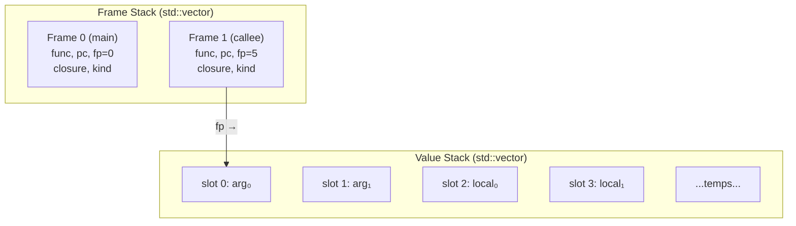

# Bytecode & VM

[← Back to README](../README.md) · [Architecture](architecture.md) ·
[NaN-Boxing](nanboxing.md) · [Runtime & GC](runtime.md) ·
[Logic Programming](logic.md)

---

## Overview

Eta compiles Core IR into a flat sequence of `Instruction`s grouped into
`BytecodeFunction` objects. The VM is a classic **stack-based interpreter**
with a separate frame stack for function calls. All values on the stack
are 64-bit NaN-boxed `LispVal`s.

**Key sources:**
[`bytecode.h`](../eta/core/src/eta/runtime/vm/bytecode.h) ·
[`vm.h`](../eta/core/src/eta/runtime/vm/vm.h) ·
[`emitter.h`](../eta/core/src/eta/semantics/emitter.h)

---

## BytecodeFunction

Every lambda (and every module's top-level init) compiles to a
`BytecodeFunction`:

```cpp
struct BytecodeFunction {
    std::vector<Instruction> code;        // the instruction stream
    std::vector<LispVal>     constants;   // constant pool (literals, func indices)
    uint32_t                 arity;       // required parameter count
    bool                     has_rest;    // accepts variadic rest arg?
    uint32_t                 stack_size;  // frame size (locals + temporaries)
    std::string              name;        // debug name (e.g., "my-module_init_lambda3")
};

struct Instruction {
    OpCode   opcode;
    uint32_t arg;   // meaning depends on opcode
};
```

Functions are stored in a `BytecodeFunctionRegistry` (thread-safe,
`std::deque`-backed for pointer stability). Closures reference functions
by index rather than raw pointer.

---

## Opcode Reference

### Data Movement

| Opcode | Arg | Stack Effect | Description |
|--------|-----|-------------|-------------|
| `Nop` | — | — | No operation |
| `LoadConst` | `idx` | → val | Push `constants[idx]` |
| `LoadLocal` | `slot` | → val | Push `stack[fp + slot]` |
| `StoreLocal` | `slot` | val → | Pop into `stack[fp + slot]` |
| `LoadUpval` | `idx` | → val | Push `closure.upvals[idx]` |
| `StoreUpval` | `idx` | val → | Pop into `closure.upvals[idx]` |
| `LoadGlobal` | `gid` | → val | Push `globals[gid]` |
| `StoreGlobal` | `gid` | val → | Pop into `globals[gid]` |
| `Pop` | — | val → | Discard top of stack |
| `Dup` | — | val → val val | Duplicate top of stack |

### Control Flow

| Opcode | Arg | Stack Effect | Description |
|--------|-----|-------------|-------------|
| `Jump` | `offset` | — | `pc += offset` (forward only) |
| `JumpIfFalse` | `offset` | val → | If `pop() == #f`, `pc += offset` |
| `Call` | `argc` | args… callee → result | Call function with `argc` arguments |
| `TailCall` | `argc` | args… callee → *(reuses frame)* | Tail call — no new frame |
| `Return` | — | val → *(to caller)* | Return top of stack to caller |
| `Values` | `n` | v₁…vₙ → multiple-values | Package n values |
| `CallWithValues` | — | producer consumer → result | `(call-with-values producer consumer)` |
| `DynamicWind` | — | before body after → result | `(dynamic-wind before body after)` |
| `CallCC` | — | consumer → result | `(call/cc consumer)` |
| `Apply` | `argc` | args… proc → result | Apply; last arg is list to unpack |
| `TailApply` | `argc` | args… proc → *(reuses frame)* | Tail-position apply |

### Closures

| Opcode | Arg | Stack Effect | Description |
|--------|-----|-------------|-------------|
| `MakeClosure` | `const_idx<<16 \| n` | upvals… → closure | Create closure from `constants[const_idx]` with `n` upvalue captures |
| `PatchClosureUpval` | `upval_idx` | closure val → | Patch `closure.upvals[upval_idx] = val` (letrec fixup) |

### Arithmetic & Primitives

| Opcode | Arg | Stack Effect | Description |
|--------|-----|-------------|-------------|
| `Add` | — | a b → (a+b) | Numeric addition |
| `Sub` | — | a b → (a−b) | Numeric subtraction |
| `Mul` | — | a b → (a×b) | Numeric multiplication |
| `Div` | — | a b → (a/b) | Numeric division |
| `Eq` | — | a b → bool | Numeric equality |
| `Cons` | — | car cdr → pair | Allocate cons cell |
| `Car` | — | pair → car | First element |
| `Cdr` | — | pair → cdr | Rest element |

### Exception Handling

| Opcode | Arg | Stack Effect | Description |
|--------|-----|-------------|-------------|
| `SetupCatch` | `(tag_idx<<16 \| pc_offset)` | — | Push a `CatchFrame`; handler PC = current PC + `pc_offset`. `constants[tag_idx]` is the tag symbol; `Nil` means catch-all |
| `PopCatch` | — | — | Pop the top catch frame on normal exit from a protected body |
| `Throw` | — | tag val → *(non-local)* | Pop `val` then `tag`; search catch stack for matching tag; transfer control or raise `RuntimeError` if none found |

The `catch`/`raise` forms compile to this pattern:

```
;; (catch 'err body)
SetupCatch  (tag_const_idx << 16 | offset_to_after_handler)
  <emit body>
PopCatch                        ; normal exit — discard frame
Jump        past_handler
  <handler: caught value already on stack>
```

### Unification / Logic Variables

These opcodes implement Robinson-style structural unification directly in the
VM.  See [Logic Programming](logic.md) for a full description of the semantics.

| Opcode | Arg | Stack Effect | Description |
|--------|-----|-------------|-------------|
| `MakeLogicVar` | — | → lvar | Allocate a fresh unbound `LogicVar` on the heap and push its boxed reference |
| `Unify` | — | a b → bool | Pop `b` then `a`; perform structural unification with occurs check; push `#t` on success (bindings on trail) or `#f` on failure |
| `DerefLogicVar` | — | x → val | Pop `x`; walk the logic-variable binding chain to its terminus; push the fully dereferenced value |
| `TrailMark` | — | → mark | Push the current trail stack depth as a fixnum snapshot |
| `UnwindTrail` | — | mark → | Pop `mark`; undo all variable bindings made since that snapshot by walking the trail back and resetting each `LogicVar.binding` to `nullopt` |
| `CopyTerm` | — | term → copy | Pop `term`; deep-copy it replacing unbound logic variables with fresh ones (sharing preserved via hash-map memo); push the copy |

**Trail invariant:** the trail is a per-VM `std::vector<LispVal>` that
records the boxed reference of every logic variable that was bound.
`TrailMark` / `UnwindTrail` implement Prolog choice-point semantics
without requiring a separate WAM-style stack.

**Example — binding and backtracking:**

```
;; (define x (logic-var))
MakeLogicVar         ; → HeapObj(lvar, id=7)
StoreGlobal  N
Pop

;; (define m (trail-mark))
TrailMark            ; → Fixnum(0)   trail is empty
StoreGlobal  M
Pop

;; (unify x 42)
LoadGlobal   N       ; push HeapObj(7)
LoadConst    K       ; push Fixnum(42)
Unify                ; deref both, bind lv[7]→42, trail=[HeapObj(7)], push #t
Pop

;; (unwind-trail m)
LoadGlobal   M       ; push Fixnum(0)
UnwindTrail          ; trail.size()=1 > 0 → pop HeapObj(7), reset lv[7].binding=nullopt

;; (logic-var? (deref-lvar x))
LoadGlobal   N       ; push HeapObj(7)
DerefLogicVar        ; lv[7].binding=nullopt → push HeapObj(7) (still a lvar)
CallBuiltin "logic-var?"   ; → #t
```

### Tape-Based Reverse-Mode AD

The VM provides tape-based (Wengert list) reverse-mode automatic
differentiation.  When a **tape is active**, the arithmetic opcodes
`Add`, `Sub`, `Mul`, `Div` and the builtins `exp`, `log`, `sqrt`,
`sin`, `cos` **transparently record** every operation involving a
`TapeRef` operand onto the active tape.

**Tape-aware arithmetic:** When `do_binary_arithmetic` detects that
either operand is a `TapeRef`, it:

1. Looks up the primals from the active tape
2. Computes the forward result
3. Appends a new tape entry recording the operation, operand indices,
   and the primal result (~32 bytes)
4. Returns a new `TapeRef` pointing to the appended entry

The builtins `exp`, `log`, `sqrt`, `sin`, `cos` follow the same
pattern.  The backward pass (`tape-backward!`) sweeps the tape in
reverse, accumulating adjoints via the chain rule — zero closures
allocated.

See [AAD documentation](aad.md) for a full description and
[European Option Greeks](european.md) for a worked example.

---

## End-to-End Example

Let's trace the compilation and execution of a small program:

### Source

```scheme
(module example
  (begin
    (defun add1 (x) (+ x 1))
    (add1 41)))
```

### Stage 1 — Expand

`defun` is desugared to `define` + `lambda`:

```scheme
(module example
  (begin
    (define add1 (lambda (x) (+ x 1)))
    (add1 41)))
```

### Stage 2 — Semantic Analysis (Core IR)

The analyzer produces these IR nodes for the module init function:

```
toplevel_inits:
  [0] Set { target: Global(slot=N), value: Lambda { ... } }
  [1] Call { callee: Var(Global(N)), args: [Const(41)] }

Lambda "add1":
  params: [x → Local(0)]
  stack_size: 2
  body: Call { callee: Var(Global(+)),   ← builtin "+" at its fixed global slot
               args: [Var(Local(0)),     ← x
                      Const(1)] }
  tail: true  (the call is in tail position of the lambda body)
```

### Stage 3 — Emit Bytecode

**`add1` lambda → `example_init_lambda0`:**

```
  constants: [ <fixnum 1> ]
  arity: 1, has_rest: false, stack_size: 2

  0: LoadLocal    0        ;; push x
  1: LoadConst    0        ;; push 1
  2: Add                   ;; push (+ x 1)
  3: Return                ;; return result
```

> [!NOTE]
> `(+ x 1)` is in tail position but uses the specialized `Add` opcode
> rather than a `TailCall` to the `+` builtin — the emitter optimizes known
> arithmetic into dedicated opcodes.

**Module init → `example_init`:**

```
  constants: [ <func_index:0>, <Nil>, <fixnum 41> ]
  arity: 0, has_rest: false, stack_size: N

  ;; (define add1 (lambda (x) (+ x 1)))
  0: MakeClosure  (0 << 16 | 0)   ;; make closure from func_index 0, 0 upvals
  1: StoreGlobal  N                ;; globals[N] = add1
  2: Pop                           ;; discard set! result

  ;; (add1 41)
  3: LoadConst    2                ;; push 41
  4: LoadGlobal   N                ;; push add1 closure
  5: Call         1                ;; call add1(41)
  6: Pop                           ;; discard expr result (module init)

  ;; Module init returns nil
  7: LoadConst    1                ;; push Nil
  8: Return
```

### Stage 4 — VM Execution Trace

```
Executing: example_init
  pc=0  MakeClosure(0,0)  → creates Closure{func=&lambda0, upvals=[]}
                            pushes HeapObject(id=…) onto stack
  pc=1  StoreGlobal(N)    → globals[N] = pop()   (add1 closure stored)
  pc=2  Pop               → discard nil from set!
  pc=3  LoadConst(2)      → push 41
  pc=4  LoadGlobal(N)     → push Closure(add1)
  pc=5  Call(1)           → pop callee, set up new frame:
                            frame = {func=lambda0, fp=top-1, pc=0}

Executing: example_init_lambda0  (fp points to stack slot with 41)
  pc=0  LoadLocal(0)      → push stack[fp+0] = 41
  pc=1  LoadConst(0)      → push 1
  pc=2  Add               → pop 1, pop 41, push 42
  pc=3  Return            → pop 42, restore caller frame, push 42

Back in example_init:
  pc=6  Pop               → discard 42
  pc=7  LoadConst(1)      → push Nil
  pc=8  Return            → execution complete, result = Nil
```

**Result:** `(add1 41)` evaluates to **42**. ✓

---

## Call Stack Model



Each `Frame` stores:

| Field | Type | Purpose |
|-------|------|---------|
| `func` | `const BytecodeFunction*` | Currently executing function |
| `pc` | `uint32_t` | Program counter (index into `func->code`) |
| `fp` | `uint32_t` | Frame pointer (first local in value stack) |
| `closure` | `LispVal` | Current closure (for upvalue access) |
| `kind` | `FrameKind` | Normal, DynamicWind, CallWithValues, Sentinel, etc. |
| `extra` | `LispVal` | Kind-specific extra data |

### Frame Kinds

| Kind | Usage |
|------|-------|
| `Normal` | Regular function call |
| `CallWithValuesConsumer` | Waiting to dispatch consumer after producer returns |
| `DynamicWindBody` | Inside the body thunk of `dynamic-wind` |
| `DynamicWindAfter` | Executing the "after" thunk |
| `DynamicWindCleanup` | Unwinding through dynamic-wind |
| `Sentinel` | Bottom-of-stack marker for continuations |
| `ContinuationJump` | Resuming a captured continuation |

---

## Tail-Call Elimination

When the emitter detects a call in tail position (`Node::tail == true`),
it emits `TailCall` or `TailApply` instead of `Call` / `Apply`.

**Regular Call:**
```
push args → push callee → Call(argc)
  → save current frame to frame stack
  → set up new frame
```

**Tail Call:**
```
push args → push callee → TailCall(argc)
  → overwrite current frame's stack slots with new args
  → reset pc to 0
  → NO new frame pushed
```

This means recursive functions like:

```scheme
(defun loop (n acc)
  (if (= n 0) acc
      (loop (- n 1) (+ acc n))))
```

run in **O(1) stack space** — the frame stack never grows.

---

## Closure Creation & Upvalue Patching

### `MakeClosure`

When a lambda captures variables from an enclosing scope, the emitter:

1. Pushes each captured variable's current value onto the stack
2. Emits `MakeClosure` with the function index and upvalue count

```
LoadLocal  2          ;; push captured var 'x' (local slot 2 in parent)
LoadUpval  0          ;; push captured var 'y' (upval 0 in parent)
MakeClosure (idx<<16 | 2)  ;; create closure with 2 upvals
```

The VM allocates a `Closure` object on the heap containing a pointer to
the `BytecodeFunction` and a vector of upvalue `LispVal`s.

### `PatchClosureUpval` (Letrec Self-Reference)

For `letrec` bindings where a lambda refers to itself:

```scheme
(letrec ((f (lambda (n) (if (= n 0) 1 (f (- n 1))))))
  (f 5))
```

At `MakeClosure` time, `f` isn't defined yet (its slot contains `Nil`).
The emitter generates:

```
MakeClosure  ...       ;; creates closure with stale upval for 'f'
StoreLocal   slot      ;; store closure in f's local slot
LoadLocal    slot      ;; push the closure (for patching)
LoadLocal    slot      ;; push itself as the new upval value
PatchClosureUpval  0   ;; closure.upvals[0] = closure itself
```

---

## Function Resolution

Closures store function references as indices (not raw pointers) for
safety. The `FUNC_INDEX_TAG` (bit 63) distinguishes function indices from
regular `LispVal` constants:

```cpp
constexpr uint64_t FUNC_INDEX_TAG = 1ULL << 63;

inline LispVal encode_func_index(uint32_t index) {
    return FUNC_INDEX_TAG | static_cast<uint64_t>(index);
}
```

When `MakeClosure` encounters a function-index constant, it calls the
`FunctionResolver` callback (wired by the `Driver`) to look up the
`BytecodeFunction*` from the `BytecodeFunctionRegistry`.

