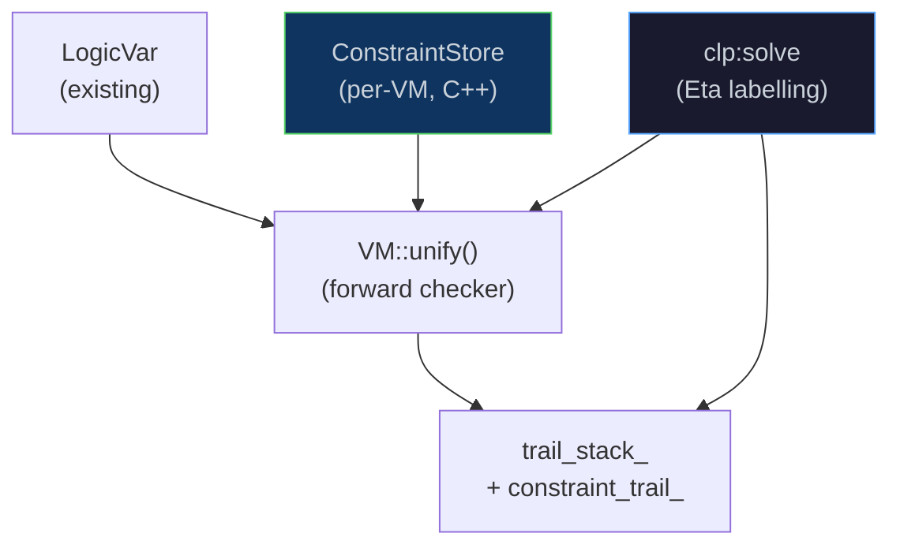

# Constraint Logic Programming

[← Back to README](../README.md) · [Logic Programming](logic.md) ·
[Bytecode & VM](bytecode-vm.md) · [Runtime & GC](runtime.md) ·
[Causal Inference](causal.md) · [Next Steps](next-steps.md)

---

## Overview

Eta extends its native structural unification with **Constraint Logic
Programming (CLP)** — the ability to attach domain restrictions to logic
variables and have those restrictions automatically enforced at bind time.

Two constraint domains are supported:

| Domain | Notation | Example |
|--------|----------|---------|
| **Integer intervals** | `clp(Z)` | `(clp:domain x 0 100)` — x ∈ [0, 100] |
| **Finite value sets** | `clp(FD)` | `(clp:in-fd x 1 2 4 8)` — x ∈ {1, 2, 4, 8} |

```scheme
(import std.clp)

(let ((x (logic-var))
      (y (logic-var)))
  (clp:domain x 1 5)     ; x ∈ [1, 5]
  (clp:domain y 3 8)     ; y ∈ [3, 8]
  (clp:solve (list x y)) ; label both
  (println (deref-lvar x))   ; => 1  (first consistent value)
  (println (deref-lvar y)))  ; => 3
```

CLP builds on the seven existing unification primitives
(`logic-var`, `unify`, `deref-lvar`, `trail-mark`, `unwind-trail`,
`copy-term`, `ground?`) — no new opcodes are required.

---

## Architecture



### Constraint Store (`ConstraintStore`)

A `ConstraintStore` lives inside every `VM` instance alongside the
existing `trail_stack_`.  It maps each logic-variable `ObjectId` to a
`Domain` value — either a `ZDomain { int64_t lo, hi }` or an
`FDDomain { std::vector<int64_t> values }`:

```cpp
// eta/core/src/eta/runtime/clp/constraint_store.h
class ConstraintStore {
    std::unordered_map<ObjectId, Domain> domains_;
    std::vector<TrailEntry>              trail_;   // for undo
public:
    const Domain* get_domain(ObjectId id) const noexcept;
    void set_domain(ObjectId id, Domain dom);   // trails old value
    std::size_t trail_size() const noexcept;
    void unwind(std::size_t mark);              // restore on backtrack
};
```

### Forward Checking at Bind Time

Every call to `VM::unify(a, b)` now checks domain constraints before
committing a binding.  When an unbound variable `a` is about to be bound
to a ground integer `b`:

```
unify(a, b):
  a' = deref(a),  b' = deref(b)
  if a' is unbound AND b' is a ground integer:
      domain = constraint_store_.get_domain(id(a'))
      if domain != nullptr AND b' ∉ domain → fail  ← NEW
  bind a' → b', push a' on trail_stack_, succeed
```

If `b'` is itself an unbound logic variable (not yet grounded), the check
is deferred — constraint propagation fires when that variable is later
grounded.  This is *forward checking*, the simplest correct CLP strategy.

### Unified Trail Mark

`TrailMark` now packs both the binding-trail depth and the
constraint-trail depth into one 47-bit fixnum (23 bits each):

```
packed_mark = binding_size | (constraint_size << 23)
```

`UnwindTrail` unpacks both halves and restores both trails.  The
encoding is backward-compatible — existing code that treats marks as
opaque cookies is unaffected.

---

## The `std.clp` Module

`(import std.clp)` is included in `std.prelude` and available by default.

### Domain Constructors

| Form | Domain |
|------|--------|
| `(clp:domain var lo hi)` | clp(Z) interval [lo, hi] |
| `(clp:in-fd var v1 v2 …)` | clp(FD) explicit set {v1, v2, …} |

```scheme
(let ((x (logic-var))
      (d (logic-var)))
  (clp:domain x 0 23)       ; x ∈ [0, 23]  — hour of day
  (clp:in-fd d 1 2 5 7)     ; d ∈ {1,2,5,7} — odd working days
  ...)
```

### Propagators

| Form | Meaning | Domain narrowing |
|------|---------|-----------------|
| `(clp:= x y)` | x = y | Intersect domains; unify |
| `(clp:+ x y z)` | z = x + y | Interval arithmetic on Z domains |
| `(clp:<= x y)` | x ≤ y | x.hi ← min(x.hi, y.hi); y.lo ← max(y.lo, x.lo) |
| `(clp:>= x y)` | x ≥ y | Symmetric to `clp:<=` |
| `(clp:<> x y)` | x ≠ y | Registers two-element `all-different` group |

### Global Constraint

```scheme
(clp:all-different (list x y z))
```

Registers `x`, `y`, `z` as a pairwise-distinct group.  The constraint is
checked at the end of each `clp:solve` call against the ground values.

### Solver: `clp:solve`

```scheme
(clp:solve vars)
```

DFS labelling over the list `vars`.  For each variable:

1. If already ground — proceed to next variable (domain was checked at
   unify time).
2. If unbound — enumerate values from the domain; for each candidate
   value:
   a. Take a `trail-mark`
   b. Call `(unify var val)` — the VM forward-checker fires here
   c. Recurse on remaining variables
   d. If the recursion fails, `(unwind-trail mark)` and try the next value

Returns `#t` if all variables are consistently labelled, `#f` otherwise.

---

## End-to-End Trace

```scheme
;;; Schedule a task: start ∈ [8, 12], duration ∈ [1, 4], end = start + dur

(import std.clp)

(let* ((start (logic-var))
       (dur   (logic-var))
       (end   (logic-var)))
  (clp:domain start 8 12)
  (clp:domain dur   1  4)
  (clp:domain end   9 16)
  ;; Propagate: end = start + dur
  (clp:+ start dur end)
  ;; Solve: find all consistent (start, dur, end) triples
  (let loop ()
    (let* ((m  (trail-mark))
           (ok (clp:solve (list start dur end))))
      (when ok
        (println (list (deref-lvar start)
                       (deref-lvar dur)
                       (deref-lvar end)))
        (unwind-trail m)
        (loop)))))
```

Expected output (all valid schedules):
```
(8 1 9)
(8 2 10)
(8 3 11)
(8 4 12)
(9 1 10)
... (all combinations satisfying start + dur = end)
```

---

## N-Queens Example

The classic N-Queens puzzle demonstrates `clp:all-different`:

```scheme
(import std.clp)
(import std.collections)

;;; n-queens n — find the first solution to the n-queens problem.
;;; Returns a list of column placements for each row (1-indexed).
(defun n-queens (n)
  (let ((queens (map* (lambda (_) (logic-var)) (iota n))))
    ;; Each queen in column [1..n]
    (for-each (lambda (q) (clp:domain q 1 n)) queens)
    ;; No two queens in the same column
    (clp:all-different queens)
    ;; No two queens on the same diagonal
    (for-each (lambda (pair)
                (let* ((i (car pair)) (qi (car (cdr pair)))
                       (j (car (cdr (cdr pair)))) (qj (cdr (cdr (cdr pair)))))
                  (let ((diff (logic-var)))
                    (clp:domain diff (- (- n) n) n)
                    (clp:+ qi diff qj)
                    ;; diff ≠ (j - i) and diff ≠ (i - j)
                    (clp:all-different (list diff (logic-var))))))
              (all-pairs queens (iota n 1)))
    (clp:solve queens)
    (map* deref-lvar queens)))

(println (n-queens 4))   ; => (2 4 1 3)  (or another valid solution)
(println (n-queens 6))   ; => (2 4 6 1 3 5)
```

---

## Relation to `std.logic`

| Feature | `std.logic` | `std.clp` |
|---------|-------------|-----------|
| Constraint type | Equality only (`unify`) | Integer intervals & finite sets |
| Backtracking | `trail-mark` / `unwind-trail` (manual) | `clp:solve` (automatic DFS) |
| Constraint propagation | None | Forward checking at bind time |
| Term copying | `copy-term` (native `CopyTerm` opcode) | Uses `copy-term` transitively via `std.logic` |
| All-different | Requires manual `naf` | `clp:all-different` global constraint |
| Requires C++ | VM opcodes already exist | `ConstraintStore` in VM + 3 builtins |

---

## Current Limitations

| Feature | Status |
|---------|--------|
| Arc consistency (AC-3) | Not yet — propagation fires only at bind time (forward checking) |
| Attributed variables | Not yet — needed for full wakeup on var-var unification |
| Non-integer domains | Not yet — float/real intervals not supported |
| Optimisation (`minimize`/`maximize`) | Not yet — only satisfaction supported |

Full arc consistency propagation is the next planned enhancement; see
[`docs/next-steps.md §3`](next-steps.md).

---

## Source Locations

| Component | File |
|-----------|------|
| `ZDomain`, `FDDomain` | [`clp/domain.h`](../eta/core/src/eta/runtime/clp/domain.h) |
| `ConstraintStore` | [`clp/constraint_store.h`](../eta/core/src/eta/runtime/clp/constraint_store.h) |
| Forward checker in `unify()` | [`vm/vm.cpp`](../eta/core/src/eta/runtime/vm/vm.cpp) |
| Unified trail mark | [`vm/vm.cpp`](../eta/core/src/eta/runtime/vm/vm.cpp) — `TrailMark`/`UnwindTrail` |
| `%clp-domain-z!`, `%clp-domain-fd!`, `%clp-get-domain` | [`core_primitives.h`](../eta/core/src/eta/runtime/core_primitives.h) |
| `std.clp` stdlib | [`stdlib/std/clp.eta`](../stdlib/std/clp.eta) |
| N-queens / schedule examples | [`examples/do-calculus/demo.eta`](../examples/do-calculus/demo.eta) |

