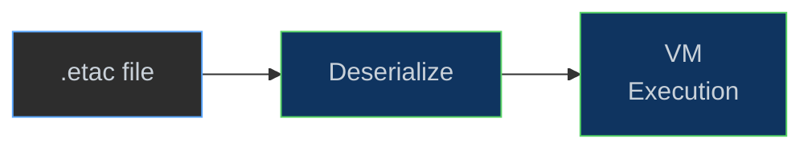

# Bytecode Compiler (`etac`)

[← Back to README](../README.md) · [Quick Start](quickstart.md) · [Build from Source](build.md) ·
[Architecture](architecture.md) ·
[NaN-Boxing](nanboxing.md) · [Bytecode & VM](bytecode-vm.md) ·
[Optimization](optimization.md) · [Runtime & GC](runtime.md) ·
[Modules & Stdlib](modules.md) · [Project Status](next-steps.md)

---

## Overview

**`etac`** is Eta's ahead-of-time bytecode compiler. It runs the full
compilation pipeline (lex → parse → expand → link → analyze → emit) and
**serializes** the resulting bytecode to a compact binary `.etac` file
instead of executing it.

The interpreter (`etai`) can then load `.etac` files directly, **skipping
every front-end stage** and jumping straight to VM execution. This is
useful for:

- **Faster startup** — large programs and library modules that rarely
  change are compiled once and loaded instantly.
- **Distribution** — ship pre-compiled `.etac` files without exposing
  source code.
- **Inspection** — the `--disasm` flag prints a human-readable
  disassembly of the emitted bytecode.

```
etac  hello.eta        →  hello.etac       # compile once
etai  hello.etac                           # run from cache (instant load)
```

---

## Quick Start

```console
# Compile an Eta source file to bytecode
$ etac examples/hello.eta
compiled examples/hello.eta → examples/hello.etac (3 functions, 1 module(s))

# Run the compiled bytecode
$ etai examples/hello.etac
Hello, world!
2432902008176640000
```

---

## CLI Reference

```
Usage: etac [options] <file.eta> [-o <file.etac>]
```

| Flag | Description |
|------|-------------|
| `-o <output>` | Output file path. Defaults to `<input>.etac`. |
| `-O`, `--optimize` | Enable IR optimization passes (constant folding, dead code elimination). |
| `-O0` | Disable optimization (default). |
| `--disasm` | Print disassembly to stdout instead of writing a `.etac` file. |
| `--no-debug` | Strip debug info (source maps) from the output, producing a smaller file. |
| `--path <dirs>` | Module search path (semicolon-separated on Windows, colon-separated on Linux). Falls back to `ETA_MODULE_PATH`. |
| `--help` | Show the help message. |

---

## Compilation Pipeline

`etac` reuses the same six-stage pipeline as the interpreter, but
replaces the final VM execution step with binary serialization:

```mermaid
flowchart LR
    SRC["Source\n(.eta)"] --> LEX["Lexer"]
    LEX --> PAR["Parser"]
    PAR --> EXP["Expander"]
    EXP --> LNK["Module\nLinker"]
    LNK --> SEM["Semantic\nAnalyzer"]
    SEM --> OPT["Optimization\nPasses  (-O)"]
    OPT --> EMT["Emitter"]
    EMT --> SER["Serialize\n(.etac)"]

    style SRC fill:#2d2d2d,stroke:#58a6ff,color:#c9d1d9
    style LEX fill:#1a1a2e,stroke:#58a6ff,color:#c9d1d9
    style PAR fill:#1a1a2e,stroke:#58a6ff,color:#c9d1d9
    style EXP fill:#1a1a2e,stroke:#58a6ff,color:#c9d1d9
    style LNK fill:#16213e,stroke:#79c0ff,color:#c9d1d9
    style SEM fill:#16213e,stroke:#79c0ff,color:#c9d1d9
    style OPT fill:#16213e,stroke:#79c0ff,color:#c9d1d9
    style EMT fill:#0f3460,stroke:#56d364,color:#c9d1d9
    style SER fill:#0f3460,stroke:#56d364,color:#c9d1d9
```



When `etai` is given a `.etac` file it takes the **fast-load path** —
deserializing the function registry directly into the VM:



---

## Optimization Passes

When the `-O` flag is supplied, `etac` runs an IR optimization pipeline
between semantic analysis and bytecode emission. The following passes are
currently implemented:

| Pass | Description |
|------|-------------|
| **Constant Folding** | Evaluates compile-time-constant expressions (arithmetic on literals, boolean simplification) and replaces them with their result. |
| **Dead Code Elimination** | Removes unreachable branches and unused bindings from the Core IR. |

Passes are composable — the pipeline runs them in sequence and can be
extended with additional passes in the future.

> **📖 Full details:** [Optimization Pipeline](optimization.md) — architecture, IR node reference, pass authoring guide.

```console
# Compile with optimizations enabled
$ etac -O examples/hello.eta -o hello-opt.etac
```

---

## Disassembly

The `--disasm` flag prints a human-readable dump of the emitted bytecode
to stdout, which is useful for understanding what the compiler produces
or debugging performance issues:

```console
$ etac --disasm examples/hello.eta
```

Both `etac` and `etai` support disassembly:

| Command | What it disassembles |
|---------|---------------------|
| `etac --disasm file.eta` | Compile from source, print bytecode to stdout (no `.etac` written). |
| `etai --disasm file.eta` | Compile + execute from source, then dump the registry. |
| `etai --disasm file.etac` | Load a pre-compiled `.etac` file and dump its bytecode. |

---

## Binary Format (`.etac`)

Each `.etac` file stores a serialized `BytecodeFunctionRegistry` — the
same structure the emitter produces in memory. The format is designed for
fast loading with minimal parsing.

```
┌──────────────────────────────────────────────────────┐
│  Magic          4 B   "ETAC"                         │
│  Version        2 B   format version (1)             │
│  Flags          2 B   endianness, debug-info present │
├──────────────────────────────────────────────────────┤
│  Source Hash     8 B   hash of the .eta source       │
├──────────────────────────────────────────────────────┤
│  Module Table   var    one entry per module          │
│    ┌─ name_len     4 B                               │
│    ├─ name         var   UTF-8                       │
│    ├─ init_func_ix 4 B   index into function table   │
│    ├─ total_globals 4 B                              │
│    └─ main_slot    4 B   (0xFFFFFFFF if absent)      │
├──────────────────────────────────────────────────────┤
│  Constant Pool  var    NaN-boxed literals, interned  │
│                        strings, function indices     │
├──────────────────────────────────────────────────────┤
│  Function Table var   one entry per BytecodeFunction │
│    ┌─ arity        4 B                               │
│    ├─ has_rest     1 B                               │
│    ├─ stack_size   4 B                               │
│    ├─ name_len     4 B                               │
│    ├─ name         var   UTF-8                       │
│    ├─ n_consts     4 B   indices into constant pool  │
│    ├─ const_refs   var                               │
│    ├─ n_instrs     4 B                               │
│    └─ instructions var   (opcode:u8 + arg:u32) × n   │
├──────────────────────────────────────────────────────┤
│  Debug Info     var    (optional) source spans per   │
│                        instruction for diagnostics   │
└──────────────────────────────────────────────────────┘
```

> [!NOTE]
> Use `--no-debug` to strip the Debug Info section, producing a smaller
> file at the cost of losing source-location information in error messages.

---

## Source-Hash Validation

Every `.etac` file embeds a hash of the original `.eta` source text.
The `BytecodeSerializer` computes this hash at compile time and stores it
in the file header. This enables cache-invalidation strategies — a tool
can compare the stored hash against the current source to detect stale
bytecode.

```cpp
uint64_t hash = BytecodeSerializer::hash_source(source_text);
```

---

## Integration with `etai`

The interpreter auto-detects the `.etac` extension and uses the fast-load
path (`Driver::run_etac_file`). No special flags are needed:

```console
$ etai hello.etac          # just works — skips lex/parse/expand/link/analyze/emit
```

The fast-load path:

1. Deserializes the `BytecodeFunctionRegistry` from the binary stream.
2. Merges the deserialized functions into the interpreter's live registry.
3. Installs builtin primitives and resizes the globals vector.
4. Executes each module's `_init` function, then invokes `(defun main …)` if present.

This means `.etac` files participate in the same module system as `.eta`
files — the prelude is loaded normally, and cross-module imports resolve
as expected.

---

## Key Source Files

| File | Role |
|------|------|
| [`main_etac.cpp`](../eta/compiler/src/eta/compiler/main_etac.cpp) | `etac` entry point — CLI parsing, pipeline orchestration, serialization. |
| [`bytecode_serializer.h`](../eta/core/src/eta/runtime/vm/bytecode_serializer.h) | `BytecodeSerializer` — serialize / deserialize `.etac` binary format. |
| [`disassembler.h`](../eta/core/src/eta/runtime/vm/disassembler.h) | `Disassembler` — human-readable bytecode dump. |
| [`optimization_pipeline.h`](../eta/core/src/eta/semantics/optimization_pipeline.h) | `OptimizationPipeline` — composable IR pass runner. |
| [`constant_folding.h`](../eta/core/src/eta/semantics/passes/constant_folding.h) | Constant folding pass. |
| [`dead_code_elimination.h`](../eta/core/src/eta/semantics/passes/dead_code_elimination.h) | Dead code elimination pass. |
| [`driver.h`](../eta/interpreter/src/eta/interpreter/driver.h) | `Driver::run_etac_file` — fast-load path in the interpreter. |

