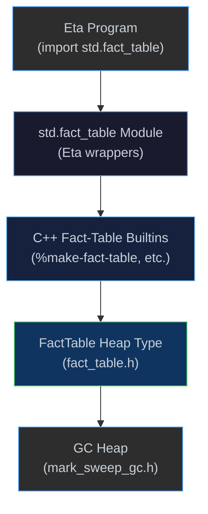

# Fact Tables

[← Back to README](../README.md) · [Modules & Stdlib](modules.md) ·
[Runtime & GC](runtime.md) · [Logic Programming](logic.md) ·
[Causal Inference](causal.md)

---

## Overview

A **FactTable** is an in-memory, column-oriented store of fixed-arity rows.
Each column holds a `std::vector<LispVal>` and can optionally carry a
per-column **hash index** (`std::unordered_multimap<LispVal, size_t>`) for
O(1)-amortised equality lookups.  The type lives on the GC heap alongside
other heap objects.

FactTables are designed for the relational, causal, and logic workloads
typical in Eta — anywhere you need to store, index, and query structured
data without leaving the language.

```scheme
(import std.fact_table)

(define trades (make-fact-table 'symbol 'side 'qty 'price))

(fact-table-insert! trades 'AAPL 'buy  100 150)
(fact-table-insert! trades 'GOOG 'sell  50 2800)
(fact-table-insert! trades 'AAPL 'sell  75 155)

(fact-table-build-index! trades 0)                ; index on 'symbol column
(fact-table-query trades 0 'AAPL)                 ; => (0 2)
(fact-table-ref trades 0 3)                       ; => 150
(fact-table-row-count trades)                     ; => 3
```

---

## Architecture



---

## Columnar Storage

Each table stores data **column-major**: `columns[col_idx][row_idx]`.
This layout is cache-friendly for column scans (e.g., aggregating all
values of a single field) and naturally supports per-column indexing.

```cpp
struct FactTable {
    std::vector<std::string>                col_names;
    std::vector<std::vector<LispVal>>       columns;    // columnar storage
    std::vector<std::unordered_multimap<LispVal, std::size_t>> indexes;
    std::size_t                             row_count{0};
};
```

When `add_row` is called, each value is appended to its corresponding
column vector.  If a column already has a live hash index, the new
value is incrementally inserted into that index — no rebuild required.

---

## Hash Indexes

Calling `(fact-table-build-index! ft col-idx)` builds (or rebuilds)
a hash index on column `col-idx`.  The index maps each distinct
`LispVal` to the set of row IDs where it appears.

Subsequent queries via `(fact-table-query ft col-idx key)` use the
index for O(1) lookups.  If no index exists, the query falls back to
a linear scan.

---

## GC Integration

The `FactTable` is a GC-managed heap object.  During mark-sweep
collection, every `LispVal` stored in its columns is visited:

```cpp
void visit_fact_table(const types::FactTable& ft) override {
    for (const auto& col : ft.columns)
        for (auto v : col) callback(v);
}
```

This ensures that values stored in the table keep their referents
alive — strings, symbols, closures, or any other heap-allocated
values will not be swept while the table references them.

---

## Low-Level Builtins

These `%`-prefixed builtins are registered in `core_primitives.h` and
are the direct C++ interface.  User code should prefer the `std.fact_table`
wrappers.

| Builtin | Args | Description |
|---------|------|-------------|
| `%make-fact-table` | `(col-name-list)` | Create a table; arg is an Eta list of symbols/strings |
| `%fact-table-insert!` | `(table row-list)` | Insert a row; arg 2 is an Eta list of values |
| `%fact-table-build-index!` | `(table col-idx)` | Build hash index on column `col-idx` |
| `%fact-table-query` | `(table col-idx key)` | Return list of row-index fixnums matching `key` |
| `%fact-table-column-names` | `(table)` | Return declared column names as symbols |
| `%fact-table-live-row-ids` | `(table)` | Return live row IDs in ascending row-id order |
| `%fact-table-group-count` | `(table group-col-idx)` | Return alist `((key . count) ...)` over live rows |
| `%fact-table-group-sum` | `(table group-col-idx value-col-idx)` | Return alist `((key . sum) ...)` over live rows |
| `%fact-table-ref` | `(table row-idx col-idx)` | Return the cell value at `(row, col)` |
| `%fact-table-row-count` | `(table)` | Return number of rows as fixnum |
| `%fact-table?` | `(value)` | Low-level fact-table predicate (`#t` / `#f`) |
| `fact-table?` | `(value)` | `#t` if value is a FactTable, `#f` otherwise |

---

## `std.fact_table` Module API

```scheme
(import std.fact_table)
```

The module wraps the low-level builtins with a friendlier variadic API.

### Construction

| Function | Signature | Description |
|----------|-----------|-------------|
| `make-fact-table` | `(col₁ col₂ …) → fact-table` | Create a table with named columns (symbols) |
| `fact-table?` | `(x) → bool` | Type predicate |

### Mutation

| Function | Signature | Description |
|----------|-----------|-------------|
| `fact-table-insert!` | `(ft val₁ val₂ …)` | Insert a row; values given as individual args |
| `fact-table-build-index!` | `(ft col-idx)` | Build/rebuild hash index on column |

### Query

| Function | Signature | Description |
|----------|-----------|-------------|
| `fact-table-query` | `(ft col-idx key) → list` | Row indices where `column[col-idx] == key` |
| `fact-table-ref` | `(ft row-idx col-idx) → value` | Cell access |
| `fact-table-row-count` | `(ft) → fixnum` | Number of rows |
| `fact-table-row` | `(ft row-idx) → list` | All values in a row as a list |

### Iteration / Higher-Order

| Function | Signature | Description |
|----------|-----------|-------------|
| `fact-table-for-each` | `(ft f)` | Call `(f row-idx)` for each live row |
| `fact-table-filter` | `(ft col-idx key) → list` | Alias for `fact-table-query` |
| `fact-table-fold` | `(ft f init) → value` | Fold `(f acc row-idx)` over live rows |

### Aggregation

| Function | Signature | Description |
|----------|-----------|-------------|
| `fact-table-group-count` | `(ft group-col-idx) → alist` | Group by key and count live rows |
| `fact-table-group-sum` | `(ft group-col-idx value-col-idx) → alist` | Group by key and sum numeric values |
| `fact-table-group-by` | `(ft group-col-idx [agg-op [value-col-idx]]) → fact-table` | Group into a new fact table; `agg-op` is `'count` (default) or `'sum` |
| `fact-table-partition` | `(ft group-col-idx) → alist` | Partition into `((key . fact-table) ...)`, one table per key |

---

## End-to-End Trace

Creating a table and querying it:

```scheme
(define ft (make-fact-table 'name 'age))
(fact-table-insert! ft 'alice 30)
(fact-table-insert! ft 'bob   25)
(fact-table-insert! ft 'alice 35)
(fact-table-build-index! ft 0)
(fact-table-query ft 0 'alice)   ; => (0 2)
(fact-table-ref ft 2 1)          ; => 35
```

**What happens at each step:**

1. `make-fact-table` calls `%make-fact-table` → `factory::make_fact_table` →
   allocates a `FactTable` on the heap with 2 empty column vectors and 2
   empty index maps.

2. `fact-table-insert!` calls `%fact-table-insert!` → `FactTable::add_row` →
   appends each value to its column vector; increments `row_count`.

3. `fact-table-build-index!` → `FactTable::build_index(0)` → clears and
   rebuilds the hash multimap for column 0.

4. `fact-table-query` → `FactTable::query(0, 'alice)` → looks up the
   index multimap → returns row IDs `{0, 2}` → builds an Eta list `(0 2)`.

5. `fact-table-ref` → `FactTable::get_cell(2, 1)` → returns `columns[1][2]`
   = `35`.

---

## Value Formatting

When displayed, a FactTable prints as:

```
#<fact-table 2cols×3rows>
```

The column count and row count are shown for quick identification.

---

## Source Locations

| Component | File |
|-----------|------|
| `FactTable` struct | [`types/fact_table.h`](../eta/core/src/eta/runtime/types/fact_table.h) |
| `ObjectKind::FactTable` | [`memory/heap.h`](../eta/core/src/eta/runtime/memory/heap.h) |
| GC visitor | [`memory/mark_sweep_gc.h`](../eta/core/src/eta/runtime/memory/mark_sweep_gc.h) |
| Heap visitor dispatch | [`memory/heap_visit.h`](../eta/core/src/eta/runtime/memory/heap_visit.h) |
| Factory function | [`factory.h`](../eta/core/src/eta/runtime/factory.h) |
| Value formatter | [`value_formatter.h`](../eta/core/src/eta/runtime/value_formatter.h) |
| Builtins | [`core_primitives.h`](../eta/core/src/eta/runtime/core_primitives.h) |
| `std.fact_table` module | [`stdlib/std/fact_table.eta`](../stdlib/std/fact_table.eta) |
| Example | [`examples/fact-table.eta`](../examples/fact-table.eta) |

