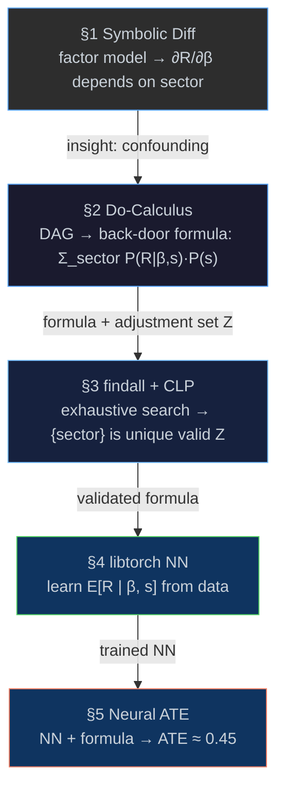

# Causal Pipeline Primer — Symbolic → Causal → Logic → Neural

[← Back to README](../../../README.md) · [Examples](../examples-tour.md) ·
[Causal Reference](causal.md) · [Portfolio Engine](../../featured_examples/portfolio.md) ·
[Logic](logic.md) · [CLP](clp.md) · [AAD](aad.md) · [Torch](torch.md)

> [!TIP]
> This page is a **gentle on-ramp** to Eta's paradigm-composition story.
> It walks the small `examples/causal_demo.eta` program (3-node DAG,
> single confounder) and uses the extra space to explain *how the VM
> actually executes it* — unification, trail management, CLP forward
> checking, and libtorch tensor objects.
>
> For the full institutional pipeline — 6-node macro DAG, AAD risk
> sensitivities, CLP(R) + QP allocation, scenario stress, dynamic
> control — read [`portfolio.md`](../../featured_examples/portfolio.md) next.

---

## Overview

[`examples/causal_demo.eta`](../../../examples/causal_demo.eta) is a compact
end-to-end pipeline: symbolic algebra feeds causal identification,
causal identification feeds logic-search validation, logic-search
feeds neural estimation, and the neural model plugs back into the
causal formula to produce an Average Treatment Effect.

| Section | Stage                             | What it does |
|---------|-----------------------------------|--------------|
| **§1** | Symbolic Processing               | Define a factor model as S-expressions, differentiate it, simplify with fixed-point rewriting |
| **§2** | Causal Reasoning                  | Encode a 3-node DAG; derive the back-door formula with `do:identify` |
| **§3** | Logic & CLP                       | `findall` enumerates valid adjustment sets; `clp(Z)` validates probability weights |
| **§4** | libTorch Integration              | Train a neural network to learn `E[return \| beta, sector]` |
| **§5** | Neural Back-Door Estimation (ATE) | Plug NN predictions into the back-door formula to compute the ATE |



---

## Running the Example

The example requires a release bundle with **torch support**.

```console
# Compile + run (recommended)
etac -O examples/causal_demo.eta
etai causal_demo.etac

# Or interpret directly
etai examples/causal_demo.eta
```

`etac -O` runs the full compilation pipeline with optimization passes
(constant folding, dead-code elimination) and serializes compact
bytecode; `etai` then loads `.etac` directly, skipping lex / parse /
expand / link / analysis for faster startup.

---

## The Question

> *"Does increasing a portfolio's market-beta exposure causally increase
>  returns, or is the relationship driven by sector composition?"*

A naive regression of `stock-return` on `market-beta` conflates two
paths:

```
sector ──→ market-beta ──→ stock-return     (causal path)
sector ──────────────────→ stock-return     (direct sector effect)
```

`sector` is a **confounder** — it influences both the exposure and the
outcome.

---

## 1 — Symbolic Factor Model & Differentiation

This stage is the unique pedagogical contribution of the primer:
the factor model is a quoted S-expression tree that a self-contained
differentiator pattern-matches over.

```scheme
(define factor-model
  '(+ (+ (+ alpha (* beta market))
          (* gamma sector))
      (* delta (* beta sector))))    ; return = α + β·market + γ·sector + δ·β·sector
```

Three accessors destructure each node:

```scheme
(defun op (e) (car e))
(defun a1 (e) (car (cdr e)))
(defun a2 (e) (car (cdr (cdr e))))
```

The differentiator applies the sum and product rules:

```scheme
(defun diff (e v)
  (cond
    ((number? e) 0)
    ((symbol? e) (if (eq? e v) 1 0))
    ((eq? (op e) '+)
      (list '+ (diff (a1 e) v) (diff (a2 e) v)))
    ((eq? (op e) '*)
      (list '+ (list '* (diff (a1 e) v) (a2 e))
               (list '* (a1 e) (diff (a2 e) v))))
    (#t 0)))
```

A simplifier wrapped in a fixed-point loop folds constants and
eliminates identity elements:

```scheme
(defun simplify* (e)
  (let ((s (simplify e)))
    (if (equal? s e) s (simplify* s))))

(defun D (expr var) (simplify* (diff expr var)))

(define dR/dbeta   (D factor-model 'beta))     ; => (+ market (* delta sector))
(define dR/dsector (D factor-model 'sector))   ; => (+ gamma (* delta beta))
```

The key insight: `∂return/∂beta` contains `sector`. The beta
sensitivity is **not constant** across sectors — exactly the
interaction term that motivates causal analysis.

> [!NOTE]
> **How the VM handles it**
>
> The factor model is a **quoted list** — the compiler emits `LoadConst`
> instructions that push NaN-boxed `ConsPtr` heap objects. No
> evaluation happens until `diff` pattern-matches on the tree by calling
> `car`, `cdr`, `eq?` (which compile to `Car`, `Cdr`, `Eq` opcodes).
>
> `simplify*` is a **fixed-point loop**: it calls `simplify`, compares
> the result with `equal?` (deep structural equality, O(n) tree walk),
> and loops until no further reductions fire. The compiler recognises
> the self-tail-call and emits a `Jump` back to the function entry
> instead of a `Call` + `Return` pair — so the fixed-point iteration
> runs in constant stack space.

---

## 2 — Causal DAG & Do-Calculus Identification

Encode the causal structure as a DAG in `std.causal`'s edge-list
format and ask `do:identify` for the adjustment formula:

```scheme
(define finance-dag
  '((sector      -> market-beta)
    (sector      -> stock-return)
    (market-beta -> stock-return)))

(define formula (do:identify finance-dag 'stock-return 'market-beta))
;; => P(stock-return | do(market-beta))
;;     = Σ_{sector} P(stock-return | market-beta, sector) · P(sector)
;;    Adjustment set Z = (sector)
```

The formula tells us: to estimate the causal effect of beta on
returns, **stratify by sector**, then average over the sector
distribution.

> See [`causal.md` — Symbolic Identification with Do-Calculus](causal.md#symbolic-identification-with-do-calculus)
> for the three-rules formalism, the back-door criterion proof, and
> the full DAG-utility API.

---

## 3 — Logic Search & CLP Validation

Instead of trusting the single adjustment set returned by
`do:identify`, `findall` exhaustively enumerates all valid adjustment
sets via backtracking; `clp(Z)` then checks that the resulting sector
weights are valid probabilities.

```scheme
(let* ((z (logic-var))
       (valid-sets
         (findall
           (lambda () (deref-lvar z))
           (map* (lambda (cand)
                   (lambda ()
                     (and (== z cand)
                          (dag:satisfies-backdoor?
                            finance-dag 'market-beta 'stock-return cand))))
                 candidates))))
  (println valid-sets))            ; => ((sector))
```

```scheme
(let ((w-tech (logic-var)))
  (clp:domain w-tech 1 99)         ; P(tech) ∈ (0,1) — no degenerate strata
  (unify w-tech 33))               ; commits only if 33 ∈ [1,99]
```

> See [`portfolio.md`](../../featured_examples/portfolio.md) for the same `clp(R)` machinery
> applied to exact portfolio feasibility (no penalties, no projection).

> [!NOTE]
> **How the VM handles it**
>
> **Logic variables** are heap-allocated objects with tag `LogicVar`.
> `(logic-var)` compiles to `MakeLogicVar`, which allocates a fresh
> cell on the GC heap.
>
> **Unification** (`== z cand`) compiles to `Unify`. The VM performs
> Robinson's structural unification: walk both sides to their root,
> bind the unbound side, and **push the binding onto the trail** (a
> stack of `(variable, old-value)` pairs).
>
> **Trail management:** `(trail-mark)` → `TrailMark` opcode pushes the
> current trail stack pointer. `(unwind-trail mark)` → `UnwindTrail`
> opcode pops and unbinds every entry back to the saved mark. This
> gives `findall` its backtracking — each branch is tried in
> isolation.
>
> **CLP forward checking:** `(clp:domain w 1 99)` calls the C++
> primitive `%clp-domain-z!`, which attaches a `ConstraintStore::Domain`
> to the logic variable. When `(unify w 33)` fires, the VM checks the
> domain **before** committing the binding — out-of-domain unification
> returns `#f` immediately, so no search effort is wasted.

---

## 4 — Neural Network Training (libtorch)

Train a small MLP to learn `E[return | beta, sector]` — the
conditional expectation that the back-door formula requires.

```scheme
(define net (sequential (linear 2 32)
                        (relu-layer)
                        (linear 32 16)
                        (relu-layer)
                        (linear 16 1)))
(define opt (adam net 0.001))

(train! net)
(letrec ((loop (lambda (epoch)
         (if (> epoch 8000) 'done
             (let ((loss (train-step! net opt mse-loss X Y)))
               (loop (+ epoch 1)))))))
  (loop 1))
(eval! net)
```

`train-step!` sequences zero-grad → forward → loss → backward → step
in one call. Training data is 60 observations (20 per sector)
generated from the DGP `return = 1.5·beta + 0.8·sector_code +
0.3·beta·sector_code + noise`.

> See [`portfolio.md`](../../featured_examples/portfolio.md) for the same NN architecture
> applied to a fact-table-backed per-sector return model with explicit
> DGP recovery checks.

> [!NOTE]
> **How the VM handles it**
>
> **Tensor objects** are heap-allocated `TensorPtr` values — the VM
> stores a `std::shared_ptr<at::Tensor>` inside a GC-managed heap
> object. When the GC traces reachable objects, tensor pointers
> participate in the mark phase; when collected, the destructor
> releases the libtorch tensor memory.
>
> **`train-step!`** is a pure Eta function (defined in `std.torch`)
> that sequences five `CallBuiltin` opcodes — `optim/zero-grad!`,
> `nn/forward`, the loss function, `torch/backward`, and `optim/step!`
> — each invoking the corresponding C++ primitive registered in
> `core_primitives.h`.

---

## 5 — Neural Back-Door Estimation (ATE)

Plug the trained NN into the do-calculus adjustment formula:

```
E[return | do(beta=x)] = Σ_{sector}  E_NN[return | beta=x, sector=s] · P(s)
```

```scheme
(defun nn-predict (beta-val sector-code)
  (let* ((inp (reshape (from-list (list beta-val sector-code)) '(1 2)))
         (out (forward net inp)))
    (item out)))

(defun nn-adjusted-effect (beta-val)
  (/ (+ (nn-predict beta-val  1.0)     ; tech
        (nn-predict beta-val  0.0)     ; energy
        (nn-predict beta-val -1.0))    ; finance
     3.0))

(define ate (- (nn-adjusted-effect 1.2)
               (nn-adjusted-effect 0.9)))
```

### Result

```
  E[return | do(beta=1.2)] = 1.806
  E[return | do(beta=0.9)] = 1.356
  ATE(beta: 0.9 -> 1.2)    = 0.449

  True ATE (from DGP) = 1.5 * (1.2 - 0.9) = 0.45
```

The NN estimate matches the DGP because `E[sector_code] =
(1+0+(−1))/3 = 0` (balanced design): the interaction term vanishes
in expectation and the ATE equals the direct beta coefficient times
the beta increment. A naive regression that ignores confounding
would over-estimate the effect for tech and under-estimate it for
finance; the back-door adjustment correctly isolates the causal
contribution of beta.

---

## Where to Go Next

| If you want…                                                       | Read                                     |
|--------------------------------------------------------------------|------------------------------------------|
| The full `std.causal` / do-calculus API                            | [`causal.md`](causal.md)                 |
| A 6-node macro DAG, AAD sensitivities, QP, stress, dynamic control | [`portfolio.md`](../../featured_examples/portfolio.md)           |
| Logic-programming primitives in detail                             | [`logic.md`](logic.md)                   |
| CLP(R) and convex QP for allocation                                | [`clp.md`](clp.md)                       |
| libtorch tensors, NN layers, optimizers                            | [`torch.md`](torch.md)                   |
| Reverse-mode AAD walkthrough                                       | [`aad.md`](aad.md)                       |

---

## Source Locations

| Component                                | File                                                                                                    |
|------------------------------------------|---------------------------------------------------------------------------------------------------------|
| Causal demo (this primer)                | [`examples/causal_demo.eta`](../../../examples/causal_demo.eta)                                              |
| Portfolio engine (full pipeline)         | [`examples/portfolio.eta`](../../../examples/portfolio.eta)                                                  |
| Causal DAG utilities & do-calculus       | [`stdlib/std/causal.eta`](../../../stdlib/std/causal.eta)                                                    |
| Logic programming (`findall`, `membero`) | [`stdlib/std/logic.eta`](../../../stdlib/std/logic.eta)                                                      |
| CLP(Z) / CLP(FD) domains                 | [`stdlib/std/clp.eta`](../../../stdlib/std/clp.eta)                                                          |
| libtorch wrappers                        | [`stdlib/std/torch.eta`](../../../stdlib/std/torch.eta)                                                      |
| VM execution engine                      | [`eta/core/src/eta/runtime/vm/vm.cpp`](../../../eta/core/src/eta/runtime/vm/vm.cpp)                          |
| Constraint store (forward checking)      | [`eta/core/src/eta/runtime/clp/constraint_store.h`](../../../eta/core/src/eta/runtime/clp/constraint_store.h)|
| Bytecode compiler (`etac`)               | [`docs/compiler.md`](compiler.md)                                                                       |
