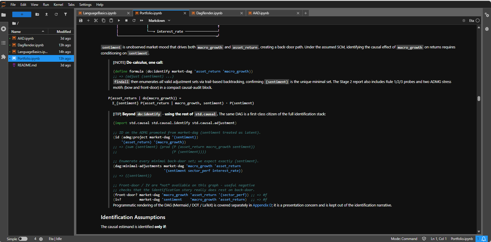
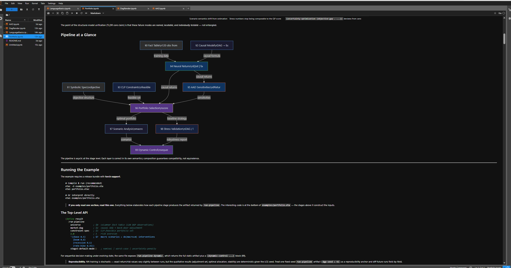
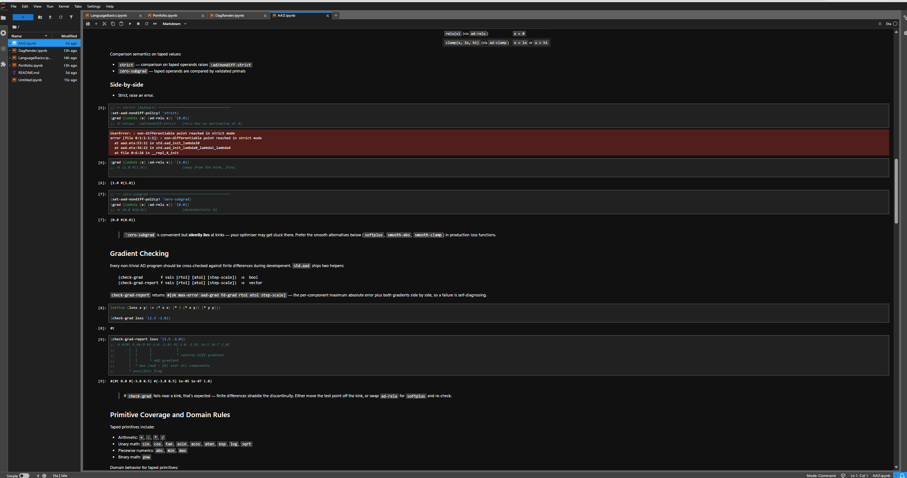

# Eta Jupyter Kernel (`eta_jupyter`)

This page documents the current local kernel workflow and the notebook-facing
runtime behavior.

## Build

Jupyter is part of the required dependency stack. Configure and build
`eta_jupyter` (or `eta_all`):

```powershell
cmake -S . -B out/msvc-release
cmake --build out/msvc-release --target eta_jupyter -j 14
```

## Install kernelspec

`eta_jupyter` now supports runtime installation:

```powershell
eta_jupyter --install --user
eta_jupyter --install --sys-prefix
eta_jupyter --install --prefix C:\eta\install
```

Supported flags:

- `--install`: write a `kernel.json` for the current `eta_jupyter` executable.
- `--user`: install into the user Jupyter data directory.
- `--sys-prefix`: install under the active Python/Conda prefix
  (`CONDA_PREFIX`, `VIRTUAL_ENV`, or `PYTHONHOME`).
- `--prefix <path>` / `--prefix=<path>`: install under an explicit prefix.

## Rich display

Execution now publishes MIME bundles (with `text/plain` fallback) for:

- `application/vnd.eta.tensor+json`
- `application/vnd.eta.facttable+json`
- `application/vnd.eta.heap+json`
- `application/vnd.eta.disasm+json`
- `application/vnd.eta.actors+json`
- `application/vnd.eta.dag+json`
- `application/vnd.eta.tensor-explorer+json`
- `application/vnd.vegalite.v5+json`
- `text/html`
- `text/markdown`
- `text/latex`
- `image/svg+xml`
- `image/png`

Notebook helpers are available from `std.jupyter`:

```eta
(import std.jupyter)
(jupyter:html "<b>Hello</b>")
(jupyter:tensor (torch/zeros '(3 3)))
(jupyter:table some-fact-table)
(jupyter:plot 'line '(1 2 3) '(2 4 8))
```

## Notebook screenshots

### Generic notebook flow

Basic Eta notebook execution and cell output:



### Rich rendering

Example of notebook-side rich rendering output:



### Error reporting

Example of runtime error reporting in a notebook cell:



## Comm widgets

`std.jupyter` now includes comm-backed helpers for live debug widgets:

- `(jupyter:heap)`
- `(jupyter:disasm query)`
- `(jupyter:actors)`
- `(jupyter:dag graph)` where `graph` is either:
  - graph-json shape: `((nodes ...) (edges ...))`
  - edge-list shape: `((a -> b) (b -> c) ...)`
- `(jupyter:tensor-explorer tensor-json)`

When the labextension is not installed, these helpers still render an HTML
fallback snapshot.

## Magics

The kernel supports line and cell magics in `execute_request_impl`:

- `%time EXPR`
- `%timeit EXPR`
- `%bytecode EXPR`
- `%load PATH`
- `%run PATH`
- `%env [KEY[=VALUE]]`
- `%cwd [PATH]`
- `%import MOD`
- `%reload MOD`
- `%who`
- `%whos`
- `%plot EXPR`
- `%table EXPR`
- `%%trace` (cell magic)

## Interrupts and actor output routing

- The kernel installs a signal-driven interrupt pump (`SIGINT`/`SIGTERM`) that
  calls `Driver::request_interrupt()` on the active interpreter.
- VM interrupt checks remain in the opcode hot loop, so runaway evaluation can
  be interrupted without restarting the kernel.
- `spawn-thread` captures the active stream sinks at spawn time. Output from the
  spawned actor therefore continues to route to the originating cell stream even
  after the cell has returned.
- `spawn` child processes do not inherit notebook stream sinks; use the actor
  comm widget for process/thread state visibility.

## Kernel state model

The kernel uses one shared `Driver` per process. Cell re-execution and
redefinitions follow standard Jupyter semantics.

Optional startup configuration is loaded from `kernel.toml`:

- `ETA_KERNEL_CONFIG` (explicit file path), or
- `~/.config/eta/kernel.toml` (plus platform fallbacks).

Example:

```toml
[autoimport]
modules = ["std.io", "std.logic", "std.stats"]

[display]
table_max_rows = 1000
tensor_preview = 8
plot_theme = "light"

[interrupt]
hard_kill_after_seconds = 30
```

`std.io` is always auto-imported.
