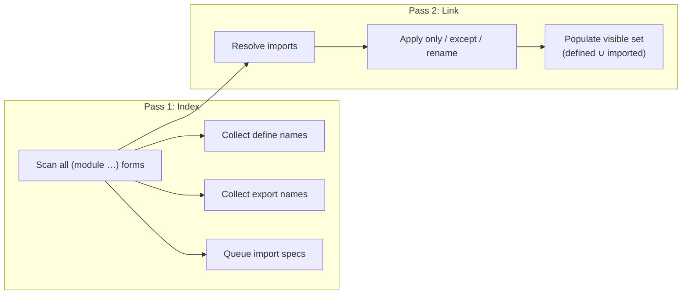
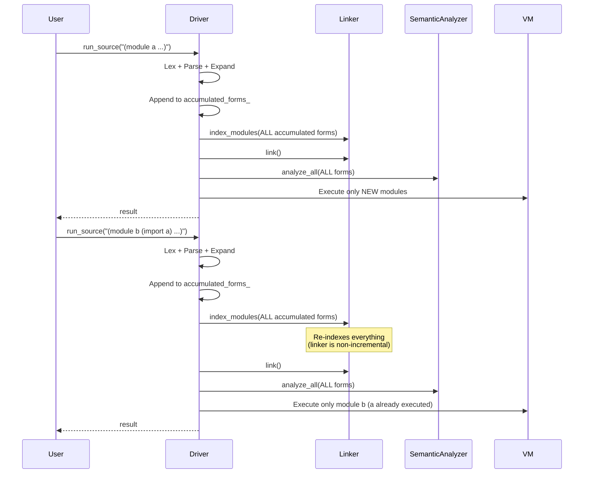

# Modules & Standard Library

[<- Back to README](../../../README.md) · [Architecture](../../architecture.md) ·
[NaN-Boxing](nanboxing.md) · [Bytecode & VM](bytecode-vm.md) ·
[Runtime & GC](runtime.md) · [Networking](networking.md) ·
[Message Passing](message-passing.md)

---

## Module System

Eta organises code into **modules**. Every top-level source file must
contain one or more `(module …)` forms. The module system supports
exports, imports with filtering, and incremental REPL execution.

**Key sources:**
[`module_linker.h`](../../../eta/core/src/eta/reader/module_linker.h) ·
[`expander.h`](../../../eta/core/src/eta/reader/expander.h) ·
[`driver.h`](../../../eta/session/src/eta/session/driver.h)

---

### Module Syntax

```scheme
(module <name>
  (export <id> ...)           ;; names visible to importers
  (import <module-name>)      ;; import all exported names
  (import (only <mod> <id> ...))
  (import (except <mod> <id> ...))
  (import (rename <mod> (<old> <new>) ...))
  (begin
    (define ...)
    (defun ...)
    ...))
```

**Example:**

```scheme
(module geometry
  (export area circumference)
  (import std.math)
  (begin
    (defun area (r) (* pi (* r r)))
    (defun circumference (r) (* 2 pi r))))
```

---

### Module Linker Phases

The `ModuleLinker` resolves inter-module dependencies in two passes:



#### Pass 1 — `index_modules()`

For each `(module name ...)` form:

1. Create a `ModuleTable` entry with the module `name`
2. Scan the body for `define` / `defun` forms ? populate `defined`
3. Scan `(export …)` ? populate `exports`
4. Queue `(import …)` clauses as `PendingImport`s

**Errors detected:** `DuplicateModule`

#### Pass 2 — `link()`

For each queued `PendingImport`:

1. Look up the source module's `exports` set
2. Apply the import filter:

| Filter | Effect |
|--------|--------|
| `(import mod)` | Import all exported names |
| `(import (only mod a b))` | Import only `a` and `b` |
| `(import (except mod x))` | Import all except `x` |
| `(import (rename mod (old new)))` | Import `old` as `new` |

3. Check for conflicts with already-visible names
4. Add resolved names to the target module's `visible` set
5. Record provenance in `import_origins` for diagnostics

**Errors detected:** `UnknownModule`, `CircularDependency`,
`ConflictingImport`, `NameNotExported`, `ExportOfUnknownName`

---

### Incremental Execution (REPL)

The `Driver` supports incremental execution for the REPL:



Key properties:
- **All** accumulated forms are re-fed to the linker each time (it is
  stateless between calls)
- The `executed_modules_` set tracks which modules have already run,
  so they are not re-executed
- VM `globals_` persist across calls, so definitions from module `a`
  are visible when module `b` runs
- Builtins are re-installed each cycle (their heap objects may have been GC'd)

---

### Prelude Auto-Loading

On startup, the `Driver` calls `load_prelude()` which searches the
module path for `prelude.eta`. This file defines the standard library
modules inline. After the prelude runs, its modules are in
`executed_modules_` and their global slots are populated in the VM.

---

## Standard Library Reference

All standard library modules are defined in the
[`stdlib/std/`](../../../stdlib/std/) directory; the
[`stdlib/prelude.eta`](../../../stdlib/prelude.eta) file aggregates and
re-exports a curated subset for one-line import:

```scheme
(import std.prelude)  ;; imports std.core, std.math, std.aad, std.io, std.collections,
                      ;; std.logic, std.clp, std.causal, std.fact_table,
                      ;; std.db, std.stats, std.time, and std.net
```

---

### `std.core` — Core Combinators & Predicates

```scheme
(import std.core)
```

| Function | Signature | Description |
|----------|-----------|-------------|
| `atom?` | `(x) ? bool` | True if `x` is not a pair |
| `void` | `() ? '()` | Returns the empty list |
| `identity` | `(x) ? x` | Identity function |
| `compose` | `(f g) ? (λ (x) (f (g x)))` | Function composition |
| `flip` | `(f) ? (λ (a b) (f b a))` | Swap arguments |
| `constantly` | `(v) ? (λ args v)` | Always returns `v` |
| `negate` | `(pred) ? (λ (x) (not (pred x)))` | Negate a predicate |
| `cadr` | `(xs) ? element` | Second element |
| `caddr` | `(xs) ? element` | Third element |
| `caar`, `cdar`, `caddar` | `(xs) ? element` | Nested accessors |
| `last` | `(xs) ? element` | Last element of a list |
| `list?` | `(x) ? bool` | True if `x` is a proper list |
| `iota` | `(count [start [step]]) ? list` | Generate a sequence |
| `assoc-ref` | `(key alist) ? value \| #f` | Association list lookup |

---

### `std.math` — Mathematical Functions

```scheme
(import std.math)
```

| Binding | Type | Description |
|---------|------|-------------|
| `pi` | constant | 3.141592653589793 |
| `e` | constant | 2.718281828459045 |
| `square` | `(x) ? x→` | Square |
| `cube` | `(x) ? x→` | Cube |
| `even?` | `(n) ? bool` | Even predicate |
| `odd?` | `(n) ? bool` | Odd predicate |
| `sign` | `(x) ? -1 \| 0 \| 1` | Sign function |
| `clamp` | `(x lo hi) ? number` | Clamp to range |
| `quotient` | `(a b) ? number` | Integer quotient |
| `gcd` | `(a b) ? number` | Greatest common divisor |
| `lcm` | `(a b) ? number` | Least common multiple |
| `expt` | `(base exp) ? number` | Exponentiation (fast power) |
| `sum` | `(xs) ? number` | Sum of a list |
| `product` | `(xs) ? number` | Product of a list |

---

### `std.aad` — AD Helpers and Gradient Checks

```scheme
(import std.aad)
```

| Function | Signature | Description |
|----------|-----------|-------------|
| `grad` | `(f vals) ? (list primal grad-vector)` | Run tape-based reverse-mode AD on scalar `f` |
| `ad-abs` | `(x) ? number` | Policy-aware absolute value |
| `ad-max` / `ad-min` | `(a b ...) ? number` | Policy-aware piecewise max/min |
| `ad-relu` | `(x) ? number` | `max(0, x)` built on AD-safe primitives |
| `ad-clamp` | `(x lo hi) ? number` | Policy-aware clamp |
| `softplus` | `(x beta) ? number` | Smooth approximation to `max(0, x)` |
| `smooth-abs` | `(x epsilon) ? number` | Smooth absolute value (`epsilon` required) |
| `smooth-clamp` | `(x lo hi beta) ? number` | Smooth clamp approximation |
| `check-grad` | `(f vals [rtol [atol [step-scale]]]) ? bool` | Compare AAD gradient vs finite differences |
| `check-grad-report` | `(f vals [rtol [atol [step-scale]]]) ? vector` | Detailed gradient-check report |
| `with-checkpoint` | `(thunk) ? result` | Checkpoint API surface for AD blocks |

---

### `std.io` — Input/Output Utilities

```scheme
(import std.io)
```

| Function | Signature | Description |
|----------|-----------|-------------|
| `print` | `(x)` | Display `x` |
| `println` | `(x)` | Display `x` followed by newline |
| `eprintln` | `(x)` | Print to stderr |
| `display-to-string` | `(x) ? string` | Render value to string via string port |
| `read-line` | `([port]) ? string \| #f` | Read a line (returns `#f` at EOF) |
| `with-output-to-port` | `(port thunk) ? result` | Redirect stdout for `thunk` |
| `with-input-from-port` | `(port thunk) ? result` | Redirect stdin for `thunk` |
| `with-error-to-port` | `(port thunk) ? result` | Redirect stderr for `thunk` |

---

### `std.collections` — Higher-Order List & Vector Operations

```scheme
(import std.collections)
```

| Function | Signature | Description |
|----------|-----------|-------------|
| `map*` | `(f xs) ? list` | Map (single-list) |
| `map2` | `(f xs ys) ? list` | Pairwise map over two lists (truncates to shorter list) |
| `zip-with` | `(f xs ys) ? list` | Alias for `map2` |
| `map-indexed` | `(f xs) ? list` | Map with zero-based index (calls `f` with `i` and `x`) |
| `filter` | `(pred xs) ? list` | Keep elements matching `pred` |
| `foldl` | `(f acc xs) ? value` | Left fold |
| `foldr` | `(f init xs) ? value` | Right fold |
| `reduce` | `(f xs) ? value` | Fold without initial accumulator |
| `any?` | `(pred xs) ? bool` | True if any element matches |
| `every?` | `(pred xs) ? bool` | True if all elements match |
| `count` | `(pred xs) ? number` | Count matching elements |
| `sum-by` | `(f xs) ? number` | Sum transformed elements |
| `zip` | `(xs ys) ? list` | Zip two lists into pairs |
| `pairwise` | `(xs) ? list` | Adjacent element pairs as dotted pairs |
| `take` | `(n xs) ? list` | First `n` elements |
| `drop` | `(n xs) ? list` | Skip first `n` elements |
| `flatten` | `(xss) ? list` | Flatten one level of nesting |
| `range` | `(start end) ? list` | Integer range `[start, end)` |
| `sort` | `(less? xs) ? list` | Merge sort with custom comparator |
| `vector-map` | `(f v) ? vector` | Map over a vector |
| `vector-for-each` | `(f v)` | Side-effecting vector traversal |
| `vector-foldl` | `(f acc v) ? value` | Left fold over a vector |
| `vector-foldr` | `(f init v) ? value` | Right fold over a vector |
| `vector->list` | `(v) ? list` | Convert vector to list |
| `list->vector` | `(xs) ? vector` | Convert list to vector |

---

### `std.hashmap` — Hash Map Helpers

```scheme
(import std.hashmap)
```

Runtime primitives:

| Function | Signature | Description |
|----------|-----------|-------------|
| `hash-map` | `(k1 v1 k2 v2 ...) -> map` | Construct a map from key/value pairs |
| `make-hash-map` | `() -> map` | Empty hash map |
| `hash-map?` | `(x) -> bool` | Hash map predicate |
| `hash-map-ref` | `(m k [default]) -> value` | Lookup with optional default |
| `hash-map-assoc` | `(m k v) -> map` | Return a map with `k` bound to `v` |
| `hash-map-dissoc` | `(m k) -> map` | Return a map without `k` |
| `hash-map-keys` | `(m) -> list` | Keys as a list |
| `hash-map-values` | `(m) -> list` | Values as a list |
| `hash-map-size` | `(m) -> int` | Number of entries |
| `hash-map->list` | `(m) -> list` | Association-list form `((k . v) ...)` |
| `list->hash-map` | `(xs) -> map` | Build from alist or flat key/value list |
| `hash-map-fold` | `(f init m) -> value` | Fold with `(f acc k v)` |
| `hash` | `(x) -> int` | Generic hash function |

Convenience wrappers:

`hash-map-empty?`, `hash-map-contains?`, `hash-map-update`,
`hash-map-update-with-default`, `hash-map-merge`, `hash-map-merge-with`,
`hash-map-map`, `hash-map-filter`, `hash-map->alist`, `alist->hash-map`.

---

### `std.hashset` — Hash Set Helpers

```scheme
(import std.hashset)
```

Runtime primitives:

| Function | Signature | Description |
|----------|-----------|-------------|
| `make-hash-set` | `() -> set` | Empty hash set |
| `hash-set` | `(x1 x2 ...) -> set` | Construct a set from values |
| `hash-set?` | `(x) -> bool` | Hash set predicate |
| `hash-set-add` | `(s x) -> set` | Add an element |
| `hash-set-remove` | `(s x) -> set` | Remove an element |
| `hash-set-contains?` | `(s x) -> bool` | Membership check |
| `hash-set-union` | `(a b) -> set` | Union |
| `hash-set-intersect` | `(a b) -> set` | Intersection |
| `hash-set-diff` | `(a b) -> set` | Difference `a \ b` |
| `hash-set->list` | `(s) -> list` | Set elements as a list |
| `list->hash-set` | `(xs) -> set` | Build from list |

Convenience wrappers:

`hash-set-empty?`, `hash-set-size`, `hash-set-subset?`, `hash-set-equal?`.

---

### `std.regex` — Regular Expressions

```scheme
(import std.regex)
```

Regex helpers backed by C++ `std::regex` (ECMAScript syntax). The API accepts either compiled regex handles or string patterns.

| Function | Signature | Description |
|----------|-----------|-------------|
| `regex:compile` | `(pattern . flags) -> regex` | Compile a reusable regex object |
| `regex:match?` | `(regex-or-pattern input) -> bool` | Full-string match |
| `regex:search` | `(regex-or-pattern input [start]) -> match-or-#f` | First match with offsets/captures |
| `regex:find-all` | `(regex-or-pattern input) -> list` | All matches |
| `regex:replace` | `(regex-or-pattern input replacement) -> string` | Replacement string form (`$1`, `$<name>`, etc.) |
| `regex:replace-fn` | `(regex-or-pattern input fn) -> string` | Callback replacement form |
| `regex:split` | `(regex-or-pattern input) -> vector` | Regex delimiter split |
| `regex:quote` | `(s) -> string` | Escape regex metacharacters |
| `regex:match-groups-hash` | `(match) -> hash-map` | Named capture groups as a hash map of `name -> (start . end)` |

For the full reference and performance notes, see [regex.md](regex.md).

---

### `std.test` — Lightweight Test Framework

```scheme
(import std.test)
```

Uses `define-record-type` for `test-case`, `test-group`, `test-result`,
`group-result`, and `test-summary`.

| Function | Description |
|----------|-------------|
| `make-test` | `(name thunk)` — create a test case |
| `make-group` | `(name children)` — create a test group |
| `run` | `(node) ? result` — run a test or group |
| `summary` | `(result) ? test-summary` — count pass/fail |
| `print-summary` | `(summary)` — display totals |
| `assert-true` | `(x [msg])` — assert truthy |
| `assert-false` | `(x [msg])` — assert falsy |
| `assert-equal` | `(expected actual [msg])` — assert equality |
| `assert-not-equal` | `(a b [msg])` — assert inequality |
| `assert-approx-equal` | `(expected actual tol [msg])` → assert numeric closeness within `tol` |
| `print-tap` | `(result)` — emit TAP-formatted output for CI consumers |
| `print-junit` | `(result [port])` — emit JUnit XML for CI consumers |

**Example:**

```scheme
(module my-tests
  (import std.test)
  (import std.math)
  (import std.io)
  (begin
    (define suite
      (make-group "math"
        (list
          (make-test "square"
            (lambda () (assert-equal 25 (square 5))))
          (make-test "gcd"
            (lambda () (assert-equal 6 (gcd 12 18)))))))

    (let ((result (run suite)))
      (print-summary (summary result)))))
```

Output:
```
2 tests, 2 passed, 0 failed
```

---

---

### `std.logic` — Relational / miniKanren-style Programming

```scheme
(import std.logic)
```

Provides logic variables, unification, search combinators, and a
miniKanren-flavoured surface (`fresh`, `conde`, `conj`, `disj`,
`run*`, `run-n`, `run1`, `==`, `==o`, `succeedo`, `failo`,
`copy-term*`, `naf`, `succeeds?`, `findall`, `membero`,
`condu`, `conda`, `onceo`, `logic-throw`, `logic-catch`).

> **📖 Full documentation:** [Logic Programming](logic.md)

---

### `std.clp` — Constraint Logic Programming over Integers / Finite Domains

```scheme
(import std.clp)
```

Domain constructors (`(z lo hi)`, `(fd v1 v2 ...)`), constraint
posting (`clp:= clp:+ clp:plus-offset clp:abs clp:* clp:sum
clp:scalar-product clp:element clp:<= clp:>= clp:<>`),
`clp:all-different`, search (`clp:solve`, `clp:labeling`), and
optimisation (`clp:minimize`, `clp:maximize`). Shares the unified
trail and the `'clp.prop` async propagation queue with `std.clpb`
and `std.clpr`.

> **📖 Full documentation:** [Constraint Logic Programming (Z/FD)](clp.md)

---

### `std.clpb` — Boolean Constraint Logic (opt-in)

```scheme
(import std.clpb)
```

Boolean variables and constraints (`clp:boolean`, `clp:and`,
`clp:or`, `clp:xor`, `clp:imp`, `clp:eq`, `clp:not`, `clp:card`)
plus search and queries (`clp:labeling-b`, `clp:sat?`, `clp:taut?`).
Not auto-imported by `std.prelude`.

> **📖 Full documentation:** [Boolean Constraints (CLP(B))](clpb.md)

---

### `std.clpr` — Real-Interval Constraint Logic (opt-in)

```scheme
(import std.clpr)
```

Real-domain constructors and accessors, linear arithmetic
(`clp:r+`, `clp:r-`, `clp:r*scalar`), constraint posting
(`clp:r=`, `clp:r<=`, `clp:r<`, `clp:r>=`, `clp:r>`), simplex/QP
optimisation (`clp:r-minimize`, `clp:r-maximize`,
`clp:rq-minimize`, `clp:rq-maximize`), and queries
(`clp:r-bounds`, `clp:r-feasible?`). Not auto-imported by
`std.prelude`.

---

### `std.db` — Procedural Datalog over Fact Tables

```scheme
(import std.db)
```

Defines persistent relations as `defrel`, asserts/retracts ground
facts (`assert`, `retract`, `retract-all`), queries via
`call-rel` / `call-rel?`, builds per-argument indexes
(`index-rel!`), and tabulates recursive rules (`tabled`).

> **📖 Full documentation:** [Datalog Database](db.md)

---

### `std.causal` — DAGs, Do-Calculus, and Causal Estimation

```scheme
(import std.causal)
```

DAG utilities (`dag:nodes`, `dag:parents`, …), do-calculus
identification (`do:identify`, `do:identify-details`, observed
variants), and numeric estimators (`do:estimate-effect`,
`do:conditional-mean`, `do:marginal-prob`).

> **📖 Full documentation:** [Causal Inference](causal.md)

ADMG-specific helpers (districts and latent projection) are in a
separate submodule:

```scheme
(import std.causal.admg)
```

---

### `std.stats` — Statistics & Linear Models

```scheme
(import std.stats)
```

Descriptive statistics, distribution quantiles, bivariate measures, OLS
(returns a `%ols-result` record with backward-compatible
nine-element list accessors), multivariate regression, and
column-wise operations over lists, vectors, or fact-table columns.
Eigen-backed.

> **📖 Full documentation:** [Statistics](stats.md)

---

### `std.time` - Wall-Clock and Monotonic Time

```scheme
(import std.time)
```

Time helpers for wall-clock timestamps, monotonic elapsed measurement,
sleep/delay, UTC/local calendar breakdown, and ISO-8601 formatting.

| Function | Signature | Description |
|----------|-----------|-------------|
| `time:now-ms` | `() -> int` | Current Unix epoch in milliseconds |
| `time:now-us` | `() -> int` | Current Unix epoch in microseconds |
| `time:now-ns` | `() -> int` | Current Unix epoch in nanoseconds |
| `time:monotonic-ms` | `() -> int` | Monotonic milliseconds (origin unspecified) |
| `time:sleep-ms` | `(ms) -> '()` | Sleep current thread for `ms` milliseconds |
| `time:utc-parts` | `(epoch-ms) -> alist` | Date/time parts with `offset-minutes = 0` |
| `time:local-parts` | `(epoch-ms) -> alist` | Local date/time parts with timezone offset |
| `time:format-iso8601-utc` | `(epoch-ms) -> string` | `YYYY-MM-DDTHH:MM:SSZ` |
| `time:format-iso8601-local` | `(epoch-ms) -> string` | `YYYY-MM-DDTHH:MM:SS+/-HH:MM` |
| `time:elapsed-ms` | `(start end) -> int` | Non-negative monotonic delta |

Example:

```scheme
(let ((t0 (time:monotonic-ms)))
  (time:sleep-ms 25)
  (println (time:elapsed-ms t0 (time:monotonic-ms))))
```

---

### `std.fs` — Filesystem and Path Primitives

```scheme
(import std.fs)
```

Path manipulation, directory enumeration, file metadata, and temp-file
allocation backed by `std::filesystem`. Auto-imported by `std.prelude`.

| Function | Signature | Description |
|----------|-----------|-------------|
| `fs:file-exists?` | `(path) -> bool` | Path resolves on disk |
| `fs:directory?` | `(path) -> bool` | Path is a directory |
| `fs:delete-file` | `(path) -> '()` | Remove a regular file |
| `fs:make-directory` | `(path) -> '()` | Create a directory (idempotent) |
| `fs:list-directory` | `(path) -> list` | Sorted entry names |
| `fs:path-join` | `(seg ...) -> string` | Variadic path build |
| `fs:path-split` | `(path) -> list` | Inverse of `fs:path-join` |
| `fs:path-normalize` | `(path) -> string` | Lexical canonicalisation |
| `fs:temp-file` | `() -> string` | Allocate a unique temp-file path |
| `fs:temp-directory` | `() -> string` | Allocate a unique temp dir |
| `fs:file-modification-time` | `(path) -> int` | mtime in epoch ms |
| `fs:file-size` | `(path) -> int` | Size in bytes |

> **📖 Full documentation:** [Filesystem](fs.md)

---

### `std.os` — Process / Environment Primitives

```scheme
(import std.os)
```

Environment variables, command-line arguments, current working
directory, and process exit. Auto-imported by `std.prelude`.

| Function | Signature | Description |
|----------|-----------|-------------|
| `os:getenv` | `(name) -> string \| #f` | Lookup, `#f` if unset |
| `os:setenv!` | `(name value) -> '()` | Mutate process environment |
| `os:unsetenv!` | `(name) -> '()` | Idempotent unset |
| `os:environment-variables` | `() -> alist` | Sorted `("KEY" . "value")` pairs |
| `os:command-line-arguments` | `() -> list` | Strings passed after the script |
| `os:exit` | `([code]) -> never` | Terminate the process |
| `os:current-directory` | `() -> string` | Working directory |
| `os:change-directory!` | `(path) -> '()` | `chdir` equivalent |

> **📖 Full documentation:** [OS Primitives](os.md)

---


### `std.freeze` — Coroutine-Style Goal Suspension (opt-in)

```scheme
(import std.freeze)
```

Adds `freeze` (suspend a goal until a logic variable is bound) and
`dif` (disequality between terms) on top of the attributed-variable
substrate. Not auto-imported by `std.prelude`.

> **📖 Full documentation:** [Freeze & Dif](freeze.md)

---

### `std.supervisor` — Erlang-Style Process Supervision (opt-in)

```scheme
(import std.supervisor)
```

`one-for-one` and `one-for-all` supervisors built on top of the
nng actor primitives (`spawn`, `monitor`, `nng-poll`, `recv!`).
Not auto-imported by `std.prelude`.

> **📖 Full documentation:** [Supervisors](supervisor.md)

---

### `std.fact_table` — Columnar Fact Tables

```scheme
(import std.fact_table)
```

An in-memory, column-oriented store of fixed-arity rows with optional
per-column hash indexes for O(1) equality lookups.

| Category | Key Functions |
|----------|---------------|
| **Construction** | `make-fact-table`, `fact-table?` |
| **Mutation** | `fact-table-insert!`, `fact-table-build-index!` |
| **Query** | `fact-table-query`, `fact-table-ref`, `fact-table-row-count`, `fact-table-row` |
| **Iteration** | `fact-table-for-each`, `fact-table-filter`, `fact-table-fold` |
| **Aggregation** | `fact-table-group-count`, `fact-table-group-sum`, `fact-table-group-by`, `fact-table-partition` |
| **CSV Bridge** | `fact-table-load-csv`, `fact-table-save-csv` |

> **📖 Full documentation:** [Fact Tables](fact-table.md)

---

### `std.csv` — Native CSV Reader/Writer

```scheme
(import std.csv)
```

Native CSV API backed by `vincentlaucsb/csv-parser`.

| Category | Key Functions |
|----------|---------------|
| **Reader** | `csv:open-reader`, `csv:reader-from-string`, `csv:columns`, `csv:read-row`, `csv:read-record`, `csv:read-typed-row`, `csv:close` |
| **Writer** | `csv:open-writer`, `csv:write-row`, `csv:write-record`, `csv:flush`, `csv:save-file` |
| **Streaming** | `csv:fold`, `csv:for-each`, `csv:collect`, `csv:load-file` |

> **📖 Full documentation:** [CSV](csv.md)

---

### `std.json` — Native JSON Reader/Writer

```scheme
(import std.json)
```

RFC 8259 JSON codec implemented in-tree (`eta/core/src/eta/util/json.h`,
no third-party dependency). Objects decode to hash
maps, arrays to vectors, numbers default to flonums (with an opt-in
`'keep-integers-exact?` flag for integer fidelity). Auto-imported by
`std.prelude`.

| Function | Signature | Description |
|----------|-----------|-------------|
| `json:read` | `(port [opts ...]) -> value` | Read one JSON document from an input port |
| `json:read-string` | `(string [opts ...]) -> value` | Parse a JSON string |
| `json:write` | `(value [port]) -> '()` | Write JSON to a port (default: current-output-port) |
| `json:write-string` | `(value) -> string` | Serialise to a string |

> **📖 Full documentation:** [JSON](json.md)

---

### `std.prelude` — Convenience Re-Export

```scheme
(import std.prelude)
```

Re-exports public names from `std.core`, `std.math`, `std.aad`, `std.io`,
`std.os`, `std.fs`, `std.json`, `std.collections`, `std.logic`,
`std.clp`, `std.causal`, `std.fact_table`, `std.db`, `std.stats`,
`std.time`, and `std.net` in a single import for convenience.

The prelude intentionally does not re-export `std.aad`'s `grad` symbol to avoid
name conflicts with example-local gradient drivers.

The following modules are **not** included in the prelude and must be
imported explicitly when needed: `std.regex`, `std.clpb`, `std.clpr`,
`std.freeze`, `std.supervisor`, `std.csv`, `std.torch`, `std.test`.

---

### `std.torch` — libtorch Neural Network Bindings

```scheme
(import std.torch)
```


| Category | Key Functions |
|----------|---------------|
| **Tensor creation** | `tensor`, `ones`, `zeros`, `randn`, `manual-seed`, `arange`, `linspace`, `from-list` |
| **Arithmetic** | `t+`, `t-`, `t*`, `t/`, `matmul`, `dot` |
| **Linear algebra/sampling** | `cholesky`, `mvnormal` |
| **Unary ops** | `neg`, `tabs`, `texp`, `tlog`, `tsqrt`, `relu`, `sigmoid`, `ttanh`, `softmax` |
| **Shape** | `shape`, `reshape`, `transpose`, `squeeze`, `unsqueeze`, `cat` |
| **Reductions** | `tsum`, `mean`, `tmax`, `tmin`, `argmax`, `argmin` |
| **Conversion** | `item`, `to-list`, `numel` |
| **Autograd** | `requires-grad!`, `requires-grad?`, `detach`, `backward`, `grad`, `zero-grad!` |
| **NN layers** | `linear`, `sequential`, `relu-layer`, `sigmoid-layer`, `dropout`, `forward`, `parameters`, `train!`, `eval!` |
| **Loss functions** | `mse-loss`, `l1-loss`, `cross-entropy-loss` |
| **Optimizers** | `sgd`, `adam`, `step!`, `optim-zero-grad!` |
| **Device** | `gpu-available?`, `gpu-count`, `device`, `to-device`, `to-gpu`, `to-cpu`, `nn-to-device` |
| **Helpers** | `train-step!` — one-call training step (zero-grad ? forward ? loss ? backward ? step) |

> **📖 Full documentation:** [Neural Networks with libtorch](torch.md)

---

### `std.net` — Networking & Message Passing

```scheme
(import std.net)
```

nng is the networking layer; the low-level primitives (`nng-socket`,
`send!`, `recv!`, `spawn`, etc.) are registered as global builtins.
`std.net` adds high-level Erlang-inspired patterns on top.

#### High-level helpers

| Function | Signature | Description |
|----------|-----------|-------------|
| `with-socket` | `(with-socket type thunk)` | Create a socket, run `(thunk sock)`, close via `dynamic-wind` — safe even on exceptions |
| `request-reply` | `(request-reply endpoint message)` | Open a REQ socket, dial, send, receive exactly one reply, close |
| `worker-pool` | `(worker-pool module-path tasks)` | Spawn one child per task, dispatch, collect results in order, clean up |
| `pub-sub` | `(pub-sub endpoint topics handler)` | Connect a SUB socket, subscribe to `topics`, call `handler` on each message |
| `survey` | `(survey endpoint question timeout-ms)` | Open a SURVEYOR socket, broadcast `question`, collect all responses before deadline |

#### Low-level nng builtins (globally available)

| Primitive | Signature | Description |
|-----------|-----------|-------------|
| `nng-socket` | `(nng-socket type-sym)` | Create a socket → `'pair`, `'req`, `'rep`, `'pub`, `'sub`, `'push`, `'pull`, `'surveyor`, `'respondent`, `'bus` |
| `nng-listen` | `(nng-listen sock endpoint)` | Bind and listen on an endpoint |
| `nng-dial` | `(nng-dial sock endpoint)` | Connect to an endpoint (auto-reconnects) |
| `nng-close` | `(nng-close sock)` | Close the socket (idempotent; also called by GC) |
| `nng-socket?` | `(nng-socket? x)` | Socket predicate |
| `send!` | `(send! sock value [flag])` | Serialize and send; flags: `'text`, `'noblock`, `'wait` |
| `recv!` | `(recv! sock [flag])` | Receive and deserialize; returns `#f` on timeout; flags: `'noblock`, `'wait` |
| `nng-poll` | `(nng-poll items timeout-ms)` | Poll multiple sockets; returns list of ready sockets |
| `nng-subscribe` | `(nng-subscribe sock topic)` | Set SUB topic filter (byte prefix) |
| `nng-set-option` | `(nng-set-option sock option value)` | Set socket option (`'recv-timeout`, `'send-timeout`, `'survey-time`, …) |

#### Actor model builtins (globally available)

| Primitive | Signature | Description |
|-----------|-----------|-------------|
| `spawn` | `(spawn module-path [endpoint])` | Spawn a child `etai` process; returns parent-side PAIR socket |
| `spawn-wait` | `(spawn-wait sock)` | Block until the child process exits; return exit code |
| `spawn-kill` | `(spawn-kill sock)` | Forcibly terminate the child process |
| `spawn-thread` | `(spawn-thread thunk)` | Run a 0-arg closure (with captured upvalues) in a fresh in-process VM thread; returns the parent-side PAIR socket |
| `spawn-thread-with` | `(spawn-thread-with proc args)` | In-process variant for a named procedure plus argument list |
| `thread-join` | `(thread-join sock)` | Wait for an in-process actor thread to finish |
| `thread-alive?` | `(thread-alive? sock)` | Non-blocking thread liveness check |
| `monitor` | `(monitor sock)` | Receive a `(down ...)` message when the peer (process or thread) exits |
| `current-mailbox` | `(current-mailbox)` | Inside a spawned child or thread: return the PAIR socket to the parent |

#### Usage examples

```scheme
;; Safe socket management
(with-socket 'req
  (lambda (sock)
    (nng-dial sock "tcp://localhost:5555")
    (send! sock '(compute 42))
    (recv! sock 'wait)))

;; One-shot synchronous RPC
(request-reply "tcp://localhost:5555" '(compute 42))

;; Parallel fan-out
(worker-pool "worker.eta" '(1 2 3 4 5))

;; Subscribe to a topic stream
(pub-sub "tcp://localhost:5556"
         '("prices" "alerts")
         (lambda (msg) (println msg)))

;; Scatter-gather query
(survey "tcp://*:5557" '(status?) 1000)
```

> **📖 Full documentation:**
> [Networking Primitives](networking.md) ·
> [Message Passing & Actors](message-passing.md) ·
> [Examples](../examples-tour.md#concurrency)

---

## Builtin Primitives vs. Standard Library

There are two layers of "standard" functionality:

| Layer | Defined in | Mechanism |
|-------|-----------|-----------|
| **Builtins** | C++ (`core_primitives.h`, `io_primitives.h`, `port_primitives.h`) | Registered as `Primitive` heap objects in fixed global slots |
| **Standard Library** | Eta (`prelude.eta`, `std/*.eta`) | Regular Eta functions defined in modules |

Builtins like `+`, `cons`, `display` are always available (they occupy
global slots 0..N−1). The standard library modules build on top of
builtins to provide higher-level abstractions like `foldl`, `sort`, and
`read-line`.

---

## LSP Integration

**File:** [`lsp_server.h`](../../../eta/lsp/src/eta/lsp/lsp_server.h)

The `eta_lsp` executable implements the Language Server Protocol over
JSON-RPC (stdio). It creates a `Driver` internally and runs the
compilation pipeline on each `textDocument/didOpen` and `didChange` event,
publishing diagnostics back to the editor.

Supported LSP features:
- `textDocument/publishDiagnostics` — real-time error reporting
- Document synchronization (full content sync)

### VS Code Extension

The [`editors/vscode/`](../editors/vscode/) directory contains a VS Code
extension that provides:

- TextMate grammar for syntax highlighting ([`eta.tmLanguage.json`](../editors/vscode/syntaxes/eta.tmLanguage.json))
- Language configuration (bracket matching, comment toggling)
- LSP client that launches `eta_lsp` as a child process

Install via the build script or manually with `vsce package`.
