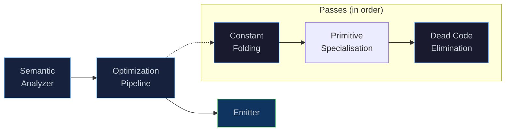

# Eta Optimisation Plan

This plan inventories existing IR-level optimisation in Eta and lists the
highest-ROI improvements available in the compiler, the bytecode emitter,
and the VM. Items are ordered by expected payoff per unit of work.

## Current state (April 2026)

Three passes exist under
[`eta/core/src/eta/semantics/passes/`](../../../eta/core/src/eta/semantics/passes):

- **`ConstantFolding`** - folds binary `+ - * /` only when both operands
  are `Const` numeric literals and the callee resolves to a global named
  `+`/`-`/`*`/`/`. No identity simplification, no n-ary, no fixpoint, no
  comparisons or boolean ops.
- **`DeadCodeElimination`** - removes pure (`Const`/`Var`/`Quote`)
  non-tail expressions inside a `Begin`; collapses single-element
  `Begin`s.
- **`PrimitiveSpecialisation`** - lowers eligible builtin calls to
  dedicated primitive IR nodes that emit VM opcodes
  (`Add/Sub/Mul/Div/Eq/Cons/Car/Cdr`).

The optimisation pipeline is wired and active under `etac -O`:

- `main_etac.cpp` registers `ConstantFolding`,
  `PrimitiveSpecialisation`, and `DeadCodeElimination` when
  `-O` / `--optimize` is set.
- `Driver::run_source_impl` executes
  `optimization_pipeline_.run_all(sem_mods)` between semantic analysis and
  bytecode emission.
- With `-O0` (or default), no passes are registered.

Important correctness caveat: current `ConstantFolding` identifies
arithmetic by global binding name only. If user code rebinds
`+`/`-`/`*`/`/`, `-O` can fold using builtin semantics even when runtime
call target differs.

For calls proven to target immutable builtins with supported arity,
`etac -O` now emits dedicated opcodes (`Add/Sub/Mul/Div/Eq/Cons/Car/Cdr`)
instead of generic `LoadGlobal` + `Call`.

Calls that are not proven safe (shadowed names, unsupported arity, or
non-builtin/global targets) still take the generic call path.

## Shortlist (best ROI first)

1. Self-recursive tail call -> backward `Jump` in the emitter.
2. Drop the `shared_lock` on `BytecodeFunctionRegistry::get` and pass
   `std::span<LispVal>` to primitives (zero-copy).
3. Harden and extend `ConstantFolding` (builtin-identity checks, n-ary,
   comparisons, identities, fixpoint loop).
4. Constant + copy propagation through `let`-bindings.
5. Extend primitive specialisation coverage (more builtins/arity forms)
   where semantic proof is straightforward.

Items 1-2 alone should produce a multi-x speedup on arithmetic-heavy
workloads (AAD primal, Monte Carlo path generation in pure Eta) without
introducing any new opcodes or new IR.

---

## Detailed items

### 1. Primitive call specialisation status and next extensions

**Where**: implemented in
`eta/core/src/eta/semantics/passes/primitive_specialisation.h`,
consumed by the existing emitter.

[`bytecode.h`](../../../eta/core/src/eta/runtime/vm/bytecode.h) defines
dedicated opcodes `Add`, `Sub`, `Mul`, `Div`, `Eq`, `Cons`, `Car`,
`Cdr`. The pass currently lowers calls when:

- the callee is a `Var` with `Address::Global`,
- the target global slot is a known immutable builtin,
- and the arity matches,

to `PrimitiveCall`, which the emitter lowers to the matching opcode.

Remaining work in this area:

- extend coverage to additional builtins with fixed arity where opcode
  equivalents exist or can be added cheaply,
- evaluate whether selected variadic builtin forms should lower to
  specialised opcodes after argument normalization.

### 2. Harden and extend constant folding

- Make folding semantic-safe under shadowing:
  - fold only when callee identity is a known immutable builtin, not
    name-match alone.
  - add regression tests that redefine `+`/`-`/`*`/`/` and verify `-O`
    does not fold incorrectly.
- Extend `ConstantFolding` to:
  - n-ary `+ - * /` (runtime `+` is variadic; folder currently handles 2 args).
  - comparisons (`= < > <= >=`) and `not` (and/or are lowered to `if`).
  - algebraic identities: `(* x 1)`, `(+ x 0)`, `(- x 0)`,
    `(* x 0) -> 0` only when `x` is pure, `(if #t a b) -> a`,
    `(if #f a b) -> b`.
  - iterate to a fixpoint, since folding can expose new opportunities.

### 3. Constant / copy propagation through `let` (i.e. `Begin` + `Set{Local}`)

`Let` is desugared into a `Begin` that starts with `Set{Local}`
initialisers (see letrec pattern detection in `emit_begin`).
For a non-mutated local whose initialiser is a `Const`, `Var`, or
`Quote`, replace each `LoadLocal slot` with the initialiser, then DCE
drops the `Set`. Combined with item 2 this enables folding through
`(let ((x 2) (y 3)) (* x y))` style code that macro expansion produces
everywhere. `BindingInfo::mutable_flag` already records mutability.

### 4. Inlining of small lambdas / direct-recursive calls

Two cheap forms:

- **Beta-reduce known-callee, single-use lambdas**:
  `((lambda (x y) body) a b)` -> substitute. Eta uses this pattern
  extensively for `let`/`when`/macro expansions.
- **Self-recursive tail calls**: when the callee resolves to the
  enclosing `Lambda` and the call is in tail position, emit a backward
  `Jump` instead of `TailCall`. Today `TailCall` still does full
  dispatch and frame movement work each iteration.

### 5. Global resolution caching ("ICs lite")

`LoadGlobal` is already O(1). But every global call still does callee
object checks and function resolution from the registry, currently with a
`shared_lock` on the read path.

Options:

- Eliminate lock on the read path. Functions are append-only; slots are
  stable with `std::deque`.
- Add a fused call opcode (`CallGlobal` / `CallDirect`) that resolves once.

### 6. Stop reallocating `args` per primitive call

`dispatch_callee` builds a `std::vector<LispVal> args` for every
primitive call and primitive code usually iterates once. Either:

- pass `std::span<LispVal>` from the VM stack (zero-copy), or
- pre-allocate a thread-local scratch buffer and reuse it.

This is a runtime change, not an IR pass, but it is low-hanging VM work.

### 7. Bytecode peephole

After emission, a quick scan can collapse:

- `LoadConst Nil; Pop` (from `set!`) when result is unused.
- `Jump x; Jump y` chains.
- dead jump patterns around `if` / `begin`.
- trailing structural `Pop` patterns before terminal `LoadConst Nil; Return`.

### 8. Closure / upvalue elimination for non-escaping lambdas

If a `Lambda` is only used as the immediate callee of a `Call` (no
escape), it does not need `MakeClosure` / heap allocation - its body can
be inlined or compiled as a direct sibling function with shared frame
access.

### 9. AAD / numerical hot-path specific

Given the XVA plan and existing AD tape integration:

- **Fixnum/flonum-specialised arithmetic opcodes**: when both operands
  are statically flonum, bypass generic numeric classification and
  overflow ladders.
- **Tape-record fast path**: avoid per-op tape tag tests when no tape is active.

### 10. Dead-store / dead-local elimination

DCE today only touches pure expressions inside `Begin`. It does not
detect:

- `Set{Local}` where local is never loaded again (dead store),
- local slots written but never read (dead binding; shrinks frame size).

A liveness sweep over IR can implement both.

### 11. Constant lifting and quote interning at emit time

`emit_const` already caches string constants per function. `Quote` data
and numeric constants are not interned across the constant pool, so
repeated quoted literals still duplicate work and storage.

A hashed datum pool keyed by value would shrink bytecode and improve
constant-pool locality.

### 12. Type-driven specialisation (longer term)

There is no static type system, but a flow-sensitive pass could prove
"this var is always closure arity N" or "always fixnum" along a path and
emit specialised opcodes.

---

## Suggested rollout order

1. Self-recursive tail-call -> jump (emitter only, no new opcode). [done]
2. Drop the `shared_lock` on `BytecodeFunctionRegistry::get`; pass
   `span<const LispVal>` to primitives. [done]
3. Harden `ConstantFolding` correctness under builtin shadowing.
4. Extend folding (n-ary/comparisons/identities/fixpoint) plus
   constant/copy propagation through let-bindings.
5. Bytecode peephole.
6. Dead-store elimination + frame shrinking.
7. AAD-specific flonum fast path + active-tape flag.
8. Closure elimination for non-escaping lambdas.
9. Constant pool / quote interning.
10. Flow-sensitive type specialisation.

Each step is independently shippable and benchmarkable.

### Step 1 implementation notes

- Tail-position calls that target the current closure's self-capture upvalue
  are now lowered in the emitter to:
  - evaluate arguments left-to-right,
  - `StoreLocal` each parameter slot in reverse order,
  - emit a backward `Jump` to the lambda entry.
- This keeps self-recursive loops in constant stack space without introducing
  any new VM opcode.
- The optimisation is currently enabled for unary self recursion only; wider
  arity handling remains disabled until the multi-argument path is proven
  stable under the full stdlib workload.
- Non-self tail calls (including mutual recursion) continue to emit
  `TailCall`.

### Step 2 implementation notes

- `BytecodeFunctionRegistry::get` now uses a lock-free read path.
- Primitive dispatch now forwards arguments as `std::span<const LispVal>`
  over the VM stack instead of materialising a temporary `std::vector`.
- VM primitive dispatch checks for stack underflow before slicing arguments
  and pops arguments from the VM stack after primitive evaluation.
- No behavioural regressions were observed in `eta_core_test` and
  `eta_stdlib_tests` after this change.

---

## Optimization Pipeline Reference

[← Back to README](../../../README.md) · [Architecture](../../architecture.md) ·
[Bytecode & VM](bytecode-vm.md) · [Compiler (`etac`)](compiler.md) ·
[Runtime & GC](runtime.md) · [Modules & Stdlib](modules.md) ·
[Project Status](../../next-steps.md)

---

## Overview

Eta includes a composable **IR-level optimization pipeline** that
transforms the Core IR graph between semantic analysis and bytecode
emission. Optimizations at this level benefit from high-level type,
scope, and control-flow information that is lost once the IR is lowered
to bytecode.

The pipeline is invoked by the `etac` compiler when the **`-O`** flag is
supplied. The interpreter (`etai`) does not run optimization passes — it
prioritises fast turnaround during development.



```console
# Compile with optimizations enabled
$ etac -O hello.eta

# Compile without optimizations (default)
$ etac hello.eta
$ etac -O0 hello.eta
```

---

## Core IR — The Optimization Target

Passes operate on the **Core IR** — a typed, tree-structured
intermediate representation produced by the semantic analyzer.
Every expression in an Eta program is lowered to one of the following
node types before bytecode emission:

| Node | Description |
|------|-------------|
| `Const` | Literal value (integer, double, boolean, character, string). |
| `Var` | Variable reference — resolved to a `Local`, `Upval`, or `Global` address. |
| `Quote` | Quoted datum (deep-copied S-expression). |
| `If` | Conditional: `test`, `conseq`, `alt`. |
| `Begin` | Sequence of expressions — result is the last one. |
| `Set` | Mutation (`set!`) — writes to a resolved address. |
| `Lambda` | Function: parameters, captured upvalues, body. |
| `Call` | Function call: callee + argument list. |
| `PrimitiveCall` | Specialised builtin call lowered to a dedicated VM opcode. |
| `Apply` | `(apply proc args ...)` — spread-call. |
| `CallCC` | `(call/cc consumer)` — first-class continuation capture. |
| `Values` / `CallWithValues` | Multiple-return-value support. |
| `DynamicWind` | `(dynamic-wind before body after)`. |
| `Raise` / `Guard` | Exception raise and guard (catch). |
| `MakeLogicVar` / `Unify` / `DerefLogicVar` / `TrailMark` / `UnwindTrail` | Logic programming (unification, backtracking). |

All `Node*` pointers are arena-allocated inside `ModuleSemantics` — old
nodes replaced by a pass are simply abandoned and freed when the arena
destructs. This makes pass authoring cheap: no manual deallocation is
required.

---

## Architecture

### `OptimizationPass` — Base Class

Every pass implements the `OptimizationPass` interface:

```cpp
class OptimizationPass {
public:
    virtual ~OptimizationPass() = default;

    /// Human-readable name (for diagnostics / --dump-passes).
    virtual std::string_view name() const noexcept = 0;

    /// Transform the IR for a single module.
    virtual void run(ModuleSemantics& mod) = 0;
};
```

A pass receives a `ModuleSemantics` reference containing the module's
`toplevel_inits` (the IR roots) and its `bindings` metadata. It may
mutate the IR graph in place, replace nodes, or remove them.

### `OptimizationPipeline` — Pass Runner

The pipeline is an ordered container of passes. Passes execute in
registration order over each module:

```cpp
OptimizationPipeline pipeline;
pipeline.add_pass(std::make_unique<ConstantFolding>());
pipeline.add_pass(std::make_unique<PrimitiveSpecialisation>());
pipeline.add_pass(std::make_unique<DeadCodeElimination>());

pipeline.run_all(modules);  // runs all passes, in order, on every module
```

The pipeline also exposes introspection helpers:

| Method | Description |
|--------|-------------|
| `size()` | Number of registered passes. |
| `empty()` | True when no passes are registered. |
| `pass_names()` | Returns a `vector<string>` of all pass names (useful for `--dump-passes`). |

### `IRVisitor<Derived>` — CRTP Tree Walker

Passes typically use the `IRVisitor` CRTP base class to walk the IR.
It provides depth-first traversal of all node children, calling
`pre_visit` before and `post_visit` after each subtree:

```cpp
struct MyFolder : IRVisitor<MyFolder> {
    ModuleSemantics& mod;

    // Called after all children of `node` have been visited.
    // Return a replacement node, or `node` itself to keep it.
    core::Node* post_visit(core::Node* node, bool tail_context) {
        // ... inspect and optionally replace node ...
        return node;
    }
};
```

The visitor handles every Core IR node type — `If`, `Begin`, `Lambda`,
`Call`, `Set`, `DynamicWind`, `Values`, `CallWithValues`, `CallCC`,
`Apply`, `Raise`, `Guard`, `Unify`, `DerefLogicVar`, `UnwindTrail`, and
all leaf nodes. A `bool context` parameter (typically "tail position") is
threaded through the walk.

---

## Built-in Passes

### Constant Folding

**Name:** `constant-folding`

Evaluates compile-time-constant arithmetic expressions and replaces them
with their result. This is a conservative peephole — only calls to the
builtin `+`, `-`, `*`, `/` primitives where **both** arguments are
`Const` literal nodes with numeric payloads are folded.

| Source | Folded Result |
|--------|---------------|
| `(+ 2 3)` | `5` (fixnum) |
| `(+ 1.5 2.5)` | `4.0` (double) |
| `(- 10 3)` | `7` |
| `(* 4 5)` | `20` |
| `(/ 10 2)` | `5` (exact integer division) |
| `(/ 7 2)` | `3.5` (inexact → double) |
| `(/ x 0)` | *not folded* (division by zero) |
| `(+ x 1)` | *not folded* (`x` is a variable) |

**Type promotion rules:**

- Fixnum ⊕ Fixnum → Fixnum (when the result fits in 47 bits).
- Fixnum ⊕ Double → Double.
- Division of two fixnums that is not exact → Double.

**Effect on bytecode:** A folded expression emits a single `LoadConst`
instruction instead of `LoadConst` + `LoadConst` + `LoadGlobal` + `Call`.

### Primitive Specialisation

**Name:** `primitive-specialisation`

Lowers eligible builtin calls to dedicated primitive opcodes.

Current lowering targets:

- Binary: `+`, `-`, `*`, `/`, `=`, `cons`
- Unary: `car`, `cdr`

Lowering only applies when the callee resolves to a proven immutable
builtin global with matching arity. Calls that fail those checks remain
generic `Call`/`TailCall`.

**Effect on bytecode:** Replaces `LoadGlobal` + `Call` with direct opcode
instructions (`Add`, `Sub`, `Mul`, `Div`, `Eq`, `Cons`, `Car`, `Cdr`).

### Dead Code Elimination

**Name:** `dead-code-elimination`

Removes side-effect-free expressions whose results are discarded. The
pass targets `Begin` blocks (sequences):

| Source | After DCE |
|--------|-----------|
| `(begin 42 99)` | `99` |
| `(begin (+ 1 2) x)` | `x` |
| `(begin 1 2 3 4 5)` | `5` |
| `(begin (set! x 1) x)` | `(begin (set! x 1) x)` — `set!` has side effects, kept. |
| `(begin x)` | `x` — single-element `begin` simplified. |

A node is considered **pure** (side-effect-free) if it is a `Const`,
`Var`, or `Quote`. Non-tail expressions in a `Begin` that are pure are
removed. The last expression is always kept — it produces the block's
value.

### Combined Example

When both passes run in sequence, they compose naturally:

```scheme
;; Source
(begin (+ 1 2) (+ 3 4))

;; After constant folding:
(begin 3 7)

;; After dead code elimination:
7
```

The final bytecode emits a single `LoadConst 7` — no arithmetic
instructions, no discarded intermediate values.

---

## Writing a Custom Pass

To add a new optimization pass:

1. **Create a header** in `eta/core/src/eta/semantics/passes/`:

```cpp
#pragma once

#include "eta/semantics/optimization_pass.h"
#include "eta/semantics/ir_visitor.h"
#include "eta/semantics/core_ir.h"

namespace eta::semantics::passes {

class MyPass : public OptimizationPass {
public:
    std::string_view name() const noexcept override {
        return "my-pass";
    }

    void run(ModuleSemantics& mod) override {
        Walker w{mod};
        for (auto*& node : mod.toplevel_inits) {
            node = w.visit(node, false);
        }
    }

private:
    struct Walker : IRVisitor<Walker> {
        ModuleSemantics& mod;
        explicit Walker(ModuleSemantics& m) : mod(m) {}

        core::Node* post_visit(core::Node* node, bool /*ctx*/) {
            // Inspect node->data (a std::variant of all IR node types).
            // To replace a node, create a new one via mod.emplace<T>(...)
            // and return it. The old node stays in the arena.
            return node;
        }
    };
};

} // namespace eta::semantics::passes
```

2. **Register the pass** in `main_etac.cpp` (under the `-O` flag):

```cpp
if (optimize) {
    auto& pipeline = driver.optimization_pipeline();
    pipeline.add_pass(std::make_unique<ConstantFolding>());
    pipeline.add_pass(std::make_unique<PrimitiveSpecialisation>());
    pipeline.add_pass(std::make_unique<DeadCodeElimination>());
    pipeline.add_pass(std::make_unique<MyPass>());  // ← new
}
```

3. **Add tests** in `eta/qa/test/src/optimization_tests.cpp` using the
   `OptFixture` helper — it compiles source through the full pipeline
   with your passes applied and lets you inspect both runtime results and
   emitted bytecode.

> [!TIP]
> Pass ordering matters. Constant folding can create new dead code
> (e.g. `(begin (+ 1 2) x)` → `(begin 3 x)` → `x`), so running DCE
> after folding and primitive specialisation is more effective than the reverse.

---

## Key Source Files

| File | Role |
|------|------|
| [`optimization_pass.h`](../../../eta/core/src/eta/semantics/optimization_pass.h) | `OptimizationPass` — abstract base class for all passes. |
| [`optimization_pipeline.h`](../../../eta/core/src/eta/semantics/optimization_pipeline.h) | `OptimizationPipeline` — ordered pass runner. |
| [`ir_visitor.h`](../../../eta/core/src/eta/semantics/ir_visitor.h) | `IRVisitor<Derived>` — CRTP depth-first tree walker. |
| [`core_ir.h`](../../../eta/core/src/eta/semantics/core_ir.h) | Core IR node types (`Node`, `NodeData` variant). |
| [`constant_folding.h`](../../../eta/core/src/eta/semantics/passes/constant_folding.h) | Constant folding pass. |
| [`primitive_specialisation.h`](../../../eta/core/src/eta/semantics/passes/primitive_specialisation.h) | Primitive-call specialisation pass. |
| [`dead_code_elimination.h`](../../../eta/core/src/eta/semantics/passes/dead_code_elimination.h) | Dead code elimination pass. |
| [`optimization_tests.cpp`](../../../eta/qa/test/src/optimization_tests.cpp) | Unit tests for the pipeline, visitor, and optimisation passes. |
| [`main_etac.cpp`](../../../eta/tools/compiler/src/eta/compiler/main_etac.cpp) | `etac` entry point — pass registration under `-O`. |

