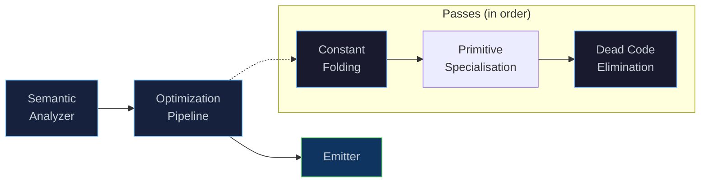

# Optimization Pipeline

[← Back to README](../../../README.md) · [Architecture](../../architecture.md) ·
[Bytecode & VM](bytecode-vm.md) · [Compiler (`etac`)](compiler.md) ·
[Runtime & GC](runtime.md) · [Modules & Stdlib](modules.md) ·
[Project Status](../../next-steps.md)

---

## Overview

Eta includes a composable **IR-level optimization pipeline** that
transforms the Core IR graph between semantic analysis and bytecode
emission. Optimizations at this level benefit from high-level type,
scope, and control-flow information that is lost once the IR is lowered
to bytecode.

The pipeline is invoked by the `etac` compiler when the **`-O`** flag is
supplied. The interpreter (`etai`) does not run optimization passes — it
prioritises fast turnaround during development.



```console
# Compile with optimizations enabled
$ etac -O hello.eta

# Compile without optimizations (default)
$ etac hello.eta
$ etac -O0 hello.eta
```

---

## Core IR — The Optimization Target

Passes operate on the **Core IR** — a typed, tree-structured
intermediate representation produced by the semantic analyzer.
Every expression in an Eta program is lowered to one of the following
node types before bytecode emission:

| Node | Description |
|------|-------------|
| `Const` | Literal value (integer, double, boolean, character, string). |
| `Var` | Variable reference — resolved to a `Local`, `Upval`, or `Global` address. |
| `Quote` | Quoted datum (deep-copied S-expression). |
| `If` | Conditional: `test`, `conseq`, `alt`. |
| `Begin` | Sequence of expressions — result is the last one. |
| `Set` | Mutation (`set!`) — writes to a resolved address. |
| `Lambda` | Function: parameters, captured upvalues, body. |
| `Call` | Function call: callee + argument list. |
| `PrimitiveCall` | Specialised builtin call lowered to a dedicated VM opcode. |
| `Apply` | `(apply proc args ...)` — spread-call. |
| `CallCC` | `(call/cc consumer)` — first-class continuation capture. |
| `Values` / `CallWithValues` | Multiple-return-value support. |
| `DynamicWind` | `(dynamic-wind before body after)`. |
| `Raise` / `Guard` | Exception raise and guard (catch). |
| `MakeLogicVar` / `Unify` / `DerefLogicVar` / `TrailMark` / `UnwindTrail` | Logic programming (unification, backtracking). |

All `Node*` pointers are arena-allocated inside `ModuleSemantics` — old
nodes replaced by a pass are simply abandoned and freed when the arena
destructs. This makes pass authoring cheap: no manual deallocation is
required.

---

## Architecture

### `OptimizationPass` — Base Class

Every pass implements the `OptimizationPass` interface:

```cpp
class OptimizationPass {
public:
    virtual ~OptimizationPass() = default;

    /// Human-readable name (for diagnostics / --dump-passes).
    virtual std::string_view name() const noexcept = 0;

    /// Transform the IR for a single module.
    virtual void run(ModuleSemantics& mod) = 0;
};
```

A pass receives a `ModuleSemantics` reference containing the module's
`toplevel_inits` (the IR roots) and its `bindings` metadata. It may
mutate the IR graph in place, replace nodes, or remove them.

### `OptimizationPipeline` — Pass Runner

The pipeline is an ordered container of passes. Passes execute in
registration order over each module:

```cpp
OptimizationPipeline pipeline;
pipeline.add_pass(std::make_unique<ConstantFolding>());
pipeline.add_pass(std::make_unique<PrimitiveSpecialisation>());
pipeline.add_pass(std::make_unique<DeadCodeElimination>());

pipeline.run_all(modules);  // runs all passes, in order, on every module
```

The pipeline also exposes introspection helpers:

| Method | Description |
|--------|-------------|
| `size()` | Number of registered passes. |
| `empty()` | True when no passes are registered. |
| `pass_names()` | Returns a `vector<string>` of all pass names (useful for `--dump-passes`). |

### `IRVisitor<Derived>` — CRTP Tree Walker

Passes typically use the `IRVisitor` CRTP base class to walk the IR.
It provides depth-first traversal of all node children, calling
`pre_visit` before and `post_visit` after each subtree:

```cpp
struct MyFolder : IRVisitor<MyFolder> {
    ModuleSemantics& mod;

    // Called after all children of `node` have been visited.
    // Return a replacement node, or `node` itself to keep it.
    core::Node* post_visit(core::Node* node, bool tail_context) {
        // ... inspect and optionally replace node ...
        return node;
    }
};
```

The visitor handles every Core IR node type — `If`, `Begin`, `Lambda`,
`Call`, `Set`, `DynamicWind`, `Values`, `CallWithValues`, `CallCC`,
`Apply`, `Raise`, `Guard`, `Unify`, `DerefLogicVar`, `UnwindTrail`, and
all leaf nodes. A `bool context` parameter (typically "tail position") is
threaded through the walk.

---

## Built-in Passes

### Constant Folding

**Name:** `constant-folding`

Evaluates compile-time-constant arithmetic expressions and replaces them
with their result. This is a conservative peephole — only calls to the
builtin `+`, `-`, `*`, `/` primitives where **both** arguments are
`Const` literal nodes with numeric payloads are folded.

| Source | Folded Result |
|--------|---------------|
| `(+ 2 3)` | `5` (fixnum) |
| `(+ 1.5 2.5)` | `4.0` (double) |
| `(- 10 3)` | `7` |
| `(* 4 5)` | `20` |
| `(/ 10 2)` | `5` (exact integer division) |
| `(/ 7 2)` | `3.5` (inexact → double) |
| `(/ x 0)` | *not folded* (division by zero) |
| `(+ x 1)` | *not folded* (`x` is a variable) |

**Type promotion rules:**

- Fixnum ⊕ Fixnum → Fixnum (when the result fits in 47 bits).
- Fixnum ⊕ Double → Double.
- Division of two fixnums that is not exact → Double.

**Effect on bytecode:** A folded expression emits a single `LoadConst`
instruction instead of `LoadConst` + `LoadConst` + `LoadGlobal` + `Call`.

### Primitive Specialisation

**Name:** `primitive-specialisation`

Lowers eligible builtin calls to dedicated primitive opcodes.

Current lowering targets:

- Binary: `+`, `-`, `*`, `/`, `=`, `cons`
- Unary: `car`, `cdr`

Lowering only applies when the callee resolves to a proven immutable
builtin global with matching arity. Calls that fail those checks remain
generic `Call`/`TailCall`.

**Effect on bytecode:** Replaces `LoadGlobal` + `Call` with direct opcode
instructions (`Add`, `Sub`, `Mul`, `Div`, `Eq`, `Cons`, `Car`, `Cdr`).

### Dead Code Elimination

**Name:** `dead-code-elimination`

Removes side-effect-free expressions whose results are discarded. The
pass targets `Begin` blocks (sequences):

| Source | After DCE |
|--------|-----------|
| `(begin 42 99)` | `99` |
| `(begin (+ 1 2) x)` | `x` |
| `(begin 1 2 3 4 5)` | `5` |
| `(begin (set! x 1) x)` | `(begin (set! x 1) x)` — `set!` has side effects, kept. |
| `(begin x)` | `x` — single-element `begin` simplified. |

A node is considered **pure** (side-effect-free) if it is a `Const`,
`Var`, or `Quote`. Non-tail expressions in a `Begin` that are pure are
removed. The last expression is always kept — it produces the block's
value.

### Combined Example

When both passes run in sequence, they compose naturally:

```scheme
;; Source
(begin (+ 1 2) (+ 3 4))

;; After constant folding:
(begin 3 7)

;; After dead code elimination:
7
```

The final bytecode emits a single `LoadConst 7` — no arithmetic
instructions, no discarded intermediate values.

---

## Writing a Custom Pass

To add a new optimization pass:

1. **Create a header** in `eta/core/src/eta/semantics/passes/`:

```cpp
#pragma once

#include "eta/semantics/optimization_pass.h"
#include "eta/semantics/ir_visitor.h"
#include "eta/semantics/core_ir.h"

namespace eta::semantics::passes {

class MyPass : public OptimizationPass {
public:
    std::string_view name() const noexcept override {
        return "my-pass";
    }

    void run(ModuleSemantics& mod) override {
        Walker w{mod};
        for (auto*& node : mod.toplevel_inits) {
            node = w.visit(node, false);
        }
    }

private:
    struct Walker : IRVisitor<Walker> {
        ModuleSemantics& mod;
        explicit Walker(ModuleSemantics& m) : mod(m) {}

        core::Node* post_visit(core::Node* node, bool /*ctx*/) {
            // Inspect node->data (a std::variant of all IR node types).
            // To replace a node, create a new one via mod.emplace<T>(...)
            // and return it. The old node stays in the arena.
            return node;
        }
    };
};

} // namespace eta::semantics::passes
```

2. **Register the pass** in `main_etac.cpp` (under the `-O` flag):

```cpp
if (optimize) {
    auto& pipeline = driver.optimization_pipeline();
    pipeline.add_pass(std::make_unique<ConstantFolding>());
    pipeline.add_pass(std::make_unique<PrimitiveSpecialisation>());
    pipeline.add_pass(std::make_unique<DeadCodeElimination>());
    pipeline.add_pass(std::make_unique<MyPass>());  // ← new
}
```

3. **Add tests** in `eta/test/src/optimization_tests.cpp` using the
   `OptFixture` helper — it compiles source through the full pipeline
   with your passes applied and lets you inspect both runtime results and
   emitted bytecode.

> [!TIP]
> Pass ordering matters. Constant folding can create new dead code
> (e.g. `(begin (+ 1 2) x)` → `(begin 3 x)` → `x`), so running DCE
> after folding and primitive specialisation is more effective than the reverse.

---

## Key Source Files

| File | Role |
|------|------|
| [`optimization_pass.h`](../../../eta/core/src/eta/semantics/optimization_pass.h) | `OptimizationPass` — abstract base class for all passes. |
| [`optimization_pipeline.h`](../../../eta/core/src/eta/semantics/optimization_pipeline.h) | `OptimizationPipeline` — ordered pass runner. |
| [`ir_visitor.h`](../../../eta/core/src/eta/semantics/ir_visitor.h) | `IRVisitor<Derived>` — CRTP depth-first tree walker. |
| [`core_ir.h`](../../../eta/core/src/eta/semantics/core_ir.h) | Core IR node types (`Node`, `NodeData` variant). |
| [`constant_folding.h`](../../../eta/core/src/eta/semantics/passes/constant_folding.h) | Constant folding pass. |
| [`primitive_specialisation.h`](../../../eta/core/src/eta/semantics/passes/primitive_specialisation.h) | Primitive-call specialisation pass. |
| [`dead_code_elimination.h`](../../../eta/core/src/eta/semantics/passes/dead_code_elimination.h) | Dead code elimination pass. |
| [`optimization_tests.cpp`](../../../eta/test/src/optimization_tests.cpp) | Unit tests for the pipeline, visitor, and optimisation passes. |
| [`main_etac.cpp`](../../../eta/compiler/src/eta/compiler/main_etac.cpp) | `etac` entry point — pass registration under `-O`. |

