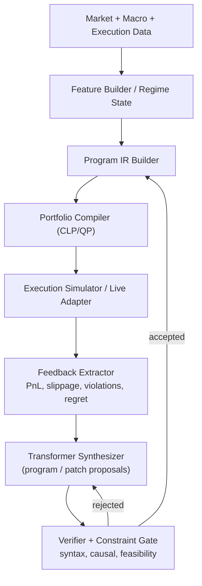

# Program Synthesis Roadmap (Transformer-Driven SRFC)

[Back to README](../../../README.md) | [Portfolio](../../featured_examples/portfolio.md) |
[Causal](causal.md) | [CLP](clp.md) | [Torch](torch.md) | [Optimization](optimization.md)

---

## Objective

Build a **self-rewriting financial compiler** in Eta where:

- market/state data is compiled into a strategy program IR,
- the IR is executed under causal + execution constraints,
- feedback drives program rewrites,
- rewrites are proposed by a **transformer synthesis model** and validated by symbolic checks.

---

## Direct Answer

Yes: for the stated goal ("full on transformer program synthesis"), we should use **NN learning** as the main synthesis engine.

But it should be **neuro-symbolic**, not NN-only:

- NN/transformer proposes programs or edits.
- Deterministic validators, causal checks, and CLP/QP feasibility enforce hard constraints.
- Out-of-sample execution metrics decide promotion.

This keeps expressivity high while preventing unsafe or infeasible generated programs from reaching runtime.

---

## Target Architecture



---

## Transformer Role (Specified)

This project uses a staged, explicit synthesis stack rather than a generic "LLM does synthesis".

### Chosen v1 (first production target)

- **Representation**: token-level generation over **linearized typed AST** (sexpr with typed tags and node IDs).
- **Task form**: **program editing**, not full regeneration by default.
- **Decoder**: grammar-constrained autoregressive transformer with edit-action vocabulary.
- **Search**: bounded beam search + verifier-in-loop pruning.
- **Retrieval**: retrieve top-k similar `(context, program, outcome)` exemplars and prepend as conditioning memory.
- **Selection**: proposal model generates candidates; symbolic verifier + learned critic rerank; executor decides final winner.

### Chosen v2 (after v1 stabilizes)

- Add **MCTS-guided decoding** over edit actions for deeper lookahead under execution-aware value estimates.
- Keep same action space and verifier gates; MCTS only changes search policy.

### Deferred (not first path)

- Diffusion over trees/graphs.
- Unconstrained free-form code generation.
- End-to-end RL-only synthesis without supervised warm start.

Reason: v1 gives highest implementation certainty and best compatibility with Eta's existing symbolic validator + CLP/QP gates.

### Concrete Inference Contract

For each decision cycle:

1. Build context embedding + retrieve top-k historical exemplars.
2. Condition proposal transformer on `(program_t, feedback_t, context_t, retrieved_k)`.
3. Generate `N` patch candidates with constrained beam decoding.
4. Run static + causal + feasibility verifier; drop invalid candidates.
5. Score survivors with critic model and light execution proxy.
6. Execute top `M` in full simulator/OOS slice.
7. Promote best candidate if champion/challenger criteria are met.

---

## Program IR

The IR should be explicit, typed, and serializable. Suggested top-level shape:

```scheme
(program
  (meta (version 1) (created-at ...) (seed ...))
  (factors
    (factor beta ...)
    (factor momentum ...)
    (factor liquidity ...))
  (forecast
    (mu-model ...)
    (sigma-model ...))
  (constraints
    (budget 1.0)
    (long-only #t)
    (max-weight 'tech 0.35)
    (max-turnover 0.20))
  (objective
    (score (- expected-return (* lambda risk) cost penalties)))
  (execution
    (impact-model ...)
    (slippage-model ...)))
```

Design requirements:

- Canonical form (`normalize-program`) for deterministic comparisons/diffs.
- Stable IDs per node for patch targeting.
- Static checks before compile (`well-typed`, `known-symbols`, `unit checks`).
- Lossless read/write format for dataset generation.

---

## Stage Overview

| Stage | Theme | Outcome | Effort (single strong engineer) |
|------|-------|---------|----------------------------------|
| 0 | Baseline + reproducibility | Fixed seeds, deterministic artifacts, run schema | 1 week |
| 1 | IR + compiler boundary | Stable DSL/IR + validator + program hash | 2-3 weeks |
| 2 | Executor + feedback API | Deterministic evaluation and rich feedback vectors | 2-4 weeks |
| 3 | Data factory | Synthetic + historical training corpora of `(context, program, outcome)` | 2-4 weeks |
| 4 | Transformer v1 (supervised) | Program generation from context with AST-aware decoding | 4-6 weeks |
| 5 | Rewrite model (patch synthesis) | Edit proposals conditioned on prior program + feedback | 3-5 weeks |
| 6 | Constraint-aware decoding | Generate only valid/near-valid candidates; verifier-in-loop | 2-4 weeks |
| 7 | OOS selection loop | Champion/challenger and promotion rules | 2-3 weeks |
| 8 | RL fine-tuning | Execution-aware reward optimization | 4-8 weeks |
| 9 | Production hardening | Monitoring, rollback, drift alarms, governance | 3-6 weeks |

End-to-end total: ~6-10 months for one engineer, or ~3-5 months for a small team (2-3 engineers).

---

## Detailed Plan

## Stage 0 - Baseline Freeze and Instrumentation

### Scope

- Freeze seeds and deterministic run configuration.
- Define a run artifact schema (JSON/alist) used by all later stages.
- Establish baseline metrics from non-synthesized programs.

### Deliverables

- Standard artifact fields:
  - program hash,
  - in-sample metrics,
  - out-of-sample metrics,
  - execution-cost metrics,
  - constraint violations,
  - causal-consistency diagnostics.

### Exit Criteria

- Same seed/context produces same artifact and rank ordering.

---

## Stage 1 - Program IR + Validation

### Scope

- Introduce SRFC IR module(s) and validation gates.
- Add canonicalization and deterministic hashing.
- Add round-trip parse/print tests for IR stability.

### Suggested Touchpoints

- `stdlib/std/srfc_ir.eta` (new)
- `stdlib/std/srfc_validate.eta` (new)
- `examples/srfc_ir_demo.eta` (new)

### Exit Criteria

- Invalid programs are rejected with explicit diagnostics.
- Program normalization is idempotent.

---

## Stage 2 - Executor and Feedback Contract

### Scope

- Compile IR to optimization + execution evaluation path.
- Define `feedback_t` contract used by rewriter.

### Feedback Vector (minimum)

- return decomposition,
- risk decomposition,
- slippage/impact surprise,
- turnover and liquidity stress,
- constraint violations,
- causal mismatch indicators,
- regime label/confidence,
- regret vs benchmark/champion.

### Suggested Touchpoints

- `stdlib/std/srfc_exec.eta` (new)
- `stdlib/std/srfc_feedback.eta` (new)
- reuse logic from `examples/portfolio.eta`

### Exit Criteria

- `exec(program, context)` deterministic under fixed seed.
- Feedback schema versioned and backward-compatible.

---

## Stage 3 - Training Data Factory

### Scope

- Build offline corpora for synthesis and rewrite learning.
- Mix three data sources:
  - seeded templates,
  - search-generated variants,
  - replay from historical execution logs.

### Dataset Units

- Synthesis samples:
  - input: market context + constraints + causal state
  - target: full program IR
- Rewrite samples:
  - input: `(program_t, feedback_t, context_t)`
  - target: patch/edit to `program_{t+1}`

### Exit Criteria

- Dataset includes both positive and hard-negative programs.
- Strict temporal splits exist for OOS evaluation.

---

## Stage 4 - Transformer v1 (Program Synthesis)

### Scope

- Train first transformer for full program generation.
- Use structure-aware tokenization (AST/sexpr tokens, typed markers).

### Model Recommendations

- **Primary mode**: patch synthesis over existing program (`program_t -> patch_t`).
- Encoder-decoder transformer (preferred) or decoder-only with structured prefixes.
- Grammar-constrained decoding with edit-action masks:
  - `ADD_NODE`
  - `REMOVE_NODE`
  - `REPLACE_SUBTREE`
  - `TUNE_PARAM`
  - `ADD_CONSTRAINT`
  - `RELAX_CONSTRAINT`
- Pointer/copy support for reusing existing subtrees and symbols.
- Multi-objective training:
  - sequence loss,
  - edit validity/action-mask compliance loss,
  - static-validity auxiliary loss,
  - soft feasibility score,
  - imitation loss from accepted historical rewrites.

### Retrieval-Augmented Editing

- Retrieve similar historical contexts and accepted rewrites.
- Use retrieved examples as explicit conditioning tokens.
- Track retrieval attribution in artifacts for auditability.

### Critic and Reranking

- Separate critic model predicts:
  - expected OOS gain,
  - violation risk,
  - instability risk.
- Final pre-execution ranking combines:
  - proposal log-probability,
  - critic score,
  - verifier severity penalties.

### Eta Integration Options

1. **Recommended first**: external Python training/inference service, Eta calls via `std.net`.
2. **Later**: extend `std.torch` bindings to include missing transformer primitives:
   - `nn/embedding`,
   - `nn/layernorm`,
   - multi-head attention,
   - mask-aware sequence ops.

### Exit Criteria

- >=95% syntactic validity on holdout.
- Strong top-k valid candidate rate after verifier.
- Patch-based synthesis outperforms full-regeneration baseline on acceptance and stability.

---

## Stage 5 - Transformer Rewrite Model (Patch Synthesis)

### Scope

- Train second transformer specialized for edits, not full regeneration.
- Patch format should be explicit and composable.

### Patch Schema (required)

```text
patch := {
  parent_program_id,
  edits: [edit_1, ..., edit_n],
  safety_intent,
  expected_effect
}

edit := {
  op,          // ADD_NODE | REMOVE_NODE | REPLACE_SUBTREE | TUNE_PARAM | ...
  target_id,   // stable AST node id
  payload,     // typed subtree/parameter
  rationale    // short model-generated explanation tag
}
```

### Patch Actions

- add factor,
- remove factor,
- retune hyperparameter/coefficient,
- tighten/relax constraint,
- swap risk model variant,
- adjust objective term weights.

### Exit Criteria

- Rewrites are smaller, safer, and more stable than full regeneration.
- Patch acceptance rate beats rule-based baseline.
- Median accepted patch edit distance stays below defined governance threshold.

---

## Stage 6 - Constraint-Aware Decoding and Verification

### Scope

- Put symbolic verifier inside candidate generation loop.
- Reject invalid programs before expensive execution.

### Gate Order

1. parse + type checks,
2. causal admissibility checks,
3. CLP/QP feasibility check,
4. execution safety limits.

### Exit Criteria

- Near-zero runtime failures from generated programs.
- Candidate latency remains bounded under beam search.

---

## Stage 7 - Selection and Promotion Policy

### Scope

- Define champion/challenger policy for live promotion.
- Separate exploration from production.

### Promotion Rules

- minimum OOS horizon,
- bounded max drawdown,
- bounded violation count,
- positive risk-adjusted improvement over champion,
- no causal consistency regression.

### Exit Criteria

- Fully auditable promotion decisions with rollback snapshots.

---

## Stage 8 - RL Fine-Tuning (Execution-Aware)

### Scope

- Fine-tune synthesis/rewrite policies against simulator reward.
- Keep hard safety gates from Stage 6.

### Reward Sketch

```text
reward =
  alpha * return
  - beta * cost
  - gamma * instability
  - delta * violation_risk
  - eta * causal_inconsistency
```

### Practical Setup

- Offline RL first (replay + simulator),
- constrained on-policy fine-tuning second,
- conservative KL/policy updates to avoid collapse.

### Exit Criteria

- RL policy improves OOS utility over supervised-only baseline.
- No increase in safety/constraint incidents.

---

## Stage 9 - Productionization and Governance

### Scope

- Monitoring, alerting, drift detection, and governance.
- Human override and fallback strategy are mandatory.

### Required Controls

- real-time health metrics,
- drift alarms (data, regime, performance),
- rollback-on-breach,
- immutable audit log of program versions and approvals.

### Exit Criteria

- Safe degraded mode available at all times.
- Every live decision traces to `(program_id, data_window, model_version, verifier_result)`.

---

## Core Metrics

### Synthesis Quality

- syntactic validity rate,
- semantic validity rate (passes verifier),
- feasibility rate (CLP/QP solvable),
- novelty/diversity without collapse.

### Trading Utility

- OOS Sharpe / Sortino,
- max drawdown,
- turnover,
- slippage and impact error.

### Stability and Safety

- constraint violation count,
- causal mismatch rate,
- promotion reversal/rollback rate,
- incident count by severity.

---

## Testing Strategy

1. Unit tests
   - IR parser/printer round-trip,
   - validator rules,
   - patch apply/rollback.
2. Property tests
   - normalization idempotence,
   - verifier monotonicity under strict constraint additions.
3. Integration tests
   - end-to-end loop on fixed seeds and synthetic regimes.
4. Regression suite
   - archived contexts with expected promotion outcomes.

---

## Risks and Mitigations

| Risk | Impact | Mitigation |
|---|---|---|
| Transformer mode collapse | low diversity, brittle programs | diversity regularization, ensemble sampling, novelty budget |
| Simulator-reality gap | RL overfits simulator | periodic real-world replay calibration, conservative policy updates |
| Invalid program spikes | runtime instability | strict gate ordering + constrained decoding |
| Overfitting to recent regimes | poor generalization | temporal CV, rolling retraining windows, regime-balanced sampling |
| Latency explosion (beam + verifier) | missed decision windows | staged filtering, cached feasibility checks, bounded beams |

---

## Recommended Build Order

1. Stages 0-2 first (infrastructure and determinism).
2. Stage 3 data factory.
3. Stage 4 supervised transformer.
4. Stage 6 verifier-aware decoding.
5. Stage 5 rewrite model.
6. Stage 7 promotion policy.
7. Stage 8 RL fine-tune.
8. Stage 9 hardening.

This ordering reduces correctness risk before adding high-variance learning loops.

---

## Definition of Done (Program Synthesis)

The roadmap is complete when all are true:

- Transformer-generated rewrites are the default proposal path.
- >=99% of promoted candidates pass static + causal + feasibility gates.
- OOS utility is consistently above deterministic baseline across multiple regimes.
- Rollback and audit controls are active and tested.
- The full loop `P_t -> feedback_t -> P_{t+1}` runs unattended with bounded risk.
