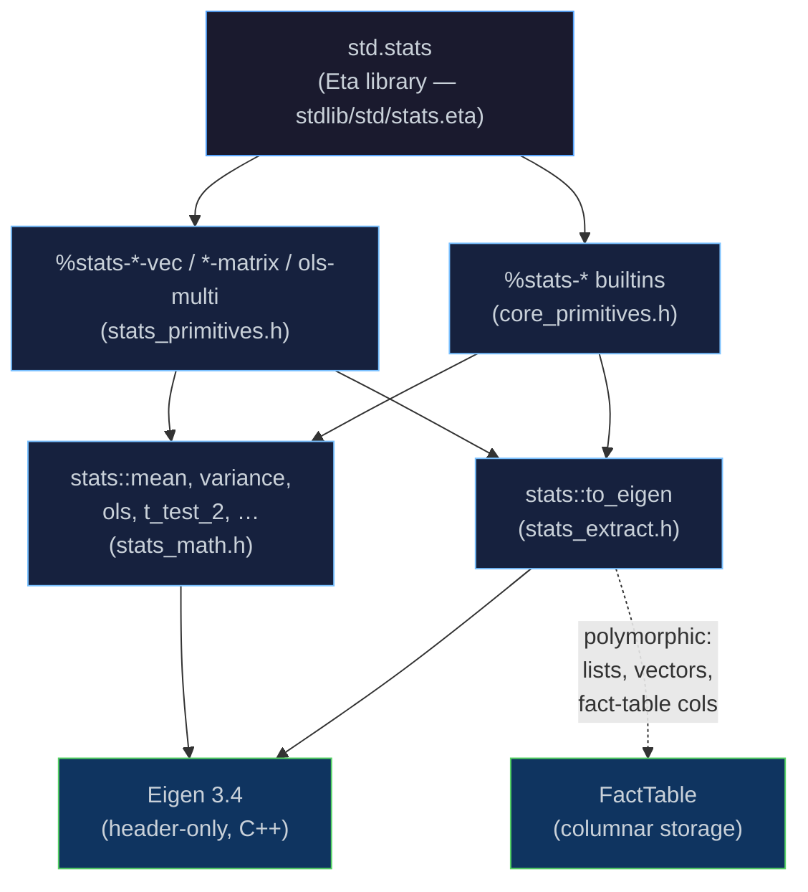

# `std.stats` — Statistics (Eigen-backed)

[← Back to README](../../../README.md) · [Fact Tables](fact-table.md) ·
[AAD – Finance Examples](aad.md) · [Modules & Stdlib](modules.md) ·
[Runtime & GC](runtime.md) · [Project Status](../../next-steps.md)

---

## Overview

Eta ships a single, unified statistics package — **`std.stats`** — backed
entirely by [Eigen](https://eigen.tuxfamily.org/).  Every function operates
**polymorphically** on lists, `#(…)` vectors, and
[fact-table](fact-table.md) columns; there is no need for separate
functions per data type.

```scheme
(import std.stats)     ; one import — everything is included
```

The package covers:

| Area | Functions |
|------|-----------|
| Descriptive statistics | `stats:mean`, `stats:variance`, `stats:stddev`, `stats:sem`, `stats:percentile`, `stats:median` |
| Bivariate | `stats:covariance`, `stats:correlation` |
| Confidence intervals | `stats:ci`, `stats:ci-lower`, `stats:ci-upper` |
| Distribution utilities | `stats:normal-quantile`, `stats:t-cdf`, `stats:t-quantile` |
| Welch t-test | `stats:t-test` + accessors |
| Simple OLS | `stats:ols` + accessors |
| Column-wise ops | `stats:mean-vec`, `stats:var-vec`, `stats:quantile-vec` |
| Matrices | `stats:cov-matrix`, `stats:cor-matrix` |
| Multivariate OLS | `stats:ols-multi` + accessors |

> [!NOTE]
> Eigen is a header-only C++ template library for linear algebra.  It is
> fetched automatically at CMake configure time via `FetchEigen.cmake`.
> No system installation is required.

---

## Descriptive Statistics

| Function | Signature | Returns |
|----------|-----------|---------|
| `stats:mean` | `(xs)` | Arithmetic mean |
| `stats:variance` | `(xs)` | Sample variance (N-1) |
| `stats:stddev` | `(xs)` | Sample standard deviation |
| `stats:sem` | `(xs)` | Standard error of the mean |
| `stats:percentile` | `(xs p)` | p-th percentile (0 ≤ p ≤ 1) |
| `stats:median` | `(xs)` | 50th percentile |

```scheme
(import std.stats)

(define xs '(2.1 -1.4 3.8 0.5 -2.9 4.2 1.7 -0.8 2.6 3.1))

(stats:mean    xs)    ; => 1.29
(stats:stddev  xs)    ; => 2.397
(stats:median  xs)    ; => 1.9
(stats:percentile xs 0.25)  ; => -0.575
```

---

## Bivariate Statistics

| Function | Signature | Returns |
|----------|-----------|---------|
| `stats:covariance` | `(xs ys)` | Sample covariance |
| `stats:correlation` | `(xs ys)` | Pearson correlation coefficient |

```scheme
(stats:covariance  xs ys)   ; => -0.211
(stats:correlation xs ys)   ; => -0.287
```

---

## Confidence Intervals

`stats:ci` uses the t-distribution with N-1 degrees of freedom.  Returns a
`(lower . upper)` pair.

| Function | Signature | Returns |
|----------|-----------|---------|
| `stats:ci` | `(xs level)` | `(lower . upper)` pair for the mean |
| `stats:ci-lower` | `(ci)` | Lower bound |
| `stats:ci-upper` | `(ci)` | Upper bound |

```scheme
(let ((ci (stats:ci xs 0.95)))
  (display (stats:ci-lower ci))   ; e.g. -0.279
  (display (stats:ci-upper ci)))  ; e.g.  2.629
```

---

## Two-Sample Welch t-Test

`stats:t-test` performs Welch's two-sample t-test (unequal variances).
Returns a four-element list `(t-stat p-value df mean-diff)`.

| Function | Signature | Returns |
|----------|-----------|---------|
| `stats:t-test` | `(xs ys)` | `(t p df diff)` |
| `stats:t-test-stat` | `(result)` | t-statistic |
| `stats:t-test-pvalue` | `(result)` | two-tailed p-value |
| `stats:t-test-df` | `(result)` | Welch-Satterthwaite degrees of freedom |
| `stats:t-test-mean-diff` | `(result)` | mean(xs) – mean(ys) |

```scheme
(let ((r (stats:t-test xs ys)))
  (display (stats:t-test-stat   r))    ; t-statistic
  (display (stats:t-test-pvalue r))    ; p-value
  (if (< (stats:t-test-pvalue r) 0.05)
      (display "significant")
      (display "not significant")))
```

---

## Distribution Utilities

| Function | Signature | Returns |
|----------|-----------|---------|
| `stats:normal-quantile` | `(p)` | Inverse CDF of `N(0,1)` |
| `stats:t-cdf` | `(t df)` | CDF of the t-distribution |
| `stats:t-quantile` | `(p df)` | Inverse CDF (quantile function) |

---

## Simple OLS Regression

`stats:ols` fits a univariate linear model `y = slope*x + intercept`.
It returns an `%ols-result` record (defined via `define-record-type`)
with fields for coefficients, standard errors, t-statistics, and
p-values for both slope and intercept. For backward compatibility,
the `stats:ols-*` accessors also accept the legacy nine-element list
representation that earlier versions returned.

| Function | Signature | Returns |
|----------|-----------|---------|
| `stats:ols` | `(xs ys)` | OLS result record |
| `stats:ols-slope` | `(r)` | Slope coefficient |
| `stats:ols-intercept` | `(r)` | Intercept coefficient |
| `stats:ols-r2` | `(r)` | Coefficient of determination R² |
| `stats:ols-se-slope` | `(r)` | Standard error of slope |
| `stats:ols-se-intercept` | `(r)` | Standard error of intercept |
| `stats:ols-t-slope` | `(r)` | t-statistic for slope |
| `stats:ols-t-intercept` | `(r)` | t-statistic for intercept |
| `stats:ols-p-slope` | `(r)` | p-value for slope |
| `stats:ols-p-intercept` | `(r)` | p-value for intercept |

```scheme
(let ((r (stats:ols xs ys)))
  (display (stats:ols-slope     r))   ; slope
  (display (stats:ols-intercept r))   ; intercept
  (display (stats:ols-r2        r)))  ; R-squared
```

---

## Column-Wise Operations

These functions compute a statistic **per column** across multiple data
series.  Every function accepts either:

- **a list of sequences** — each element is a list, vector, or fact-table
  column; or
- **a fact-table + column-index list** — columns are extracted automatically.

| Function | Sequence form | Fact-table form | Returns |
|----------|---------------|-----------------|---------|
| `stats:mean-vec` | `(seqs)` | `(ft cols)` | list of means |
| `stats:var-vec` | `(seqs)` | `(ft cols)` | list of variances (N-1) |
| `stats:quantile-vec` | `(seqs p)` | `(ft cols p)` | list of p-th quantiles |

```scheme
;; From plain lists:
(stats:mean-vec (list xs ys zs))          ; => (mean-x mean-y mean-z)
(stats:var-vec  (list xs ys))             ; => (var-x var-y)
(stats:quantile-vec (list xs ys) 0.5)     ; => (median-x median-y)

;; From a fact-table (columns 0, 1, 2):
(stats:mean-vec ft '(0 1 2))             ; => (mean0 mean1 mean2)
(stats:quantile-vec ft '(0 1) 0.95)      ; => (q95-col0 q95-col1)
```

---

## Covariance & Correlation Matrices

| Function | Sequence form | Fact-table form | Returns |
|----------|---------------|-----------------|---------|
| `stats:cov-matrix` | `(seqs)` | `(ft cols)` | list-of-lists (N×N) |
| `stats:cor-matrix` | `(seqs)` | `(ft cols)` | list-of-lists (N×N) |

Computed via `(X-μ)ᵀ(X-μ) / (n-1)` using Eigen dense matrices.
Correlation is normalised so that diagonal entries are always 1.0.

```scheme
;; Covariance matrix from lists:
(stats:cov-matrix (list xs ys zs))
;; => ((cov-xx cov-xy cov-xz)
;;     (cov-yx cov-yy cov-yz)
;;     (cov-zx cov-zy cov-zz))

;; From a fact-table:
(stats:cor-matrix ft '(0 1 2))
```

---

## Multivariate OLS

`stats:ols-multi` fits the linear model `y = Xβ + ε` using
**Eigen `ColPivHouseholderQR`** for numerical stability.

| Sequence form | `(stats:ols-multi y-seq (list x1-seq x2-seq …))` |
|:---|:---|
| **Fact-table form** | `(stats:ols-multi ft y-col '(x1-col x2-col …))` |

Returns an alist:

| Key | Value |
|-----|-------|
| `coefficients` | `(β₀ β₁ … βₖ)` — intercept first |
| `std-errors` | `(se₀ se₁ … seₖ)` |
| `t-stats` | `(t₀ t₁ … tₖ)` |
| `p-values` | `(p₀ p₁ … pₖ)` |
| `r-squared` | R² |
| `adj-r-squared` | Adjusted R² |
| `residual-se` | Residual standard error σ̂ |

Accessor helpers:

| Function | Returns |
|----------|---------|
| `stats:ols-multi-coefficients` | `(β₀ β₁ … βₖ)` |
| `stats:ols-multi-std-errors` | `(se₀ se₁ … seₖ)` |
| `stats:ols-multi-t-stats` | `(t₀ t₁ … tₖ)` |
| `stats:ols-multi-p-values` | `(p₀ p₁ … pₖ)` |
| `stats:ols-multi-r-squared` | R² |
| `stats:ols-multi-adj-r-squared` | Adjusted R² |
| `stats:ols-multi-residual-se` | σ̂ |

```scheme
;; From sequences:
(let ((r (stats:ols-multi y-data (list x1 x2))))
  (display (stats:ols-multi-coefficients r))
  (display (stats:ols-multi-r-squared r)))

;; From a fact-table — regress column 3 on columns 0, 1, 2:
(let ((r (stats:ols-multi ft 3 '(0 1 2))))
  (display (stats:ols-multi-coefficients r))
  (display (stats:ols-multi-p-values r)))
```

---

## Summary Helper

`stats:summary` returns a labelled alist of key statistics:

```scheme
(stats:summary xs)
; => ((n 10) (mean 1.29) (stddev 2.397) (sem 0.758)
;     (median 1.9) (min -2.9) (max 4.2) (ci-95 (-0.42 . 3.0)))
```

---

## Architecture



All statistics are exposed through the single **`std.stats`** Eta module,
which wraps two sets of `%stats-*` C++ builtins:

- **Univariate / bivariate** (`core_primitives.h`) — `%stats-mean`,
  `%stats-variance`, `%stats-normal-quantile`, `%stats-covariance`,
  `%stats-ols`, `%stats-t-test-2`,
  etc.  Each calls `stats::to_eigen()` (from `stats_extract.h`) to convert
  any numeric sequence into an `Eigen::VectorXd`, then delegates to the
  pure-math functions in `stats_math.h`.

- **Multivariate / column-wise** (`stats_primitives.h`) — `%stats-mean-vec`,
  `%stats-cov-matrix`, `%stats-ols-multi`, etc.  These accept either a
  **list of sequences** or a **fact-table + column indices**, building an
  Eigen data matrix for covariance/correlation matrices and QR-based OLS.

Both layers use **Eigen** for all vector/matrix operations.  Eigen is a
header-only library fetched automatically at CMake configure time; no
system installation is needed.

---

## Example

[`cookbook/quant/stats.eta`](../../../cookbook/quant/stats.eta) demonstrates `std.stats`
using two simulated monthly return series (equity and bond):

```bash
etai cookbook/quant/stats.eta
```

Expected output (abbreviated):

```
============================================================
 Descriptive Statistics
============================================================

Equity fund (monthly %):
  mean   = 1.175
  stddev = 2.28915
  SEM    = 0.660822
  median = 1.9

------------------------------------------------------------
 Two-sample Welch t-test  (H0: equal means)
------------------------------------------------------------
  t-statistic = 1.18636
  p-value     = 0.259546
  => Fail to reject H0 at 5%: insufficient evidence.

------------------------------------------------------------
 OLS Regression:  bond ~ equity
------------------------------------------------------------
  slope       = -0.0403348
  intercept   = 0.430727
  R-squared   = 0.082503
```

---

## Source Locations

| Component | File |
|-----------|------|
| Pure math (mean, variance, normal/t quantiles, OLS, betainc, …) | [`eta/core/src/eta/runtime/stats_math.h`](../../../eta/core/src/eta/runtime/stats_math.h) |
| Polymorphic input extraction (list / vector / fact-table → `Eigen::VectorXd`) | [`eta/core/src/eta/runtime/stats_extract.h`](../../../eta/core/src/eta/runtime/stats_extract.h) |
| `%stats-mean`, `%stats-ols`, `%stats-t-test-2`, … (univariate/bivariate) | [`eta/core/src/eta/runtime/core_primitives.h`](../../../eta/core/src/eta/runtime/core_primitives.h) |
| `%stats-mean-vec`, `%stats-cov-matrix`, `%stats-ols-multi`, … (multivariate) | [`eta/builtins/stats/src/eta/stats/stats_primitives.h`](../../../eta/builtins/stats/src/eta/stats/stats_primitives.h) |
| `stats:mean`, `stats:cov-matrix`, `stats:ols-multi`, … (Eta wrappers) | [`stdlib/std/stats.eta`](../../../stdlib/std/stats.eta) |
| Eigen fetch | [`cmake/FetchEigen.cmake`](../../../cmake/FetchEigen.cmake) |
| Example | [`cookbook/quant/stats.eta`](../../../cookbook/quant/stats.eta) |
