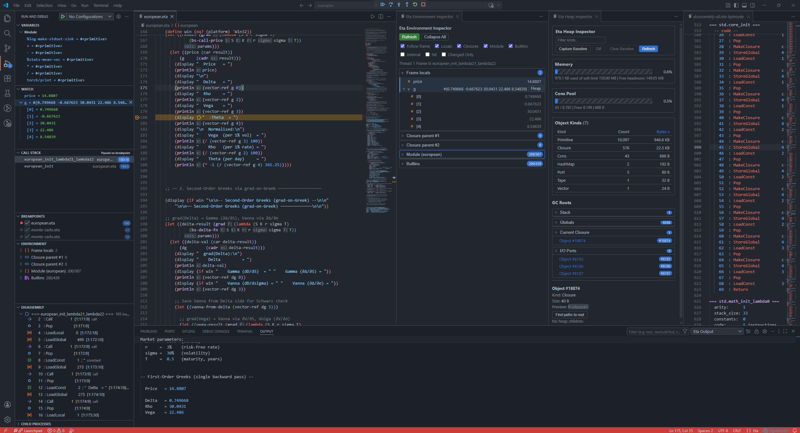
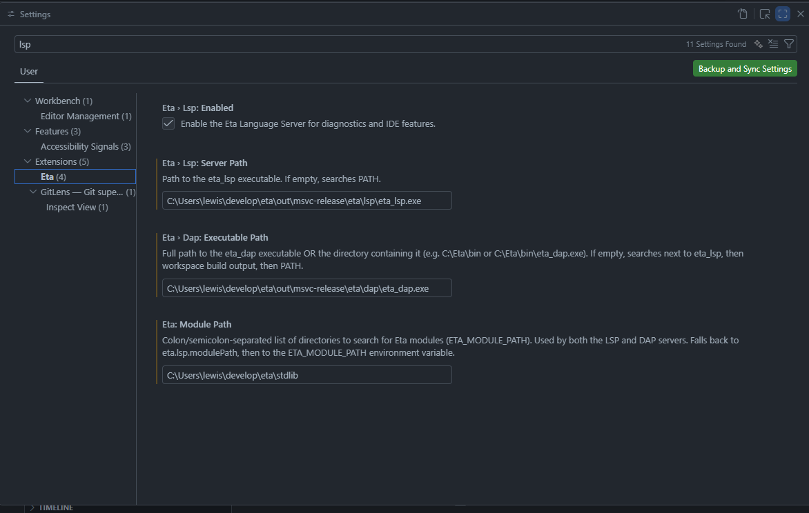
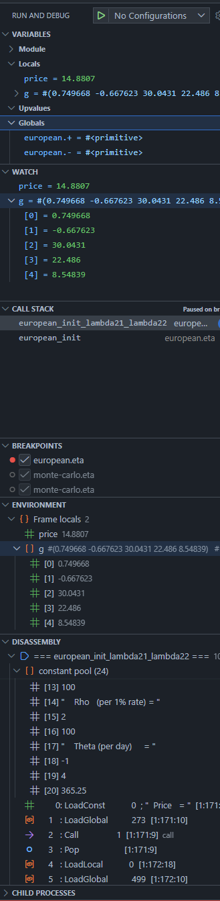
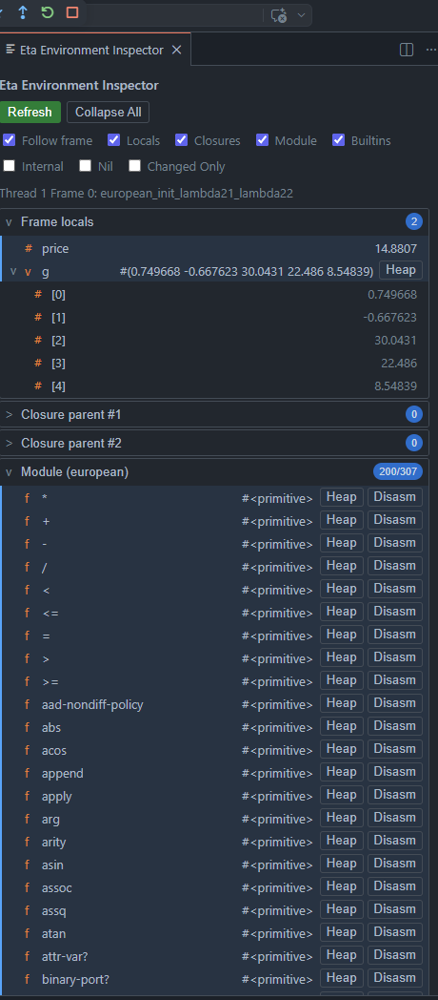
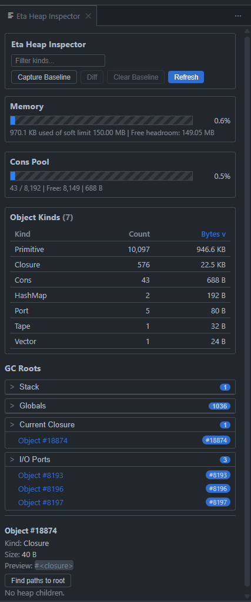
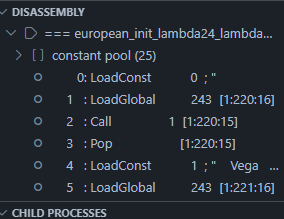
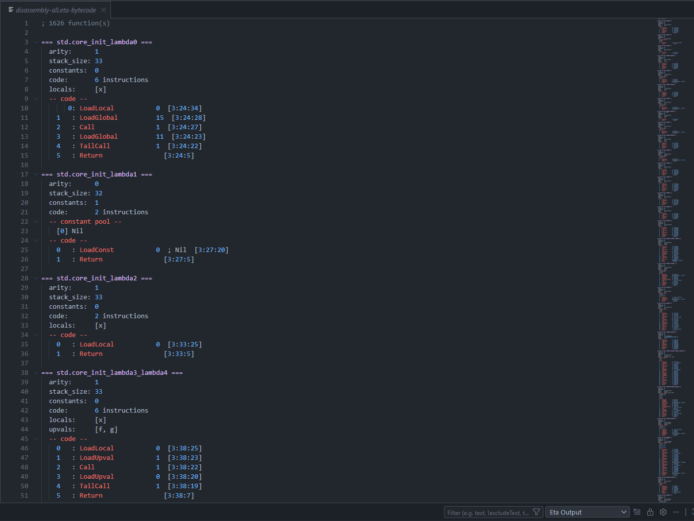
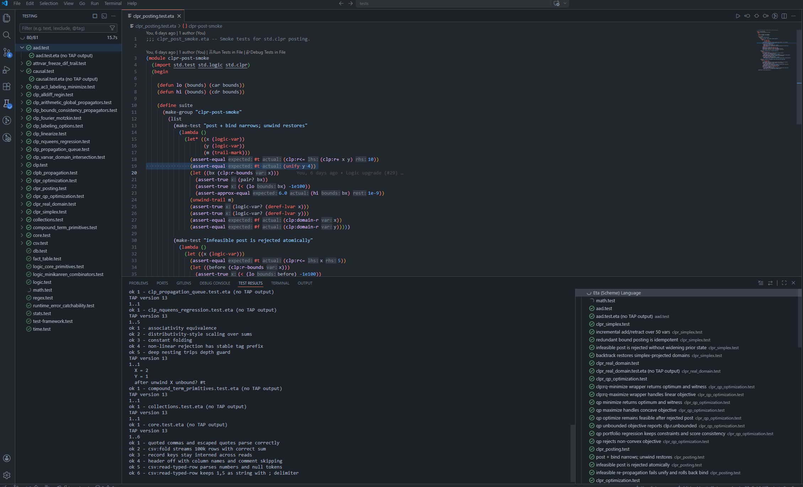

# Eta VS Code Extension

[<- Back to README](../../../README.md) | [Quick Start](../../quickstart.md) |
[Build from Source](../../build.md) | [Bytecode & VM](bytecode-vm.md) |
[Runtime & GC](runtime.md)

---

## Overview

The Eta VS Code extension bundles:

1. Eta language support (`.eta`) and snippets.
2. Language Server integration (`eta_lsp`).
3. Debug Adapter integration (`eta_dap`) with custom Eta runtime tooling.
4. Test Explorer integration (`eta_test`, TAP format).
5. Disassembly document language (`eta-bytecode`) with syntax highlighting.

This page is the reference for configuration, commands, debugger tooling,
testing, and troubleshooting.

---

## Installation

### From an Eta release bundle

Eta release installers (`install.sh`, `install.cmd`, `install.ps1`) install the
VS Code extension automatically when `code` is on `PATH`.

### Manual VSIX install

```bash
code --install-extension editors/vscode/eta-scheme-lang-<version>.vsix
```

After install, open an `.eta` file to activate the extension.

---

## Quick Start

1. Open an `.eta` file.
2. Run `Eta: Debug Eta File` (or press `F5`).
3. Set breakpoints in the gutter and step with `F10`/`F11`/`Shift+F11`.
4. Open `Eta: Show Environment Inspector` and `Eta: Show Heap Inspector`.



---

## Configuration

Open Settings and search for `Eta`.

### Core settings

| Setting | Type | Default | Notes |
|---|---|---:|---|
| `eta.modulePath` | `string` | `""` | Module search path (`ETA_MODULE_PATH`) used by LSP, DAP, and test runner. |
| `eta.lsp.enabled` | `boolean` | `true` | Enable/disable LSP startup. |
| `eta.lsp.serverPath` | `string` | `""` | Path to `eta_lsp` (file or containing directory). |
| `eta.dap.executablePath` | `string` | `""` | Path to `eta_dap` (file or containing directory). |
| `eta.test.runnerPath` | `string` | `""` | Path to `eta_test` (file or containing directory). |
| `eta.binaries.searchPaths` | `string[]` | `[]` | Extra binary search roots or executable paths. Supports `${workspaceFolder}`. |

### Debug automation settings

| Setting | Type | Default | Notes |
|---|---|---:|---|
| `eta.debug.autoShowHeap` | `boolean` | `false` | Open Heap Inspector automatically (effective when heap auto-refresh is enabled). |
| `eta.debug.autoShowEnvironment` | `boolean` | `false` | Open Environment Inspector webview on stop events. |
| `eta.debug.autoShowDisassembly` | `boolean` | `false` | Open disassembly document on stop events. |
| `eta.debug.autoRefreshViewsOnStop` | `boolean` | `false` | Auto-refresh debug side views (Environment/Child Processes/disassembly refresh path). |
| `eta.debug.autoRefreshHeapOnStop` | `boolean` | `false` | Auto-refresh Heap Inspector on stops. |
| `eta.debug.autoRefreshDisassemblyOnStop` | `boolean` | `true` | Auto-refresh current disassembly on stops. |
| `eta.debug.inlineValuesEnabled` | `boolean` | `false` | Enable inline variable values while paused. |

### Environment filter/settings

| Setting | Type | Default |
|---|---|---:|
| `eta.debug.environment.followActiveFrame` | `boolean` | `true` |
| `eta.debug.environment.showLocals` | `boolean` | `true` |
| `eta.debug.environment.showClosures` | `boolean` | `true` |
| `eta.debug.environment.showGlobals` | `boolean` | `false` |
| `eta.debug.environment.showBuiltins` | `boolean` | `false` |
| `eta.debug.environment.showInternal` | `boolean` | `false` |
| `eta.debug.environment.showNil` | `boolean` | `false` |
| `eta.debug.environment.showChangedOnly` | `boolean` | `false` |

Example:

```jsonc
{
  "eta.modulePath": "/path/to/stdlib",
  "eta.lsp.serverPath": "/path/to/eta_lsp",
  "eta.dap.executablePath": "/path/to/eta_dap",
  "eta.test.runnerPath": "/path/to/eta_test",
  "eta.debug.environment.showBuiltins": true
}
```



---

## Binary Discovery Order

The extension resolves binaries in this order.

### `eta_lsp`

1. `eta.lsp.serverPath`
2. `<extension>/bin/eta_lsp`
3. workspace build candidates (for example `out/msvc-release/...`, `out/wsl-clang-release/...`)
4. `eta.binaries.searchPaths`
5. `PATH`

### `eta_dap`

1. `eta.dap.executablePath`
2. next to resolved `eta_lsp`
3. bundled/workspace/search-path/PATH fallback resolution

### `eta_test`

1. `eta.test.runnerPath`
2. next to resolved `eta_lsp`
3. next to resolved `eta_dap`
4. bundled/workspace/search-path/PATH fallback resolution

---

## Launch Configuration (`launch.json`)

Debugger type is `eta`.

| Property | Type | Default | Description |
|---|---|---:|---|
| `program` | `string` | `${file}` | Eta source path to run/debug. |
| `args` | `string[]` | `[]` | Program args passed through launch handling. |
| `cwd` | `string` | `${workspaceFolder}` | Working directory for adapter launch. |
| `env` | `object` | `{}` | Environment variables for adapter process. |
| `modulePath` | `string` | `eta.modulePath` | Session-level `ETA_MODULE_PATH` override. |
| `stopOnEntry` | `boolean` | `false` | Pause on first instruction. |
| `etac` | `boolean` | `false` | Run precompiled path when adapter supports it. |
| `console` | `string` | `debugConsole` | `debugConsole`, `integratedTerminal`, `externalTerminal`. |
| `trace` | `boolean` | `false` | Launch adapter with protocol tracing (`--trace-protocol`). |

Minimal config:

```jsonc
{
  "version": "0.2.0",
  "configurations": [
    {
      "type": "eta",
      "request": "launch",
      "name": "Run Eta file",
      "program": "${file}",
      "stopOnEntry": false
    }
  ]
}
```

---

## Editing Features

### Language and LSP

1. Grammar-based syntax highlighting for Eta (`source.eta`).
2. LSP diagnostics, completion, hover, go-to-definition, references, rename,
   signature help, and symbols (when `eta_lsp` is available).
3. Code lenses:
   - `Run File`
   - `Debug File (stop on entry)`
   - `Run Tests in File` / `Debug Tests in File` for `*.test.eta`
4. Import document links: dotted module names in `(import ...)` become clickable.

### Snippets

The extension ships a broad snippet set including:

1. core forms (`module`, `defun`, `define`, `lambda`, `let`, `if`, `cond`, ...)
2. error/macro forms (`catch`, `raise`, `define-syntax`)
3. stdlib workflows (regex, csv, process, networking, actors, worker pool)

---

## Debugging Workflow

The debug sidebar contributes:

1. `Environment` tree view
2. `Disassembly` tree view
3. `Child Processes` tree view



The extension also uses two output channels:

1. `Eta Language` (adapter/language logs)
2. `Eta Output` (program stdout/stderr stream from `eta-output` events)

---

## Environment Tooling

Eta has both a sidebar tree and a standalone inspector webview.

### Environment sidebar tree (`Environment`)

1. Shows lexical chain levels from `eta/environment`:
   - `Frame locals`
   - `Closure parent #N`
   - `Module (...)`
   - `Builtins`
2. Uses current call stack selection when `followActiveFrame = true`.
3. Expands compound values through DAP `variables` requests.

### Standalone `Eta Environment Inspector`

Open with `Eta: Show Environment Inspector`.

Features:

1. Refresh and Collapse All controls.
2. Live filter toggles for locals/closures/module/builtins/internal/nil.
3. `Changed Only` mode (highlights and filters bindings changed since previous stop).
4. Row actions:
   - `Heap` (inspect object in Heap Inspector when object id exists)
   - `Disasm` (open disassembly from callable bindings)



`Builtins` now surfaces non-current-module runtime/global symbols, so it is no
longer limited to undotted names only.

---

## Heap Inspector

Open with `Eta: Show Heap Inspector`.

Features:

1. Memory gauge (usage vs soft limit).
2. Cons pool gauge when present.
3. Object Kinds table:
   - sortable columns
   - filter box
   - optional baseline diff mode (`Capture Baseline`, `Diff`, `Clear Baseline`)
   - truncation indicator (`showing X of Y kinds`) when capped.
4. GC Roots browser with expandable groups and module grouping for globals.
5. Object detail pane via `eta/inspectObject`.
6. Retention-path search (`Find paths to root`) using bounded BFS over roots.



---

## Disassembly Tooling

### Sidebar `Disassembly` tree

1. Function-grouped view with current-PC function auto-expanded.
2. Constant pool section and code section.
3. Opcode-aware icons/colors (calls, constants, load/store, control flow, arithmetic).
4. Call/TailCall lines can jump to callee function headers.

### Disassembly documents

Commands:

1. `Eta: Show Disassembly` (current function context)
2. `Eta: Show Disassembly (All Functions)` (full dump)

The virtual document uses `eta-bytecode` language (`source.eta-bytecode`) with
syntax highlighting for:

1. function headers
2. opcodes
3. constants/indices/numbers
4. `<func:N>` references
5. strings/comments

Cross-navigation commands:

1. `Eta: Go to Source from Disassembly` (`eta.disassembly.gotoSource`)
2. `Eta: Show Disassembly for Source Line` (`eta.disassembly.revealForSourceLine`)




---

## Child Processes View

The `Child Processes` debug view queries `eta/childProcesses` and shows:

1. process id
2. endpoint
3. module path
4. alive/exited status

Use `Eta: Refresh Child Processes` to refresh manually.

---

## Test Explorer Integration

The extension registers a VS Code Test Controller for `**/*.test.eta`.

Profiles:

1. `Run` - runs `eta_test --format tap`
2. `Debug` - launches Eta debugger for the test file
3. `Coverage` - runs with `--coverage` and degrades gracefully if unsupported

TAP parsing is streaming, so results appear incrementally during long runs.

YAML diagnostics mapping:

| TAP YAML key | VS Code mapping |
|---|---|
| `message` | test failure headline |
| `severity` | detail text |
| `at` | clickable failure location |
| `expected` | expected output field |
| `actual` | actual output field |



---

## Commands

### Primary commands

| Command | Description |
|---|---|
| `Eta: Run Eta File` | Run active Eta file using the Eta debug launch flow. |
| `Eta: Debug Eta File` | Debug active Eta file. |
| `Eta: Run Tests in Current File` | Run tests for active `*.test.eta` file. |
| `Eta: Show Heap Inspector` | Open heap webview inspector. |
| `Eta: Show Environment Inspector` | Open environment webview inspector. |
| `Eta: Show Disassembly` | Open current disassembly document. |
| `Eta: Show Disassembly (All Functions)` | Open all-functions disassembly document. |
| `Eta: Refresh Environment` | Refresh environment tree and inspector. |
| `Eta: Configure Environment Filters` | Quick-pick editor for environment filter settings. |
| `Eta: Refresh Disassembly` | Refresh disassembly sidebar tree. |
| `Eta: Refresh Child Processes` | Refresh child process sidebar tree. |

### Navigation/power commands

| Command id | Description |
|---|---|
| `eta.disassembly.gotoSource` | Jump from current disassembly line to source location. |
| `eta.disassembly.revealForSourceLine` | Reveal bytecode range for active source line. |
| `eta.disassembly.gotoCallee` | Jump to callee header from call instruction (tree/doc integration). |

---

## Troubleshooting

### "Could not locate eta_lsp/eta_dap/eta_test"

Set explicit paths:

```jsonc
{
  "eta.lsp.serverPath": "/abs/path/to/eta_lsp",
  "eta.dap.executablePath": "/abs/path/to/eta_dap",
  "eta.test.runnerPath": "/abs/path/to/eta_test"
}
```

You can also add build output folders to `eta.binaries.searchPaths`.

### "module not found" during debug/test

Set `eta.modulePath` to your stdlib/modules path. This is propagated as
`ETA_MODULE_PATH` to LSP, DAP, and `eta_test`.

### Environment/Heap inspectors show idle state

These views require a paused Eta debug session. Set a breakpoint, then step or
continue to a pause point before refreshing.

### Coverage profile marks file skipped

Your `eta_test` build does not support `--coverage` yet. Run/Debug profiles
still work.

### Disassembly source jump says no mapping

Source correlation relies on DAP disassembly location metadata for the current
session and instruction range. Ensure you are paused in a normal Eta frame.

---

## Developer Notes (Extension)

From `editors/vscode`:

```bash
npm ci
npm run compile-tests
npm test
npm run package
```

This produces `eta-scheme-lang-<version>.vsix`.
