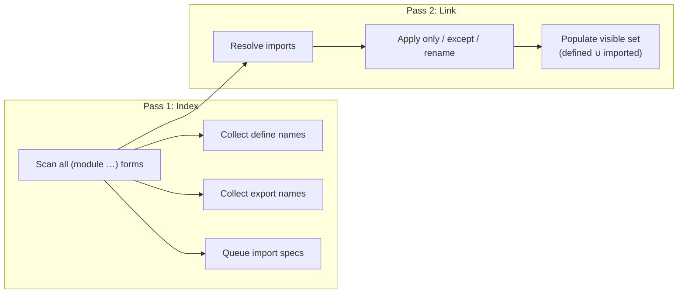
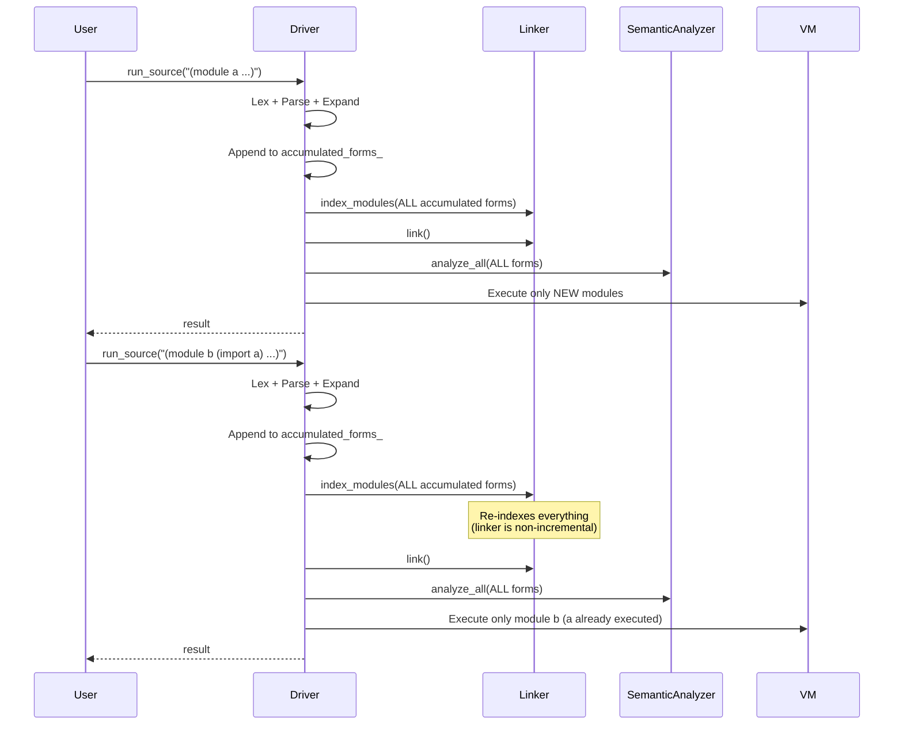

# Modules & Standard Library

[← Back to README](../README.md) · [Architecture](architecture.md) ·
[NaN-Boxing](nanboxing.md) · [Bytecode & VM](bytecode-vm.md) ·
[Runtime & GC](runtime.md)

---

## Module System

Eta organises code into **modules**. Every top-level source file must
contain one or more `(module …)` forms. The module system supports
exports, imports with filtering, and incremental REPL execution.

**Key sources:**
[`module_linker.h`](../eta/core/src/eta/reader/module_linker.h) ·
[`expander.h`](../eta/core/src/eta/reader/expander.h) ·
[`driver.h`](../eta/interpreter/src/eta/interpreter/driver.h)

---

### Module Syntax

```scheme
(module <name>
  (export <id> ...)           ;; names visible to importers
  (import <module-name>)      ;; import all exported names
  (import (only <mod> <id> ...))
  (import (except <mod> <id> ...))
  (import (rename <mod> (<old> <new>) ...))
  (begin
    (define ...)
    (defun ...)
    ...))
```

**Example:**

```scheme
(module geometry
  (export area circumference)
  (import std.math)
  (begin
    (defun area (r) (* pi (* r r)))
    (defun circumference (r) (* 2 pi r))))
```

---

### Module Linker Phases

The `ModuleLinker` resolves inter-module dependencies in two passes:



#### Pass 1 — `index_modules()`

For each `(module name ...)` form:

1. Create a `ModuleTable` entry with the module `name`
2. Scan the body for `define` / `defun` forms → populate `defined`
3. Scan `(export …)` → populate `exports`
4. Queue `(import …)` clauses as `PendingImport`s

**Errors detected:** `DuplicateModule`

#### Pass 2 — `link()`

For each queued `PendingImport`:

1. Look up the source module's `exports` set
2. Apply the import filter:

| Filter | Effect |
|--------|--------|
| `(import mod)` | Import all exported names |
| `(import (only mod a b))` | Import only `a` and `b` |
| `(import (except mod x))` | Import all except `x` |
| `(import (rename mod (old new)))` | Import `old` as `new` |

3. Check for conflicts with already-visible names
4. Add resolved names to the target module's `visible` set
5. Record provenance in `import_origins` for diagnostics

**Errors detected:** `UnknownModule`, `CircularDependency`,
`ConflictingImport`, `NameNotExported`, `ExportOfUnknownName`

---

### Incremental Execution (REPL)

The `Driver` supports incremental execution for the REPL:



Key properties:
- **All** accumulated forms are re-fed to the linker each time (it is
  stateless between calls)
- The `executed_modules_` set tracks which modules have already run,
  so they are not re-executed
- VM `globals_` persist across calls, so definitions from module `a`
  are visible when module `b` runs
- Builtins are re-installed each cycle (their heap objects may have been GC'd)

---

### Prelude Auto-Loading

On startup, the `Driver` calls `load_prelude()` which searches the
module path for `prelude.eta`. This file defines the standard library
modules inline. After the prelude runs, its modules are in
`executed_modules_` and their global slots are populated in the VM.

---

## Standard Library Reference

All standard library modules are defined in
[`stdlib/prelude.eta`](../stdlib/prelude.eta). There is also a
convenience re-export module:

```scheme
(import std.prelude)  ;; imports everything from std.core, std.math, std.io, std.collections
```

---

### `std.core` — Core Combinators & Predicates

```scheme
(import std.core)
```

| Function | Signature | Description |
|----------|-----------|-------------|
| `atom?` | `(x) → bool` | True if `x` is not a pair |
| `void` | `() → '()` | Returns the empty list |
| `identity` | `(x) → x` | Identity function |
| `compose` | `(f g) → (λ (x) (f (g x)))` | Function composition |
| `flip` | `(f) → (λ (a b) (f b a))` | Swap arguments |
| `constantly` | `(v) → (λ args v)` | Always returns `v` |
| `negate` | `(pred) → (λ (x) (not (pred x)))` | Negate a predicate |
| `cadr` | `(xs) → element` | Second element |
| `caddr` | `(xs) → element` | Third element |
| `caar`, `cdar`, `caddar` | `(xs) → element` | Nested accessors |
| `last` | `(xs) → element` | Last element of a list |
| `list?` | `(x) → bool` | True if `x` is a proper list |
| `iota` | `(count [start [step]]) → list` | Generate a sequence |
| `assoc-ref` | `(key alist) → value \| #f` | Association list lookup |

---

### `std.math` — Mathematical Functions

```scheme
(import std.math)
```

| Binding | Type | Description |
|---------|------|-------------|
| `pi` | constant | 3.141592653589793 |
| `e` | constant | 2.718281828459045 |
| `square` | `(x) → x²` | Square |
| `cube` | `(x) → x³` | Cube |
| `even?` | `(n) → bool` | Even predicate |
| `odd?` | `(n) → bool` | Odd predicate |
| `sign` | `(x) → -1 \| 0 \| 1` | Sign function |
| `clamp` | `(x lo hi) → number` | Clamp to range |
| `quotient` | `(a b) → number` | Integer quotient |
| `gcd` | `(a b) → number` | Greatest common divisor |
| `lcm` | `(a b) → number` | Least common multiple |
| `expt` | `(base exp) → number` | Exponentiation (fast power) |
| `sum` | `(xs) → number` | Sum of a list |
| `product` | `(xs) → number` | Product of a list |

---

### `std.io` — Input/Output Utilities

```scheme
(import std.io)
```

| Function | Signature | Description |
|----------|-----------|-------------|
| `print` | `(x)` | Display `x` |
| `println` | `(x)` | Display `x` followed by newline |
| `eprintln` | `(x)` | Print to stderr |
| `display-to-string` | `(x) → string` | Render value to string via string port |
| `read-line` | `([port]) → string \| #f` | Read a line (returns `#f` at EOF) |
| `with-output-to-port` | `(port thunk) → result` | Redirect stdout for `thunk` |
| `with-input-from-port` | `(port thunk) → result` | Redirect stdin for `thunk` |
| `with-error-to-port` | `(port thunk) → result` | Redirect stderr for `thunk` |

---

### `std.collections` — Higher-Order List & Vector Operations

```scheme
(import std.collections)
```

| Function | Signature | Description |
|----------|-----------|-------------|
| `map*` | `(f xs) → list` | Map (single-list) |
| `filter` | `(pred xs) → list` | Keep elements matching `pred` |
| `foldl` | `(f acc xs) → value` | Left fold |
| `foldr` | `(f init xs) → value` | Right fold |
| `reduce` | `(f xs) → value` | Fold without initial accumulator |
| `any?` | `(pred xs) → bool` | True if any element matches |
| `every?` | `(pred xs) → bool` | True if all elements match |
| `count` | `(pred xs) → number` | Count matching elements |
| `zip` | `(xs ys) → list` | Zip two lists into pairs |
| `take` | `(n xs) → list` | First `n` elements |
| `drop` | `(n xs) → list` | Skip first `n` elements |
| `flatten` | `(xss) → list` | Flatten one level of nesting |
| `range` | `(start end) → list` | Integer range `[start, end)` |
| `sort` | `(less? xs) → list` | Merge sort with custom comparator |
| `vector-map` | `(f v) → vector` | Map over a vector |
| `vector-for-each` | `(f v)` | Side-effecting vector traversal |
| `vector-foldl` | `(f acc v) → value` | Left fold over a vector |
| `vector-foldr` | `(f init v) → value` | Right fold over a vector |
| `vector->list` | `(v) → list` | Convert vector to list |
| `list->vector` | `(xs) → vector` | Convert list to vector |

---

### `std.test` — Lightweight Test Framework

```scheme
(import std.test)
```

Uses `define-record-type` for `test-case`, `test-group`, `test-result`,
`group-result`, and `test-summary`.

| Function | Description |
|----------|-------------|
| `make-test` | `(name thunk)` — create a test case |
| `make-group` | `(name children)` — create a test group |
| `run` | `(node) → result` — run a test or group |
| `summary` | `(result) → test-summary` — count pass/fail |
| `print-summary` | `(summary)` — display totals |
| `assert-true` | `(x [msg])` — assert truthy |
| `assert-false` | `(x [msg])` — assert falsy |
| `assert-equal` | `(expected actual [msg])` — assert equality |
| `assert-not-equal` | `(a b [msg])` — assert inequality |

**Example:**

```scheme
(module my-tests
  (import std.test)
  (import std.math)
  (import std.io)
  (begin
    (define suite
      (make-group "math"
        (list
          (make-test "square"
            (lambda () (assert-equal 25 (square 5))))
          (make-test "gcd"
            (lambda () (assert-equal 6 (gcd 12 18)))))))

    (let ((result (run suite)))
      (print-summary (summary result)))))
```

Output:
```
2 tests, 2 passed, 0 failed
```

---

### `std.fact_table` — Columnar Fact Tables

```scheme
(import std.fact_table)
```

An in-memory, column-oriented store of fixed-arity rows with optional
per-column hash indexes for O(1) equality lookups.

| Category | Key Functions |
|----------|---------------|
| **Construction** | `make-fact-table`, `fact-table?` |
| **Mutation** | `fact-table-insert!`, `fact-table-build-index!` |
| **Query** | `fact-table-query`, `fact-table-ref`, `fact-table-row-count`, `fact-table-row` |
| **Iteration** | `fact-table-for-each`, `fact-table-filter`, `fact-table-fold` |

> **📖 Full documentation:** [Fact Tables](fact-table.md)

---

### `std.prelude` — Convenience Re-Export

```scheme
(import std.prelude)
```

Re-exports **all** public names from `std.core`, `std.math`, `std.io`,
`std.collections`, `std.logic`, `std.clp`, `std.causal`, and
`std.fact_table` in a single import for convenience.

---

### `std.torch` — libtorch Neural Network Bindings

```scheme
(import std.torch)
```

> Requires the interpreter to be built with `-DETA_BUILD_TORCH=ON`.

| Category | Key Functions |
|----------|---------------|
| **Tensor creation** | `tensor`, `ones`, `zeros`, `randn`, `arange`, `linspace`, `from-list` |
| **Arithmetic** | `t+`, `t-`, `t*`, `t/`, `matmul`, `dot` |
| **Unary ops** | `neg`, `tabs`, `texp`, `tlog`, `tsqrt`, `relu`, `sigmoid`, `ttanh`, `softmax` |
| **Shape** | `shape`, `reshape`, `transpose`, `squeeze`, `unsqueeze`, `cat` |
| **Reductions** | `tsum`, `mean`, `tmax`, `tmin`, `argmax`, `argmin` |
| **Conversion** | `item`, `to-list`, `numel` |
| **Autograd** | `requires-grad!`, `requires-grad?`, `detach`, `backward`, `grad`, `zero-grad!` |
| **NN layers** | `linear`, `sequential`, `relu-layer`, `sigmoid-layer`, `dropout`, `forward`, `parameters`, `train!`, `eval!` |
| **Loss functions** | `mse-loss`, `l1-loss`, `cross-entropy-loss` |
| **Optimizers** | `sgd`, `adam`, `step!`, `optim-zero-grad!` |
| **Device** | `gpu-available?`, `gpu-count`, `device`, `to-device`, `to-gpu`, `to-cpu`, `nn-to-device` |
| **Helpers** | `train-step!` — one-call training step (zero-grad → forward → loss → backward → step) |

> **📖 Full documentation:** [Neural Networks with libtorch](torch.md)

---

## Builtin Primitives vs. Standard Library

There are two layers of "standard" functionality:

| Layer | Defined in | Mechanism |
|-------|-----------|-----------|
| **Builtins** | C++ (`core_primitives.h`, `io_primitives.h`, `port_primitives.h`) | Registered as `Primitive` heap objects in fixed global slots |
| **Standard Library** | Eta (`prelude.eta`, `std/*.eta`) | Regular Eta functions defined in modules |

Builtins like `+`, `cons`, `display` are always available (they occupy
global slots 0..N−1). The standard library modules build on top of
builtins to provide higher-level abstractions like `foldl`, `sort`, and
`read-line`.

---

## LSP Integration

**File:** [`lsp_server.h`](../eta/lsp/src/eta/lsp/lsp_server.h)

The `eta_lsp` executable implements the Language Server Protocol over
JSON-RPC (stdio). It creates a `Driver` internally and runs the
compilation pipeline on each `textDocument/didOpen` and `didChange` event,
publishing diagnostics back to the editor.

Supported LSP features:
- `textDocument/publishDiagnostics` — real-time error reporting
- Document synchronization (full content sync)

### VS Code Extension

The [`editors/vscode/`](../editors/vscode/) directory contains a VS Code
extension that provides:

- TextMate grammar for syntax highlighting ([`eta.tmLanguage.json`](../editors/vscode/syntaxes/eta.tmLanguage.json))
- Language configuration (bracket matching, comment toggling)
- LSP client that launches `eta_lsp` as a child process

Install via the build script or manually with `vsce package`.

