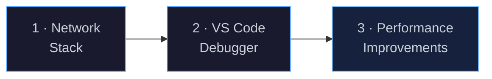
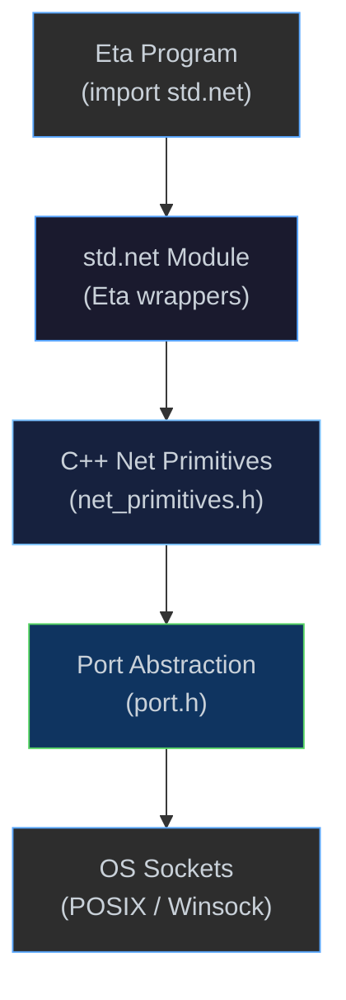
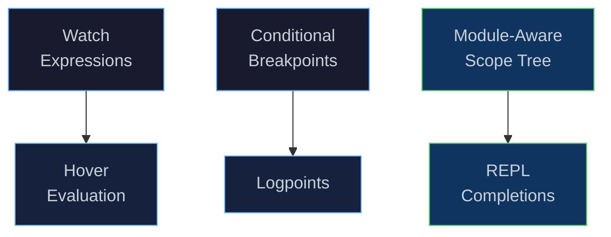

# Next Steps

[← Back to README](../README.md) · [Architecture](architecture.md) ·
[NaN-Boxing](nanboxing.md) · [Bytecode & VM](bytecode-vm.md) ·
[Compiler](compiler.md) · [Runtime & GC](runtime.md) · [Modules & Stdlib](modules.md)

---

## Overview

This document outlines the roadmap for Eta's next development phase.
The core language, compiler, runtime, and libtorch integration are all
shipped — the focus now shifts to three workstreams that improve the
developer experience, extend the standard library, and make the runtime
faster.



---

## 1 · Network Stack

### Motivation

Eta's port system currently supports file I/O and string ports, but has no
networking primitives.  Adding TCP (and later UDP / TLS) support unlocks a
large class of programs — HTTP clients and servers, database drivers,
message-queue consumers, and distributed computing examples — all written
in pure Eta.

### Proposed API

```scheme
(module http-demo
  (import std.core)
  (import std.io)
  (import std.net)
  (begin
    ;; TCP client
    (let ((conn (tcp-connect "example.com" 80)))
      (write-string "GET / HTTP/1.0\r\n\r\n" conn)
      (println (read-line conn))
      (close-port conn))

    ;; TCP server
    (let ((srv (tcp-listen 8080)))
      (let loop ((client (tcp-accept srv)))
        (write-string "HTTP/1.0 200 OK\r\n\r\nHello from Eta!\n" client)
        (close-port client)
        (loop (tcp-accept srv))))))
```

### Architecture



Network connections would be exposed as **ports** — the same abstraction
used for files and string buffers — so `read-line`, `write-string`, and
`close-port` work uniformly across all I/O kinds.

### Planned Primitives

| Function | Signature | Description |
|----------|-----------|-------------|
| `tcp-connect` | `(host port) → port` | Open a TCP client connection |
| `tcp-listen` | `(port) → server-port` | Bind and listen on a TCP port |
| `tcp-accept` | `(server-port) → port` | Accept an incoming connection |
| `udp-socket` | `([port]) → port` | Create a UDP socket |
| `udp-send` | `(port host port data)` | Send a UDP datagram |
| `udp-recv` | `(port) → (data host port)` | Receive a UDP datagram |
| `tls-connect` | `(host port) → port` | TCP + TLS handshake (stretch goal) |

### Key Implementation Tasks

| Task | Touches |
|------|---------|
| Platform socket abstraction (POSIX `socket` / Winsock `SOCKET`) | new `net/socket.h` |
| `TcpPort` / `UdpPort` subclass of `PortObject` | `port.h`, `types/` |
| `net_primitives.h` — register builtins | new `net_primitives.h` |
| `std.net` Eta wrapper module | new `stdlib/std/net.eta` |
| Non-blocking I/O & timeout support | `socket.h` |
| TLS via OpenSSL / Schannel (stretch goal) | optional dependency |
| Example: minimal HTTP server | `examples/` |

---

## 2 · VS Code Debugger Improvements

### Current State

The DAP server (`eta_dap`) already supports:

- Breakpoints (line-based, exception breakpoints)
- Step-through execution (next, step-in, step-out)
- Pause / continue
- Call-stack inspection
- Local & upvalue variable display
- REPL-style expression evaluation (`evaluate` request)
- Heap inspector (custom request)
- `stopOnEntry` launch option

### Planned Improvements



| Feature | Description | Touches |
|---------|-------------|---------|
| **Watch expressions** | Evaluate user-defined expressions every time the debugger pauses, displaying results in the Watch pane. | `dap_server.h` — `handle_evaluate` with `context: "watch"` |
| **Conditional breakpoints** | Break only when a user-supplied Eta expression evaluates to `#t`. | `dap_server.h`, `vm.h` — breakpoint callback predicate |
| **Hover evaluation** | Evaluate the symbol under the cursor when hovering during a debug pause. | VS Code extension `EvaluatableExpressionProvider` + existing `evaluate` |
| **Logpoints** | Print a message (with interpolated expressions) instead of stopping. | `dap_server.h` — `handle_set_breakpoints` logMessage support |
| **Module-aware scope tree** | Show globals grouped by module in the Variables pane, not a flat list. | `dap_server.h` — `handle_scopes` / `handle_variables` |
| **REPL completions** | Tab-completion in the Debug Console using the module's visible names. | `dap_server.h` — `handle_completions` |
| **Data breakpoints** | Break when a specific global slot is written to. | `vm.h` — write-watch on global slots |
| **Disassembly view** | Show the bytecode alongside source in a split pane. | VS Code extension custom editor |

### Key Implementation Tasks

| Task | Touches |
|------|---------|
| Wire `context` field in `evaluate` to support `watch` / `hover` | `dap_server.cpp` |
| Conditional breakpoint predicate evaluation in the VM | `vm.h`, `dap_server.cpp` |
| `logMessage` handling in `setBreakpoints` | `dap_server.cpp` |
| Group globals by module in variable scopes | `dap_server.cpp`, `module_linker.h` |
| `completions` request handler | `dap_server.cpp` |
| VS Code extension: hover evaluation, disassembly view | `editors/vscode/` |

---

## 3 · Performance Improvements

### Motivation

Eta's VM is a straightforward interpreter loop with NaN-boxed values.
There is significant room to improve throughput without changing the
language semantics.

### 3.1 · Benchmarking Infrastructure

Before optimising, establish a repeatable benchmark suite:

| Benchmark | What it measures |
|-----------|-----------------|
| `fib(35)` | Recursive call overhead, TCO savings |
| `(foldl + 0 (iota 1000000))` | Arithmetic hot loop, GC pressure |
| `(sort < (iota 100000))` | Allocation-heavy higher-order code |
| `torch training loop` | libtorch FFI round-trip overhead |
| `SABR Hessian` | Dual-number AD throughput |
| `unify / backtrack` | Logic variable creation & trail management |

Results should be tracked per-commit in CI so regressions are caught
automatically.

### 3.2 · VM Dispatch Optimisation

| Technique | Description | Expected Impact |
|-----------|-------------|-----------------|
| **Computed goto / direct threading** | Replace the `switch` dispatch loop with GCC/Clang `&&label` computed gotos. | 15–30 % speedup on tight loops (eliminates branch predictor pollution from the switch). |
| **Super-instructions** | Fuse common opcode pairs (e.g. `LoadLocal` + `Add`, `LoadConst` + `Call`) into single opcodes that skip a dispatch cycle. | 10–20 % on arithmetic-heavy code. |
| **Inline caching** | Cache the resolved global slot index for `LoadGlobal` so repeated lookups hit a fast path. | Benefits module-heavy code with many cross-module calls. |

### 3.3 · Garbage Collector Tuning

| Improvement | Description |
|-------------|-------------|
| **Generational collection** | Promote long-lived objects to an "old" generation collected less frequently. Most allocations (cons cells, closures) are short-lived. |
| **Concurrent marking** | Run the mark phase on a background thread while the VM continues executing, reducing pause times. |
| **Adaptive soft-limit** | Tune the GC trigger threshold based on allocation rate rather than a fixed byte count. |
| **Compacting / copying collector** | Defragment the heap after mark-sweep to improve cache locality. |

### 3.4 · Compiler Optimisations

| Pass | Description |
|------|-------------|
| **Constant propagation** | Propagate known constant values through `let` bindings and inline them at use sites. |
| **Closure lifting** | Convert closures that capture only constants into top-level functions, eliminating the closure allocation. |
| **Inlining** | Inline small functions (below a threshold) at their call sites to remove call overhead. |
| **Escape analysis** | Detect allocations that do not escape their scope and stack-allocate them instead of heap-allocating. |
| **Loop analysis** | Recognise tail-recursive `letrec` loops and generate tighter bytecode (dedicated loop opcodes). |

### 3.5 · Memory Layout

| Improvement | Description |
|-------------|-------------|
| **Object headers** | Shrink heap object headers from 16 bytes to 8 bytes by packing kind + GC mark + size into a single 64-bit word. |
| **Cons-cell pooling** | Maintain a free-list of recently collected cons cells to avoid heap fragmentation and speed up allocation. |
| **Intern table** | Replace the concurrent hash map with a Robin Hood or Swiss table for better probe locality. |

### Key Implementation Tasks

| Task | Touches |
|------|---------|
| Benchmark suite + CI integration | new `bench/`, `CMakeLists.txt` |
| Computed-goto dispatch in `vm.cpp` | `vm.cpp`, `bytecode.h` |
| Super-instruction definitions and emitter support | `emitter.h`, `vm.cpp` |
| Generational GC prototype | `mark_sweep_gc.h`, `heap.h` |
| Constant propagation IR pass | `optimization/` |
| Closure lifting IR pass | `optimization/` |
| Object header compaction | `types/`, `heap.h` |

---

