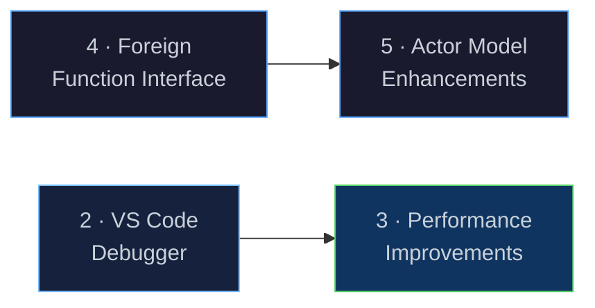
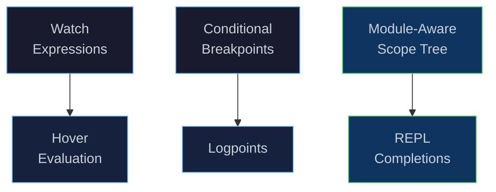

# Next Steps

[← Back to README](../README.md) · [Architecture](architecture.md) ·
[NaN-Boxing](nanboxing.md) · [Bytecode & VM](bytecode-vm.md) ·
[Compiler](compiler.md) · [Runtime & GC](runtime.md) · [Modules & Stdlib](modules.md) ·
[Networking](networking.md) · [Message Passing](message-passing.md)

---

## Overview

This document outlines the roadmap for Eta's next development phase.
The core language, compiler, runtime, libtorch integration, and nng-based
actor model are all shipped.  The focus now shifts to five workstreams that
improve the developer experience, extend the standard library, open Eta
to arbitrary native code, and deepen the actor model.



---

## 1 · Network Stack ✅

The nng-based networking and actor model is **shipped**.

| Component | Status |
|-----------|--------|
| nng socket primitives (`nng-socket`, `send!`, `recv!`, …) | ✅ |
| Actor model (`spawn`, `current-mailbox`, `spawn-wait`, `spawn-kill`) | ✅ |
| `std.net` high-level helpers (`with-socket`, `request-reply`, `worker-pool`, `pub-sub`, `survey`) | ✅ |
| Binary + text wire format with auto-detection | ✅ |
| VS Code extension: syntax highlighting, snippets, DAP child process tree view | ✅ |

> **📖 See:**
> [Networking Primitives](networking.md) ·
> [Message Passing & Actors](message-passing.md) ·
> [Network Design](network-message-passing.md)

---

## 2 · VS Code Debugger Improvements

### Current State

The DAP server (`eta_dap`) already supports:

- Breakpoints (line-based, exception breakpoints)
- Step-through execution (next, step-in, step-out)
- Pause / continue
- Call-stack inspection
- Local & upvalue variable display
- REPL-style expression evaluation (`evaluate` request)
- Heap inspector (custom request)
- `stopOnEntry` launch option

### Planned Improvements



| Feature | Description | Touches |
|---------|-------------|---------|
| **Watch expressions** | Evaluate user-defined expressions every time the debugger pauses, displaying results in the Watch pane. | `dap_server.h` — `handle_evaluate` with `context: "watch"` |
| **Conditional breakpoints** | Break only when a user-supplied Eta expression evaluates to `#t`. | `dap_server.h`, `vm.h` — breakpoint callback predicate |
| **Hover evaluation** | Evaluate the symbol under the cursor when hovering during a debug pause. | VS Code extension `EvaluatableExpressionProvider` + existing `evaluate` |
| **Logpoints** | Print a message (with interpolated expressions) instead of stopping. | `dap_server.h` — `handle_set_breakpoints` logMessage support |
| **Module-aware scope tree** | Show globals grouped by module in the Variables pane, not a flat list. | `dap_server.h` — `handle_scopes` / `handle_variables` |
| **REPL completions** | Tab-completion in the Debug Console using the module's visible names. | `dap_server.h` — `handle_completions` |
| **Data breakpoints** | Break when a specific global slot is written to. | `vm.h` — write-watch on global slots |
| **Disassembly view** | Show the bytecode alongside source in a split pane. | VS Code extension custom editor |

### Key Implementation Tasks

| Task | Touches |
|------|---------|
| Wire `context` field in `evaluate` to support `watch` / `hover` | `dap_server.cpp` |
| Conditional breakpoint predicate evaluation in the VM | `vm.h`, `dap_server.cpp` |
| `logMessage` handling in `setBreakpoints` | `dap_server.cpp` |
| Group globals by module in variable scopes | `dap_server.cpp`, `module_linker.h` |
| `completions` request handler | `dap_server.cpp` |
| VS Code extension: hover evaluation, disassembly view | `editors/vscode/` |

---

## 3 · Performance Improvements

### Motivation

Eta's VM is a straightforward interpreter loop with NaN-boxed values.
There is significant room to improve throughput without changing the
language semantics.

### 3.1 · Benchmarking Infrastructure

Before optimising, establish a repeatable benchmark suite:

| Benchmark | What it measures |
|-----------|-----------------|
| `fib(35)` | Recursive call overhead, TCO savings |
| `(foldl + 0 (iota 1000000))` | Arithmetic hot loop, GC pressure |
| `(sort < (iota 100000))` | Allocation-heavy higher-order code |
| `torch training loop` | libtorch FFI round-trip overhead |
| `SABR Hessian` | Dual-number AD throughput |
| `unify / backtrack` | Logic variable creation & trail management |

Results should be tracked per-commit in CI so regressions are caught
automatically.

### 3.2 · VM Dispatch Optimisation

| Technique | Description | Expected Impact |
|-----------|-------------|-----------------|
| **Computed goto / direct threading** | Replace the `switch` dispatch loop with GCC/Clang `&&label` computed gotos. | 15–30 % speedup on tight loops (eliminates branch predictor pollution from the switch). |
| **Super-instructions** | Fuse common opcode pairs (e.g. `LoadLocal` + `Add`, `LoadConst` + `Call`) into single opcodes that skip a dispatch cycle. | 10–20 % on arithmetic-heavy code. |
| **Inline caching** | Cache the resolved global slot index for `LoadGlobal` so repeated lookups hit a fast path. | Benefits module-heavy code with many cross-module calls. |

### 3.3 · Garbage Collector Tuning

| Improvement | Description |
|-------------|-------------|
| **Generational collection** | Promote long-lived objects to an "old" generation collected less frequently. Most allocations (cons cells, closures) are short-lived. |
| **Concurrent marking** | Run the mark phase on a background thread while the VM continues executing, reducing pause times. |
| **Adaptive soft-limit** | Tune the GC trigger threshold based on allocation rate rather than a fixed byte count. |
| **Compacting / copying collector** | Defragment the heap after mark-sweep to improve cache locality. |

### 3.4 · Compiler Optimisations

| Pass | Description |
|------|-------------|
| **Constant propagation** | Propagate known constant values through `let` bindings and inline them at use sites. |
| **Closure lifting** | Convert closures that capture only constants into top-level functions, eliminating the closure allocation. |
| **Inlining** | Inline small functions (below a threshold) at their call sites to remove call overhead. |
| **Escape analysis** | Detect allocations that do not escape their scope and stack-allocate them instead of heap-allocating. |
| **Loop analysis** | Recognise tail-recursive `letrec` loops and generate tighter bytecode (dedicated loop opcodes). |

### 3.5 · Memory Layout

| Improvement | Description |
|-------------|-------------|
| **Object headers** | Shrink heap object headers from 16 bytes to 8 bytes by packing kind + GC mark + size into a single 64-bit word. |
| **Intern table** | Replace the concurrent hash map with a Robin Hood or Swiss table for better probe locality. |

### Key Implementation Tasks

| Task | Touches |
|------|---------|
| Benchmark suite + CI integration | new `bench/`, `CMakeLists.txt` |
| Computed-goto dispatch in `vm.cpp` | `vm.cpp`, `bytecode.h` |
| Super-instruction definitions and emitter support | `emitter.h`, `vm.cpp` |
| Generational GC prototype | `mark_sweep_gc.h`, `heap.h` |
| Constant propagation IR pass | `optimization/` |
| Closure lifting IR pass | `optimization/` |
| Object header compaction | `types/`, `heap.h` |

---

## 4 · Foreign Function Interface

> [!TIP]
> A detailed design document for this workstream is available at
> [Foreign Function Interface](ffi.md).

### Motivation

Eta's FFI support is currently limited to C functions with `ptr` arguments
and return values.  A more flexible FFI unlocks libraries and services
written in any language, including C++, Rust, and Python.

### Proposed API

```scheme
(module example
  (import std.core)
  (import std.io)
  (import std.ffi)
  (begin
    ;; Call C function
    (let ((puts (ffi-foreign "puts" (-> c-string int))))
      (puts "Hello from Eta via C!"))

    ;; Call Rust function
    (let ((add (ffi-foreign "add" (-> int int int))))
      (println (add 40 2 2)))

    ;; Call Python function
    (let ((py-obj (ffi-foreign "PyObject_GetAttrString" (-> ptr c-string))))
      (println (py-obj (py-encode "hello"))))))
```

### Key Implementation Tasks

| Task | Touches |
|------|---------|
| `ffi-foreign` implementation | `ffi.cpp`, `ffi.h` |
| C++ / Rust / Python example integrations | `examples/` |
| Documentation | `docs/` |

---

## 5 · Actor Model Enhancements

> [!TIP]
> A detailed design document for this workstream is available at
> [Actor Model Enhancements](actor-model.md).

### Motivation

Eta's actor model provides a powerful concurrency primitive, but the
current implementation has limitations in performance, error handling,
and interoperability with non-actor code.

### Proposed API

```scheme
(module actor-demo
  (import std.core)
  (import std.io)
  (import std.actor)
  (begin
    ;; Spawn actor
    (def hello-actor
      (actor []
        (println "Hello from actor!")
        (loop-receive
          ;; Handle messages
          (msg
            (case msg
              ("stop" (println "Actor stopping.") (actor-stop))
              (_ (println "Received:" msg))))))

    ;; Send message to actor
    (hello-actor "Eta greets you!")

    ;; Spawn and wait for actor
    (def worker
      (actor []
        (loop-receive
          (msg
            (case msg
              ("do-work"
                (println "Worker doing work...")
                (actor-reply "work-done"))
              (_ (println "Worker received unknown message"))))))

    (worker "do-work")
    (println "Waiting for worker...")
    (actor-await worker)

    ;; Supervise actor
    (def supervisor
      (actor []
        (loop-receive
          (msg
            (case msg
              ("start-worker"
                (let ((w (actor-spawn worker)))
                  (println "Supervisor started worker:" w)
                  (actor-watch w))
              (_ (println "Supervisor received:" msg))))))

    (supervisor "start-worker")
    (println "Supervisor is monitoring the worker."))))
```

### Key Implementation Tasks

| Task | Touches |
|------|---------|
| Actor model performance optimisations | `actor.cpp`, `actor.h` |
| Supervision and error handling enhancements | `actor.cpp`, `actor.h` |
| Documentation | `docs/` |

---
