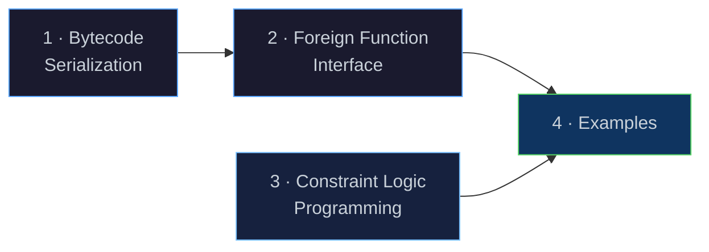
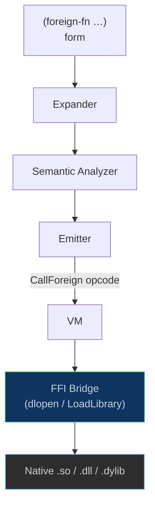
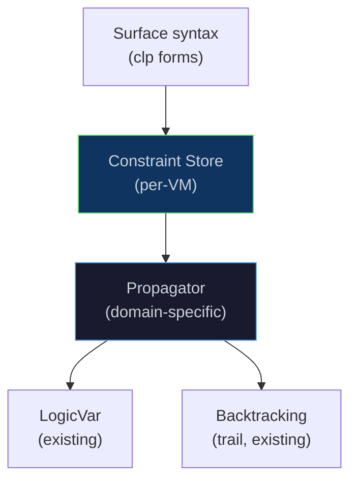
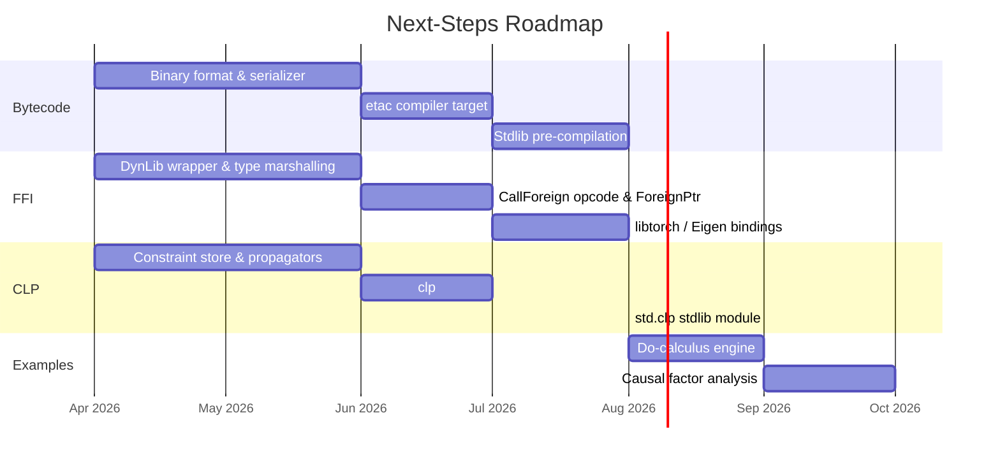

# Next Steps

[← Back to README](../README.md) · [Architecture](architecture.md) ·
[NaN-Boxing](nanboxing.md) · [Bytecode & VM](bytecode-vm.md) ·
[Runtime & GC](runtime.md) · [Modules & Stdlib](modules.md)

---

## Overview

This document outlines the four major workstreams planned for Eta's next
development phase. Although the immediate focus is on improving the DAP server,
so that it can be used to fully support development in VS Code.

This is in addition to benchmarking, bug-fixing, and general polish across the codebase.
The general BAU work will also include networking extensions to the ports. 




---

## 1 · Bytecode Serialization & the `etac` Compiler

### Motivation

Today the full pipeline (lex → parse → expand → link → analyze → emit)
runs every time a source file is executed. For large programs and library
modules that rarely change, this is wasted work. A binary bytecode format
lets us **compile once** and **load instantly**.

### Proposed Binary Format (`.etac`)

Each `.etac` file stores a serialized `BytecodeFunctionRegistry` — the
same structure the emitter already produces in memory
([`emitter.h`](../eta/core/src/eta/semantics/emitter.h)).

```
┌──────────────────────────────────────────────────────┐
│  Magic          4 B   "ETAC"                         │
│  Version        2 B   format version (1)             │
│  Flags          2 B   endianness, debug-info present │
├──────────────────────────────────────────────────────┤
│  Source Hash    32 B   SHA-256 of the .eta source    │
├──────────────────────────────────────────────────────┤
│  Constant Pool  var    NaN-boxed literals, interned  │
│                        strings, function indices     │
├──────────────────────────────────────────────────────┤
│  Function Table var   one entry per BytecodeFunction │
│    ┌─ arity        4 B                               │
│    ├─ has_rest     1 B                               │
│    ├─ stack_size   4 B                               │
│    ├─ name_len     4 B                               │
│    ├─ name         var   UTF-8                       │
│    ├─ n_consts     4 B   indices into constant pool  │
│    ├─ const_refs   var                               │
│    ├─ n_instrs     4 B                               │
│    └─ instructions var   (opcode:u8 + arg:u32) × n   │
├──────────────────────────────────────────────────────┤
│  Debug Info     var    (optional) source spans per   │
│                        instruction for diagnostics   │
└──────────────────────────────────────────────────────┘
```

### `etac` — the Ahead-of-Time Compiler

A new executable target, **`etac`**, will run the existing six-phase
pipeline and write the resulting bytecode to disk instead of executing it:

```
etac  hello.eta   →   hello.etac          # compile
etai  hello.etac                          # run from cache (skips lex→emit)
```

The [`Driver`](../eta/interpreter/src/eta/interpreter/driver.h) gains a
**fast-load path**: when presented with an `.etac` file whose source hash
matches the corresponding `.eta` file, it deserializes the function
registry directly into the VM, bypassing every compilation phase.

### Key Implementation Tasks

| Task | Touches |
|------|---------|
| Define `serialize()` / `deserialize()` for `BytecodeFunction` | `bytecode.h` |
| Implement `ConstantPoolWriter` / `ConstantPoolReader` | new files in `runtime/vm/` |
| Add `--emit-bytecode` flag to `Driver` | `driver.h` |
| Create `etac` executable target | `CMakeLists.txt`, new `main_etac.cpp` |
| Source-hash validation & cache invalidation | `driver.h` |
| Stdlib pre-compilation (`prelude.etac`, `std/*.etac`) | build scripts |

---

## 2 · Foreign Function Interface (FFI)

### Motivation

Scientific computing, machine learning, and systems programming all
require calling into native shared libraries. An FFI lets Eta programs
interoperate with C-ABI libraries — including **libtorch** (PyTorch's C++
backend), BLAS/LAPACK, SQLite, and any `dlopen`-compatible shared object.

### Surface Syntax

```scheme
(module ml
  (import std.core)
  (foreign-library "libtorch_cpu" :as torch)

  ;; Declare a foreign function: name, return type, param types
  (foreign-fn torch:ones  "at_ones"   (-> int int tensor))
  (foreign-fn torch:add   "at_add"    (-> tensor tensor tensor))
  (foreign-fn torch:print "at_print"  (-> tensor void))

  (begin
    (let ((a (torch:ones 3 4))
          (b (torch:ones 3 4)))
      (torch:print (torch:add a b)))))
```

### Architecture



### Type Marshalling

The FFI bridge must convert between NaN-boxed `LispVal` values and C
types at call boundaries:

| Eta Type | C ABI Type | Notes |
|----------|-----------|-------|
| fixnum   | `int64_t` | direct — 47-bit fixnums sign-extended |
| double   | `double`  | direct — unboxed NaN-box payload |
| string   | `const char*` | intern-table lookup → UTF-8 pointer |
| boolean  | `int`     | `#t` → 1, `#f` → 0 |
| bytevector | `void*, size_t` | raw buffer pass-through |
| opaque pointer | `void*` | wrapped in a new `ForeignPtr` heap object |

A new heap object kind, **`ForeignPtr`**, would wrap an opaque native
pointer with an optional destructor so that the GC can release native
resources when the Eta wrapper is collected.

### Key Implementation Tasks

| Task | Touches |
|------|---------|
| Implement platform `DynLib` wrapper (`dlopen` / `LoadLibrary`) | new `ffi/dynlib.h` |
| `foreign-library` / `foreign-fn` expander forms | `expander.h` |
| New `CallForeign` opcode | `bytecode.h`, `vm.h` |
| `ForeignPtr` heap object kind | `types/`, `heap.h`, `mark_sweep_gc.h` |
| Type-marshalling layer (`LispVal` ↔ C ABI) | new `ffi/marshal.h` |
| libffi or hand-rolled call-ABI trampolines | platform-specific |

---

## 3 · Constraint Logic Programming (CLP)

### Background

Structural unification is now a first-class VM primitive, with the
`MakeLogicVar`, `Unify`, `DerefLogicVar`, `TrailMark`, and `UnwindTrail`
opcodes fully implemented and the `LogicVar` heap object kind in place.
This provides a solid foundation for the next step: **Constraint Logic
Programming (CLP)**.

### Motivation

Pure unification can only express *equality* constraints. CLP generalises
this by allowing variables to be constrained over richer domains — numbers,
finite sets, booleans — without requiring an immediate ground value. This
makes it possible to write elegant solvers for scheduling, configuration,
and combinatorial search problems directly in Eta.

### Proposed Constraint Domains

| Domain | Scheme name | Example constraint |
|--------|------------|-------------------|
| Integers | `clp(Z)` | `(<= x 10)`, `(= (+ x y) z)` |
| Finite domains | `clp(FD)` | `(domain x 1 5)`, `(all-different x y z)` |
| Booleans | `clp(B)` | `(bool-or x y z)` |

### Architecture



A **constraint store** lives alongside the trail in the VM. When a
constraint cannot be immediately satisfied or refuted, it is suspended in
the store and re-evaluated whenever one of its variables is further
instantiated.

### Surface Syntax

```scheme
(module schedule
  (import std.core)
  (import std.clp)
  (begin
    (let ((start (logic-var))
          (end   (logic-var))
          (dur   (logic-var)))
      (clp:domain start 0 23)
      (clp:domain end   0 23)
      (clp:domain dur   1  8)
      (clp:= (+ start dur) end)
      (clp:solve (list start end dur))
      (println start)
      (println end))))
```

### Key Implementation Tasks

| Task | Touches |
|------|---------|
| Constraint store data structure in the VM | `vm.h` |
| `clp:domain` / `clp:=` / `clp:<=` propagators | new `runtime/clp/` |
| Suspension & wakeup mechanism for propagators | `vm.h`, `types/` |
| `all-different` global constraint | `runtime/clp/` |
| Trail integration: undo constraint store on backtrack | `vm.h` |
| `std.clp` standard-library module | `stdlib/std/clp.eta` |
| `clp:solve` labelling strategy | `stdlib/std/clp.eta` |

---

## 4 · Examples: Do-Calculus & Causal Factor Analysis

### Motivation

The combination of an FFI (for numerical libraries) and CLP
(for symbolic reasoning) provides the basis for a **causal
inference** — engine, a domain that blends symbolic graph manipulation
with statistical computation.

Two example programs are planned under a new `examples/`
directory:

### 4.1 — Do-Calculus Engine

Pearl's **do-calculus** provides three rules that determine when a causal
effect `P(y | do(x))` is identifiable from observational data. The engine
will:

1. Represent causal DAGs as Eta association lists / vectors.
2. Implement the three rules of do-calculus as Prolog-style relational
   queries using the `Unify` instruction.
3. Derive interventional distributions symbolically.

```scheme
;; Define a causal DAG
(define weather-dag
  '((rain       -> wet-grass)
    (sprinkler  -> wet-grass)
    (season     -> rain)
    (season     -> sprinkler)))

;; Query: is P(wet-grass | do(sprinkler)) identifiable?
(do-identify weather-dag 'wet-grass 'sprinkler)
;; → (adjust (rain) P(wet-grass | rain, sprinkler) P(rain | season) P(season))
```

### 4.2 — Causal Factor Analysis

Building on the do-calculus engine and the FFI bridge to a numerical
library (e.g. libtorch or Eigen), this example will:

1. Load observational data from CSV via port I/O.
2. Construct a causal graph from domain knowledge.
3. Apply do-calculus to derive an adjustment formula.
4. Estimate the causal effect numerically using the FFI-backed matrix
   operations.

```scheme
(module causal-factor
  (import std.io)
  (import std.collections)
  (foreign-library "libeta_numerics" :as num)

  (begin
    ;; 1. Load data
    (define data (read-csv "observations.csv"))

    ;; 2. Causal graph
    (define dag
      '((education -> income)
        (location  -> education)
        (location  -> income)))

    ;; 3. Identify: P(income | do(education))
    (define formula (do-identify dag 'income 'education))

    ;; 4. Estimate via numerical adjustment
    (println (estimate-effect formula data))))
```

### Planned Directory Layout

```
examples/
├── README.md                 # Overview and run instructions
├── do-calculus/
│   ├── dag.eta               # DAG representation utilities
│   ├── do-rules.eta          # Three rules of do-calculus
│   └── demo.eta              # Interactive identification demo
└── causal-factor/
    ├── csv-loader.eta        # Port-based CSV ingestion
    ├── adjustment.eta        # Numerical estimation routines
    └── analysis.eta          # End-to-end causal factor analysis
```

---

<!--
Timelines are pessemistic here, hopefully can be done sooner.

## Dependency Graph

The workstreams have natural dependencies — bytecode serialization can
proceed independently, while the examples require both the FFI and
unification work to be in place:


-->
---

## References

- Pearl, J. (2009). *Causality: Models, Reasoning, and Inference*. Cambridge University Press.
- Warren, D. H. D. (1983). *An Abstract Prolog Instruction Set*. SRI Technical Note 309.
- Aït-Kaci, H. (1991). *Warren's Abstract Machine: A Tutorial Reconstruction*.

