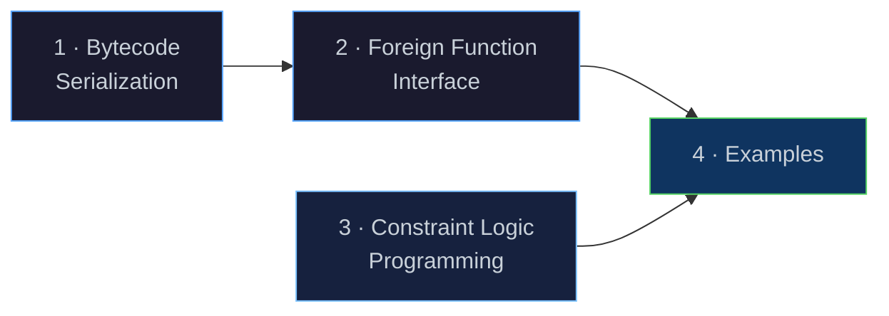
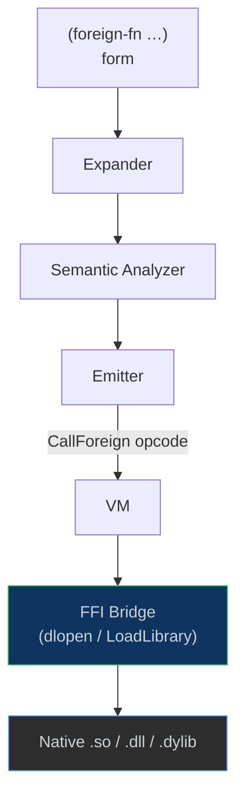

# Next Steps

[← Back to README](../README.md) · [Architecture](architecture.md) ·
[NaN-Boxing](nanboxing.md) · [Bytecode & VM](bytecode-vm.md) ·
[Runtime & GC](runtime.md) · [Modules & Stdlib](modules.md)

---

## Overview

This document outlines the major workstreams planned for Eta's next
development phase. Although the immediate focus is on improving the DAP server,
so that it can be used to fully support development in VS Code.

This is in addition to benchmarking, bug-fixing, and general polish across the codebase.
The general BAU work will also include networking extensions to the ports. 




---

## 1 · Bytecode Serialization & the `etac` Compiler

### Motivation

Today the full pipeline (lex → parse → expand → link → analyze → emit)
runs every time a source file is executed. For large programs and library
modules that rarely change, this is wasted work. A binary bytecode format
lets us **compile once** and **load instantly**.

### Proposed Binary Format (`.etac`)

Each `.etac` file stores a serialized `BytecodeFunctionRegistry` — the
same structure the emitter already produces in memory
([`emitter.h`](../eta/core/src/eta/semantics/emitter.h)).

```
┌──────────────────────────────────────────────────────┐
│  Magic          4 B   "ETAC"                         │
│  Version        2 B   format version (1)             │
│  Flags          2 B   endianness, debug-info present │
├──────────────────────────────────────────────────────┤
│  Source Hash    32 B   SHA-256 of the .eta source    │
├──────────────────────────────────────────────────────┤
│  Constant Pool  var    NaN-boxed literals, interned  │
│                        strings, function indices     │
├──────────────────────────────────────────────────────┤
│  Function Table var   one entry per BytecodeFunction │
│    ┌─ arity        4 B                               │
│    ├─ has_rest     1 B                               │
│    ├─ stack_size   4 B                               │
│    ├─ name_len     4 B                               │
│    ├─ name         var   UTF-8                       │
│    ├─ n_consts     4 B   indices into constant pool  │
│    ├─ const_refs   var                               │
│    ├─ n_instrs     4 B                               │
│    └─ instructions var   (opcode:u8 + arg:u32) × n   │
├──────────────────────────────────────────────────────┤
│  Debug Info     var    (optional) source spans per   │
│                        instruction for diagnostics   │
└──────────────────────────────────────────────────────┘
```

### `etac` — the Ahead-of-Time Compiler

A new executable target, **`etac`**, will run the existing six-phase
pipeline and write the resulting bytecode to disk instead of executing it:

```
etac  hello.eta   →   hello.etac          # compile
etai  hello.etac                          # run from cache (skips lex→emit)
```

The [`Driver`](../eta/interpreter/src/eta/interpreter/driver.h) gains a
**fast-load path**: when presented with an `.etac` file whose source hash
matches the corresponding `.eta` file, it deserializes the function
registry directly into the VM, bypassing every compilation phase.

### Key Implementation Tasks

| Task | Touches |
|------|---------|
| Define `serialize()` / `deserialize()` for `BytecodeFunction` | `bytecode.h` |
| Implement `ConstantPoolWriter` / `ConstantPoolReader` | new files in `runtime/vm/` |
| Add `--emit-bytecode` flag to `Driver` | `driver.h` |
| Create `etac` executable target | `CMakeLists.txt`, new `main_etac.cpp` |
| Source-hash validation & cache invalidation | `driver.h` |
| Stdlib pre-compilation (`prelude.etac`, `std/*.etac`) | build scripts |

---

## 2 · Foreign Function Interface (FFI)

### Motivation

Scientific computing, machine learning, and systems programming all
require calling into native shared libraries. An FFI lets Eta programs
interoperate with C-ABI libraries — including **libtorch** (PyTorch's C++
backend), BLAS/LAPACK, SQLite, and any `dlopen`-compatible shared object.

### Surface Syntax

```scheme
(module ml
  (import std.core)
  (foreign-library "libtorch_cpu" :as torch)

  ;; Declare a foreign function: name, return type, param types
  (foreign-fn torch:ones  "at_ones"   (-> int int tensor))
  (foreign-fn torch:add   "at_add"    (-> tensor tensor tensor))
  (foreign-fn torch:print "at_print"  (-> tensor void))

  (begin
    (let ((a (torch:ones 3 4))
          (b (torch:ones 3 4)))
      (torch:print (torch:add a b)))))
```

### Architecture



### Type Marshalling

The FFI bridge must convert between NaN-boxed `LispVal` values and C
types at call boundaries:

| Eta Type | C ABI Type | Notes |
|----------|-----------|-------|
| fixnum   | `int64_t` | direct — 47-bit fixnums sign-extended |
| double   | `double`  | direct — unboxed NaN-box payload |
| string   | `const char*` | intern-table lookup → UTF-8 pointer |
| boolean  | `int`     | `#t` → 1, `#f` → 0 |
| bytevector | `void*, size_t` | raw buffer pass-through |
| opaque pointer | `void*` | wrapped in a new `ForeignPtr` heap object |

A new heap object kind, **`ForeignPtr`**, would wrap an opaque native
pointer with an optional destructor so that the GC can release native
resources when the Eta wrapper is collected.

### Key Implementation Tasks

| Task | Touches |
|------|---------|
| Implement platform `DynLib` wrapper (`dlopen` / `LoadLibrary`) | new `ffi/dynlib.h` |
| `foreign-library` / `foreign-fn` expander forms | `expander.h` |
| New `CallForeign` opcode | `bytecode.h`, `vm.h` |
| `ForeignPtr` heap object kind | `types/`, `heap.h`, `mark_sweep_gc.h` |
| Type-marshalling layer (`LispVal` ↔ C ABI) | new `ffi/marshal.h` |
| libffi or hand-rolled call-ABI trampolines | platform-specific |

---

