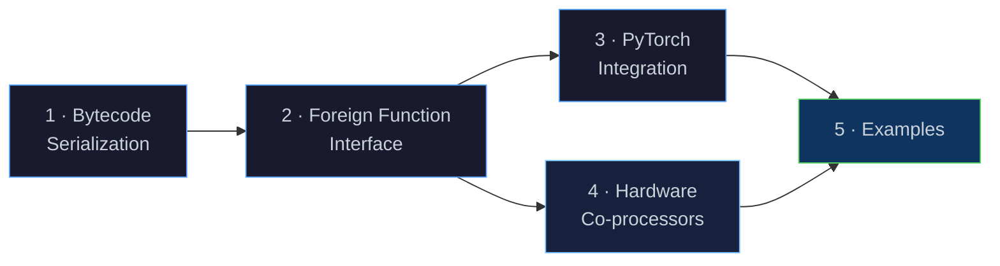
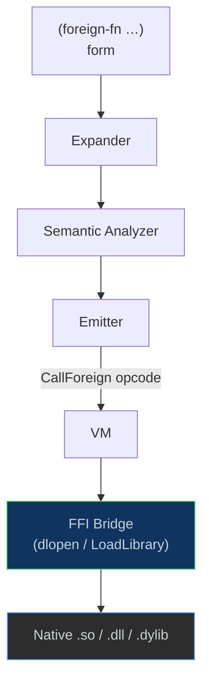
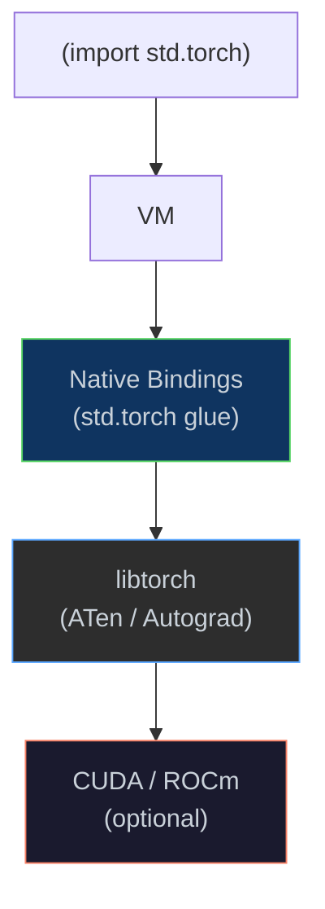

# Next Steps

[← Back to README](../README.md) · [Architecture](architecture.md) ·
[NaN-Boxing](nanboxing.md) · [Bytecode & VM](bytecode-vm.md) ·
[Runtime & GC](runtime.md) · [Modules & Stdlib](modules.md)

---

## Overview

This document outlines the major workstreams planned for Eta's next
development phase. Although the immediate focus is on improving the DAP server,
so that it can be used to fully support development in VS Code.

This is in addition to benchmarking, bug-fixing, and general polish across the codebase.
The general BAU work will also include networking extensions to the ports. 




---

## 1 · Bytecode Serialization & the `etac` Compiler

### Motivation

Today the full pipeline (lex → parse → expand → link → analyze → emit)
runs every time a source file is executed. For large programs and library
modules that rarely change, this is wasted work. A binary bytecode format
lets us **compile once** and **load instantly**.

### Proposed Binary Format (`.etac`)

Each `.etac` file stores a serialized `BytecodeFunctionRegistry` — the
same structure the emitter already produces in memory
([`emitter.h`](../eta/core/src/eta/semantics/emitter.h)).

```
┌──────────────────────────────────────────────────────┐
│  Magic          4 B   "ETAC"                         │
│  Version        2 B   format version (1)             │
│  Flags          2 B   endianness, debug-info present │
├──────────────────────────────────────────────────────┤
│  Source Hash    32 B   SHA-256 of the .eta source    │
├──────────────────────────────────────────────────────┤
│  Constant Pool  var    NaN-boxed literals, interned  │
│                        strings, function indices     │
├──────────────────────────────────────────────────────┤
│  Function Table var   one entry per BytecodeFunction │
│    ┌─ arity        4 B                               │
│    ├─ has_rest     1 B                               │
│    ├─ stack_size   4 B                               │
│    ├─ name_len     4 B                               │
│    ├─ name         var   UTF-8                       │
│    ├─ n_consts     4 B   indices into constant pool  │
│    ├─ const_refs   var                               │
│    ├─ n_instrs     4 B                               │
│    └─ instructions var   (opcode:u8 + arg:u32) × n   │
├──────────────────────────────────────────────────────┤
│  Debug Info     var    (optional) source spans per   │
│                        instruction for diagnostics   │
└──────────────────────────────────────────────────────┘
```

### `etac` — the Ahead-of-Time Compiler

A new executable target, **`etac`**, will run the existing six-phase
pipeline and write the resulting bytecode to disk instead of executing it:

```
etac  hello.eta   →   hello.etac          # compile
etai  hello.etac                          # run from cache (skips lex→emit)
```

The [`Driver`](../eta/interpreter/src/eta/interpreter/driver.h) gains a
**fast-load path**: when presented with an `.etac` file whose source hash
matches the corresponding `.eta` file, it deserializes the function
registry directly into the VM, bypassing every compilation phase.

### Key Implementation Tasks

| Task | Touches |
|------|---------|
| Define `serialize()` / `deserialize()` for `BytecodeFunction` | `bytecode.h` |
| Implement `ConstantPoolWriter` / `ConstantPoolReader` | new files in `runtime/vm/` |
| Add `--emit-bytecode` flag to `Driver` | `driver.h` |
| Create `etac` executable target | `CMakeLists.txt`, new `main_etac.cpp` |
| Source-hash validation & cache invalidation | `driver.h` |
| Stdlib pre-compilation (`prelude.etac`, `std/*.etac`) | build scripts |

---

## 2 · Foreign Function Interface (FFI)

### Motivation

Scientific computing, machine learning, and systems programming all
require calling into native shared libraries. An FFI lets Eta programs
interoperate with C-ABI libraries — including **libtorch** (PyTorch's C++
backend), BLAS/LAPACK, SQLite, and any `dlopen`-compatible shared object.

### Surface Syntax

```scheme
(module ml
  (import std.core)
  (foreign-library "libtorch_cpu" :as torch)

  ;; Declare a foreign function: name, return type, param types
  (foreign-fn torch:ones  "at_ones"   (-> int int tensor))
  (foreign-fn torch:add   "at_add"    (-> tensor tensor tensor))
  (foreign-fn torch:print "at_print"  (-> tensor void))

  (begin
    (let ((a (torch:ones 3 4))
          (b (torch:ones 3 4)))
      (torch:print (torch:add a b)))))
```

### Architecture



### Type Marshalling

The FFI bridge must convert between NaN-boxed `LispVal` values and C
types at call boundaries:

| Eta Type | C ABI Type | Notes |
|----------|-----------|-------|
| fixnum   | `int64_t` | direct — 47-bit fixnums sign-extended |
| double   | `double`  | direct — unboxed NaN-box payload |
| string   | `const char*` | intern-table lookup → UTF-8 pointer |
| boolean  | `int`     | `#t` → 1, `#f` → 0 |
| bytevector | `void*, size_t` | raw buffer pass-through |
| opaque pointer | `void*` | wrapped in a new `ForeignPtr` heap object |

A new heap object kind, **`ForeignPtr`**, would wrap an opaque native
pointer with an optional destructor so that the GC can release native
resources when the Eta wrapper is collected.

### Key Implementation Tasks

| Task | Touches |
|------|---------|
| Implement platform `DynLib` wrapper (`dlopen` / `LoadLibrary`) | new `ffi/dynlib.h` |
| `foreign-library` / `foreign-fn` expander forms | `expander.h` |
| New `CallForeign` opcode | `bytecode.h`, `vm.h` |
| `ForeignPtr` heap object kind | `types/`, `heap.h`, `mark_sweep_gc.h` |
| Type-marshalling layer (`LispVal` ↔ C ABI) | new `ffi/marshal.h` |
| libffi or hand-rolled call-ABI trampolines | platform-specific |

---

## 3 · PyTorch Integration

### Motivation

Deep learning and differentiable programming are fundamental to modern
scientific computing. By integrating with **PyTorch** — either through the
FFI (§ 2) calling into **libtorch** (the C++ backend) or via native
bindings — Eta programs gain access to GPU-accelerated tensor operations,
automatic differentiation, and the vast PyTorch model ecosystem without
leaving the language.

### Integration Strategies

| Strategy | Mechanism | Pros | Cons |
|----------|-----------|------|------|
| **FFI → libtorch** | `foreign-library "libtorch_cpu"` | Reuses § 2 infrastructure; pure C++ | Must manually wrap each ATen op |
| **Embedded Python** | Embed CPython via `libpython` and call `import torch` | Access to full Python‐level API, pre-trained models | Heavyweight; GIL contention |
| **Native Bindings** | Dedicated `std.torch` module backed by C++ glue code | Idiomatic Eta API; type-safe tensors | More implementation effort |

### Proposed Surface Syntax (Native Bindings)

```scheme
(module nn-demo
  (import std.core)
  (import std.torch)

  (begin
    (let ((a (torch/ones '(3 4)))
          (b (torch/randn '(3 4))))
      (define c (torch/add a b))
      (torch/print c)

      ;; Autograd
      (let ((x (torch/tensor 2.0 :requires-grad #t)))
        (define y (torch/mul x x))        ;; y = x²
        (torch/backward y)
        (display (torch/grad x))))))      ;; → 4.0
```

### Architecture



### Tensor Representation

A new heap object kind, **`TensorPtr`**, wraps a `torch::Tensor` handle.
Like `ForeignPtr` (§ 2), the GC invokes a destructor on collection to
release the underlying tensor storage.

| Eta Value | C++ Mapping | Notes |
|-----------|------------|-------|
| `tensor`  | `torch::Tensor` | reference-counted via libtorch's intrusive_ptr |
| `device`  | `torch::Device`  | `:cpu`, `:cuda`, `:mps` |
| `dtype`   | `torch::Dtype`   | `:float32`, `:float64`, `:int64` |
| `shape`   | `std::vector<int64_t>` | Eta list of fixnums |

### Key Implementation Tasks

| Task | Touches |
|------|---------|
| Add libtorch as an optional CMake dependency | `CMakeLists.txt` |
| Implement `TensorPtr` heap object | `types/`, `heap.h`, `mark_sweep_gc.h` |
| `std.torch` native-binding module | new `stdlib/std/torch.eta` + C++ glue |
| Tensor creation ops (`ones`, `zeros`, `randn`, `tensor`) | glue layer |
| Arithmetic dispatch (`add`, `mul`, `matmul`, …) | glue layer |
| Autograd support (`backward`, `grad`) | glue layer |
| GPU device transfer (`to-device`) | glue layer |
| Python-fallback path via embedded CPython (optional) | `ffi/python.h` |

---

## 4 · Hardware Co-processors (FPGA / GPU Offload)

### Motivation

For numerically intensive workloads — large-scale simulations, batch
matrix arithmetic, Monte-Carlo paths — the VM's interpreted arithmetic
loop becomes the bottleneck. Offloading the numeric "fast path" from
`VM::do_binary_arithmetic` to dedicated hardware (an **FPGA** fabric or a
**GPU** compute kernel) can yield order-of-magnitude throughput
improvements while maintaining compatibility with the VM's NaN-boxing
memory model.

### 4.1 · Hardware / Software Interface (HSI)

The VM and the co-processor communicate via **memory-mapped I/O** (MMIO)
registers or a high-bandwidth bus (AXI4-Lite for control, AXI4-Stream for
data):

| Register | Width | Description |
|----------|-------|-------------|
| `REG_OP_A` | 64-bit | First operand (raw `LispVal` or unboxed `int64_t` / `double`) |
| `REG_OP_B` | 64-bit | Second operand |
| `REG_RESULT` | 64-bit | Result of the operation |

**Control / Status Register** (32-bit):

| Bits | Field | Meaning |
|------|-------|---------|
| `[0:3]` | `OpCode` | 0 = Add, 1 = Sub, 2 = Mul, 3 = Div |
| `[4]` | `IsFlonum` | 0 = 47-bit Fixnum, 1 = 64-bit Double |
| `[8]` | `Start` | Host sets to 1 to begin computation |
| `[9]` | `Busy` | Co-processor sets to 1 while calculating |
| `[10]` | `Overflow` | Set if Fixnum result requires promotion to Double |

### 4.2 · VM Integration

Modify [`vm.cpp`](../eta/core/src/eta/runtime/vm/vm.cpp) to delegate to
the co-processor when beneficial:

1. **Detection** — In `VM::do_binary_arithmetic`, identify operations that
   do *not* involve `Dual` objects (AD) or complex logic variables.
2. **Offloading Logic:**
   1. Check the co-processor is available and idle (`Busy == 0`).
   2. Write unboxed payloads of `a` and `b` to `REG_OP_A` / `REG_OP_B`.
   3. Write the `OpCode` and `Start` bit to the control register.
   4. **Poll or Yield** — for single ops, spin on `Busy`; for batch work,
      yield back to the scheduler and resume on interrupt.
   5. **Read Result** — if `Overflow` is set, promote to flonum; otherwise
      box `REG_RESULT` as the appropriate NaN-boxed type.

### 4.3 · Co-processor Kernel Design

Implement the arithmetic logic in RTL (Verilog / VHDL) or High-Level
Synthesis (HLS):

*   **Fixnum Unit** — 47-bit signed adder / subtractor / multiplier with
    overflow detection that triggers the `Overflow` flag when the result
    exceeds `FIXNUM_MIN / MAX`.
*   **Flonum Unit** — IEEE-754 double-precision FPU (vendor IP cores such
    as Xilinx Floating-Point Operator for Add, Sub, Mul, Div).
*   **Promotion Logic** — hardware Fixnum-to-Double converter; on Fixnum
    overflow the co-processor automatically re-runs the operation in the
    FPU before returning.

### 4.4 · Data Transfer Mechanisms

| Mechanism | Best For | Details |
|-----------|----------|---------|
| **MMIO (register-based)** | Single op (e.g. `(+ a b)`) | Low latency, high per-call overhead |
| **DMA / Shared Memory** | Vectorised arithmetic | VM writes a buffer of numbers; co-processor processes the array in bulk |

For the DMA path a new VM instruction — `OpCode::CoprocessorMap` — would
apply an arithmetic operation element-wise over a list or vector, shipping
the entire buffer to the co-processor in one transfer.

### 4.5 · GPU Compute Offload (Alternative Path)

Instead of (or in addition to) an FPGA, arithmetic kernels can be
dispatched to a **GPU** via CUDA or OpenCL:

*   A `std.gpu` module exposes `gpu/map`, `gpu/reduce`, and
    `gpu/matmul`.
*   The VM ships operand buffers to device memory, launches a kernel, and
    reads back results — reusing the same `OpCode::CoprocessorMap`
    instruction with a different backend flag.

### 4.6 · Verification & Fallback Strategy

*   **Software Fallback** — the existing C++ arithmetic logic is always
    retained. If the co-processor is busy, missing, or returns an error
    the VM falls back transparently.
*   **Bit-Exactness** — the co-processor's FPU rounding modes and NaN
    handling must match the host `double` semantics to prevent divergence
    in complex simulations.
*   **Cycle-Accurate Simulation** — use Verilator to co-simulate the
    hardware alongside the VM during development before deploying to
    physical silicon.

### Workflow Summary

```
Extract  →  VM unboxes LispVal to raw numeric bits
Ship     →  Send bits + opcode to co-processor registers (or DMA buffer)
Compute  →  Co-processor runs 47-bit / 64-bit parallel logic
Retrieve →  VM reads result + status flags (Overflow / Error)
Re-box   →  VM wraps result back into a LispVal and pushes to the stack
```

### Key Implementation Tasks

| Task | Touches |
|------|---------|
| Define MMIO register layout & platform abstraction | new `coproc/interface.h` |
| `OpCode::CoprocessorMap` instruction | `bytecode.h`, `vm.h` |
| FPGA kernel (Fixnum + Flonum units) | RTL / HLS sources |
| DMA buffer management & shared-memory allocator | new `coproc/dma.h` |
| GPU offload path (CUDA / OpenCL kernels) | new `coproc/gpu.h` |
| Verilator co-simulation test harness | `test/` |
| Software fallback & feature-detection logic | `vm.cpp` |

---

