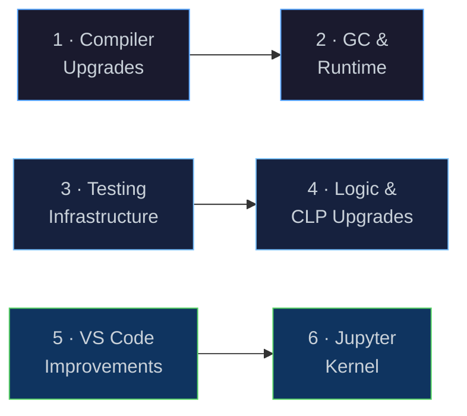
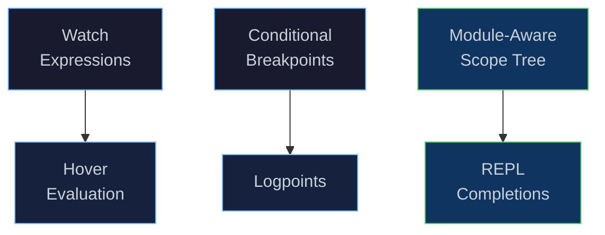

# Next Steps

[← Back to README](../README.md) · [Architecture](architecture.md) ·
[NaN-Boxing](nanboxing.md) · [Bytecode & VM](bytecode-vm.md) ·
[Compiler](compiler.md) · [Runtime & GC](runtime.md) · [Modules & Stdlib](modules.md) ·
[Logic Programming](logic.md) · [CLP](clp.md)

---

## Overview

This document outlines the roadmap for Eta's next development phase.
The core language, compiler, runtime, networking/actor model, libtorch
integration, Eigen statistics, causal inference, and debug adapter are all
shipped.  The focus now shifts to six workstreams that harden correctness,
improve throughput, extend the logic/constraint programming layers, and
broaden the developer experience.



---

## 1 · Compiler Upgrades

### Motivation

The current emitter performs a single forward pass over the Core IR and
produces correct but unoptimised bytecode.  Several well-understood IR passes
would meaningfully reduce allocation pressure and call overhead for
data-intensive workloads.

### 1.1 · Optimisation Passes

| Pass | Description | Expected Impact |
|------|-------------|-----------------|
| **Constant propagation** | Propagate known constant values through `let` bindings; replace use sites with inline literals. | Eliminates redundant `LoadGlobal` / `LoadConst` pairs; benefits arithmetic-heavy code. |
| **Closure lifting** | Convert closures that capture only compile-time constants into top-level functions. | Removes closure-allocation overhead for many helper lambdas. |
| **Inlining** | Inline small functions (below a threshold) at their call sites. | Removes call overhead; enables subsequent constant propagation across call boundaries. |
| **Escape analysis** | Detect allocations that do not escape their defining scope. | Enables stack allocation instead of heap allocation for short-lived cons cells and closures. |
| **Loop recognition** | Detect tail-recursive `letrec` loops and emit dedicated loop opcodes. | Avoids repeated closure entry overhead in tight recursive loops. |

### 1.2 · VM Dispatch

| Technique | Description | Expected Impact |
|-----------|-------------|-----------------|
| **Computed goto / direct threading** | Replace the `switch` dispatch loop with GCC/Clang `&&label` computed gotos. | 15-30% speedup on tight loops (eliminates switch branch-predictor pressure). |
| **Super-instructions** | Fuse common opcode pairs (e.g. `LoadLocal` + `Add`, `LoadConst` + `Call`) into single opcodes. | 10-20% on arithmetic-heavy code. |
| **Inline caching** | Cache the resolved global slot for `LoadGlobal` on the first access. | Benefits module-heavy code with many cross-module calls. |

### Key Implementation Tasks

| Task | Touches |
|------|---------|
| Constant propagation IR pass | `optimization/` |
| Closure lifting IR pass | `optimization/` |
| Inlining IR pass | `optimization/` |
| Computed-goto dispatch | `vm.cpp`, `bytecode.h` |
| Super-instruction definitions and emitter support | `emitter.h`, `vm.cpp` |

---

## 2 · GC & Runtime Upgrades

### 2.1 · Garbage Collector

The current collector is a stop-the-world mark-sweep over a sharded
`boost::concurrent_flat_map` heap.  Three targeted improvements address the
main bottlenecks:

| Improvement | Description |
|-------------|-------------|
| **Generational collection** | Promote long-lived objects to an "old" generation collected less frequently.  Most cons cells and closures are short-lived; a nursery GC would dramatically reduce average pause time. |
| **Concurrent marking** | Run the mark phase on a background thread while the VM continues executing; stop only for the final remark and sweep.  Reduces worst-case pause from O(live-set) to O(dirty-set). |
| **Compacting / copying collector** | Defragment the heap after mark-sweep to improve cache locality and reduce fragmentation in long-running actor workloads. |

### 2.2 · Object Layout

| Improvement | Description |
|-------------|-------------|
| **Object header compaction** | Shrink heap object headers from 16 bytes to 8 bytes by packing kind + GC mark + size into a single 64-bit word. |
| **Intern table improvement** | Replace the concurrent hash map with a Robin Hood or Swiss table for better probe locality. |

### Key Implementation Tasks

| Task | Touches |
|------|---------|
| Generational GC prototype | `mark_sweep_gc.h`, `heap.h` |
| Background mark thread | `mark_sweep_gc.cpp`, `vm.cpp` |
| Object header compaction | `types/`, `heap.h` |
| Adaptive GC trigger (allocation-rate based) | `heap.h`, `mark_sweep_gc.h` |

---

## 3 · Testing Infrastructure

### Motivation

The current unit-test binary (`eta_core_test`) runs a broad suite of
Boost.Test cases but several areas have limited deterministic coverage:
actor-thread round-trips at scale, and regression for specific bytecode
optimisation passes.

### 3.1 · Benchmarking Suite

Before optimising the compiler or GC, establish a repeatable benchmark suite
tracked per-commit in CI:

| Benchmark | What it Measures |
|-----------|-----------------|
| `fib(35)` | Recursive call overhead, TCO savings |
| `(foldl + 0 (iota 1000000))` | Arithmetic hot loop, GC pressure |
| `(sort < (iota 100000))` | Allocation-heavy higher-order code |
| `SABR Hessian` | Tape-based AD throughput |
| `unify / backtrack` | Logic variable creation and trail management |
| `stats:ols-multi` on large FactTable | Eigen FFI round-trip overhead |

### 3.2 · Coverage Expansion

| Area | Current Gap |
|------|-------------|
| Bytecode optimisation passes | No deterministic tests for constant-folding / DCE correctness |
| CLP propagation | AC-3 arc-consistency pass needs property-based tests |
| Actor supervision | `spawn-wait` / error propagation paths not covered |
| LSP / DAP protocol | Existing tests cover basic requests; edge cases (large documents, restart) are untested |

### Key Implementation Tasks

| Task | Touches |
|------|---------|
| Benchmark harness + CI integration | new `bench/`, `CMakeLists.txt` |
| Property-based test helpers | `eta/test/src/` |

---

## 4 · Logic Programming & CLP Upgrades

### 4.1 · Logic Programming

The core unification engine and `std.logic` library are complete (see
[Logic Programming](logic.md)).  The following features are not yet
implemented:

| Feature | Current Status | Notes |
|---------|---------------|-------|
| **Attributed variables** | Not supported | Required for full CLP wakeup semantics.  Would need a new `AttrVar` heap kind and a wakeup queue in the VM. |
| **Tabling / memoisation** | Not supported | Standard SLG tabling requires a WAM-style call stack; a simplified memo-table for ground queries is a tractable first step. |
| **`assert` / `retract`** | Encodeable via `set!` | A dedicated dynamic fact-database primitive would be more ergonomic and integrate with `findall` directly. |
| **Cut (`!`)** | Not built-in | `run1` covers the most common use case; a proper cut would require a choicepoint stack in the VM. |
| **DCG rules** | Not built-in | Definite-clause grammars can be encoded as difference lists today; native `-->` syntax would improve readability. |

### 4.2 · CLP Upgrades

The current CLP implementation uses forward checking with DFS labelling.
Four enhancements are planned (see also [CLP — Current Limitations](clp.md)):

| Feature | Current Status | Description |
|---------|---------------|-------------|
| **Arc consistency (AC-3)** | Not yet | Propagate constraint narrowing transitively at each assignment.  Requires an arc queue and wakeup on domain change. |
| **Attributed variables** | Not yet | Full AC-3 requires attributed variables to attach wakeup hooks.  The two features are co-dependent. |
| **Non-integer domains** | Not yet | Real-interval `clp(R)` for float/rational constraints.  Requires a new `RDomain` type in `constraint_store.h`. |
| **Optimisation goals** | Not yet | `(clp:minimize cost vars)` / `(clp:maximize cost vars)` via branch-and-bound.  Needed for scheduling and portfolio problems. |

### Key Implementation Tasks

| Task | Touches |
|------|---------|
| `AttrVar` heap kind + wakeup queue in VM | `heap.h`, `vm.cpp`, `core_primitives.h` |
| AC-3 arc queue in `ConstraintStore` | `clp/constraint_store.h`, `vm.cpp` |
| `RDomain` float-interval domain | `clp/domain.h`, `constraint_store.h` |
| `clp:minimize` / `clp:maximize` in `std.clp` | `stdlib/std/clp.eta`, `clp/constraint_store.h` |
| Simplified ground-query memo table | `std.logic`, `vm.cpp` |
| Native DCG syntax (`-->`) in expander | `expander.cpp`, `semantic_analyzer.cpp` |

---

## 5 · VS Code Improvements

### Current State

The DAP server (`eta_dap`) already supports:

- Breakpoints (line-based, exception breakpoints)
- Step-through execution (next, step-in, step-out)
- Pause / continue
- Call-stack inspection
- Local & upvalue variable display
- REPL-style expression evaluation (`evaluate` request)
- Heap inspector (custom request)
- `stopOnEntry` launch option
- Disassembly view (bytecode with current-PC marker)
- GC Roots tree (Stack, Globals, Frames with drill-down)
- Child process panel (spawned actor PID, endpoint, live/exited status)

### Planned Improvements



| Feature | Description | Touches |
|---------|-------------|---------|
| **Watch expressions** | Evaluate user-defined expressions every time the debugger pauses, displaying results in the Watch pane. | `dap_server.h` — `handle_evaluate` with `context: "watch"` |
| **Conditional breakpoints** | Break only when a user-supplied Eta expression evaluates to `#t`. | `dap_server.h`, `vm.h` — breakpoint callback predicate |
| **Hover evaluation** | Evaluate the symbol under the cursor when hovering during a debug pause. | VS Code extension `EvaluatableExpressionProvider` + existing `evaluate` |
| **Logpoints** | Print a message (with interpolated expressions) instead of stopping. | `dap_server.h` — `handle_set_breakpoints` logMessage support |
| **Module-aware scope tree** | Show globals grouped by module in the Variables pane, not a flat list. | `dap_server.h` — `handle_scopes` / `handle_variables` |
| **REPL completions** | Tab-completion in the Debug Console using the module's visible names. | `dap_server.h` — `handle_completions` |
| **Data breakpoints** | Break when a specific global slot is written to. | `vm.h` — write-watch on global slots |

### Key Implementation Tasks

| Task | Touches |
|------|---------|
| Wire `context` field in `evaluate` to support `watch` / `hover` | `dap_server.cpp` |
| Conditional breakpoint predicate evaluation in the VM | `vm.h`, `dap_server.cpp` |
| `logMessage` handling in `setBreakpoints` | `dap_server.cpp` |
| Group globals by module in variable scopes | `dap_server.cpp`, `module_linker.h` |
| `completions` request handler | `dap_server.cpp` |
| VS Code extension: hover evaluation | `editors/vscode/` |

---

## 6 · Jupyter Kernel

### Motivation

A Jupyter kernel would let users interact with Eta from notebooks —
incrementally evaluating cells, mixing prose with live computation,
and inline-rendering tensor or statistics outputs.  This would make Eta
particularly accessible for exploratory quantitative finance and
causal-inference workflows.

### Architecture — xeus

The kernel is built on [**xeus**](https://github.com/jupyter-xeus/xeus),
the official C++ framework for Jupyter kernels.  xeus handles the
ZeroMQ transport, Jupyter wire protocol, heartbeat, and control channels.
The Eta implementation only needs to subclass `xeus::xinterpreter` and
override five methods.


The `EtaInterpreter` class subclasses `xeus::xinterpreter`; xeus-zmq
provides the ZeroMQ transport backend.  All protocol-level concerns
(HMAC signing, message framing, heartbeat) are handled by xeus.

### xinterpreter Interface

```cpp
// eta/kernel/eta_interpreter.h
class EtaInterpreter : public xeus::xinterpreter {
public:
    EtaInterpreter();

private:
    // Execute a cell; publish stdout/stderr via xeus streams.
    nl::json execute_request_impl(int execution_count,
                                  const std::string& code,
                                  bool silent, bool store_history,
                                  nl::json user_expressions,
                                  bool allow_stdin) override;

    // Tab-completion using the Driver's visible name set.
    nl::json complete_request_impl(const std::string& code,
                                   int cursor_pos) override;

    // Symbol inspection (arity, doc-string if present).
    nl::json inspect_request_impl(const std::string& code,
                                  int cursor_pos,
                                  int detail_level) override;

    // Incremental parse check — lets Jupyter know whether to show
    // a continuation prompt or execute immediately.
    nl::json is_complete_request_impl(const std::string& code) override;

    // Kernel metadata (language name, version, file extension).
    nl::json kernel_info_request_impl() override;

    Driver driver_;   // persistent state across cells
};
```

Each `execute_request_impl` call passes the cell source to
`driver_.run_source()`; stdout and stderr from the `Driver` are captured
and forwarded as `stream` messages via `publish_stream`.

### Proposed Features

| Feature | Description |
|---------|-------------|
| **Cell execution** | Each cell is a `(module …)` or bare `(begin …)` form fed to `Driver::run_source`. |
| **Incremental state** | Globals, loaded modules, and GC roots persist across cells exactly as in the REPL. |
| **Tab-completion** | `complete_request_impl` queries the `Driver`'s global name table. |
| **Rich output** | Tensors and fact-tables rendered as `text/html` tables via `display_data`. |
| **Interrupt handling** | `SIGINT` sets a VM interrupt flag, aborting the current evaluation cleanly. |
| **Kernel spec** | A `kernelspec/` directory installable via `jupyter kernelspec install`. |
| **Magic commands** | `%disasm`, `%heap`, `%time` — thin prefix checks before passing to `run_source`. |

### Key Implementation Tasks

| Task | Touches |
|------|---------|
| Fetch xeus + xeus-zmq via CMake | `CMakeLists.txt`, `cmake/FetchXeus.cmake` |
| `EtaInterpreter` subclass | `eta/kernel/eta_interpreter.h`, `eta/kernel/eta_interpreter.cpp` |
| `main()` wiring xeus-zmq server | `eta/kernel/main_kernel.cpp` |
| Kernel spec JSON + install target | `editors/jupyter/kernelspec/` |
| Rich display formatters for tensors / fact-tables | `eta/kernel/display.cpp` |
| Magic command dispatch (`%disasm`, `%heap`, `%time`) | `eta/kernel/magics.cpp` |

---
