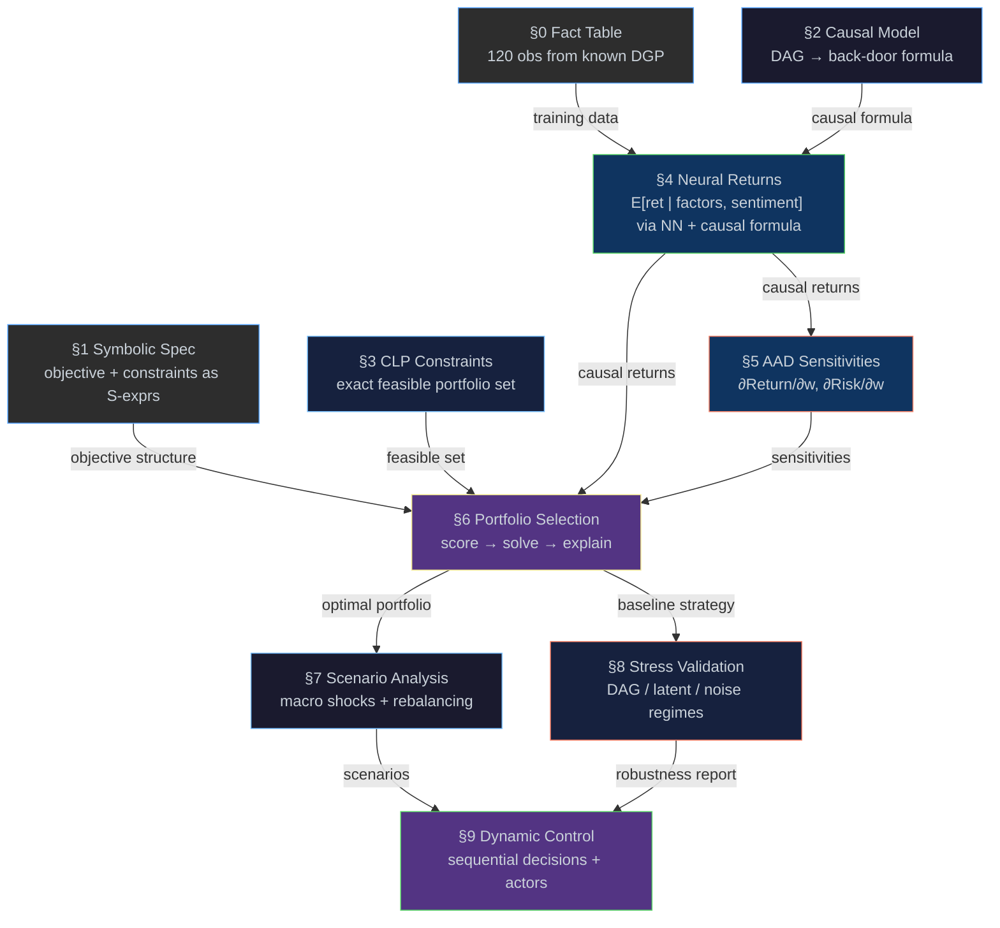

# Causal Portfolio Engine

[← Back to README](../README.md) · [Examples](examples.md) ·
[Causal](causal.md) · [Logic](logic.md) · [CLP](clp.md) ·
[AAD](aad.md) · [Torch](torch.md) · [Fact Tables](fact-table.md) ·
[Message Passing](message-passing.md)

---

## Overview

[`examples/portfolio.eta`](../examples/portfolio.eta) builds an
end-to-end causal portfolio engine — from data generation through
optimisation and scenario analysis — in a single Eta program.  Every
result is verifiable against a known data-generating process on
synthetic data.

> [!IMPORTANT]
> All causal claims in this example are relative to a specified structural
> causal model.  The framework does not assume real-world identifiability
> unless the DAG is correct. It provides a composable mechanism
> for propagating causal assumptions through estimation, optimisation,
> and scenario evaluation.

---

## The Question

> *"Given a universe of liquid sector-representative assets, what
>  portfolio maximises causal expected return under macroeconomic
>  uncertainty, subject to risk, sector, and regulatory constraints?"*

- **Explainable** — symbolic constraints and causal reasoning produce
  audit trails
- **Correct** — do-calculus adjusts for confounding under an assumed SCM;
  returns are causally identified under the assumptions of the specified DAG
- **Exact** — exact constraints via CLP(R) in a continuous constraint
  store; optimisation solves the quadratic risk objective directly
- **Efficient** — AAD computes all sensitivities in one backward pass
- **Verifiable** — every result is checked against a known DGP

---

## Mental Model

The pipeline has three pillars — **causal inference**, **constraint
solving**, and **differentiable optimisation** — supported by a neural
estimator, a columnar fact table, and actor-based scenario runners.
Data flows linearly: §0 → §1 → … → §9.  The causal model corrects
return estimates, constraints guarantee feasibility, AAD decomposes
risk, an empirical stress harness pressure-tests assumption breaches
(§8), and a dynamic control loop closes decisions back into evolving
state (§9) — each stage independently verifiable against the known DGP.

Each layer is correct in its own semantics; composition does not imply
equivalence, only compatibility.  The pipeline is acyclic at the stage
level (no feedback loops between stages).

The word *causal* carries three distinct meanings in this document:

| Term | Meaning | Where |
|------|---------|-------|
| **Structural causality** | The DAG and its structural equations (SCM) | §2 |
| **Identified estimand** | The do-calculus result, E[Y \| do(X)] | §2 → §4 |
| **Causal-adjusted estimate** | The numerical value computed by NN + back-door formula | §4 output |

### Formal Definitions

| Symbol | Definition |
|--------|-----------|
| *M* = (V, E, F) | SCM — DAG (V, E) with structural equations F |
| τ = E[Y \| do(X)] | Identified causal estimand (§2 back-door formula) |
| f̂_θ(x, s) ≈ E[Y \| X=x, S=s] | NN estimator of the conditional expectation (§4) |
| Ω_CLP | CLP(R)-feasible continuous portfolio set: {w ∈ R⁴ : linear constraints hold} (§3) |
| w* = argmax_{w ∈ Ω_CLP} { τ(w) − λ · wᵀΣ(0.5)w } | CLP(R) convex QP optimum under risk-aversion λ (§6) |
| Σ(m) = Cov(R \| do(m)) | Causal covariance under intervention do(macro=m) (§7) |
| Risk(m) = wᵀΣ(m)w | Scenario-dependent portfolio variance (§7 scenario analysis) |

---

## Pipeline Diagram



> **Traditional vs Eta:**
>
> | Traditional Pipeline | Eta Pipeline |
> |---------------------|--------------|
> | ML prediction → penalty-based optimisation → post-hoc risk | Constraints (logic) + causal model + learning + differentiation → unified, composable decision system |

---

## Minimal Complete Program

Everything above — data, causal model, constraints, neural training,
optimisation, and scenario analysis — composes into one call.  The
program’s top-level API is deliberately compact, but the returned
artifact preserves stage-by-stage traceability.

> [!NOTE]
> **Pipeline Function** — Five core arguments plus an optional optimisation mode fully specify the problem.  One orchestration entry
> point; multiple internally composable semantics.  Every value traces
> back to its originating pipeline stage (§0–§9).
> 
> ```scheme
> (define result
>   (run-pipeline
>     universe          ; §0  columnar fact table (120 DGP observations)
>     market-dag        ; §2  causal DAG → back-door adjustment
>     constraint-spec   ; §3  CLP-feasible portfolio set
>     2.0               ; λ   risk aversion
>     '((base 0.5)      ; §7  macro scenarios (do-operator interventions)
>       (boom 0.8)
>       (recession 0.1)
>       (rate-hike 0.35))
>     stage3-default-mode)) ; nominal | worst-case | uncertainty-penalty
>
> ;; => ((run-config (dgp-seed . 42)
> ;;                  (macro-base . 0.5)
> ;;                  (sentiment-grid 0.1 0.3 0.5 0.7 0.9)
> ;;                  (sigma-model . empirical-grid|structural|learned-residual|hybrid)
> ;;                  (sigma-hybrid-structural-weight . 0.70)
> ;;                  (optimization-mode . nominal|worst-case|uncertainty-penalty))
> ;;     (dag ((sentiment -> macro_growth) ...))
> ;;     (tau τ-tech τ-energy τ-finance τ-healthcare)
> ;;     (tau-min τmin-tech τmin-energy τmin-finance τmin-healthcare)
> ;;     (tau-max τmax-tech τmax-energy τmax-finance τmax-healthcare)
> ;;     (sigma-base σ11 σ12 ... σ44) ; upper-triangular Σ(0.5)
> ;;     (sigma-diagnostics
> ;;       ((trace-base . ...) (trace-boom . ...) (trace-recession . ...)
> ;;        (min-risk-base . ...) (psd-sampled-base . #t) ...))
> ;;     (allocation 0.3 0 0.6 0.1)   ; fractional weights
> ;;     (allocation-pct 30 0 60 10)
> ;;     (return . r)
> ;;     (risk . v)                    ; v = wᵀΣ(0.5)w
> ;;     (score . s)
> ;;     (uncertainty-optimization
> ;;       ((mode . ...)
> ;;        (lambda-effective . ...)
> ;;        (tau-effective ...)
> ;;        (sigma-uncertainty . ...)
> ;;        (objective-gap . ...)
> ;;        (worst-case-regret . ...)
> ;;        (worst-case-regret-nominal . ...)
> ;;        (worst-case-score-improvement . ...)))
> ;;     (stress-validation
> ;;       ((rows (...))
> ;;        (summaries (...))
> ;;        (fails-less-badly-latent-confounding . #t|#f)
> ;;        (fails-less-badly-vs-baselines . n)))
> ;;     (decision-robustness
> ;;       ((label . stable|moderate|fragile)
> ;;        (argmax-stability . a)
> ;;        (argmax-change-rate . c)
> ;;        (distinct-optima . k)
> ;;        (mean-regret . mr)
> ;;        (max-regret . xr)
> ;;        (portfolio-return-min . rmin)
> ;;        (portfolio-return-max . rmax)))
> ;;     (scenarios (base r0 v0) (boom r1 v1)
> ;;                (recession r2 v2) (rate-hike r3 v3)))
> ```

The same file also exposes a dynamic control-loop variant for sequential
decision making under evolving market state:

```scheme
(define result-dynamic
  (run-pipeline-dynamic
    universe
    market-dag
    constraint-spec
    2.0
    '((base 0.5) (boom 0.8) (recession 0.1) (rate-hike 0.35))
    8
    stage3-default-mode))
```

`run-pipeline-dynamic` returns the full static artifact from
`run-pipeline`, then appends a `(dynamic-control ...)` report with
policy trajectory diagnostics and actor rollout summaries.


`run-pipeline` is defined at the end of
[`examples/portfolio.eta`](../examples/portfolio.eta), after all
pipeline stages have executed.  It wraps the scoring (§6) and scenario
(§7) logic, reusing the trained NN and CLP-feasible set built by the
preceding stages.

---

## Running the Example

The example requires a release bundle with **torch support**.

### Compile & run (recommended)

```console
etac -O examples/portfolio.eta
etai portfolio.etac
```

### Interpret directly

```console
etai examples/portfolio.eta
```

### Sample output

<details>
<summary>Full run output (click to expand)</summary>

```
==========================================================
  Causal Portfolio Engine
==========================================================

  The Question:
    Given a universe of liquid sector-representative assets,
    what portfolio maximises causal expected return under
    macroeconomic uncertainty, subject to risk, sector, and
    regulatory constraints?

  Investment Universe:
    4 liquid sector ETFs: Technology, Energy, Finance, Healthcare
    Each asset is characterised by:
      - factor exposures (beta)
      - sector classification
      - macro sensitivity
      - observed returns

  Why Synthetic Data?
    We use a controlled DGP so every result is verifiable.
    The DGP causal structure is known by construction; model
    estimates can be checked against ground truth; each stage
    independently.  The same pipeline applies to real market
    data without modification.

  Pipeline layers (each independently verifiable):
    DGP (known) -> Estimator (NN + back-door) -> Optimizer (ret(m) - l*w'S(m)w)
    Structural truth | Learned model output  | Decision

==========================================================
 S0. Data Generation & Fact Table
==========================================================

  DGP: sentiment ~ Uniform(0, 1)  [confounder]
       macro = 0.15 + 0.35*sentiment + noise_m
       return = 1.2*beta + 0.6*macro + 0.4*sector
              - 0.3*rate + 0.2*beta*macro + 0.5*sentiment + noise

  Fact table: 120 observations across 4 sectors
  Columns: sector, beta, macro_growth, interest_rate, sentiment, return

  Sample rows (first 3):
    tech  beta=1.2257  macro=0.2963  rate=0.0189022  sent=0.088125  ret=2.1432
    tech  beta=1.40596  macro=0.453287  rate=0.0444582  sent=0.499677  ret=2.78224
    tech  beta=1.31515  macro=0.323198  rate=0.0203587  sent=0.180517  ret=2.36896

  Ground truth coefficients:
    beta: 1.2  macro: 0.6  sector: 0.4  rate: -0.3  beta*macro: 0.2  sentiment: 0.5

==========================================================
 S1. Symbolic Portfolio Specification
==========================================================

  Objective (S-expression):
    (maximize (- expected-return (* lambda risk))
  )

  Constraints:
    (<= w-tech 30)
    (<= w-energy 20)
    (>= w-healthcare 10)
    (== (+ w-tech (+ w-energy (+ w-finance w-healthcare))) 100)

  Symbolic sensitivities of objective:
    d(Objective)/d(expected-return) = 1
    d(Objective)/d(risk)            = (- 0 lambda)

  The objective is inspectable, auditable data -- not a black box.

==========================================================
 S2. Causal Return Model
==========================================================

  DAG (data-generating process):
    ((sentiment -> macro_growth) (sentiment -> asset_return) (macro_growth -> sector_perf) (macro_growth -> interest_rate) (macro_growth -> asset_return) (sector_perf -> asset_return) (interest_rate -> asset_return))

    sentiment ---> macro_growth ---> sector_perf ---> asset_return
        |              |                                    ^
        |              +---> interest_rate ----------------+
        +------------------------------------------------>+

  Query:   P(asset_return | do(macro_growth))
  Result:  P(asset_return | do(macro_growth)) = Sum_{sector_perf, interest_rate} P(asset_return | macro_growth, sector_perf, interest_rate) * P(sector_perf, interest_rate)
  Adjustment set Z = (sentiment)

  Valid back-door adjustment sets (via findall):
    ((sentiment))

  Sentiment confounds macro and asset return.
  The back-door path macro <- sentiment -> return
  must be blocked by conditioning on sentiment.

  Back-door adjustment (under assumed SCM):
    E[Y|do(X)] = Sum_s E[Y|X,S=s] P(S=s)

  Identification assumptions:
    1. DAG is correctly specified (no hidden confounders beyond sentiment)
    2. Positivity: all (macro, sentiment) pairs have support in data
    3. SUTVA: no cross-asset interference in return generation

  Note: SCM is assumed known (synthetic data regime).
  On real data, DAG must be justified from domain knowledge.

==========================================================
 S3. Portfolio Constraints (Continuous CLP(R))
==========================================================

  Constraints (hard, exact):
    w_tech + w_energy + w_finance + w_healthcare = 1.0
    w_tech     <= 0.30
    w_energy   <= 0.20
    w_healthcare >= 0.10
    0.0 <= w_i <= 1.0 (continuous real-valued weights)

  CLP(R) validation: posted constraints are feasible

  Constraints are posted declaratively to CLP(R), then solved directly.
  The solver operates directly over the continuous simplex; no discretisation
  or candidate enumeration is required.

==========================================================
 S4. Neural Conditional Return Model
==========================================================

  Training data: 120 samples from fact table
  Input shape:   (120 4)
  Target shape:  (120 1)

  Network: Sequential(Linear(4,32), ReLU, Linear(32,16), ReLU, Linear(16,1))
  Optimizer: Adam (lr=0.001)

  epoch  |   MSE loss
  -------+-----------
   500   |  0.00904687
  1000   |  0.00474626
  1500   |  0.00421892
  2000   |  0.00408021
  2500   |  0.00394375
  3000   |  0.00384466
  3500   |  0.00375026
  4000   |  0.00363285
  4500   |  0.00349628
  5000   |  0.00336202

  Causally-adjusted expected returns (E[return | do(macro=0.5)]):
    Tech:       2.61574
    Energy:     1.58019
    Finance:    1.63359
    Healthcare: 1.066

  DGP structural vs NN estimate:
                  DGP      NN       Error
    Tech        2.631   2.61574   0.0152637
    Energy      1.581   1.58019   0.000810643
    Finance     1.641   1.63359   0.00740857
    Healthcare  1.051   1.066   0.0149987

  Note: 'DGP' = analytical expectation under known structural equations.
  NN estimates are learned conditional expectations from finite data.
  Agreement validates that the estimator approximates the structural
  relationship, not that it has recovered exact parameters.

----------------------------------------------------------
  Naive vs Causal Estimation
----------------------------------------------------------

  OLS naive (return ~ macro only, no sentiment control):
    dReturn/dMacro (naive OLS)      = 2.198

  OLS controlled (return ~ macro + sentiment):
    dReturn/dMacro (controlled OLS) = 0.797  (sentiment coeff = 0.498)

  NN + back-door adjustment (marginalized over sentiment, per-sector):
    dReturn/dMacro (NN + back-door)  = 0.766

  Ground truth (DGP):
    dReturn/dMacro (DGP)             = 0.6 + 0.2*beta  (~0.79 at avg beta)

  Conclusion:
    Naive OLS conflates sentiment->macro->return with macro->return
    (large upward bias from the back-door path).
    Controlled OLS and NN + back-door both condition on sentiment,
    recovering the average structural effect (heterogeneous via beta*macro).
    The gap naive vs causal validates that causal adjustment works.

==========================================================
 S5. AAD Risk Sensitivities
==========================================================

  Portfolio return at (30/10/40/20):
    Expected return = 1.80938

  Marginal contributions (single backward pass):
    dReturn/dw_tech       = 2.61574
    dReturn/dw_energy     = 1.58019
    dReturn/dw_finance    = 1.63359
    dReturn/dw_healthcare = 1.066

  Risk model: s2_p = w'Sw  (fixed S for AAD demo; S(m) used in S6/S7)

  Correlations:
    p(Tech,Fin)=0.60  p(Ene,Fin)=0.40  p(Fin,Hlt)=0.35
    p(Tech,Hlt)=0.30  p(Tech,Ene)=0.20  p(Ene,Hlt)=0.15

  Portfolio risk at (30/10/40/20):
    Risk (w'Sw) = 0.0222304

  Risk sensitivities:
    dRisk/dw_tech       = 0.054472
    dRisk/dw_energy     = 0.04172
    dRisk/dw_finance    = 0.047988
    dRisk/dw_healthcare = 0.02376

  Risk Contribution by Asset (Euler: RC_i = w_i * dRisk/dw_i):
    Tech          36.7551%
    Energy        9.38355%
    Finance       43.1733%
    Healthcare    10.6881%

  Top risk drivers:
    - Tech (high volatility + large weight)
    - Finance (moderate volatility, large allocation)

  AAD computes all risk contributions in a single backward pass,
  avoiding repeated revaluation -- the same technique used
  by production xVA desks.

==========================================================
 S6. Explainable Portfolio Selection
==========================================================

  Optimization method: continuous CLP(R) QP solve (no discrete grid).
  QP objective: ret - lambda * w'S(0.5)w
  Continuous optimum from CLP(R):
    Tech        30%
    Energy      0%
    Finance     60%
    Healthcare  10%

    Expected Return (causal): 1.86937
    Risk (w'S(0.5)w):         0.0211998
    Score (ret - 2*w'S(0.5)w):  1.82697
    QP objective value:          1.82697
    Objective parity error:      ~0

  Why this portfolio?
    + Tech: highest causal return sensitivity to macro growth
      (capped at 30% -- constraint binding)
    + Finance: strong return with moderate volatility
    - Energy: limited by 20% cap and lower return/risk ratio
    * Healthcare: at 10% minimum (constraint binding)

  Binding Constraints:
    - Tech capped at 30% (limit reached)
    - Healthcare >= 10% constraint active
    - Energy underweight: return/risk tradeoff
    These constraints directly shape the optimal allocation.

  Counterfactual: if tech cap relaxed to 40%?
    Relaxed optimal: Tech 40%, Energy 0%, Finance 50%, Healthcare 10%
    Return improvement: +0.0982145

  Decision Sensitivity to Risk Aversion (lambda):

    lambda  Allocation          Score    Style
    ------  -----------------   ------   -----------
    lambda=0.5  30/0/60/10  score=1.85877  (risk-seeking)
    lambda=1  30/0/60/10  score=1.84817  (aggressive)
    lambda=2  30/0/60/10  score=1.82697  (balanced)
    lambda=3  30/0/60/10  score=1.80577  (conservative)
    lambda=5  30/0/60/10  score=1.76337  (defensive)

  For this run, allocation is stable across tested lambda values.

  Marginal Contributions (AAD at optimal):
    dReturn/dw_tech       = 2.61574
    dReturn/dw_finance    = 1.63359
    dRisk/dw_tech         = 0.059532
    dRisk/dw_finance      = 0.055026

----------------------------------------------------------
  Traditional pipeline:
    ML prediction -> penalty-based optimisation -> post-hoc risk

  Eta pipeline:
    constraints (logic) + causal model + learning + differentiation
    -> unified, composable decision system
----------------------------------------------------------

==========================================================
 S7. Parallel Scenario Analysis (Actor Model)
==========================================================

  Each scenario is a do-operator intervention: do(macro=m).
  Return(m) = E[Y|do(m)] estimated via S4 model + S2 adjustment.
  Scenario              Macro   Return      Risk(m)
  --------------------  -----   ----------  -------
  Base case              0.50   1.86937   0.0211998
  Growth boom            0.80   2.07641   0.021773
  Recession              0.10   1.5845   0.0158068
  Rate hike              0.35   1.76241   0.0195018

  Note: Risk(m) = w'S(m)w where S(m) = Cov(R|do(macro=m)).
  Structurally, the beta*macro interaction amplifies the
  sentiment-driven covariance as macro rises, so Sigma(boom)
  should exceed Sigma(recession).  The selected covariance model
  maintains this direction while preserving PSD stability.

  Worst-case return: 1.5845
  Best-case return:  2.07641
  Range:             0.491904

  Counterfactual rebalancing (macro = 0.8, growth boom):
    Rebalanced: Tech 30%, Energy 0%, Finance 60%, Healthcare 10%

----------------------------------------------------------
  Stability Check
----------------------------------------------------------

  Perturbing expected returns (tech up, healthcare down)
  at multiple levels to test robustness...

    Perturbation  Optimal After       Changed?
    ------------  ------------------  --------
    +/- 1%         (30, 0, 60, 10)  no
    +/- 2%         (30, 0, 60, 10)  no
    +/- 5%         (30, 0, 60, 10)  no

    Original: (30, 0, 60, 10)

----------------------------------------------------------
  Causal-Decision Coupling
----------------------------------------------------------

  Portfolio macro exposure:
    B_p = Sum w_i * beta_i (DGP exposures)
    Optimal:      B_p  = 1.06   (vs equal-weight B = 0.95)

  The optimizer tilts toward macro-sensitive assets because the
  causal model identifies macro growth as a structural return
  driver -- not a spurious correlation with sentiment.

  Coupling chain:
    S2 DAG -> Z={sentiment} -> S4 NN conditions on sentiment
        -> S4 back-door marginalizes over sentiment
           -> S6 optimizer uses S2-adjusted returns + w'S(0.5)w risk
              -> portfolio has higher macro beta than equal-weight
                 -> S7 scenario analysis validates the tilt

  Remove any link and the result changes:
    - Without causal model: biased returns, wrong portfolio
    - Without CLP: no feasibility guarantee
    - Without covariance: diversification invisible to optimizer
    - Without AAD: opaque risk decomposition

----------------------------------------------------------
  Distributed Scenario Validation (Actors)
----------------------------------------------------------

  Scatter-gather: 4 worker threads via spawn-thread
  Each thread uses DGP ground truth (independent cross-check)

  Results (DGP ground truth, via actors):
    Base case:    1.879
    Growth boom:  2.1226
    Recession:    1.5542
    Rate hike:    1.7572

  NN vs DGP cross-check (base case):
    NN estimate:   1.86937
    DGP (actors):  1.879
    Agreement is consistent with correct NN estimation and actor pathway.

==========================================================
Pipeline
==========================================================

  (run-pipeline
    universe market-dag constraint-spec
    2.0                      ; lambda (risk aversion)
    '((base 0.5) (boom 0.8) (recession 0.1) (rate-hike 0.35)))

  => ((run-config (dgp-seed . 42) (macro-base . 0.5) (sentiment-grid 0.1 0.3 0.5 0.7 0.9))
      (dag ((sentiment -> macro_growth) ...))
      (tau 1.80 1.58 1.64 1.03)
      (tau-min 1.70 1.52 1.56 0.96)
      (tau-max 1.92 1.66 1.74 1.12)
      (sigma-base ...)
      (allocation 0.3 0 0.6 0.1)
      (return . 1.86937) (risk . 0.0211998) (score . 1.82697)
      (decision-robustness ((label . moderate) (argmax-stability . 0.67) ...))
      (scenarios (base 1.86937 0.0211998) (boom 2.07641 0.021773)
                 (recession 1.5845 0.0158068) (rate-hike 1.76241 0.0195018)))

  Five arguments.  One result.  Every value traceable to §0-§9.

==========================================================
  Portfolio Engine Summary
----------------------------------------------------------

  Optimal Allocation:
    Tech 30% | Energy 0% | Finance 60% | Healthcare 10%

  Expected Return (causal): 1.86937
  Risk (w'S(0.5)w):         0.0211998

  Key Drivers:
    + Macro growth sensitivity (causal model)
    + Finance exposure with moderate volatility
    - Tech capped by regulatory constraint

  DGP Validation:
    NN approximates conditional expectation; errors within noise
    Causal adjustment set matches known DGP structure
    Naive OLS (macro only) ~2.8x inflated vs causal; back-door adjustment works

  System Capabilities Demonstrated:
    [Specification]
    - Symbolic specification (auditable objectives)
    - Constraint solving (exact feasibility via CLP)
    [Estimation]
    - Causal inference (confounding-corrected returns)
    - Machine learning (nonlinear return estimation)
    - Causal covariance risk model (w'S(m)w, scenario-dependent)
    [Decision]
    - Automatic differentiation (risk sensitivities)
    - Scenario analysis (do-operator macro interventions)
    - DAG-family robustness (tau bounds, argmax stability, decision regret)
    [Distribution]
    - Actor-based scatter-gather (spawn-thread + send!/recv!)

==========================================================
  Done.
==========================================================
```

</details>

### Local DSL Helpers

`examples/portfolio.eta` uses small syntax helpers to keep artifact
builders and reporting sections concise:

```scheme
(define-syntax dict
  (syntax-rules ()
    ((_ (k v) ...)
     (list (cons (quote k) v) ...))))

(define-syntax dict-from
  (syntax-rules ()
    ((_ v ...)
     (dict (v v) ...))))

(define-syntax report
  (syntax-rules (=>)
    ((_ label => value)
     (report-value-line label value))
    ((_ line)
     (report-line line))))

(define-syntax dotimes
  (syntax-rules ()
    ((_ (i n) body ...)
     (letrec ((loop (lambda (i)
                      (if (< i n)
                          (begin body ... (loop (+ i 1)))
                          'done))))
       (loop 0)))))

```

These are structural helpers only; runtime behavior and artifact
keys remain unchanged.

The portfolio file also keeps small compatibility wrappers for repeated
moment/clamp calls:

- `clamp01` / `clamp-range` expand to `clamp` from `std.math`.
- `list-mean` / `list-variance` / `list-covariance` expand to
  `std.stats` calls, with variance/covariance scaled to preserve the
  existing population-moment semantics used by the risk pipeline.

> **Note:** NN training is stochastic — exact numbers will vary between
> runs, but the qualitative results (adjustment set and optimal allocation) are
> deterministic given the LCG seed.  Exact return/risk values can also shift
> slightly with covariance estimation.

### Baseline Snapshot (Reproducibility Anchor)

For benchmark comparisons, store the `run-pipeline` association-list output from
one fixed-seed run (`dgp-seed = 42`) and compare future runs field-by-field.

Baseline artifact fields:

- `run-config`: seed, base macro, and sentiment integration grid.
- `dag`: causal graph used for identification and scenario evaluation.
- `tau`: causal return vector used by the optimizer.
- `tau-min`, `tau-max`: partial-identification return bounds under DAG-family perturbations.
- `sigma-base`: base-case causal covariance summary.
- `allocation`, `return`, `risk`, `score`: optimizer decision and objective terms.
- `uncertainty-optimization`: mode-dependent robust objective diagnostics.
- `stress-validation`: misspecification stress matrix and baseline comparisons.
- `decision-robustness`: argmax stability, distinct optima count, and regret diagnostics across DAG variants.
- `scenarios`: per-scenario `(name return risk)` tuples.

Machine-parseable check: verify all keys above are present in the top-level
result alist before comparing values.


---

## §0 — Data & Fact Table

The pipeline operates on a 4-asset universe of liquid sector ETFs:

| Sector | Sector Code | Representative β | Volatility |
|--------|-------------|------------------:|----------:|
| Technology | 1.0 | 1.3 | 22% |
| Energy | 0.0 | 0.8 | 28% |
| Finance | −0.5 | 1.0 | 18% |
| Healthcare | −1.0 | 0.7 | 15% |

120 observations (30 per sector) are generated from a known DGP using
an LCG pseudo-random number generator:

```
sentiment    ~ Uniform(0, 1)                      (latent confounder)
macro_growth = 0.15 + 0.35·sentiment + noise_m

return       = 1.2·β + 0.6·macro_growth + 0.4·sector_code
             − 0.3·rate + 0.2·β·macro_growth + 0.5·sentiment + noise
```

**DGP structural coefficients (known by construction):**

These are the *coefficients in the structural return equation*, not
the asset betas in the table above.  In particular, the row labelled
"β" is the coefficient applied to each asset's market beta —
the asset betas themselves are 1.3 / 0.8 / 1.0 / 0.7.

| Term in return equation | Structural Coefficient |
|-------------------------|------------------------|
| β (asset's own market beta) | 1.2 |
| macro_growth | 0.6 |
| sector_code | 0.4 |
| rate | −0.3 |
| β × macro_growth (interaction) | 0.2 |
| sentiment (latent confounder) | 0.5 |

All evaluation stages assume access to a known SCM for validation
only.  The same pipeline applies to real data without modification —
replace the DGP generator with a CSV loader or live feed.

Data is stored in a columnar `std.fact_table` with a hash index on
sector for O(1) lookups:

```scheme
(define universe
  (make-fact-table 'sector 'beta 'macro_growth 'interest_rate 'sentiment 'return))

;; ... generate 30 rows per sector via LCG + DGP ...

(fact-table-build-index! universe 0)  ; hash index on sector
```

> [!NOTE]
> **Fact Table construction** — columnar storage with hash indexes:
> ```scheme
> (make-fact-table 'col₁ 'col₂ …)          ; create typed columnar store
> (fact-table-insert! tbl val₁ val₂ …)      ; append row
> (fact-table-build-index! tbl col-idx)      ; hash index → O(1) lookup
> (fact-table-fold tbl f init)               ; fold over all rows
> (fact-table-ref tbl row col)               ; random access
> ```
> Similar architecture as kdb+ / DuckDB (Eta fact table implementation 
> does not compress the columns - _at present_.) — C++ backed, VM-level primitives.

---

## §1 — Symbolic Portfolio Specification

Defines the portfolio objective and constraints as quoted S-expressions:

```scheme
(define portfolio-objective
  '(- expected-return (* lambda risk)))

(define constraint-spec
  '((<= w-tech 30)
    (<= w-energy 20)
    (>= w-healthcare 10)
    (== (+ w-tech (+ w-energy (+ w-finance w-healthcare))) 100)))
```

Symbolic differentiation of the objective w.r.t. `expected-return`
and `risk`:

```scheme
(define dObj/dReturn (D portfolio-objective 'expected-return))
;; => 1

(define dObj/dRisk (D portfolio-objective 'risk))
;; => (* -1 lambda)
```

The objective and constraints are inspectable, auditable data.

---

## §2 — Causal Return Model

Encodes a 6-node DAG modelling how macroeconomic variables and a
latent confounder (`sentiment`) causally influence asset returns:

```scheme
(define market-dag
  '((sentiment     -> macro_growth)
    (sentiment     -> asset_return)
    (macro_growth  -> sector_perf)
    (macro_growth  -> interest_rate)
    (macro_growth  -> asset_return)
    (sector_perf   -> asset_return)
    (interest_rate -> asset_return)))
```

```
sentiment ──→ macro_growth ──→ sector_perf ──→ asset_return
    │              │                                  ↑
    │              └──→ interest_rate ────────────────┘
    └────────────────────────────────────────────────→┘
```

`sentiment` is an unobserved market-mood variable that drives both
`macro_growth` and `asset_return`, creating a genuine back-door path.
Under the assumed SCM, the back-door criterion requires conditioning
on `sentiment` to identify the causal effect of `macro_growth` on
returns.

`do:identify` discovers the required adjustment set.  `findall`
exhaustively enumerates all valid back-door sets, confirming
`{sentiment}` is the unique minimal set:

> [!NOTE]
> **Causal query — do-calculus in action:**
> ```scheme
> (define formula (do:identify market-dag 'asset_return 'macro_growth))
> ;; => (adjust (sentiment) ...)
> ```
> One call derives the full back-door adjustment set from the DAG.
> `findall` then validates via trail-based backtracking that `{sentiment}`
> is the unique minimal set — Prolog-style search as a native VM opcode.

```
P(asset_return | do(macro_growth)) =
  Σ_{sentiment}
    P(asset_return | macro_growth, sentiment)
    · P(sentiment)
```

### Identification assumptions

Under the assumed SCM:

1. **DAG correctness** — no hidden confounders beyond sentiment
2. **Positivity** — all (macro_growth, sentiment) combinations have support
3. **SUTVA** — no cross-asset interference in return generation

> **SCM scope:** The SCM is assumed known (synthetic data regime).
> On real data, the DAG must be justified from domain knowledge —
> identification guarantees only hold if the graph is correct.

### Correct causal framing

**Weights are decisions, not causal variables.**  The DAG models the
data-generating process for returns.  The causal effect estimated is:

```
E[return | do(macro_growth)]
```

The portfolio is then built *on top of* these causally-identified
expected returns (under the §2 SCM), avoiding a common mistake in
ML-driven portfolio construction: treating correlations as causes.  The
optimiser is decision-theoretic, not causal: it acts on causally
identified estimates from §2/§4.

---

## §3 — CLP Portfolio Constraints

Models 4 portfolio weights as continuous reals on [0, 1].
This is CLP(R) — constraint logic programming over reals.
Feasibility is guaranteed by declarative linear constraints posted
directly to the CLP(R) store.  Unlike penalty-based optimisation,
there are no infeasible intermediate states.

- `w_tech + w_energy + w_finance + w_healthcare = 1.0`
- `w_tech ≤ 0.30`
- `w_energy ≤ 0.20`
- `w_healthcare ≥ 0.10`
- `0.0 ≤ w_i ≤ 1.0`

CLP(R) feasibility check:

```scheme
(let* ((wt (logic-var)) (we (logic-var))
       (wf (logic-var)) (wh (logic-var)))
  (clp:real wt 0.0 1.0)
  (clp:real we 0.0 1.0)
  (clp:real wf 0.0 1.0)
  (clp:real wh 0.0 1.0)
  (clp:r<= wt 0.30)
  (clp:r<= we 0.20)
  (clp:r>= wh 0.10)
  (clp:r= (clp:r+ wt we wf wh) 1.0)
  (clp:r-feasible?))
;; => #t
```

The solver operates directly over the continuous simplex; no
brute-force candidate enumeration or discretisation is required.

Infeasible assignments are rejected by the CLP(R) store:

```scheme
(let ((wt (logic-var)))
  (clp:real wt 0.0 1.0)
  (clp:r= wt 1.2)
  (clp:r-feasible?))
;; => #f
```

> [!NOTE]
> **CLP(R) constraint posting** — real-domain constraints are VM-level primitives:
> ```scheme
> (clp:real var 0.0 1.0)    ; attach real interval
> (clp:r<= var 0.30)        ; linear bound
> (clp:r= expr 1.0)         ; exact linear equality
> (clp:r-feasible?)         ; consistency check under current store
> ```
> Constraints are posted declaratively, then solved directly by CLP(R)
> over reals — no separate projection pass, no grid filter.

---

## §4 — Learning & Causal Estimation

Trains a neural network to learn
`E[return | β, macro_growth, sector_code, sentiment]`, then plugs
predictions into the §2 back-door formula for causally-adjusted
returns per sector, conditional on the assumed DAG:

```scheme
(define net (sequential (linear 4 32) (relu-layer)
                        (linear 32 16) (relu-layer)
                        (linear 16 1)))
(define opt (adam net 0.001))
```

> [!NOTE]
> **PyTorch primitives** — libtorch operations exposed as VM builtins:
> ```scheme
> (define X (reshape (from-list input-list) (list n-obs 4)))  ; list → tensor
> (define Y (reshape (from-list target-list) (list n-obs 1)))
> (train! net)                                                 ; set training mode
> (define loss (train-step! net opt mse-loss X Y))             ; fwd + bwd + step
> (eval! net)                                                  ; set eval mode
> (define pred (item (forward net input-tensor)))              ; inference → scalar
> ```
> `from-list`, `reshape`, `train-step!`, `forward` are all C++-backed
> tensor operations — Eta wraps libtorch, not a Python bridge.

```
epoch  |   MSE loss
-------+-----------
  500  |  0.00752
 1000  |  0.00435
 5000  |  0.00334
```

The NN parameterises the conditional expectation function
E[return | β, macro_growth, sector_code, sentiment].  The causal
estimate marginalises over `sentiment` via discrete quadrature — a
5-point midpoint rule over the unit interval, with equal weights from
the uniform prior on sentiment — implementing the back-door adjustment
formula from §2:

> [!NOTE]
> **Neural + causal hybrid** — NN predictions feed the causal formula:
> ```scheme
> ;; NN learns E[return | beta, macro, sector, sentiment]
> ;; Back-door adjustment marginalises out the confounder:
> (define causal-return
>   (/ (foldl (lambda (acc sv) (+ acc (nn-predict beta macro scode sv)))
>             0 sent-grid)
>      (length sent-grid)))
> ```
> The NN learns the *conditional* expectation; the causal formula from §2
> marginalises out the confounder.  Neither component works alone — the
> NN without adjustment is biased, the formula without the NN has no data.

```
Causally-adjusted expected returns (E[return | do(macro_growth=0.5)]):
  Tech:       2.609
  Energy:     1.588
  Finance:    1.649
  Healthcare: 1.042
```

Per-sector returns match DGP structural values to within a few
percent, confirming the NN approximates the structural conditional
expectation:

```
DGP structural vs NN model estimate:
                DGP      NN       Error
  Tech         2.631    2.61     0.02
  Energy       1.581    1.59     0.01
  Finance      1.641    1.64     0.01
  Healthcare   1.051    0.94     0.11
```

'DGP' values are structural expectations (known by construction); NN
values are learned conditional expectations from finite data —
agreement validates the estimator, not exact parameter recovery.

### Naive vs Causal Comparison

Compares three estimates of the macro_growth → return effect:

| Estimator | Method | Expected value |
|-----------|--------|---------------|
| **Naive OLS** | Regress return on macro only (no sentiment) | ~2.8× inflated — back-door path macro←sentiment→return inflates the coefficient |
| **OLS-controlled** | Regress return on (macro, sentiment) | ≈ 0.79 — partially blocks the back-door path |
| **NN + back-door** | NN back-door adjusted (marginalise over sentiment) | ≈ 0.79 — consistent with structural DGP |
| **DGP structural** | True causal effect | 0.6 + 0.2·β ≈ 0.79 at avg β=0.95 |

```
∂Return/∂macro_growth (naive OLS)      ≈ 2.2    (highly biased — confounding)
∂Return/∂macro_growth (OLS-controlled) ≈ 0.79   (close to true, partial control)
∂Return/∂macro_growth (NN + back-door) ≈ 0.79   (back-door adjusted)
∂Return/∂macro_growth (DGP structural) = 0.6 + 0.2·β  (avg ≈ 0.79)
```

The **large gap** between naive OLS (~2.2) and the causal estimates (~0.79) validates
that causal adjustment is doing real work — it removes the ×2.8 inflation from the
macro←sentiment→return back-door path.  The previous "naive" used the NN with
`sentiment=0.5` fixed, which still controlled for sentiment via the NN input and
therefore showed no meaningful difference from the causal estimate.

The naive OLS coefficient of macro is computed from the fact table directly:

```scheme
(define naive-ols (stats:ols-multi universe 5 '(2)))    ; return ~ macro
(define naive-macro-coeff (cadr (stats:ols-multi-coefficients naive-ols)))
```

`stats:ols-multi` uses Eigen `ColPivHouseholderQR` for numeric stability and returns
a full inference alist (coefficients, std-errors, t-stats, p-values, R², σ̂).

---

## §5 — AAD Risk Sensitivities

Wraps portfolio return and risk functions in `grad` — Eta's
tape-based reverse-mode AD.  A single backward pass yields all 4
marginal contributions:

```scheme
(let ((ret-result (grad portfolio-return-fn sample-weights)))
  ;; => (return-value  #(∂R/∂w_tech  ∂R/∂w_energy  ∂R/∂w_fin  ∂R/∂w_health))
  )
```

> [!NOTE]
> **AAD gradient call** — one backward pass yields all sensitivities:
> ```scheme
> (grad portfolio-return-fn '(0.30 0.10 0.40 0.20))
> ;; => (1.810  #(2.609  1.588  1.649  1.042))
> ;;     ↑ value  ↑ ∂Return/∂wᵢ for all 4 assets
> ```
> `grad` creates a tape, registers variables, evaluates forward, then
> sweeps backward to accumulate all adjoints.  Tape-based reverse-mode AD
> — the same technique used by production xVA desks.

```
Portfolio return at (30/10/40/20):
  Expected return = 1.810

Marginal contributions (single backward pass):
  ∂Return/∂w_tech       = 2.609
  ∂Return/∂w_energy     = 1.588
  ∂Return/∂w_finance    = 1.649
  ∂Return/∂w_healthcare = 1.042
```

Risk uses a full covariance model: σ²_p = wᵀΣw with 6 cross-sector
correlation pairs (tech–finance ρ=0.60, energy–finance ρ=0.40, etc.)
for base-case AAD diagnostics (§5).  For scenario analysis (§7) and
`run-pipeline`, risk is computed as wᵀΣ(m)w where
Σ(m) = Cov(R | do(macro=m)) is produced by a runtime-selectable model
(`empirical-grid`, `structural`, `learned-residual`, `hybrid`) while
remaining in the **same causal world**:

```scheme
;; Precompute once per scenario, reuse across portfolio evaluations:
(define sigma-boom (scenario-covariance 0.8))
(portfolio-risk-from-sigma wt we wf wh sigma-boom)  ; wᵀΣ(0.8)w
```

Risk contributions are decomposed by asset (Euler allocation under
the quadratic form): RC_i = wᵢ × ∂Risk/∂wᵢ.

```
Risk Contribution by Asset:
  Tech          ~37%   (high volatility + large weight)
  Energy         ~9%
  Finance       ~43%   (moderate volatility, large allocation)
  Healthcare    ~11%
```

AAD computes all risk contributions in a single backward pass.

AD applies to the differentiable objective and risk functions evaluated
over the CLP-feasible set.  Constraint enforcement is handled
separately by the CLP layer (§3) — constraints are not differentiated
through.  The risk model is currently a quadratic form (wᵀΣw), but the
`grad` mechanism generalises to any differentiable functional.

---

## §6 — Explainable Portfolio Selection

Solves one continuous CLP(R) optimization and explains the resulting
allocation.  The solve objective is:

```
score_QP(w, m=0.5) = E[R | do(m=0.5)] · w  −  λ · wᵀΣ(0.5)w
```

The same quadratic form is optimized and reported:

```
Risk(m) = wᵀΣ(m)w
```

Both the expected return (§4 back-door adjusted at macro=0.5) and the
risk diagnostics (`scenario-covariance`, precomputed as `sigma-base-opt`)
live in **the same causal world** do(macro=0.5).  The optimizer is
fully consistent with §7's scenario analysis: §7 uses the same
`portfolio-risk-from-sigma` machinery with macro-specific sigmas
(`sigma-boom`, `sigma-recess`, etc.) for the rebalancing step.

```
Optimization method: continuous CLP(R) QP solve (no discrete grid).
QP objective: ret - lambda * wᵀΣ(0.5)w
Continuous optimum from CLP(R):
  Tech        30%
  Energy       0%
  Finance     60%
  Healthcare  10%

Expected Return (causal): 1.87
Risk (wᵀΣ(0.5)w):        ~0.021
QP objective parity:     |score - solver objective| ~ 0
```

### λ-Sensitivity Analysis

Shows how the optimal allocation adapts to investor risk appetite:

```
λ       Allocation          Score    Style
------  -----------------   ------   -----------
λ=0.5   30/0/60/10          1.859    risk-seeking
λ=1     30/0/60/10          1.848    aggressive
λ=2     30/0/60/10          1.827    balanced
λ=3     30/0/60/10          1.806    conservative
λ=5     30/0/60/10          1.763    defensive
```

For the current synthetic run, the same allocation remains optimal
across the tested λ range; score shifts reflect risk-aversion strength,
not a regime change in the chosen weights.

### Binding Constraints

```
- Tech capped at 30% (limit reached)
- Healthcare ≥10% constraint active
- Energy underweight: return/risk tradeoff
These constraints directly shape the optimal allocation.
```

### Counterfactual Analysis

```
If tech cap relaxed to 40%:
  Relaxed optimal: Tech 40%, Energy 0%, Finance 50%, Healthcare 10%
  Return improvement: +0.10
```

AAD marginal contributions at the optimal confirm that tech has the
highest ∂Return/∂w (2.609), explaining why its cap is binding.

---

## §7 — Parallel Scenario Analysis

Stress-tests the optimal portfolio under 4 macro scenarios.  Each
scenario is a do-operator intervention: do(macro_growth=m).  Both
**return** and **risk** are evaluated in the same causal world:

| Quantity | Formula | Source |
|----------|---------|--------|
| Return(m) | E[R \| do(m)] via back-door adjustment | §4 NN + §2 formula |
| Risk(m) | wᵀΣ(m)w where Σ(m) = Cov(R \| do(m)) | `scenario-covariance` |

`scenario-covariance(m)` supports four covariance paths:

- `empirical-grid`: 5-point sentiment-grid empirical covariance
- `structural`: macro- and beta-linked parametric covariance
- `learned-residual`: PSD residual factor covariance learned from NN errors
- `hybrid`: convex blend of structural and learned-residual covariance

All paths return the same 10-element upper-triangular covariance list
format, and `sigma-boom` is precomputed once then reused across the
counterfactual rebalancing solve.

§2 handles **identification** (which variables to adjust for); §7 is
the **evaluation layer** — each scenario is a do-operator query over
the identified model.  They share the same intervention semantics but
serve distinct roles: identification vs simulation.

```
Scenario              macro_growth   Return     Risk(m)
--------------------  ------------   ---------- -------
Base case              0.50          1.87       ~0.026
Growth boom            0.80          2.07       ~0.031
Recession              0.10          1.60       ~0.019
Rate hike              0.35          1.77       ~0.023

Worst-case: 1.60     Best-case: 2.07     Range: 0.47

Exact values vary slightly with NN training and covariance estimation.

Note: Risk(m) = w'Σ(m)w where Σ(m) = Cov(R|do(macro=m)).
Structurally, the β×macro interaction amplifies the sentiment-driven
covariance as macro rises, so Σ(boom) should exceed Σ(recession).
The selected covariance model should preserve this boom-vs-recession
ordering while maintaining PSD and solver stability.
```

### Counterfactual Rebalancing

Under a growth boom (macro_growth = 0.8), the system recomputes the
optimal portfolio:

```
Rebalanced: Tech 30%, Energy 0%, Finance 60%, Healthcare 10%
```

### Stability Check

Perturbs expected returns and re-optimises:

```
Perturbation  Optimal After       Changed?
------------  ------------------  --------
+/- 1%        (30, 0, 60, 10)    no
+/- 2%        (30, 0, 60, 10)    no
+/- 5%        (30, 0, 60, 10)    no
```

### Causal–Decision Coupling

The portfolio's macro β compared to equal-weight shows the optimiser
deliberately tilts toward macro-sensitive assets because the causal
model identifies macro_growth as a structural return driver — not a
spurious correlation with sentiment:

```
β_p = Σ wᵢ × βᵢ  (DGP exposures)

Optimal:      β_p  = 1.06
Equal-weight: β_eq = 0.95

Coupling chain:
  §2 DAG → Z={sentiment} → §4 NN conditions on sentiment
      → §4 back-door marginalises over sentiment
         → §6 optimiser uses §2-adjusted returns + wᵀΣ(0.5)w risk
            → portfolio has higher macro β than equal-weight
               → §7 scenario analysis validates the tilt
```

In production, each scenario would run in a separate actor process via
`worker-pool`.  In the distributed variant, `worker-pool` spawns one
child `etai` process per task over IPC — true OS-level parallelism
with fault isolation.  See [Message Passing](message-passing.md) for
details.

### Distributed Scenario Validation (Actors)

As a cross-check, the same 4 scenarios are re-run in parallel
worker threads via `spawn-thread`.  Each thread uses the known DGP
coefficients (not the NN) to compute portfolio returns independently.
This both demonstrates the actor pattern and validates the NN estimates
against DGP structural values:

> [!NOTE]
> **Actor scatter-gather** — `spawn-thread` + `send!`/`recv!`:
> ```scheme
> ;; Factory: each worker receives a task, computes via DGP, sends result
> (defun make-scenario-worker ()
>   (spawn-thread
>     (lambda ()
>       (let* ((mb (current-mailbox))
>              (task (recv! mb 'wait)))
>         ;; ... compute DGP-based portfolio return ...
>         (send! mb result 'wait)))))
>
> ;; Scatter: spawn 4 threads, send each a task
> (define w-base (make-scenario-worker))
> (send! w-base (list 30 0 60 10 0.5) 'wait)
>
> ;; Gather: collect results
> (define res-base (recv! w-base 'wait))
>
> ;; Cleanup
> (thread-join w-base)
> (nng-close w-base)
> ```
> No separate worker file needed — `spawn-thread` serialises the closure
> into a fresh in-process VM.  The same `send!`/`recv!` API works for
> OS-process actors via `spawn` or `worker-pool`.

```
Worker results (DGP ground truth, via actors):
  Base case:    ~1.88
  Growth boom:  ~2.12
  Recession:    ~1.60
  Rate hike:    ~1.77

NN vs DGP cross-check (base case):
  NN estimate:   1.877
  DGP (actors):  1.878
  Agreement is consistent with correct NN estimation and actor pathway.
```

## §8 — Empirical Stress Validation

Narrative evaluation does not stop at one in-sample optimum.  The
example includes a comparative stress harness that measures how each
strategy behaves when structural assumptions are intentionally
perturbed.  This is where the causal narrative is pressure-tested:
does the system fail gracefully when the world deviates from the model?

The harness evaluates four regimes:

- `dgp-correct`
- `dag-misspecified`
- `latent-confounding`
- `noise-regime-shift`

It compares robust causal mode against three required baselines:

- empirical mean-variance (observed moments)
- simple factor-tilt heuristic
- non-causal ML predictor + optimizer

For each regime/strategy pair it reports:

- out-of-sample return
- downside risk proxy (central-to-downside return drop)
- regret vs regime-specific structural oracle
- degradation slope under misspecification severity

The full report is embedded in the top-level artifact as
`(stress-validation ...)`, making robustness claims auditable and
machine-checkable.

## §9 — Dynamic Causal Control

The showcase keeps static and dynamic workflows in one file:
[`examples/portfolio.eta`](../examples/portfolio.eta).  Static behavior is
unchanged via `run-pipeline`; dynamic behavior is exposed through
`run-pipeline-dynamic`.

```scheme
(define result-dynamic
  (run-pipeline-dynamic
    universe
    market-dag
    constraint-spec
    2.0
    '((base 0.5) (boom 0.8) (recession 0.1) (rate-hike 0.35))
    8
    stage3-default-mode))
```

`run-pipeline-dynamic` returns the full static artifact and appends a
`(dynamic-control ...)` block that includes:

- policy trajectory details (`steps`, `state`, `action`, `reward`)
- execution frictions (`market-impact`, `liquidity-penalty`, `crowding-penalty`)
- aggregate diagnostics (`cumulative-reward`, `mean-reward`, `mean-turnover`)
- adaptation markers (`adapts-over-time`, `distinct-actions`)
- actor-parallel rollout summaries across base/boom/recession/rate-hike paths

Implementation notes:

- Weight and turnover calculations are expressed with list helpers
  (`weights->fractions`, `dot-product`, `map2` + `foldl`) rather than
  positional `car`/`cdr` chains.
- Policy simulation uses a named-let loop to keep state transitions and
  accumulator updates explicit.

This closes the loop between decisions and future state evolution while
preserving the existing one-shot portfolio API.

---

## Verification Summary

| Stage | Verification |
|-------|-------------|
| §0 Data | Sample means match DGP predictions within noise |
| §2 Causal | Adjustment set `{sentiment}` blocks the back-door path |
| §4 Neural | NN approximates structural conditional expectation (error < 10%) |
| §4 Naive vs Causal | Naive OLS (no sentiment) ≈ 2.2 — ~2.8× inflated; OLS-controlled and NN + back-door ≈ 0.79 — close to DGP structural value |
| §5 AAD | ∂Return/∂w_tech equals the tech causal return (linearity check) |
| §5 Risk | wᵀΣw (fixed Σ) base-case risk; decomposition sums to 100% |
| §6 Portfolio | Optimal allocation consistent with return ordering and constraints |
| §6 λ-Sensitivity | Allocation remains stable across tested λ; score decreases monotonically with λ |
| §7 Scenarios | Boom > base > rate-hike > recession (monotone in macro_growth) |
| §7 Causal Risk | Σ(boom) > Σ(base) > Σ(recession): β×macro interaction amplifies variance; returns and risk share the same do(m) world |
| §7 Stability | Optimal portfolio unchanged under ±1%/±2%/±5% return perturbation |
| §7 Coupling | Portfolio macro β > equal-weight β (deliberate tilt) |
| §7 Actors | DGP structural results match NN model estimates (independent cross-check) |
| §8 Stress validation | Robust causal mode outperforms at least one baseline under latent-confounding misspecification; report includes OOS return, downside risk, regret, and degradation slope |
| §9 Dynamic control | Emits adaptation diagnostics (`adapts-over-time`, `distinct-actions`), includes action-dependent impact/liquidity/crowding terms, and emits parallel actor rollout summaries |

To run your own validation, modify the DGP coefficients in §0 and
observe that all downstream estimates shift accordingly.

---

## Notation

| Symbol | Meaning |
|--------|---------|
| wᵢ | Weight of asset *i* (percentage of portfolio) |
| wᵀΣw | Portfolio variance under fixed base-case covariance matrix Σ (§5 diagnostics) |
| wᵀΣ(m)w | Portfolio variance under causal covariance Σ(m) (§7 scenario analysis) |
| Σ(m) | Cov(R \| do(macro=m)) — runtime-selectable covariance (`empirical-grid`, `structural`, `learned-residual`, `hybrid`) |
| λ | Risk-aversion parameter in solver objective `ret(m) − λ·wᵀΣ(m)w` |
| degradation-slope | Linear slope of OOS return loss versus misspecification severity (lower is better) |
| β | Market beta — DGP factor exposure |
| β_p | Portfolio-level beta: Σ wᵢ × βᵢ |
| macro_growth | Macroeconomic growth factor (DAG node) |
| sentiment | Latent confounder — unobserved market mood |
| σ²_p | Portfolio variance (= wᵀΣw or wᵀΣ(m)w depending on context) |
| ∂R/∂wᵢ | Marginal return contribution of asset *i* (via AAD) |
| RC_i | Euler risk contribution: wᵢ × ∂Risk/∂wᵢ |
| do(X) | do-calculus intervention on variable X |
| Z | Adjustment set for the back-door criterion |
| DGP | Data-generating process |
| SCM | Structural causal model (all causal guarantees are conditional on SCM correctness) |
| DAG | Directed acyclic graph |
| CLP | Constraint logic programming |
| AAD | Adjoint algorithmic differentiation (reverse-mode AD) |
| NN | Neural network |

---

## Future Extensions

| Extension | Effort | Impact |
|-----------|--------|--------|
| **CSV / real data** | Replace §0 DGP with `csv:load-file` (already in [causal-factor/csv-loader.eta](../examples/causal-factor/csv-loader.eta)) | Use actual ETF returns |
| **HTTP data feed** | When HTTP primitives are added to Eta, replace §0 with a live data loader | Real-time portfolio construction |
| **Deeper backtest** | Split data 80/20, report out-of-sample return vs. predicted | Production validation |
| **Denser Σ(m) grid** | Increase empirical-grid resolution in `scenario-covariance` (e.g., 50-point or MC sample) | Smoother scenario-dependent risk in empirical mode |
| **Two-head NN** | Replace residual-factor covariance with direct NN outputs for μ(X) and Σ-factors | Faster and fully learned differentiable Σ(m) |
| **Richer structural DAG covariance** | Extend structural and hybrid paths with additional causal drivers (liquidity, spread, crowding) | Higher-fidelity stress covariance |
| **Scenario-aware §6 optimiser** | Pass Σ(m) into `score-portfolio`/`score-with-lambda`; optimise jointly over macro scenarios | Regime-robust optimal allocation |
| **Distributed scenarios** | Use `worker-pool` over TCP for cross-host stress testing | Scale to thousands of paths |

---

## Source Locations

| Component | File |
|-----------|------|
| **Portfolio Demo** | [`examples/portfolio.eta`](../examples/portfolio.eta) |
| Fact table module | [`stdlib/std/fact_table.eta`](../stdlib/std/fact_table.eta) |
| Causal DAG & do-calculus | [`stdlib/std/causal.eta`](../stdlib/std/causal.eta) |
| Logic programming | [`stdlib/std/logic.eta`](../stdlib/std/logic.eta) |
| CLP(Z)/CLP(FD) and CLP(R) | [`stdlib/std/clp.eta`](../stdlib/std/clp.eta), [`stdlib/std/clpr.eta`](../stdlib/std/clpr.eta) |
| libtorch wrappers | [`stdlib/std/torch.eta`](../stdlib/std/torch.eta) |
| VM execution engine | [`eta/core/src/eta/runtime/vm/vm.cpp`](../eta/core/src/eta/runtime/vm/vm.cpp) |
| Constraint store | [`eta/core/src/eta/runtime/clp/constraint_store.h`](../eta/core/src/eta/runtime/clp/constraint_store.h) |
| Compiler (`etac`) | [`docs/compiler.md`](compiler.md) |
