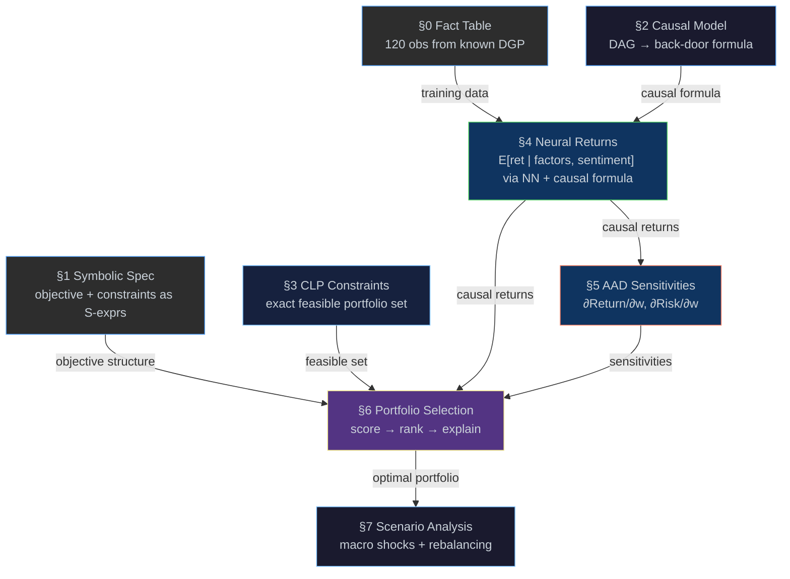

# Causal Portfolio Engine

[← Back to README](../README.md) · [Examples](examples.md) ·
[Causal](causal.md) · [Logic](logic.md) · [CLP](clp.md) ·
[AAD](aad.md) · [Torch](torch.md) · [Fact Tables](fact-table.md) ·
[Message Passing](message-passing.md)

---

## Overview

[`examples/portfolio.eta`](../examples/portfolio.eta) builds an
end-to-end causal portfolio engine — from data generation through
optimisation and scenario analysis — in a single Eta program.  Every
result is verifiable against a known data-generating process on
synthetic data.

> [!IMPORTANT]
> All causal claims in this example are relative to a specified structural
> causal model.  The framework does not assume real-world identifiability
> unless the DAG is correct. It provides a composable mechanism
> for propagating causal assumptions through estimation, optimisation,
> and scenario evaluation.

---

## The Question

> *"Given a universe of liquid sector-representative assets, what
>  portfolio maximises causal expected return under macroeconomic
>  uncertainty, subject to risk, sector, and regulatory constraints?"*

- **Explainable** — symbolic constraints and causal reasoning produce
  audit trails
- **Correct** — do-calculus adjusts for confounding under an assumed SCM;
  returns are causally identified given a specified DAG
- **Exact** — finite-domain CLP validates constraints at unification
  time; no penalty approximations
- **Efficient** — AAD computes all sensitivities in one backward pass
- **Verifiable** — every result is checked against a known DGP

---

## Mental Model

The pipeline has three pillars — **causal inference**, **constraint
solving**, and **differentiable optimisation** — supported by a neural
estimator, a columnar fact table, and actor-based scenario runners.
Data flows linearly: §0 → §1 → … → §7.  The causal model corrects
return estimates, constraints guarantee feasibility, and AAD decomposes
risk — each stage independently verifiable against the known DGP.

Each layer is correct in its own semantics; composition does not imply
equivalence, only compatibility.  The pipeline is strictly acyclic —
no iterative coupling between stages.

The word *causal* carries three distinct meanings in this document:

| Term | Meaning | Where |
|------|---------|-------|
| **Structural causality** | The DAG and its structural equations (SCM) | §2 |
| **Identified estimand** | The do-calculus result, E[Y \| do(X)] | §2 → §4 |
| **Causal-adjusted estimate** | The numerical value computed by NN + back-door formula | §4 output |

### Formal Definitions

| Symbol | Definition |
|--------|-----------|
| *M* = (V, E, F) | SCM — DAG (V, E) with structural equations F |
| τ = E[Y \| do(X)] | Identified causal estimand (§2 back-door formula) |
| f̂_θ(x, s) ≈ E[Y \| X=x, S=s] | NN estimator of the conditional expectation (§4) |
| Ω_CLP | CLP-feasible portfolio set: {w ∈ Z⁴ : constraints hold} (§3) |
| w* = argmax_{w ∈ Ω_CLP} { τ(w) − λ · wᵀΣw } | Optimal portfolio under risk-aversion λ (§6) |

---

## Pipeline Diagram



> **Traditional vs Eta:**
>
> | Traditional Pipeline | Eta Pipeline |
> |---------------------|--------------|
> | ML prediction → penalty-based optimisation → post-hoc risk | Constraints (logic) + causal model + learning + differentiation → unified, composable decision system |

---

## Minimal Complete Program

Everything above — data, causal model, constraints, neural training,
optimisation, scenario analysis — composes into one call:

> [!NOTE]
> **Pipeline Function** — Five arguments fully specify the problem.  One orchestration entry
> point; multiple internally composable semantics.  Every value traces
> back to its originating pipeline stage (§0–§7).
> 
> ```scheme
> (define result
>   (run-pipeline
>     universe          ; §0  columnar fact table (120 DGP observations)
>     market-dag        ; §2  causal DAG → back-door adjustment
>     constraint-spec   ; §3  CLP-feasible portfolio set
>     2.0               ; λ   risk aversion
>     '((base 0.5)      ; §7  macro scenarios (do-operator interventions)
>       (boom 0.8)
>       (recession 0.1)
>       (rate-hike 0.35))))
>
> ;; => ((allocation 30 0 60 10)
> ;;     (return . 1.87)
> ;;     (risk . 0.027)
> ;;     (score . 1.818)
> ;;     (scenarios ((base 1.87) (boom 2.07)
> ;;                 (recession 1.60) (rate-hike 1.77))))
> ```


`run-pipeline` is defined at the end of
[`examples/portfolio.eta`](../examples/portfolio.eta), after all
pipeline stages have executed.  It wraps the scoring (§6) and scenario
(§7) logic, reusing the trained NN and CLP-feasible set built by the
preceding stages.

---

## Running the Example

The example requires a release bundle with **torch support**.

### Compile & run (recommended)

```console
etac -O examples/portfolio.eta
etai portfolio.etac
```

### Interpret directly

```console
etai examples/portfolio.eta
```

### Sample output

<details>
<summary>Full run output (click to expand)</summary>

```
==========================================================
  Causal Portfolio Engine
==========================================================

  The Question:
    Given a universe of liquid sector-representative assets,
    what portfolio maximises causal expected return under
    macroeconomic uncertainty, subject to risk, sector, and
    regulatory constraints?

  Investment Universe:
    4 liquid sector ETFs: Technology, Energy, Finance, Healthcare
    Each asset is characterised by:
      - factor exposures (beta)
      - sector classification
      - macro sensitivity
      - observed returns

  Why Synthetic Data?
    We use a controlled DGP so every result is verifiable.
    The DGP causal structure is known by construction; model
    estimates can be checked against ground truth; each stage
    independently.  The same pipeline applies to real market
    data without modification.

  Pipeline layers (each independently verifiable):
    DGP (known) -> Estimator (NN + back-door) -> Optimizer (ret - l*w'Ew)
    Structural truth | Learned model output  | Decision

==========================================================
 S0. Data Generation & Fact Table
==========================================================

  DGP: sentiment ~ Uniform(0, 1)  [confounder]
       macro = 0.15 + 0.35*sentiment + noise_m
       return = 1.2*beta + 0.6*macro + 0.4*sector
              - 0.3*rate + 0.2*beta*macro + 0.5*sentiment + noise

  Fact table: 120 observations across 4 sectors
  Columns: sector, beta, macro_growth, interest_rate, sentiment, return

  Sample rows (first 3):
    tech  beta=1.2257  macro=0.2963  rate=0.0189022  sent=0.088125  ret=2.1432
    tech  beta=1.40596  macro=0.453287  rate=0.0444582  sent=0.499677  ret=2.78224
    tech  beta=1.31515  macro=0.323198  rate=0.0203587  sent=0.180517  ret=2.36896

  Ground truth coefficients:
    beta: 1.2  macro: 0.6  sector: 0.4  rate: -0.3  beta*macro: 0.2  sentiment: 0.5

==========================================================
 S1. Symbolic Portfolio Specification
==========================================================

  Objective (S-expression):
    (maximize (- expected-return (* lambda risk))
  )

  Constraints:
    (<= w-tech 30)
    (<= w-energy 20)
    (>= w-healthcare 10)
    (== (+ w-tech (+ w-energy (+ w-finance w-healthcare))) 100)

  Symbolic sensitivities of objective:
    d(Objective)/d(expected-return) = 1
    d(Objective)/d(risk)            = (- 0 lambda)

  The objective is inspectable, auditable data ÔÇö not a black box.

==========================================================
 S2. Causal Risk Model
==========================================================

  DAG (data-generating process):
    ((sentiment -> macro_growth) (sentiment -> asset_return) (macro_growth -> sector_perf) (macro_growth -> interest_rate) (macro_growth -> asset_return) (sector_perf -> asset_return) (interest_rate -> asset_return))

    sentiment ---> macro_growth ---> sector_perf ---> asset_return
        |              |                                    ^
        |              +---> interest_rate ----------------+
        +------------------------------------------------>+

  Query:   P(asset_return | do(macro_growth))
  Result:  P(asset_return | do(macro_growth)) = Sum_{sector_perf, interest_rate} P(asset_return | macro_growth, sector_perf, interest_rate) * P(sector_perf, interest_rate)
  Adjustment set Z = (sentiment)

  Valid back-door adjustment sets (via findall):
    ((sentiment))

  Sentiment confounds macro and asset return.
  The back-door path macro <- sentiment -> return
  must be blocked by conditioning on sentiment.

  Back-door adjustment (under assumed SCM):
    E[Y|do(X)] = Sum_s E[Y|X,S=s] P(S=s)

  Identification assumptions:
    1. DAG is correctly specified (no hidden confounders beyond sentiment)
    2. Positivity: all (macro, sentiment) pairs have support in data
    3. SUTVA: no cross-asset interference in return generation

  Note: SCM is assumed known (synthetic data regime).
  On real data, DAG must be justified from domain knowledge.

==========================================================
 S3. CLP Portfolio Constraints
==========================================================

  Constraints (hard, exact):
    w_tech + w_energy + w_finance + w_healthcare = 100%
    w_tech     <= 30%
    w_energy   <= 20%
    w_healthcare >= 10%
    All weights in {0, 5, 10, ..., 100}

  Feasible portfolios found: 490
  Method: discrete grid search over simplex (step 5%),
  filtered by CLP domain constraints on each weight.
  CLP validation: sample (30,10,40,20) satisfies all domains

  All portfolios satisfy constraints exactly by construction.
  Unlike traditional optimisers:
    - no penalty terms
    - no post-hoc projection
    - no infeasible intermediate states

==========================================================
 S4. Neural Conditional Return Model
==========================================================

  Training data: 120 samples from fact table
  Input shape:   (120 4)
  Target shape:  (120 1)

  Network: Sequential(Linear(4,32), ReLU, Linear(32,16), ReLU, Linear(16,1))
  Optimizer: Adam (lr=0.001)

  epoch  |   MSE loss
  -------+-----------
   500   |  0.00904687
  1000   |  0.00474626
  1500   |  0.00421892
  2000   |  0.00408021
  2500   |  0.00394375
  3000   |  0.00384466
  3500   |  0.00375026
  4000   |  0.00363285
  4500   |  0.00349628
  5000   |  0.00336202

  Causally-adjusted expected returns (E[return | do(macro=0.5)]):
    Tech:       2.61574
    Energy:     1.58019
    Finance:    1.63359
    Healthcare: 1.066

  Ground truth vs NN estimate:
                  True     NN       Error
    Tech        2.631   2.61574   0.0152637
    Energy      1.581   1.58019   0.000810643
    Finance     1.641   1.63359   0.00740857
    Healthcare  1.051   1.066   0.0149987

  Note: 'True' = DGP structural expectations (known).
  NN estimates are learned conditional expectations from finite data.
  Agreement validates that the estimator approximates the structural
  relationship, not that it has recovered exact parameters.

----------------------------------------------------------
  Naive vs Causal Estimation
----------------------------------------------------------

  Naive estimate (pooled, no causal adjustment):
    dReturn/dMacro (naive)  = 0.725952

  Causal estimate (back-door adjusted, per-sector):
    dReturn/dMacro (causal) = 0.766361

  Ground truth (DGP):
    dReturn/dMacro (DGP)    = 0.6  (+ 0.2*beta interaction)

  Conclusion:
    Naive estimation conflates sentiment with macro exposure
    (biased under this confounding structure).
    Causal adjustment removes confounding under the assumed DAG,
    yielding an estimate consistent with the structural model.

==========================================================
 S5. AAD Risk Sensitivities
==========================================================

  Portfolio return at (30/10/40/20):
    Expected return = 1.80938

  Marginal contributions (single backward pass):
    dReturn/dw_tech       = 2.61574
    dReturn/dw_energy     = 1.58019
    dReturn/dw_finance    = 1.63359
    dReturn/dw_healthcare = 1.066

  Risk model: s2_p = w'Ew  (full covariance, 6 correlation pairs)

  Correlations:
    p(Tech,Fin)=0.60  p(Ene,Fin)=0.40  p(Fin,Hlt)=0.35
    p(Tech,Hlt)=0.30  p(Tech,Ene)=0.20  p(Ene,Hlt)=0.15

  Portfolio risk at (30/10/40/20):
    Risk (w'Ew) = 0.0222304

  Risk sensitivities:
    dRisk/dw_tech       = 0.054472
    dRisk/dw_energy     = 0.04172
    dRisk/dw_finance    = 0.047988
    dRisk/dw_healthcare = 0.02376

  Risk Contribution by Asset:
    Tech          36.7551%
    Energy        9.38355%
    Finance       43.1733%
    Healthcare    10.6881%

  Top risk drivers:
    - Tech (high volatility + large weight)
    - Finance (moderate volatility, large allocation)

  AAD computes all risk contributions in a single backward pass,
  avoiding repeated revaluation -- the same technique used
  by production xVA desks.

==========================================================
 S6. Explainable Portfolio Selection
==========================================================

  Top 3 Portfolios (from 490 feasible candidates):

    1. (30, 0, 60, 10)  score=1.81842
    2. (30, 5, 55, 10)  score=1.81762
    3. (30, 10, 50, 10)  score=1.81611

  Optimal (grid search, 5% resolution) (#1):
    Tech        30%
    Energy      0%
    Finance     60%
    Healthcare  10%

    Expected Return (causal): 1.87148
    Risk (w'Ew):              0.0265266
    Score (ret - 2*w'Ew):     1.81842

  Why this portfolio?
    + Tech: highest causal return sensitivity to macro growth
      (capped at 30% -- constraint binding)
    + Finance: strong return with moderate volatility
    - Energy: limited by 20% cap and lower return/risk ratio
    * Healthcare: at 10% minimum (constraint binding)

  Binding Constraints:
    - Tech capped at 30% (limit reached)
    - Healthcare >= 10% constraint active
    - Energy underweight: return/risk tradeoff
    These constraints directly shape the optimal allocation.

  Counterfactual: if tech cap relaxed to 40%?
    Relaxed optimal: Tech 40%, Energy 0%, Finance 50%, Healthcare 10%
    Return improvement: +0.0982145

  Decision Sensitivity to Risk Aversion (lambda):

    lambda  Allocation          Score    Style
    ------  -----------------   ------   -----------
    lambda=0.5  30/0/60/10  score=1.85821  (risk-seeking)
    lambda=1  30/0/60/10  score=1.84495  (aggressive)
    lambda=2  30/0/60/10  score=1.81842  (balanced)
    lambda=3  30/5/55/10  score=1.79202  (conservative)
    lambda=5  30/10/50/10  score=1.74107  (defensive)

  The system adapts portfolio structure to investor risk appetite.

  Marginal Contributions (AAD at optimal):
    dReturn/dw_tech       = 2.61574
    dReturn/dw_finance    = 1.63359
    dRisk/dw_tech         = 0.059532
    dRisk/dw_finance      = 0.055026

----------------------------------------------------------
  Traditional pipeline:
    ML prediction -> penalty-based optimisation -> post-hoc risk

  Eta pipeline:
    constraints (logic) + causal model + learning + differentiation
    -> unified, composable decision system
----------------------------------------------------------

==========================================================
 S7. Parallel Scenario Analysis (Actor Model)
==========================================================

  Each scenario is a do-operator intervention: do(macro=m).
  Return(m) = E[Y|do(m)] estimated via S4 model + S2 adjustment.
  Scenario              Macro   Portfolio Return
  --------------------  -----   ----------------
  Base case              0.50   1.87148
  Growth boom            0.80   2.0713
  Recession              0.10   1.58795
  Rate hike              0.35   1.76605

  Worst-case return: 1.58795
  Best-case return:  2.0713
  Range:             0.483351

  Counterfactual rebalancing (macro = 0.8, growth boom):
    Rebalanced: Tech 30%, Energy 5%, Finance 55%, Healthcare 10%

----------------------------------------------------------
  Stability Check
----------------------------------------------------------

  Perturbing expected returns (tech up, healthcare down)
  at multiple levels to test robustness...

    Perturbation  Optimal After       Changed?
    ------------  ------------------  --------
    +/- 1%         (30, 0, 60, 10)  no
    +/- 2%         (30, 0, 60, 10)  no
    +/- 5%         (30, 0, 60, 10)  no

    Original: (30, 0, 60, 10)

----------------------------------------------------------
  Causal-Decision Coupling
----------------------------------------------------------

  Portfolio macro exposure:
    B_p = Sum w_i * beta_i (DGP exposures)
    Optimal:      B_p  = 1.06   (vs equal-weight B = 0.95)

  The optimizer tilts toward macro-sensitive assets because the
  causal model identifies macro growth as a structural return
  driver -- not a spurious correlation with sentiment.

  Coupling chain:
    S2 DAG -> Z={sentiment} -> S4 NN conditions on sentiment
        -> S4 back-door marginalizes over sentiment
           -> S6 optimizer uses S2-adjusted returns + w'Ew risk
              -> portfolio has higher macro beta than equal-weight
                 -> S7 scenario analysis validates the tilt

  Remove any link and the result changes:
    - Without causal model: biased returns, wrong portfolio
    - Without CLP: no feasibility guarantee
    - Without covariance: diversification invisible to optimizer
    - Without AAD: opaque risk decomposition

----------------------------------------------------------
  Distributed Scenario Validation (Actors)
----------------------------------------------------------

  Scatter-gather: 4 worker threads via spawn-thread
  Each thread uses DGP ground truth (independent cross-check)

  Results (DGP ground truth, via actors):
    Base case:    1.879
    Growth boom:  2.1226
    Recession:    1.5542
    Rate hike:    1.7572

  NN vs DGP cross-check (base case):
    NN estimate:   1.87148
    DGP (actors):  1.879
    Agreement validates both the NN and the actor pathway.

==========================================================
 (*) Complete Pipeline -- One Call
==========================================================

  (run-pipeline
    universe market-dag constraint-spec
    2.0                      ; lambda (risk aversion)
    '((base 0.5) (boom 0.8) (recession 0.1) (rate-hike 0.35)))

  => ((allocation 30 0 60 10) (return . 1.87148) (risk . 0.0265266) (score . 1.81842) (scenarios ((base 1.87148) (boom 2.0713) (recession 1.58795) (rate-hike 1.76605))))

  Five arguments.  One result.  Every value traceable to S0-S7.

==========================================================
  Portfolio Engine Summary
----------------------------------------------------------

  Optimal Allocation:
    Tech 30% | Energy 0% | Finance 60% | Healthcare 10%

  Expected Return (causal): 1.87148
  Risk (w'Ew):              0.0265266

  Key Drivers:
    + Macro growth sensitivity (causal model)
    + Finance exposure with moderate volatility
    - Tech capped by regulatory constraint

  DGP Validation:
    NN approximates conditional expectation; errors within noise
    Causal adjustment set matches known DGP structure
    Naive estimator biased under this confounding; causal corrects under DAG

  System Capabilities Demonstrated:
    [Specification]
    - Symbolic specification (auditable objectives)
    - Constraint solving (exact feasibility via CLP)
    [Estimation]
    - Causal inference (confounding-corrected returns)
    - Machine learning (nonlinear return estimation)
    - Covariance risk model (w'Ew, 6 correlation pairs)
    [Decision]
    - Automatic differentiation (risk sensitivities)
    - Scenario analysis (do-operator macro interventions)
    - Robustness verification (multi-level perturbation)
    [Distribution]
    - Actor-based scatter-gather (spawn-thread + send!/recv!)

==========================================================
  Done.
==========================================================
```

</details>

> **Note:** NN training is stochastic — exact numbers will vary between
> runs, but the qualitative results (adjustment set, optimal allocation,
> ranking order) are deterministic given the LCG seed.

---

## §0 — Data & Fact Table

The pipeline operates on a 4-asset universe of liquid sector ETFs:

| Sector | Sector Code | Representative β | Volatility |
|--------|-------------|------------------:|----------:|
| Technology | 1.0 | 1.3 | 22% |
| Energy | 0.0 | 0.8 | 28% |
| Finance | −0.5 | 1.0 | 18% |
| Healthcare | −1.0 | 0.7 | 15% |

120 observations (30 per sector) are generated from a known DGP using
an LCG pseudo-random number generator:

```
sentiment    ~ Uniform(0, 1)                      (latent confounder)
macro_growth = 0.15 + 0.35·sentiment + noise_m

return       = 1.2·β + 0.6·macro_growth + 0.4·sector_code
             − 0.3·rate + 0.2·β·macro_growth + 0.5·sentiment + noise
```

**DGP structural coefficients (known by construction):**

| Parameter | Structural Value |
|-----------|-----------|
| β | 1.2 |
| macro_growth | 0.6 |
| sector | 0.4 |
| rate | −0.3 |
| β × macro_growth | 0.2 |
| sentiment | 0.5 |

All evaluation stages assume access to a known SCM for validation
only.  The same pipeline applies to real data without modification —
replace the DGP generator with a CSV loader or live feed.

Data is stored in a columnar `std.fact_table` with a hash index on
sector for O(1) lookups:

```scheme
(define universe
  (make-fact-table 'sector 'beta 'macro_growth 'interest_rate 'sentiment 'return))

;; ... generate 30 rows per sector via LCG + DGP ...

(fact-table-build-index! universe 0)  ; hash index on sector
```

> [!NOTE]
> **Fact Table construction** — columnar storage with hash indexes:
> ```scheme
> (make-fact-table 'col₁ 'col₂ …)          ; create typed columnar store
> (fact-table-insert! tbl val₁ val₂ …)      ; append row
> (fact-table-build-index! tbl col-idx)      ; hash index → O(1) lookup
> (fact-table-fold tbl f init)               ; fold over all rows
> (fact-table-ref tbl row col)               ; random access
> ```
> Same architecture as kdb+ / DuckDB — C++ backed, VM-level primitives.

---

## §1 — Symbolic Portfolio Specification

Defines the portfolio objective and constraints as quoted S-expressions:

```scheme
(define portfolio-objective
  '(- expected-return (* lambda risk)))

(define constraint-spec
  '((<= w-tech 30)
    (<= w-energy 20)
    (>= w-healthcare 10)
    (== (+ w-tech (+ w-energy (+ w-finance w-healthcare))) 100)))
```

Symbolic differentiation of the objective w.r.t. `expected-return`
and `risk`:

```scheme
(define dObj/dReturn (D portfolio-objective 'expected-return))
;; => 1

(define dObj/dRisk (D portfolio-objective 'risk))
;; => (* -1 lambda)
```

The objective and constraints are inspectable, auditable data.

---

## §2 — Causal Risk Model

Encodes a 6-node DAG modelling how macroeconomic variables and a
latent confounder (`sentiment`) causally influence asset returns:

```scheme
(define market-dag
  '((sentiment     -> macro_growth)
    (sentiment     -> asset_return)
    (macro_growth  -> sector_perf)
    (macro_growth  -> interest_rate)
    (macro_growth  -> asset_return)
    (sector_perf   -> asset_return)
    (interest_rate -> asset_return)))
```

```
sentiment ──→ macro_growth ──→ sector_perf ──→ asset_return
    │              │                                  ↑
    │              └──→ interest_rate ────────────────┘
    └────────────────────────────────────────────────→┘
```

`sentiment` is an unobserved market-mood variable that drives both
`macro_growth` and `asset_return`, creating a genuine back-door path.
Under the assumed SCM, the back-door criterion requires conditioning
on `sentiment` to identify the causal effect of `macro_growth` on
returns.

`do:identify` discovers the required adjustment set.  `findall`
exhaustively enumerates all valid back-door sets, confirming
`{sentiment}` is the unique minimal set:

> [!NOTE]
> **Causal query — do-calculus in action:**
> ```scheme
> (define formula (do:identify market-dag 'asset_return 'macro_growth))
> ;; => (adjust (sentiment) ...)
> ```
> One call derives the full back-door adjustment set from the DAG.
> `findall` then validates via trail-based backtracking that `{sentiment}`
> is the unique minimal set — Prolog-style search as a native VM opcode.

```
P(asset_return | do(macro_growth)) =
  Σ_{sentiment}
    P(asset_return | macro_growth, sentiment)
    · P(sentiment)
```

### Identification assumptions

Under the assumed SCM:

1. **DAG correctness** — no hidden confounders beyond sentiment
2. **Positivity** — all (macro_growth, sentiment) combinations have support
3. **SUTVA** — no cross-asset interference in return generation

> **SCM scope:** The SCM is assumed known (synthetic data regime).
> On real data, the DAG must be justified from domain knowledge —
> identification guarantees only hold if the graph is correct.

### Correct causal framing

**Weights are decisions, not causal variables.**  The DAG models the
data-generating process for returns.  The causal effect estimated is:

```
E[return | do(macro_growth)]
```

The portfolio is then built *on top of* these causally-identified
expected returns (under the §2 SCM), avoiding a common mistake in
ML-driven portfolio construction: treating correlations as causes.

---

## §3 — CLP Portfolio Constraints

Models 4 portfolio weights as integer percentages at 5% granularity.
This is CLP(FD) — finite-domain constraint programming over a discrete
grid.  Feasibility is guaranteed by constraint-validated enumeration:
the search space is filtered at unification time, so every candidate
in the feasible set satisfies all bounds exactly.  Unlike penalty-based
optimisation, there are no infeasible intermediate states:

- `w_tech + w_energy + w_finance + w_healthcare = 100%`
- `w_tech ≤ 30%`
- `w_energy ≤ 20%`
- `w_healthcare ≥ 10%`

CLP domain validation confirms each weight respects its bounds:

```scheme
(let* ((wt (logic-var)) (we (logic-var))
       (wf (logic-var)) (wh (logic-var)))
  (clp:domain wt 0 30)
  (clp:domain we 0 20)
  (clp:domain wf 0 100)
  (clp:domain wh 10 100)
  (unify wt 30) (unify we 10) (unify wf 40) (unify wh 20))
;; => all domains satisfied
```

Feasible portfolios are enumerated by discrete grid search over
the simplex (step 5%), filtered by CLP domain constraints on each
weight — 490 candidates, small enough to score exhaustively.  CLP acts
as a constraint validator over the discretised search space — it does
not perform symbolic propagation or arc-consistency solving in this
example.

Domain validation happens at unification time — if a value falls
outside the domain, `unify` returns `#f` immediately:

```scheme
(clp:domain wt 0 30)
(unify wt 35)           ; => #f  (rejected — outside domain)
```

> [!NOTE]
> **CLP constraint validation** — constraints are VM-level primitives:
> ```scheme
> (clp:domain var lo hi)    ; attach finite-domain constraint
> (unify var 25)            ; => 25  (within domain — accepted)
> (unify var 35)            ; => #f  (outside domain — rejected immediately)
> ```
> Domain violations are caught at *unification time* by the VM — no
> separate solver pass, no penalty functions, no post-hoc projection.

---

## §4 — Learning & Causal Estimation

Trains a neural network to learn
`E[return | β, macro_growth, sector_code, sentiment]`, then plugs
predictions into the §2 back-door formula for causally-adjusted
returns per sector, conditional on the assumed DAG:

```scheme
(define net (sequential (linear 4 32) (relu-layer)
                        (linear 32 16) (relu-layer)
                        (linear 16 1)))
(define opt (adam net 0.001))
```

> [!NOTE]
> **PyTorch primitives** — libtorch operations exposed as VM builtins:
> ```scheme
> (define X (reshape (from-list input-list) (list n-obs 4)))  ; list → tensor
> (define Y (reshape (from-list target-list) (list n-obs 1)))
> (train! net)                                                 ; set training mode
> (define loss (train-step! net opt mse-loss X Y))             ; fwd + bwd + step
> (eval! net)                                                  ; set eval mode
> (define pred (item (forward net input-tensor)))              ; inference → scalar
> ```
> `from-list`, `reshape`, `train-step!`, `forward` are all C++-backed
> tensor operations — Eta wraps libtorch, not a Python bridge.

```
epoch  |   MSE loss
-------+-----------
  500  |  0.00752
 1000  |  0.00435
 5000  |  0.00334
```

The NN parameterises the conditional expectation function
E[return | β, macro_growth, sector_code, sentiment].  The causal
estimate marginalises over `sentiment` via discrete quadrature — a
5-point midpoint rule over the unit interval, with equal weights from
the uniform prior on sentiment — implementing the back-door adjustment
formula from §2:

> [!NOTE]
> **Neural + causal hybrid** — NN predictions feed the causal formula:
> ```scheme
> ;; NN learns E[return | beta, macro, sector, sentiment]
> ;; Back-door adjustment marginalises out the confounder:
> (define causal-return
>   (/ (foldl (lambda (acc sv) (+ acc (nn-predict beta macro scode sv)))
>             0 sent-grid)
>      (length sent-grid)))
> ```
> The NN learns the *conditional* expectation; the causal formula from §2
> marginalises out the confounder.  Neither component works alone — the
> NN without adjustment is biased, the formula without the NN has no data.

```
Causally-adjusted expected returns (E[return | do(macro_growth=0.5)]):
  Tech:       2.609
  Energy:     1.588
  Finance:    1.649
  Healthcare: 1.042
```

Per-sector returns match DGP structural values to within a few
percent, confirming the NN approximates the structural conditional
expectation:

```
DGP structural vs NN model estimate:
                DGP      NN       Error
  Tech         2.631    2.61     0.02
  Energy       1.581    1.59     0.01
  Finance      1.641    1.64     0.01
  Healthcare   1.051    0.94     0.11
```

'DGP' values are structural expectations (known by construction); NN
values are learned conditional expectations from finite data —
agreement validates the estimator, not exact parameter recovery.

### Naive vs Causal Comparison

Compares the confounded naive estimate of the macro_growth effect
against the back-door adjusted causal estimate:

```
∂Return/∂macro_growth (naive)          ≈ 0.8    (biased upward)
∂Return/∂macro_growth (causal)         ≈ 0.7    (closer to DGP)
∂Return/∂macro_growth (DGP structural) = 0.6    (+ 0.2·β interaction)
```

The naive slope fixes sentiment at its mean and pools all sectors,
ignoring the confounding path.  Because sentiment positively drives
both `macro_growth` and returns, the naive estimate is biased upward.
The causal slope marginalises over sentiment per-sector, blocking the
back-door path under the assumed DAG and recovering a slope closer to
the DGP structural coefficient.

---

## §5 — AAD Risk Sensitivities

Wraps portfolio return and risk functions in `grad` — Eta's
tape-based reverse-mode AD.  A single backward pass yields all 4
marginal contributions:

```scheme
(let ((ret-result (grad portfolio-return-fn sample-weights)))
  ;; => (return-value  #(∂R/∂w_tech  ∂R/∂w_energy  ∂R/∂w_fin  ∂R/∂w_health))
  )
```

> [!NOTE]
> **AAD gradient call** — one backward pass yields all sensitivities:
> ```scheme
> (grad portfolio-return-fn '(0.30 0.10 0.40 0.20))
> ;; => (1.810  #(2.609  1.588  1.649  1.042))
> ;;     ↑ value  ↑ ∂Return/∂wᵢ for all 4 assets
> ```
> `grad` creates a tape, registers variables, evaluates forward, then
> sweeps backward to accumulate all adjoints.  Tape-based reverse-mode AD
> — the same technique used by production xVA desks.

```
Portfolio return at (30/10/40/20):
  Expected return = 1.810

Marginal contributions (single backward pass):
  ∂Return/∂w_tech       = 2.609
  ∂Return/∂w_energy     = 1.588
  ∂Return/∂w_finance    = 1.649
  ∂Return/∂w_healthcare = 1.042
```

Risk uses a full covariance model: σ²_p = wᵀΣw with 6 cross-sector
correlation pairs (tech–finance ρ=0.60, energy–finance ρ=0.40, etc.).
Risk contributions are decomposed by asset:
RC_i = wᵢ × ∂Risk/∂wᵢ.

```
Risk Contribution by Asset:
  Tech          ~37%   (high volatility + large weight)
  Energy         ~9%
  Finance       ~43%   (moderate volatility, large allocation)
  Healthcare    ~11%
```

AAD computes all risk contributions in a single backward pass.

AD applies to the differentiable objective and risk functions evaluated
over the CLP-feasible set.  Constraint enforcement is handled
separately by the CLP layer (§3) — constraints are not differentiated
through.  The risk model is currently a quadratic form (wᵀΣw), but the
`grad` mechanism generalises to any differentiable functional.

---

## §6 — Explainable Portfolio Selection

Scores every CLP-feasible portfolio, ranks the top 3, and produces a
full institutional-grade explanation:

```
Top 3 Portfolios (from 490 feasible candidates):

  1. (30, 0, 60, 10)    score=1.815
  2. (30, 5, 55, 10)    score=1.814
  3. (30, 10, 50, 10)   score=1.812

Optimal (grid search, 5% resolution) (#1):
  Tech        30%
  Energy       0%
  Finance     60%
  Healthcare  10%

Expected Return (causal): 1.87
Risk (wᵀΣw):             0.027
```

### λ-Sensitivity Analysis

Shows how the optimal allocation adapts to investor risk appetite:

```
λ       Allocation          Score    Style
------  -----------------   ------   -----------
λ=0.5   30/0/60/10          1.854    risk-seeking
λ=1     30/0/60/10          1.841    aggressive
λ=2     30/0/60/10          1.815    balanced
λ=3     30/5/55/10          1.788    conservative
λ=5     30/10/50/10         1.737    defensive
```

The return-maximiser (30/0/60/10) dominates for λ ≤ 2 — a flat
regime where the tech+finance core is robust.  The allocation only
shifts once the risk penalty is strong enough (λ ≥ 3) to justify
energy diversification.

### Binding Constraints

```
- Tech capped at 30% (limit reached)
- Healthcare ≥10% constraint active
- Energy underweight: return/risk tradeoff
These constraints directly shape the optimal allocation.
```

### Counterfactual Analysis

```
If tech cap relaxed to 40%:
  Relaxed optimal: Tech 40%, Energy 0%, Finance 50%, Healthcare 10%
  Return improvement: +0.10
```

AAD marginal contributions at the optimal confirm that tech has the
highest ∂Return/∂w (2.609), explaining why its cap is binding.

---

## §7 — Parallel Scenario Analysis

Stress-tests the optimal portfolio under 4 macro scenarios.  Each
scenario is a do-operator intervention: do(macro_growth=m).  Returns
are computed via back-door adjustment, consistent with the §2 causal
model.

§2 handles **identification** (which variables to adjust for); §7 is
the **evaluation layer** — each scenario is a do-operator query over
the identified model.  They share the same intervention semantics but
serve distinct roles: identification vs simulation.

```
Scenario              macro_growth   Portfolio Return
--------------------  ------------   ----------------
Base case              0.50          1.87
Growth boom            0.80          2.07
Recession              0.10          1.60
Rate hike              0.35          1.77

Worst-case: 1.60     Best-case: 2.07     Range: 0.47
```

### Counterfactual Rebalancing

Under a growth boom (macro_growth = 0.8), the system recomputes the
optimal portfolio:

```
Rebalanced: Tech 30%, Energy 5%, Finance 55%, Healthcare 10%
```

### Stability Check

Perturbs expected returns and re-optimises:

```
Perturbation  Optimal After       Changed?
------------  ------------------  --------
+/- 1%        (30, 0, 60, 10)    no
+/- 2%        (30, 0, 60, 10)    no
+/- 5%        (30, 0, 60, 10)    no
```

### Causal–Decision Coupling

The portfolio's macro β compared to equal-weight shows the optimiser
deliberately tilts toward macro-sensitive assets because the causal
model identifies macro_growth as a structural return driver — not a
spurious correlation with sentiment:

```
β_p = Σ wᵢ × βᵢ  (DGP exposures)

Optimal:      β_p  = 1.06
Equal-weight: β_eq = 0.95

Coupling chain:
  §2 DAG → Z={sentiment} → §4 NN conditions on sentiment
      → §4 back-door marginalises over sentiment
         → §6 optimiser uses §2-adjusted returns + wᵀΣw risk
            → portfolio has higher macro β than equal-weight
               → §7 scenario analysis validates the tilt
```

In production, each scenario would run in a separate actor process via
`worker-pool`.  In the distributed variant, `worker-pool` spawns one
child `etai` process per task over IPC — true OS-level parallelism
with fault isolation.  See [Message Passing](message-passing.md) for
details.

### Distributed Scenario Validation (Actors)

As a cross-check, the same 4 scenarios are re-run in parallel
worker threads via `spawn-thread`.  Each thread uses the known DGP
coefficients (not the NN) to compute portfolio returns independently.
This both demonstrates the actor pattern and validates the NN estimates
against DGP structural values:

> [!NOTE]
> **Actor scatter-gather** — `spawn-thread` + `send!`/`recv!`:
> ```scheme
> ;; Factory: each worker receives a task, computes via DGP, sends result
> (defun make-scenario-worker ()
>   (spawn-thread
>     (lambda ()
>       (let* ((mb (current-mailbox))
>              (task (recv! mb 'wait)))
>         ;; ... compute DGP-based portfolio return ...
>         (send! mb result 'wait)))))
>
> ;; Scatter: spawn 4 threads, send each a task
> (define w-base (make-scenario-worker))
> (send! w-base (list 30 0 60 10 0.5) 'wait)
>
> ;; Gather: collect results
> (define res-base (recv! w-base 'wait))
>
> ;; Cleanup
> (thread-join w-base)
> (nng-close w-base)
> ```
> No separate worker file needed — `spawn-thread` serialises the closure
> into a fresh in-process VM.  The same `send!`/`recv!` API works for
> OS-process actors via `spawn` or `worker-pool`.

```
Worker results (DGP ground truth, via actors):
  Base case:    ~1.88
  Growth boom:  ~2.12
  Recession:    ~1.60
  Rate hike:    ~1.77

NN vs DGP cross-check (base case):
  NN estimate:   1.877
  DGP (actors):  1.878
  Agreement validates both the NN and the actor pathway.
```

---

## Verification Summary

| Stage | Verification |
|-------|-------------|
| §0 Data | Sample means match DGP predictions within noise |
| §2 Causal | Adjustment set `{sentiment}` blocks the back-door path |
| §4 Neural | NN approximates structural conditional expectation (error < 10%) |
| §4 Naive vs Causal | Naive slope biased upward (~0.8); causal closer to truth (~0.7 vs 0.6) |
| §5 AAD | ∂Return/∂w_tech equals the tech causal return (linearity check) |
| §5 Risk | wᵀΣw risk higher than diagonal; risk decomposition sums to 100% |
| §6 Portfolio | Optimal allocation consistent with return ordering and constraints |
| §6 λ-Sensitivity | Return-maximiser dominates low λ; diversification emerges at high λ |
| §7 Scenarios | Boom > base > rate-hike > recession (monotone in macro_growth) |
| §7 Stability | Optimal portfolio unchanged under ±1%/±2%/±5% return perturbation |
| §7 Coupling | Portfolio macro β > equal-weight β (deliberate tilt) |
| §7 Actors | DGP structural results match NN model estimates (independent cross-check) |

To run your own validation, modify the DGP coefficients in §0 and
observe that all downstream estimates shift accordingly.

---

## Notation

| Symbol | Meaning |
|--------|---------|
| wᵢ | Weight of asset *i* (percentage of portfolio) |
| wᵀΣw | Portfolio variance under full covariance matrix Σ |
| λ | Risk-aversion parameter in objective `ret − λ·wᵀΣw` |
| β | Market beta — DGP factor exposure |
| β_p | Portfolio-level beta: Σ wᵢ × βᵢ |
| macro_growth | Macroeconomic growth factor (DAG node) |
| sentiment | Latent confounder — unobserved market mood |
| σ²_p | Portfolio variance (= wᵀΣw) |
| ∂R/∂wᵢ | Marginal return contribution of asset *i* (via AAD) |
| RC_i | Risk contribution: wᵢ × ∂Risk/∂wᵢ |
| do(X) | do-calculus intervention on variable X |
| Z | Adjustment set for the back-door criterion |
| DGP | Data-generating process |
| SCM | Structural causal model (all causal guarantees are conditional on SCM correctness) |
| DAG | Directed acyclic graph |
| CLP | Constraint logic programming |
| AAD | Adjoint algorithmic differentiation (reverse-mode AD) |
| NN | Neural network |

---

## Future Extensions

| Extension | Effort | Impact |
|-----------|--------|--------|
| **CSV / real data** | Replace §0 DGP with `csv:load-file` (already in [causal-factor/csv-loader.eta](../examples/causal-factor/csv-loader.eta)) | Use actual ETF returns |
| **HTTP data feed** | When HTTP primitives are added to Eta, replace §0 with a live data loader | Real-time portfolio construction |
| **Deeper backtest** | Split data 80/20, report out-of-sample return vs. predicted | Production validation |
| **Factor covariance** | Estimate Σ from data via sample covariance or factor model | Data-driven risk |
| **Distributed scenarios** | Use `worker-pool` over TCP for cross-host stress testing | Scale to thousands of paths |

---

## Source Locations

| Component | File |
|-----------|------|
| **Portfolio Demo** | [`examples/portfolio.eta`](../examples/portfolio.eta) |
| Fact table module | [`stdlib/std/fact_table.eta`](../stdlib/std/fact_table.eta) |
| Causal DAG & do-calculus | [`stdlib/std/causal.eta`](../stdlib/std/causal.eta) |
| Logic programming | [`stdlib/std/logic.eta`](../stdlib/std/logic.eta) |
| CLP(Z) / CLP(FD) | [`stdlib/std/clp.eta`](../stdlib/std/clp.eta) |
| libtorch wrappers | [`stdlib/std/torch.eta`](../stdlib/std/torch.eta) |
| VM execution engine | [`eta/core/src/eta/runtime/vm/vm.cpp`](../eta/core/src/eta/runtime/vm/vm.cpp) |
| Constraint store | [`eta/core/src/eta/runtime/clp/constraint_store.h`](../eta/core/src/eta/runtime/clp/constraint_store.h) |
| Compiler (`etac`) | [`docs/compiler.md`](compiler.md) |

