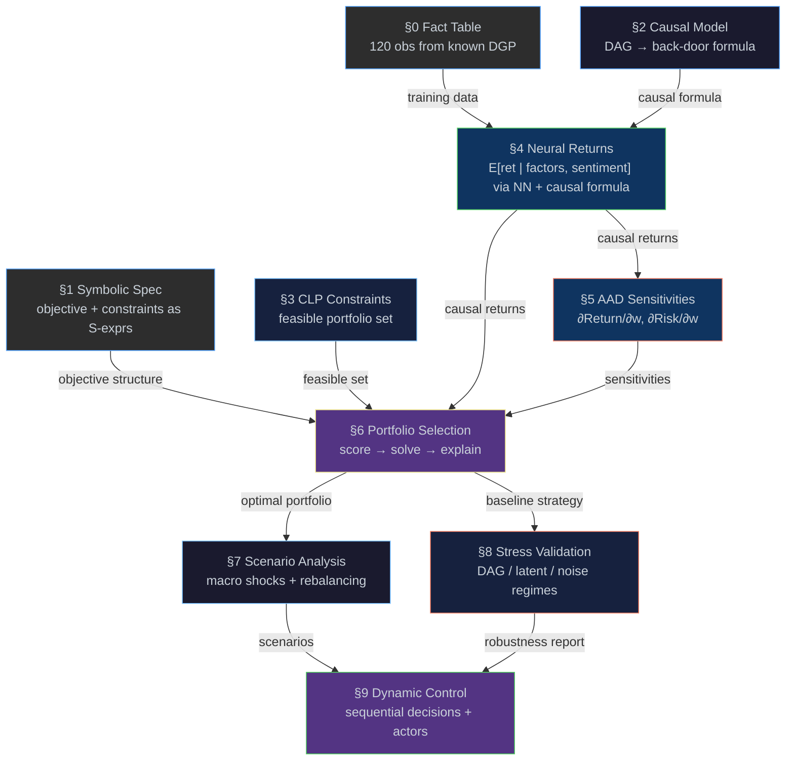

# Causal Portfolio Engine

[← Back to README](../README.md) · [Examples](examples.md) ·
[Causal](causal.md) · [Logic](logic.md) · [CLP](clp.md) ·
[AAD](aad.md) · [Torch](torch.md) · [Fact Tables](fact-table.md) ·
[Message Passing](message-passing.md)

---

## TL;DR — Executive Walkthrough

> **Core claim.** Estimation, optimisation, and stress testing are
> all defined on the **same structural model**. The DAG that
> identifies expected returns is the same DAG whose `do(m)`
> interventions generate scenarios; the covariance used to price risk
> in the QP is the same Σ(m) used in stress regimes; the constraint
> set that bounds the optimiser is the same one against which
> robustness is measured. Nothing is glued together post-hoc.

In one sentence: *causally-identified expected returns, constrained
exactly via CLP(R), optimised as a convex QP, decomposed by AAD, and
stress-tested under consistent `do(m)` interventions on the same
structural model.*

**What goes in**

- A 4-asset universe (sector ETFs) with observed factor data
- A structural causal DAG describing how macro variables drive returns
- A symbolic constraint spec (sector caps, regulatory floors, budget)
- A risk-aversion parameter λ and a list of macro scenarios

**What happens (seven steps)**

1. **Generate data** from a known DGP (so every result is verifiable)
2. **Identify the causal effect** of macro on returns from the DAG (back-door)
3. **Learn** the conditional return surface with a neural network
4. **Adjust for confounding** by marginalising over the back-door set
5. **Solve** a convex QP over the CLP(R)-feasible portfolio set
6. **Decompose risk** with reverse-mode AAD (one backward pass)
7. **Stress test** under do-operator macro interventions and DAG perturbations

**What comes out**

A single association list with the optimal allocation, expected
return, risk, per-scenario tables, robustness diagnostics, and
sensitivity reports — every value traceable back to the stage that
produced it.

```scheme
(run-pipeline universe market-dag constraint-spec 2.0
  '((base 0.5) (boom 0.8) (recession 0.1) (rate-hike 0.35)))
;; => ((allocation 0.30 0 0.60 0.10)
;;     (return . 1.87) (risk . 0.021) (score . 1.83)
;;     (scenarios (base 1.87 0.021) (boom 2.08 0.022) ...)
;;     (decision-robustness ...) (stress-validation ...) ...)
```

---

## Why This Matters

Standard quantitative pipelines silo four problems and solve each one
with tools that don't talk to each other. Eta unifies them in one
semantic layer.

| Problem in standard pipelines | What goes wrong | How Eta addresses it |
|---|---|---|
| ML conflates correlation with cause | Biased return estimates inflate spurious factors | Structural causal model + back-door adjustment (§2, §4) |
| Optimisers ignore feasibility geometry | Penalty hacks, infeasible interim states, fragile constraints | Declarative constraints in CLP(R); QP solved over the feasible set (§3, §6) |
| Risk is opaque post-hoc reporting | "Where does the risk come from?" answered by approximation | Reverse-mode AAD: all sensitivities in one backward pass (§5) |
| Scenario analysis is ad-hoc shocks | Stress tests inconsistent with the estimation model | Macro scenarios are `do(m)` interventions on the same DAG (§7) |

> [!IMPORTANT]
> The deeper claim is not that any one of these components is novel.
> It is that they share a **single semantic substrate** — logic
> programming, ML, optimisation, causality, and differentiation
> compose without translation layers. Most production stacks fail at
> exactly this seam.

### What Breaks If You Remove a Component

| Remove | What goes wrong |
|---|---|
| Causal model (§2) | Returns biased by sentiment back-door path (~2.8× inflation in this DGP) |
| CLP constraints (§3) | No feasibility guarantee; penalty terms distort the objective |
| Covariance / risk model (§5, §7) | Diversification invisible to the optimiser |
| AAD (§5) | Risk decomposition becomes a black box; no per-asset attribution |
| Scenario `do(m)` semantics (§7) | Stress tests stop being consistent with the estimator |
| Stress validation (§8) | Robustness claims unfalsifiable |

### Failure-Mode Dependency Graph

The components are not just modular — their errors **compose**, often
multiplicatively. Knowing how failures propagate is what makes the
pipeline auditable rather than merely impressive.

```
DAG misspecified ──────►  μ̂ biased  ─┐
                                      ├──►  optimiser solves the
Σ(m) misspecified ─────►  risk        │     wrong problem exactly
                          mispriced  ─┤        │
                                      │        ▼
both slightly off ─────►  errors ─────┘   apparent stability
                          amplified           hides bias
                          in score
                                              │
CLP store inconsistent ►  feasible set        ▼
                          shrinks /        decision-robustness
                          spurious         (§7) and stress-
                          constraints      validation (§8)
                          binding          flag the regime as
                                           fragile, not stable
```

| If this fails | Then this happens | Detected by |
|---|---|---|
| DAG is wrong | μ̂ biased; back-door adjusts on the wrong set | §4 naive-vs-causal gap collapses or reverses; §8 `dag-misspecified` row |
| Σ(m) is wrong | Risk mispriced; QP picks the wrong corner | §7 Σ-ordering check (boom > base > recession); decomposition no longer sums to 100% |
| Both slightly wrong | Errors amplify in `μ̂ − λ·wᵀΣw`; optimum looks confident | §8 latent-confounding regret + degradation slope |
| CLP store inconsistent | Spurious constraints bind; feasible set shrinks | `clp:r-feasible? ⇒ #f`; QP parity error blows up |
| Scenario semantics drift from estimation | Stress numbers stop being comparable to the QP score | `(uncertainty-optimization (objective-gap . ...))` deviates from zero |

The point of the structural-model unification (TL;DR core claim) is
that these failure modes are *named, locatable, and individually
testable* — not entangled.

---

## Pipeline at a Glance



The pipeline is acyclic at the stage level. Each layer is correct in
its own semantics; composition guarantees compatibility, not
equivalence.

---

## Running the Example

The example requires a release bundle with **torch support**.

```console
# Compile & run (recommended)
etac -O examples/portfolio.eta
etai portfolio.etac

# Or interpret directly
etai examples/portfolio.eta
```

> [!TIP]
> **If you only read one section, read this one.** Everything below
> elaborates how each pipeline stage produces the artifact returned by
> `run-pipeline`. The interesting code is at the *bottom* of
> [`examples/portfolio.eta`](../examples/portfolio.eta) — the stages
> above it construct the inputs.

### The Top-Level API

```scheme
(define result
  (run-pipeline
    universe          ; §0  columnar fact table (120 DGP observations)
    market-dag        ; §2  causal DAG → back-door adjustment
    constraint-spec   ; §3  CLP-feasible portfolio set
    2.0               ; λ   risk aversion
    '((base 0.5)      ; §7  macro scenarios = do(macro=m) interventions
      (boom 0.8)
      (recession 0.1)
      (rate-hike 0.35))
    stage3-default-mode))   ; nominal | worst-case | uncertainty-penalty
```

For sequential decision making under evolving state, the same file
exposes `run-pipeline-dynamic`, which returns the full static
artifact plus a `(dynamic-control ...)` block (§9).

<details>
<summary>Full result alist shape (click to expand)</summary>

```scheme
;; => ((run-config (dgp-seed . 42)
;;                  (macro-base . 0.5)
;;                  (sentiment-grid 0.1 0.3 0.5 0.7 0.9)
;;                  (sigma-model . empirical-grid|structural|learned-residual|hybrid)
;;                  (sigma-hybrid-structural-weight . 0.70)
;;                  (optimization-mode . nominal|worst-case|uncertainty-penalty))
;;     (dag ((sentiment -> macro_growth) ...))
;;     (tau τ-tech τ-energy τ-finance τ-healthcare)
;;     (tau-min ...)  (tau-max ...)
;;     (sigma-base σ11 σ12 ... σ44)        ; upper-triangular Σ(0.5)
;;     (sigma-diagnostics ((trace-base . ...) (psd-sampled-base . #t) ...))
;;     (allocation 0.30 0 0.60 0.10)
;;     (allocation-pct 30 0 60 10)
;;     (return . r) (risk . v) (score . s)
;;     (uncertainty-optimization ((mode . ...) (lambda-effective . ...) ...))
;;     (stress-validation ((rows ...) (summaries ...)
;;                         (fails-less-badly-latent-confounding . #t|#f) ...))
;;     (decision-robustness ((label . stable|moderate|fragile)
;;                           (argmax-stability . a) (mean-regret . mr) ...))
;;     (scenarios (base r0 v0) (boom r1 v1)
;;                (recession r2 v2) (rate-hike r3 v3))))
```

</details>

<details>
<summary>Sample console output (click to expand)</summary>

```
==========================================================
  Causal Portfolio Engine
==========================================================
  ... (full run text — DGP summary, training loss, naive vs causal,
       AAD sensitivities, optimal allocation, scenario table,
       stability check, distributed cross-check) ...

  Optimal Allocation:
    Tech 30% | Energy 0% | Finance 60% | Healthcare 10%
  Expected Return (causal): 1.86937
  Risk (w'S(0.5)w):         0.0211998
```

</details>

> **Reproducibility.** NN training is stochastic — exact return/risk
> values vary slightly between runs, but the qualitative results
> (adjustment set, optimal allocation, stability) are deterministic
> given the LCG seed. Treat one fixed-seed `run-pipeline` artifact
> (`dgp-seed = 42`) as a reproducibility anchor and diff future runs
> field-by-field.

---

## Headline Properties (with the fine print)

- **Auditable** — symbolic constraints and causal reasoning produce
  inspectable artefacts at every stage.
- **Causally identified** — the back-door adjustment yields the
  identified estimand E[Y \| do(X)] **conditional on the assumed
  DAG**. Identification fails if hidden confounders exist outside the
  modelled SCM.
- **Feasibility-guaranteed** — CLP(R) maintains exact linear
  feasibility throughout the solve; no penalty hacks, no infeasible
  interim states.
- **Convex-QP optimal** — the risk-adjusted objective is a convex QP
  on the feasible polytope; the reported optimum is the QP solver's
  solution under the chosen risk model.
- **Sensitivity-complete** — AAD returns ∂R/∂wᵢ and ∂Risk/∂wᵢ for all
  assets in one backward pass.
- **Verifiable** — every stage is checked against a known DGP on
  synthetic data; the same pipeline runs on real data without
  modification.

---

## §0 — Data & Fact Table

The pipeline operates on a 4-asset universe of liquid sector ETFs:

| Sector | Sector Code | Representative β | Volatility |
|--------|------------:|-----------------:|-----------:|
| Technology | 1.0 | 1.3 | 22% |
| Energy | 0.0 | 0.8 | 28% |
| Finance | −0.5 | 1.0 | 18% |
| Healthcare | −1.0 | 0.7 | 15% |

120 observations (30 per sector) are generated from a known DGP using
an LCG PRNG:

```
sentiment    ~ Uniform(0, 1)                      (latent confounder)
macro_growth = 0.15 + 0.35·sentiment + noise_m
return       = 1.2·β + 0.6·macro_growth + 0.4·sector_code
             − 0.3·rate + 0.2·β·macro_growth + 0.5·sentiment + noise
```

**Structural coefficients (known by construction):**

These are the *coefficients in the structural return equation*, not
the asset betas above. The "β" row is the coefficient applied to each
asset's market beta.

| Term in return equation | Structural Coefficient |
|---|---|
| β (asset's own market beta) | 1.2 |
| macro_growth | 0.6 |
| sector_code | 0.4 |
| rate | −0.3 |
| β × macro_growth (interaction) | 0.2 |
| sentiment (latent confounder) | 0.5 |

Data is stored in a columnar `std.fact_table` with a hash index on
sector for O(1) lookups:

```scheme
(define universe
  (make-fact-table 'sector 'beta 'macro_growth 'interest_rate 'sentiment 'return))
;; ... insert 30 rows per sector via LCG + DGP ...
(fact-table-build-index! universe 0)
```

> [!NOTE]
> **Fact Table API** — columnar store with hash indexes (similar
> architecture to kdb+ / DuckDB; C++-backed VM primitives, no column
> compression yet):
> ```scheme
> (make-fact-table 'col₁ 'col₂ …)
> (fact-table-insert! tbl val₁ val₂ …)
> (fact-table-build-index! tbl col-idx)   ; O(1) lookup
> (fact-table-fold tbl f init)
> (fact-table-ref tbl row col)
> ```

The same pipeline applies to real data without modification — replace
the DGP generator with a CSV loader or live feed.

---

## §1 — Symbolic Portfolio Specification

The objective and constraints are quoted S-expressions, so they remain
inspectable, differentiable, and serialisable:

```scheme
(define portfolio-objective
  '(- expected-return (* lambda risk)))

(define constraint-spec
  '((<= w-tech 30)
    (<= w-energy 20)
    (>= w-healthcare 10)
    (== (+ w-tech (+ w-energy (+ w-finance w-healthcare))) 100)))

(define dObj/dReturn (D portfolio-objective 'expected-return)) ;; => 1
(define dObj/dRisk   (D portfolio-objective 'risk))            ;; => (* -1 lambda)
```

The objective is data, not a black box — `D` differentiates it
symbolically.

---

## §2 — Causal Return Model

A 6-node DAG models how macroeconomic variables and a latent
confounder (`sentiment`) influence asset returns:

```scheme
(define market-dag
  '((sentiment     -> macro_growth)
    (sentiment     -> asset_return)
    (macro_growth  -> sector_perf)
    (macro_growth  -> interest_rate)
    (macro_growth  -> asset_return)
    (sector_perf   -> asset_return)
    (interest_rate -> asset_return)))
```

```
sentiment ──→ macro_growth ──→ sector_perf ──→ asset_return
    │              │                                  ↑
    │              └──→ interest_rate ────────────────┘
    └────────────────────────────────────────────────→┘
```

`sentiment` is unobserved market-mood that drives both `macro_growth`
and `asset_return`, creating a back-door path. Under the assumed SCM,
identifying the causal effect of `macro_growth` on returns requires
conditioning on `sentiment`.

> [!NOTE]
> **Do-calculus, one call:**
> ```scheme
> (define formula (do:identify market-dag 'asset_return 'macro_growth))
> ;; => (adjust (sentiment) ...)
> ```
> `findall` then enumerates *all* valid adjustment sets via trail-based
> backtracking, confirming `{sentiment}` is the unique minimal set.

```
P(asset_return | do(macro_growth)) =
  Σ_{sentiment} P(asset_return | macro_growth, sentiment) · P(sentiment)
```

### Identification Assumptions

The causal estimand is identified **only if**:

1. **DAG correctness** — no hidden confounders beyond sentiment
2. **Positivity** — all (macro_growth, sentiment) combinations have support
3. **SUTVA** — no cross-asset interference

> The SCM is *assumed known* (synthetic data regime). On real data, the
> DAG must be justified from domain knowledge. Identification
> guarantees only hold if the graph is correct.

> [!IMPORTANT]
> **Weights are decisions, not causal variables.** The DAG models the
> data-generating process for returns. The portfolio is then built
> *on top of* causally-identified expected returns — the optimiser is
> decision-theoretic, not causal. This avoids a common ML-driven
> portfolio mistake: treating correlations as causes.

The word *causal* carries three distinct meanings in this document:

| Term | Meaning | Where |
|---|---|---|
| **Structural causality** | The DAG and its structural equations (SCM) | §2 |
| **Identified estimand** | The do-calculus result E[Y \| do(X)] | §2 → §4 |
| **Causal-adjusted estimate** | The numerical value computed by NN + back-door formula | §4 output |

---

## §3 — CLP(R) Portfolio Constraints

Portfolio weights are continuous reals on [0, 1] under linear
constraints posted directly to the CLP(R) store. Feasibility is
maintained by the solver — no penalty hacks, no infeasible interim
states.

- `w_tech + w_energy + w_finance + w_healthcare = 1.0`
- `w_tech ≤ 0.30`, `w_energy ≤ 0.20`, `w_healthcare ≥ 0.10`
- `0.0 ≤ wᵢ ≤ 1.0`

```scheme
(let* ((wt (logic-var)) (we (logic-var))
       (wf (logic-var)) (wh (logic-var)))
  (clp:real wt 0.0 1.0)  (clp:real we 0.0 1.0)
  (clp:real wf 0.0 1.0)  (clp:real wh 0.0 1.0)
  (clp:r<= wt 0.30)      (clp:r<= we 0.20)
  (clp:r>= wh 0.10)
  (clp:r= (clp:r+ wt we wf wh) 1.0)
  (clp:r-feasible?))
;; => #t
```

The solver operates directly over the continuous simplex; no
brute-force enumeration or discretisation. Infeasible assignments are
rejected:

```scheme
(let ((wt (logic-var)))
  (clp:real wt 0.0 1.0)
  (clp:r= wt 1.2)
  (clp:r-feasible?))                  ;; => #f
```

> [!NOTE]
> **CLP(R) primitives** — VM-level real-domain constraints:
> ```scheme
> (clp:real var 0.0 1.0)    ; attach real interval
> (clp:r<= var 0.30)        ; linear bound
> (clp:r= expr 1.0)         ; exact linear equality
> (clp:r-feasible?)         ; consistency under current store
> ```

---

## §4 — Learning & Causal Estimation

A small MLP learns
`E[return | β, macro_growth, sector_code, sentiment]`; the §2
back-door formula then marginalises over `sentiment` to produce
causally-adjusted returns per sector.

```scheme
(define net (sequential (linear 4 32) (relu-layer)
                        (linear 32 16) (relu-layer)
                        (linear 16 1)))
(define opt (adam net 0.001))
```

> [!NOTE]
> **PyTorch via libtorch** — VM builtins, no Python bridge:
> ```scheme
> (define X (reshape (from-list input-list) (list n-obs 4)))
> (define Y (reshape (from-list target-list) (list n-obs 1)))
> (train! net)
> (define loss (train-step! net opt mse-loss X Y))
> (eval! net)
> (define pred (item (forward net input-tensor)))
> ```

```
epoch  |   MSE loss
-------+-----------
  500  |  0.00752
 1000  |  0.00435
 5000  |  0.00334
```

The back-door integral is implemented as 5-point midpoint quadrature
over the unit interval (uniform prior on sentiment):

> [!NOTE]
> **Neural + causal hybrid** — neither component works alone:
> ```scheme
> (define causal-return
>   (/ (foldl (lambda (acc sv) (+ acc (nn-predict beta macro scode sv)))
>             0 sent-grid)
>      (length sent-grid)))
> ```
> The NN learns the *conditional* expectation; the causal formula
> from §2 marginalises out the confounder. The NN without adjustment
> is biased; the formula without the NN has no data.

```
Causally-adjusted expected returns (E[return | do(macro_growth=0.5)]):
  Tech:       2.609     (DGP 2.631)
  Energy:     1.588     (DGP 1.581)
  Finance:    1.649     (DGP 1.641)
  Healthcare: 1.042     (DGP 1.051)
```

Errors are within finite-sample noise — agreement validates the
estimator approximates the structural conditional expectation, not
that it has recovered exact parameters.

### Naive vs Causal — Why Adjustment Matters

| Estimator | Method | ∂Return/∂macro |
|---|---|---:|
| **Naive OLS** | return ~ macro only | ≈ 2.2 (≈ 2.8× inflated) |
| **OLS-controlled** | return ~ macro + sentiment | ≈ 0.79 |
| **NN + back-door** | back-door adjusted (marginalise sentiment) | ≈ 0.79 |
| **DGP structural** | true causal effect | 0.6 + 0.2·β ≈ 0.79 at avg β |

The large gap between naive OLS and the causal estimates is the
back-door path `macro ← sentiment → return` doing real damage. Both
controlled OLS and NN + back-door close it.

The naive coefficient comes straight from the fact table:

```scheme
(define naive-ols (stats:ols-multi universe 5 '(2)))   ; return ~ macro
(define naive-macro-coeff (cadr (stats:ols-multi-coefficients naive-ols)))
```

`stats:ols-multi` uses Eigen `ColPivHouseholderQR` and returns a full
inference alist (coefficients, std-errors, t-stats, p-values, R²,
σ̂).

---

## §5 — AAD Risk Sensitivities

`grad` (Eta's tape-based reverse-mode AD) yields all four marginal
contributions in one backward pass:

> [!NOTE]
> **One backward pass, all sensitivities:**
> ```scheme
> (grad portfolio-return-fn '(0.30 0.10 0.40 0.20))
> ;; => (1.810  #(2.609  1.588  1.649  1.042))
> ;;     ↑value  ↑ ∂Return/∂wᵢ for all 4 assets
> ```
> Same technique used by production xVA desks.

```
Portfolio return at (30/10/40/20) = 1.810
∂Return/∂w_tech       = 2.609
∂Return/∂w_energy     = 1.588
∂Return/∂w_finance    = 1.649
∂Return/∂w_healthcare = 1.042
```

Risk uses a full covariance model: σ²_p = wᵀΣw. For base-case AAD
diagnostics §5 uses a fixed Σ; for scenario analysis (§7) and
`run-pipeline`, risk is wᵀΣ(m)w where Σ(m) = Cov(R \| do(macro=m))
is produced by a runtime-selectable model (`empirical-grid`,
`structural`, `learned-residual`, `hybrid`) — keeping returns and
risk in the **same causal world**:

```scheme
(define sigma-boom (scenario-covariance 0.8))
(portfolio-risk-from-sigma wt we wf wh sigma-boom)   ; wᵀΣ(0.8)w
```

Risk contributions decomposed by Euler allocation under the quadratic
form, RC_i = wᵢ × ∂Risk/∂wᵢ:

```
Tech         ~37%   (high vol + large weight)
Energy        ~9%
Finance      ~43%   (moderate vol, large allocation)
Healthcare   ~11%
```

AD applies to the differentiable objective and risk; constraint
enforcement is handled separately by the CLP layer (§3) — constraints
are not differentiated through.

---

## §6 — Explainable Portfolio Selection

One continuous CLP(R) QP solve over the feasible set:

```
score_QP(w, m=0.5) = E[R | do(m=0.5)] · w  −  λ · wᵀΣ(0.5)w
```

Both the expected return (§4 back-door at m=0.5) and the risk
(`scenario-covariance`, precomputed as `sigma-base-opt`) live in the
**same causal world** do(macro=0.5) — fully consistent with §7.

```
Optimization: continuous CLP(R) QP solve (no discrete grid).
Optimum:      Tech 30% | Energy 0% | Finance 60% | Healthcare 10%
Return:       1.87           Risk: ~0.021
QP parity:    |score - solver objective| ~ 0
```

### λ-Sensitivity

```
λ      Allocation         Score   Style
0.5    30/0/60/10         1.859   risk-seeking
1      30/0/60/10         1.848   aggressive
2      30/0/60/10         1.827   balanced
3      30/0/60/10         1.806   conservative
5      30/0/60/10         1.763   defensive
```

For the current synthetic run the same allocation remains optimal
across the tested λ; score shifts reflect risk-aversion strength,
not a regime change in the chosen weights.

> [!NOTE]
> **Why is the allocation flat in λ?** The invariance is driven by
> **binding constraints**, not by an absence of risk sensitivity.
> Tech is at its 30% cap and healthcare at its 10% floor across the
> entire λ range; energy sits at the lower bound because its
> return/risk ratio loses to finance even at λ = 5. The interior
> degree of freedom (tech ↔ finance) only moves once λ rises high
> enough that the marginal-risk gradient ∂Risk/∂w_finance overtakes
> ∂Return/∂w_finance — beyond λ = 5 in this DGP. Relax the tech cap
> (the §6 counterfactual: 30% → 40%) and the allocation immediately
> *does* shift, confirming the optimiser is not insensitive to risk;
> it is **constrained out of expressing that sensitivity** in the
> tested λ window.

### Binding Constraints & Counterfactual

```
Tech capped at 30%       (limit reached)
Healthcare ≥ 10%         (active)
Energy underweight       (return/risk tradeoff)

If tech cap relaxed to 40%:
  Relaxed optimal: Tech 40%, Energy 0%, Finance 50%, Healthcare 10%
  Return improvement: +0.10
```

AAD marginal contributions confirm tech has the highest ∂Return/∂w
(2.609) — explaining why its cap binds.

---

## §6.5 — Real-World Frictions (Desk-Ready Extension)

The core QP above is friction-free. Production desks care about
**transaction costs, turnover, and slippage** — and the structural-
model framing handles them without leaving the convex-QP regime.

Let `w₀` be the current book and `Δw = w − w₀`. A friction-aware
objective:

```
score(w) =  μ̂ᵀ w
          − λ · wᵀ Σ(m) w           ; risk (§5/§7)
          − κ · ‖Δw‖₁                ; linear transaction cost (turnover)
          − γ · Δwᵀ Λ Δw             ; quadratic market-impact / slippage
```

| Term | Friction | Convex? | Where it slots in |
|---|---|---|---|
| κ · ‖Δw‖₁ | Per-trade cost / commission | Yes (LP-representable) | Add to §6 QP via auxiliary `t⁺ᵢ, t⁻ᵢ ≥ 0`, `Δwᵢ = t⁺ᵢ − t⁻ᵢ`, and CLP(R) bounds |
| γ · Δwᵀ Λ Δw | Market impact (Almgren–Chriss style) | Yes (Λ ⪰ 0) | Folds into the QP Hessian: `Σ_eff = λ·Σ(m) + γ·Λ` |
| Liquidity floor (`turnoverᵢ ≤ ADVᵢ · ρ`) | Capacity / participation cap | Yes | Linear bound in CLP(R), same store as §3 |
| Crowding penalty | Strategy capacity decay | Convex if quadratic | Same Hessian extension as market impact |

**What this gives you for free:**

- The **CLP(R) feasible set extends naturally** — bounds on `Δw`, `t⁺`,
  `t⁻` are just more linear constraints in the same store.
- The **AAD pass still returns every sensitivity in one sweep** —
  `∂score/∂wᵢ` now includes cost and impact terms, so trade-cost
  attribution comes free.
- The **scenario layer (§7) keeps its semantics** — `Λ` and `κ` can
  themselves be `do(m)`-conditional (e.g., spreads widen in
  recession), and stress validation (§8) measures cost-aware regret,
  not paper-portfolio regret.

These frictions already appear in `run-pipeline-dynamic` (§9) as
`market-impact`, `liquidity-penalty`, and `crowding-penalty` along
the policy trajectory. Lifting them into the static QP (§6) is the
last step that turns the showcase from a research artefact into a
desk-shaped tool — and it requires no new machinery, only more rows
in the existing CLP store and Hessian.

> [!IMPORTANT]
> Frictions are where most "academic" portfolio engines silently
> break: they assume `w₀ = 0` or treat costs as a post-hoc deduction.
> Because Eta's optimiser solves over an arbitrary convex polytope
> with a PSD Hessian, the friction-aware problem is the **same kind
> of problem** as the friction-free one — same solver, same
> sensitivities, same scenario semantics.

---

## §7 — Parallel Scenario Analysis

Each scenario is a do-operator intervention `do(macro_growth = m)`.
Both **return** and **risk** are evaluated in the same causal world:

| Quantity | Formula | Source |
|---|---|---|
| Return(m) | E[R \| do(m)] via back-door adjustment | §4 NN + §2 formula |
| Risk(m) | wᵀΣ(m)w where Σ(m) = Cov(R \| do(m)) | `scenario-covariance` |

`scenario-covariance(m)` supports four paths — `empirical-grid`,
`structural`, `learned-residual`, `hybrid` — all returning the same
10-element upper-triangular format. §2 handles **identification**;
§7 is the **evaluation layer** (do-operator queries over the
identified model).

```
Scenario              macro   Return   Risk(m)
Base case              0.50   1.87     ~0.021
Growth boom            0.80   2.07     ~0.022
Recession              0.10   1.60     ~0.016
Rate hike              0.35   1.77     ~0.020

Worst-case 1.60   Best-case 2.07   Range 0.47
```

Structurally the β×macro interaction amplifies sentiment-driven
covariance as macro rises, so Σ(boom) > Σ(base) > Σ(recession). The
selected covariance model preserves this ordering while remaining
PSD.

### Stability and Coupling

```
Perturbation  Optimal After       Changed?
±1%           (30, 0, 60, 10)     no
±2%           (30, 0, 60, 10)     no
±5%           (30, 0, 60, 10)     no

Portfolio macro β:
  Optimal      β_p  = 1.06
  Equal-weight β_eq = 0.95
```

The optimiser tilts toward macro-sensitive assets because the causal
model identifies macro_growth as a structural return driver — not a
spurious correlation with sentiment.

### Distributed Cross-Check (Actors)

The same 4 scenarios re-run in parallel worker threads via
`spawn-thread`, each computing portfolio returns from the **DGP
ground truth** (not the NN). This both demonstrates the actor pattern
and validates NN estimates against structural values.

> [!NOTE]
> **Scatter-gather with `spawn-thread` + `send!`/`recv!`:**
> ```scheme
> (defun make-scenario-worker ()
>   (spawn-thread
>     (lambda ()
>       (let* ((mb (current-mailbox))
>              (task (recv! mb 'wait)))
>         ;; ... compute DGP-based portfolio return ...
>         (send! mb result 'wait)))))
>
> (define w-base (make-scenario-worker))
> (send! w-base (list 30 0 60 10 0.5) 'wait)
> (define res-base (recv! w-base 'wait))
> (thread-join w-base)
> (nng-close w-base)
> ```
> No separate worker file — the closure is serialised into a fresh
> in-process VM. The same `send!`/`recv!` API works for OS-process
> actors via `spawn` or `worker-pool`.

```
Worker results (DGP, via actors):
  Base:    ~1.88     Boom:    ~2.12
  Recess:  ~1.60     Hike:    ~1.77

NN vs DGP (base case):  1.877 vs 1.878  →  consistent.
```

In production, each scenario can run in a separate actor process via
`worker-pool` over IPC — true OS-level parallelism with fault
isolation. See [Message Passing](message-passing.md).

---

## §8 — Empirical Stress Validation

The harness measures how each strategy behaves when structural
assumptions are intentionally perturbed — pressure-testing the causal
narrative.

**Regimes:** `dgp-correct`, `dag-misspecified`, `latent-confounding`,
`noise-regime-shift`.

**Baselines:** empirical mean-variance (observed moments), simple
factor-tilt heuristic, non-causal ML predictor + optimiser.

**Per regime / strategy pair:** out-of-sample return, downside risk
proxy, regret vs regime-specific structural oracle, degradation slope
under misspecification severity.

The full report is embedded in the artifact as
`(stress-validation ...)` — robustness claims are auditable and
machine-checkable rather than narrative.

---

## §9 — Dynamic Causal Control

`run-pipeline-dynamic` returns the full static artifact and appends a
`(dynamic-control ...)` block:

```scheme
(define result-dynamic
  (run-pipeline-dynamic
    universe market-dag constraint-spec
    2.0
    '((base 0.5) (boom 0.8) (recession 0.1) (rate-hike 0.35))
    8                          ; horizon
    stage3-default-mode))
```

The block contains:

- policy trajectory details (`steps`, `state`, `action`, `reward`)
- execution frictions (`market-impact`, `liquidity-penalty`,
  `crowding-penalty`)
- aggregate diagnostics (`cumulative-reward`, `mean-reward`,
  `mean-turnover`)
- adaptation markers (`adapts-over-time`, `distinct-actions`)
- actor-parallel rollout summaries across base/boom/recession/rate-hike

This closes the loop between decisions and future state evolution
while preserving the existing one-shot portfolio API.

---

## Verification Summary

| Stage | Check |
|---|---|
| §0 Data | Sample means match DGP predictions within noise |
| §2 Causal | Adjustment set `{sentiment}` blocks the back-door path |
| §4 Neural | NN approximates structural conditional expectation (error < 10%) |
| §4 Naive vs Causal | Naive OLS ≈ 2.2 (≈ 2.8× inflated); OLS-controlled & NN + back-door ≈ 0.79 |
| §5 AAD | ∂Return/∂w_tech equals tech causal return (linearity check) |
| §5 Risk | wᵀΣw decomposition sums to 100% |
| §6 Portfolio | Optimal allocation consistent with return ordering and constraints |
| §6 λ-Sensitivity | Allocation stable across tested λ; score monotone in λ |
| §6.5 Frictions | Cost-aware QP remains convex; AAD attributes ∂score/∂wᵢ across cost + impact terms |
| §7 Scenarios | Boom > base > rate-hike > recession (monotone in macro_growth) |
| §7 Causal Risk | Σ(boom) > Σ(base) > Σ(recession); returns and risk share the same do(m) world |
| §7 Stability | Optimal portfolio unchanged under ±1/±2/±5% return perturbation |
| §7 Coupling | Portfolio macro β > equal-weight β (deliberate tilt) |
| §7 Actors | DGP results match NN estimates (independent cross-check) |
| §8 Stress | Robust causal mode beats ≥ 1 baseline under latent-confounding misspecification |
| §9 Dynamic | Emits adaptation diagnostics and parallel actor rollout summaries |

To run your own validation, modify the DGP coefficients in §0 and
observe that all downstream estimates shift accordingly.

---

## Appendix A — Formal Definitions

| Symbol | Definition |
|---|---|
| *M* = (V, E, F) | SCM — DAG (V, E) with structural equations F |
| τ = E[Y \| do(X)] | Identified causal estimand (§2 back-door formula) |
| f̂_θ(x, s) ≈ E[Y \| X=x, S=s] | NN estimator of the conditional expectation (§4) |
| Ω_CLP | CLP(R)-feasible set: {w ∈ R⁴ : linear constraints hold} (§3) |
| w* = argmax_{w ∈ Ω_CLP} { τ(w) − λ · wᵀΣ(0.5)w } | CLP(R) convex QP optimum (§6) |
| Σ(m) = Cov(R \| do(m)) | Causal covariance under do(macro=m) (§7) |
| Risk(m) = wᵀΣ(m)w | Scenario-dependent portfolio variance (§7) |

## Appendix B — Notation

| Symbol | Meaning |
|---|---|
| wᵢ | Weight of asset *i* |
| wᵀΣw | Portfolio variance under fixed base-case Σ (§5 diagnostics) |
| wᵀΣ(m)w | Portfolio variance under causal Σ(m) (§7) |
| Σ(m) | Cov(R \| do(macro=m)) — runtime-selectable model |
| λ | Risk-aversion parameter |
| degradation-slope | OOS return loss vs misspecification severity (lower better) |
| β | Market beta (DGP factor exposure) |
| β_p | Portfolio beta: Σ wᵢ × βᵢ |
| sentiment | Latent confounder (unobserved market mood) |
| σ²_p | Portfolio variance |
| ∂R/∂wᵢ | Marginal return contribution via AAD |
| RC_i | Euler risk contribution: wᵢ × ∂Risk/∂wᵢ |
| do(X) | do-calculus intervention on variable X |
| Z | Adjustment set for the back-door criterion |
| DGP / SCM / DAG | Data-generating process / structural causal model / directed acyclic graph |
| CLP / AAD / NN | Constraint logic programming / adjoint AD / neural network |

## Appendix C — Source Layout & DSL Helpers

`examples/portfolio.eta` keeps stage flow explicit via:

- shared header helpers for stage banners
- direct stdlib math/stats (`clamp`, `mean`, `variance`, `covariance`)
- named `let` / `foldl` patterns instead of `letrec` loop lambdas
- explicit `S8` and `S9` section headers in runtime output

Local syntax helpers used throughout the file:

```scheme
(define-syntax dict
  (syntax-rules ()
    ((_ (k v) ...) (list (cons (quote k) v) ...))))

(define-syntax dict-from
  (syntax-rules ()
    ((_ v ...) (dict (v v) ...))))

(define-syntax report
  (syntax-rules (=>)
    ((_ label => value) (report-value-line label value))
    ((_ line)            (report-line line))))

(define-syntax dotimes
  (syntax-rules ()
    ((_ (i n) body ...)
     (letrec ((loop (lambda (i)
                      (if (< i n)
                          (begin body ... (loop (+ i 1)))
                          'done))))
       (loop 0)))))
```

These are structural helpers only — runtime behaviour and artifact
keys are unchanged. Compatibility wrappers (`clamp01`, `clamp-range`,
`list-mean`, `list-variance`, `list-covariance`) expand to
`std.math` / `std.stats` calls, with variance/covariance scaled to
preserve the existing population-moment semantics.

---

## Future Extensions

| Extension | Effort | Impact |
|---|---|---|
| **CSV / real data** | Replace §0 DGP with `csv:load-file` (see [`causal-factor/csv-loader.eta`](../examples/causal-factor/csv-loader.eta)) | Use actual ETF returns |
| **HTTP data feed** | When HTTP primitives land, swap §0 for a live loader | Real-time portfolio construction |
| **Deeper backtest** | Split data 80/20, report OOS return vs predicted | Production validation |
| **Denser Σ(m) grid** | Higher empirical-grid resolution (e.g., 50-point or MC) | Smoother scenario-dependent risk |
| **Two-head NN** | Direct NN outputs for μ(X) and Σ-factors | Faster, fully learned differentiable Σ(m) |
| **Richer structural Σ** | Add liquidity / spread / crowding drivers | Higher-fidelity stress covariance |
| **Scenario-aware §6** | Pass Σ(m) into scoring; jointly optimise across macro scenarios | Regime-robust allocation |
| **Distributed scenarios** | `worker-pool` over TCP for cross-host stress testing | Scale to thousands of paths |

---

## Source Locations

| Component | File |
|---|---|
| **Portfolio Demo** | [`examples/portfolio.eta`](../examples/portfolio.eta) |
| Fact table module | [`stdlib/std/fact_table.eta`](../stdlib/std/fact_table.eta) |
| Causal DAG & do-calculus | [`stdlib/std/causal.eta`](../stdlib/std/causal.eta) |
| Logic programming | [`stdlib/std/logic.eta`](../stdlib/std/logic.eta) |
| CLP(Z)/CLP(FD) and CLP(R) | [`stdlib/std/clp.eta`](../stdlib/std/clp.eta), [`stdlib/std/clpr.eta`](../stdlib/std/clpr.eta) |
| libtorch wrappers | [`stdlib/std/torch.eta`](../stdlib/std/torch.eta) |
| VM execution engine | [`eta/core/src/eta/runtime/vm/vm.cpp`](../eta/core/src/eta/runtime/vm/vm.cpp) |
| Constraint store | [`eta/core/src/eta/runtime/clp/constraint_store.h`](../eta/core/src/eta/runtime/clp/constraint_store.h) |
| Compiler (`etac`) | [`docs/compiler.md`](compiler.md) |

