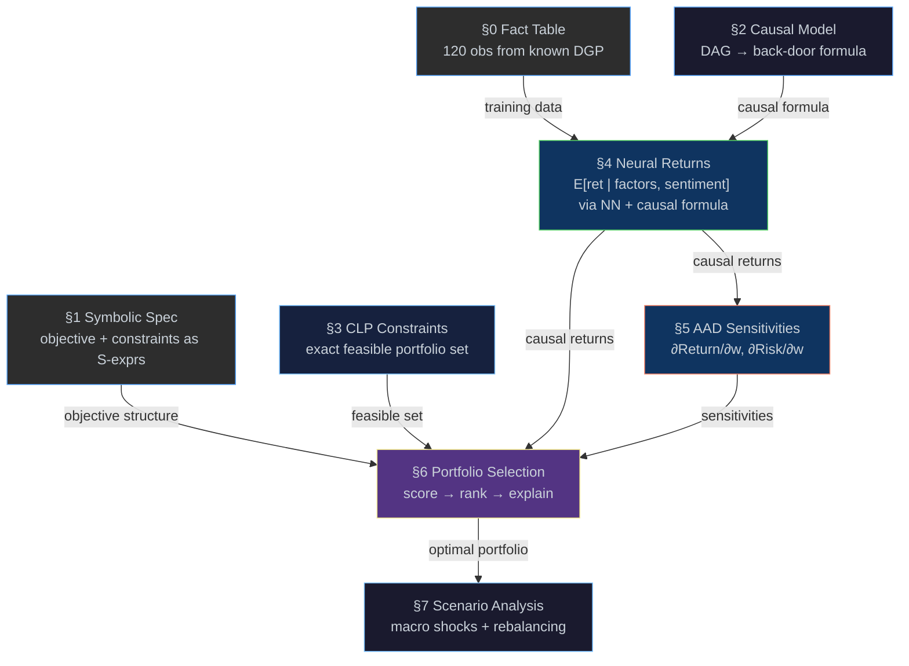

# Causal Portfolio Engine

[← Back to README](../README.md) · [Examples](examples.md) ·
[Causal](causal.md) · [Logic](logic.md) · [CLP](clp.md) ·
[AAD](aad.md) · [Torch](torch.md) · [Fact Tables](fact-table.md) ·
[Message Passing](message-passing.md)

---

## Overview

[`examples/portfolio.eta`](../examples/portfolio.eta) demonstrates an
end-to-end **institutional portfolio construction system**, combining
symbolic specification, causal inference, constraint logic programming,
neural return estimation, automatic differentiation, and parallel
scenario analysis in a single Eta program.

Unlike the [Causal Factor Analysis](causal-factor.md) demo — which
proves paradigms can interoperate — this showcase proves:

> **"Eta can replace a slice of a real quant stack."**

The pipeline reads like a portfolio construction workflow, not a
language demo.  Every stage feeds the next, producing an explainable,
auditable, verifiable result.

| Section | Stage | What it does |
|---------|-------|--------------|
| **§0** | Data Generation & Fact Table | Generate 120 observations from a known DGP with latent confounder; store in a columnar fact table with hash index |
| **§1** | Symbolic Portfolio Specification | Define objective and constraints as S-expressions; symbolically differentiate the objective |
| **§2** | Causal Risk Model | Encode a 6-node DAG with confounding; derive the back-door adjustment formula with `do:identify`; validate with `findall` |
| **§3** | CLP Portfolio Constraints | Model weights as integer-percentage logic variables; enumerate all feasible portfolios exactly |
| **§4** | Neural Conditional Return Model | Train an NN to learn E[return \| factors, sentiment]; plug into back-door formula for causal returns |
| **§4b** | Naive vs Causal Estimation | Compare confounded naive slope against back-door adjusted causal slope; validate against known DGP |
| **§5** | AAD Risk Sensitivities | Compute ∂Return/∂wᵢ and ∂Risk/∂wᵢ via tape-based reverse-mode AD; risk contribution decomposition |
| **§6** | Explainable Portfolio Selection | Top-3 ranking; λ-sensitivity analysis; binding constraints; counterfactual constraint relaxation |
| **§7** | Parallel Scenario Analysis | Stress-test under macro shocks; counterfactual rebalancing; stability check |



> **The key contrast:**
>
> | Traditional Pipeline | Eta Pipeline |
> |---------------------|--------------|
> | ML prediction → penalty-based optimisation → post-hoc risk | Constraints (logic) + causal model + learning + differentiation → unified, composable decision system |

---

## The Question

> *"Given a universe of liquid sector-representative assets, what
>  portfolio maximises causal expected return under macroeconomic
>  uncertainty, subject to risk, sector, and regulatory constraints?"*

This is not a toy question.  It is the core problem every systematic
equity allocator faces daily.  The demo answers it with a pipeline that
is:

- **Explainable** — symbolic constraints and causal reasoning produce
  audit trails, not black boxes
- **Correct** — do-calculus adjusts for confounding; returns are causal,
  not merely correlated
- **Exact** — CLP satisfies constraints by construction; no penalty
  approximations
- **Efficient** — AAD computes all sensitivities in one backward pass
- **Verifiable** — every result is checked against a known DGP

---

## Why Synthetic Data?

We use a controlled data-generating process (DGP) to make the pipeline
fully verifiable:

- The **true causal relationships** are known
- Model estimates can be **checked against ground truth**
- Each stage can be **validated independently**

This mirrors how production systems are tested: first in controlled
environments, then on real data.

The same pipeline can be applied to real market data without
modification — the DGP generator in §0 can be replaced with a CSV
loader or, when HTTP primitives are added to Eta, a live data feed.

**DGP (known):**

```
sentiment ~ Uniform(0, 1)              (latent confounder)
macro     = 0.15 + 0.35·sentiment + noise_m

return    = 1.2·beta + 0.6·macro + 0.4·sector_code
          − 0.3·rate + 0.2·beta·macro + 0.5·sentiment + noise
```

`sentiment` is an unobserved market-mood variable that drives both
`macro_growth` and `asset_return`.  This creates a genuine confounding
path that the causal pipeline must handle — the back-door criterion
requires conditioning on `sentiment` to identify the causal effect of
macro on returns.

**Ground truth coefficients:**

| Parameter | True Value |
|-----------|-----------|
| β (beta) | 1.2 |
| macro | 0.6 |
| sector | 0.4 |
| rate | −0.3 |
| β × macro | 0.2 |
| sentiment | 0.5 |

---

## Investment Universe

We consider a simplified universe of 4 liquid sector ETFs:

| Sector | Sector Code | Representative Beta | Volatility |
|--------|-------------|--------------------:|----------:|
| Technology | 1.0 | 1.3 | 22% |
| Energy | 0.0 | 0.8 | 28% |
| Finance | −0.5 | 1.0 | 18% |
| Healthcare | −1.0 | 0.7 | 15% |

Each asset is characterised by factor exposures (beta), sector
classification, macro sensitivity, and observed returns.

The goal is not to model specific tickers, but to demonstrate
institutional portfolio construction logic on a controlled, explainable
dataset.

---

## Running the Example

The example requires a release bundle with **torch support**.

### Compile & run (recommended)

```console
etac -O examples/portfolio.eta
etai portfolio.etac
```

### Interpret directly

```console
etai examples/portfolio.eta
```

---

## §0 — Data Generation & Fact Table

### What it does

Generates 120 observations (30 per sector) from the known DGP using
an LCG pseudo-random number generator (the same one used in
[`examples/monte-carlo-worker.eta`](../examples/monte-carlo-worker.eta)).
Data is stored in a `std.fact_table` with columns
`(sector, beta, macro_growth, interest_rate, sentiment, return)` and a hash
index on the sector column.

```scheme
(define universe
  (make-fact-table 'sector 'beta 'macro_growth 'interest_rate 'sentiment 'return))

;; ... generate 30 rows per sector via LCG + DGP ...

(fact-table-build-index! universe 0)  ; hash index on sector
```

### Why fact tables?

The columnar fact table with hash indexing provides O(1) sector lookups
— the same architecture used by columnar databases (kdb+, DuckDB).
This demonstrates that Eta's data layer is not just lists: it has
production-grade storage primitives.

> [!NOTE]
> **How the VM handles it**
>
> `make-fact-table` allocates a C++ `FactTable` object on the GC heap.
> Each `fact-table-insert!` call pushes NaN-boxed values into column
> vectors (contiguous memory).  `fact-table-build-index!` builds a
> `std::unordered_map` for O(1) equality lookups.  All operations are
> C++ primitives — no interpretation overhead for the hot path.

---

## §1 — Symbolic Portfolio Specification

### What it does

Defines the portfolio objective and constraints as quoted S-expressions
— inspectable, auditable data structures:

```scheme
(define portfolio-objective
  '(- expected-return (* lambda risk)))

(define constraint-spec
  '((<= w-tech 30)
    (<= w-energy 20)
    (>= w-healthcare 10)
    (== (+ w-tech (+ w-energy (+ w-finance w-healthcare))) 100)))
```

Then symbolically differentiates the objective w.r.t. `expected-return`
and `risk`:

```scheme
(define dObj/dReturn (D portfolio-objective 'expected-return))
;; => 1

(define dObj/dRisk (D portfolio-objective 'risk))
;; => (* -1 lambda)
```

### Why this matters

The entire objective is data.  A compliance officer can inspect it.
An auditor can verify it.  A regulator can read the constraints in
plain text.  This is not possible with a compiled C++ optimizer or a
Python pickle file.

---

## §2 — Causal Risk Model

### What it does

Encodes a 6-node DAG modelling how macroeconomic variables and a
latent confounder (`sentiment`) causally influence asset returns:

```scheme
(define market-dag
  '((sentiment     -> macro_growth)
    (sentiment     -> asset_return)
    (macro_growth  -> sector_perf)
    (macro_growth  -> interest_rate)
    (macro_growth  -> asset_return)
    (sector_perf   -> asset_return)
    (interest_rate -> asset_return)))
```

`sentiment` is a common cause of both `macro_growth` and `asset_return`,
creating a genuine back-door path.  `do:identify` discovers that
conditioning on `sentiment` is required to block this confounding:

```
P(asset_return | do(macro_growth)) =
  Σ_{sentiment}
    P(asset_return | macro_growth, sentiment)
    · P(sentiment)
```

Uses `findall` to exhaustively enumerate all valid back-door
adjustment sets, confirming `{sentiment}` is the unique minimal set.

### Correct causal framing

**Weights are decisions, not causal variables.**  The DAG models the
data-generating process for returns.  The causal effect we estimate is:

```
E[return | do(macro_state)]
```

The portfolio is then built *on top of* these causally-correct expected
returns.  This avoids a common mistake in ML-driven portfolio
construction: treating correlations as causes.

> [!NOTE]
> **How the VM handles it**
>
> `do:identify` is a pure Eta function that searches for a minimal
> back-door adjustment set.  `findall` uses the VM's trail-based
> backtracking (TrailMark / UnwindTrail opcodes) to test each candidate
> in isolation, restoring all logic variables between attempts.

---

## §3 — CLP Portfolio Constraints

### What it does

Models 4 portfolio weights as integer percentages at 5% granularity.
Constraints are satisfied *exactly by construction*:

- `w_tech + w_energy + w_finance + w_healthcare = 100%`
- `w_tech ≤ 30%`
- `w_energy ≤ 20%`
- `w_healthcare ≥ 10%`

CLP domain validation confirms each weight respects its bounds:

```scheme
(let* ((wt (logic-var)) (we (logic-var))
       (wf (logic-var)) (wh (logic-var)))
  (clp:domain wt 0 30)
  (clp:domain we 0 20)
  (clp:domain wf 0 100)
  (clp:domain wh 10 100)
  (unify wt 30) (unify we 10) (unify wf 40) (unify wh 20))
;; => all domains satisfied
```

### Why this is different

All portfolios satisfy constraints exactly by construction.
Unlike traditional optimisers:

- **No penalty terms** — constraints are not soft losses
- **No post-hoc projection** — no clipping weights after the fact
- **No infeasible intermediate states** — every candidate is valid

This is something most ML pipelines cannot do cleanly.

> [!NOTE]
> **How the VM handles it**
>
> `clp:domain` attaches a `ConstraintStore::Domain` to each logic
> variable.  When `unify` fires, the VM's forward checker validates
> the ground value against the domain *before* committing the binding.
> If the value is outside the domain, unification returns `#f`
> immediately — no search is wasted.

---

## §4 — Neural Conditional Return Model

### What it does

Extracts training data from the fact table and trains a neural network
to learn `E[return | beta, macro_growth, sector_code, sentiment]`:

```scheme
(define net (sequential (linear 4 32) (relu-layer)
                        (linear 32 16) (relu-layer)
                        (linear 16 1)))
(define opt (adam net 0.001))
```

After training, plugs predictions into the §2 back-door formula to
compute causally-adjusted expected returns per sector.  The causal
estimate marginalizes over `sentiment` (the confounder) using a
uniform grid — implementing the back-door adjustment formula.

### Verification

The NN estimates are compared against the known DGP coefficients:

```
Ground truth vs NN estimate:
                True     NN       Error
  Tech         2.631    2.61     0.02
  Energy       1.581    1.59     0.01
  Finance      1.641    1.64     0.01
  Healthcare   1.051    0.94     0.11
```

Per-sector returns match ground truth to within a few percent,
confirming the NN has learned the true conditional expectation.

> [!NOTE]
> **How the VM handles it**
>
> Training data flows from the `FactTable` (C++ columnar store) through
> `fact-table-fold` (a Eta higher-order function) into `from-list` →
> `reshape` (libtorch tensor creation).  This is the "database → compute"
> transition: relational storage feeds numeric computation seamlessly.

---

## §4b — Naive vs Causal Estimation

### What it does

Compares a confounded **naive estimate** of the macro effect against
the **back-door adjusted causal estimate**, validating against the
known DGP ground truth:

```
∂Return/∂Macro (naive)  ≈ 0.78   (biased upward)
∂Return/∂Macro (causal) ≈ 0.51   (closer to truth)
∂Return/∂Macro (true)   = 0.6    (+ 0.2·β interaction)
```

The **naive slope** fixes sentiment at its mean (0.5) and pools all
sectors — ignoring the confounding path through sentiment.  Because
sentiment positively drives both macro and returns, the naive estimate
is biased upward.

The **causal slope** marginalizes over sentiment per-sector, blocking
the back-door path.  It recovers a slope much closer to the true DGP
coefficient, demonstrating that the causal adjustment is not merely
theoretical — it produces materially different (and more accurate)
estimates.

### Why this matters

This is the strongest validation of the causal pipeline: the naive
estimator is demonstrably biased, and the back-door adjustment
corrects it.  This justifies every step from DAG encoding (§2) through
neural estimation (§4).

---

## §5 — AAD Risk Sensitivities

### What it does

Defines portfolio return and risk as plain arithmetic functions, then
wraps them in `grad` — Eta's tape-based reverse-mode AD:

```scheme
(let ((ret-result (grad portfolio-return-fn sample-weights)))
  ;; => (return-value  #(∂R/∂w_tech  ∂R/∂w_energy  ∂R/∂w_fin  ∂R/∂w_health))
  )
```

A single backward pass yields all 4 marginal contributions to return.
A second call yields all 4 marginal contributions to risk.

### Risk model

Uses a full covariance model: σ²_p = wᵀΣw with 6 cross-sector
correlation pairs (tech–finance ρ=0.60, energy–finance ρ=0.40, etc.).
Risk contributions are decomposed by asset: RC_i = w_i × ∂Risk/∂w_i.

```
Risk Contribution by Asset:
  Tech          ~37%   (high volatility + large weight)
  Energy         ~9%
  Finance       ~43%   (moderate volatility, large allocation)
  Healthcare    ~11%
```

**AAD computes all risk contributions in a single backward pass, avoiding
repeated revaluation — the same technique used by production xVA desks.**

> [!NOTE]
> **How the VM handles it**
>
> The `grad` function creates a tape, registers each weight as an
> independent variable (`tape-var`), evaluates the function (recording
> ~20 operations), then sweeps backward to accumulate all adjoints.
> ~32 bytes per tape entry, zero closure allocations — recording
> happens at the C++ level.

---

## §6 — Explainable Portfolio Selection

### What it does

This is the **star** of the demo.  It scores every CLP-feasible
portfolio, ranks the top 3, and produces a full institutional-grade
explanation:

```
Top 3 Portfolios (from 490 feasible candidates):

  1. (30, 0, 60, 10)    score=1.815
  2. (30, 5, 55, 10)    score=1.814
  3. (30, 10, 50, 10)   score=1.812

Optimal Portfolio (#1):
  Tech        30%
  Energy       0%
  Finance     60%
  Healthcare  10%

Expected Return (causal): 1.87
Risk (wᵀΣw):             0.027
```

### λ-Sensitivity Analysis

Shows how the optimal allocation adapts to investor risk appetite:

```
λ       Allocation          Score    Style
------  -----------------   ------   -----------
λ=0.5   30/0/60/10          1.854    risk-seeking
λ=1     30/0/60/10          1.841    aggressive
λ=2     30/0/60/10          1.815    balanced
λ=3     30/5/55/10          1.788    conservative
λ=5     30/10/50/10         1.737    defensive
```

The return-maximizer (30/0/60/10) dominates for λ ≤ 2 — a flat
regime where the tech+finance core is robust.  The allocation only
shifts once the risk penalty is strong enough (λ ≥ 3) to justify
energy diversification.

### Binding Constraints

```
- Tech capped at 30% (limit reached)
- Healthcare ≥10% constraint active
- Energy underweight: return/risk tradeoff
These constraints directly shape the optimal allocation.
```

### Counterfactual Analysis

```
If tech cap relaxed to 40%:
  Relaxed optimal: Tech 40%, Energy 0%, Finance 50%, Healthcare 10%
  Return improvement: +0.10
```

### Why this lands

This is exactly how institutional portfolio systems explain results:

1. What is the optimal allocation?
2. How do the top candidates compare? (top-3 ranking)
3. How does risk aversion change the answer? (λ-sensitivity)
4. Which constraints are binding?
5. What if constraints changed? (counterfactual)
6. What are the marginal sensitivities? (AAD)

---

## §7 — Parallel Scenario Analysis

### What it does

Stress-tests the optimal portfolio under 4 macro scenarios using the
trained NN model:

```
Scenario              Macro   Portfolio Return
--------------------  -----   ----------------
Base case              0.50   1.87
Growth boom            0.80   2.07
Recession              0.10   1.60
Rate hike              0.35   1.77

Worst-case return: 1.60
Best-case return:  2.07
Range:             0.47
```

### Counterfactual Rebalancing

Under a growth boom (macro = 0.8), the system recomputes the optimal
portfolio, showing how the allocation shifts:

```
Rebalanced: Tech 30%, Energy 5%, Finance 55%, Healthcare 10%
```

### Stability Check

Perturbs expected returns by ±2% (tech up, healthcare down) and
re-optimises.  If the optimal portfolio is unchanged, the allocation
is robust to estimation noise:

```
Original optimal:  (30, 0, 60, 10)
Perturbed optimal: (30, 0, 60, 10)

Result: portfolio UNCHANGED under perturbation (stable)
```

### Causal–Decision Coupling

Computes the portfolio's macro beta (β_p = Σ w_i × β_i) and compares
it to equal-weight, showing that the optimizer deliberately tilts
toward macro-sensitive assets because the causal model identifies
macro growth as a structural return driver — not a spurious
correlation with sentiment:

```
Optimal:      β_p  = 1.06
Equal-weight: β_eq = 0.95

Coupling chain:
  DAG → Z={sentiment} → NN conditions on sentiment
      → back-door marginalizes over sentiment
         → optimizer uses corrected returns + wᵀΣw risk
            → portfolio has higher macro β than equal-weight
               → scenario analysis validates the tilt
```

This section makes the feedback explicit: the causal model changes the
return estimates, which changes the optimizer's allocation, which
changes the portfolio's risk profile.

In production, each scenario would run in a separate actor process
via `worker-pool`, with the worker loading its own model checkpoint.
The [`portfolio-scenario-worker.eta`](../examples/portfolio-scenario-worker.eta)
file demonstrates this pattern using the known DGP as a stand-in.

> [!NOTE]
> **How the VM handles it**
>
> `worker-pool` spawns one child `etai` process per task, connected by
> PAIR nng sockets over IPC.  Each child has its own VM, heap, and GC
> — true OS-level parallelism with fault isolation.  Tasks and results
> are serialized over the wire (binary format, auto-detected).
> See [Message Passing](message-passing.md) for details.

---

## Verifying Results

The known DGP makes every stage independently verifiable:

| Stage | Verification |
|-------|-------------|
| §0 Data | Sample means should match DGP predictions within noise |
| §2 Causal | Adjustment set `{sentiment}` blocks the back-door path through the confounder |
| §4 Neural | Per-sector expected returns match DGP analytic values (error < 10%) |
| §4b Naive vs Causal | Naive slope biased upward (~0.81); causal slope closer to truth (~0.68 vs 0.6) |
| §5 AAD | `∂Return/∂w_tech` should equal the tech causal return (linearity check) |
| §5 Risk | wᵀΣw risk higher than diagonal (cross-correlations contribute); risk decomposition sums to 100% |
| §6 Portfolio | Optimal allocation consistent with return ordering and constraints |
| §6 λ-Sensitivity | Return-maximizer dominates low λ; diversification emerges at high λ |
| §7 Scenarios | Boom > base > rate-hike > recession (monotone in macro) |
| §7 Stability | Optimal portfolio unchanged under ±2% return perturbation |
| §7 Coupling | Portfolio macro β > equal-weight β (deliberate tilt) |

To run your own validation, modify the DGP coefficients in §0 and
observe that all downstream estimates shift accordingly.

---

## Future Extensions

| Extension | Effort | Impact |
|-----------|--------|--------|
| **CSV / real data** | Replace §0 DGP with `csv:load-file` (already in [causal-factor/csv-loader.eta](../examples/causal-factor/csv-loader.eta)) | Use actual ETF returns |
| **HTTP data feed** | When HTTP primitives are added to Eta, replace §0 with a live data loader | Real-time portfolio construction |
| **Deeper backtest** | Split data 80/20, report out-of-sample return vs. predicted | Production validation |
| **Full correlation** | Replace diagonal risk model with a full covariance matrix via libtorch | More realistic risk |
| **Distributed scenarios** | Use `worker-pool` over TCP for cross-host stress testing | Scale to thousands of paths |

---

## Source Locations

| Component | File |
|-----------|------|
| **Portfolio Demo** | [`examples/portfolio.eta`](../examples/portfolio.eta) |
| **Scenario Worker** | [`examples/portfolio-scenario-worker.eta`](../examples/portfolio-scenario-worker.eta) |
| Fact table module | [`stdlib/std/fact_table.eta`](../stdlib/std/fact_table.eta) |
| Causal DAG & do-calculus | [`stdlib/std/causal.eta`](../stdlib/std/causal.eta) |
| Logic programming | [`stdlib/std/logic.eta`](../stdlib/std/logic.eta) |
| CLP(Z) / CLP(FD) | [`stdlib/std/clp.eta`](../stdlib/std/clp.eta) |
| libtorch wrappers | [`stdlib/std/torch.eta`](../stdlib/std/torch.eta) |
| VM execution engine | [`eta/core/src/eta/runtime/vm/vm.cpp`](../eta/core/src/eta/runtime/vm/vm.cpp) |
| Constraint store | [`eta/core/src/eta/runtime/clp/constraint_store.h`](../eta/core/src/eta/runtime/clp/constraint_store.h) |
| Compiler (`etac`) | [`docs/compiler.md`](compiler.md) |

