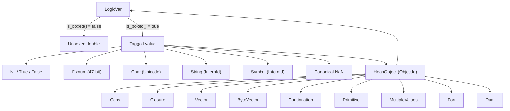
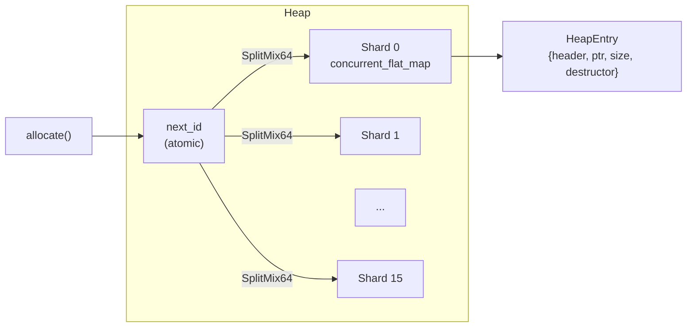
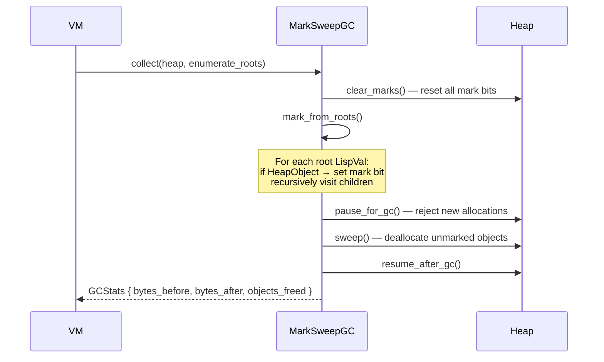
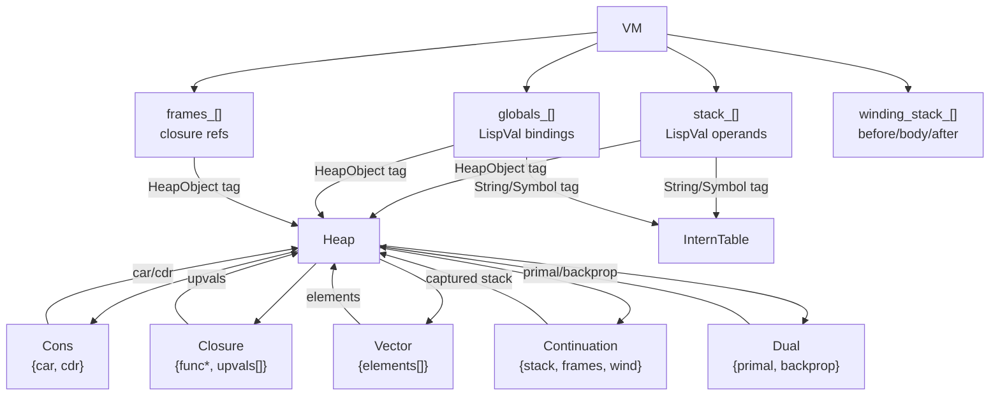

# Runtime & Garbage Collection

[← Back to README](../README.md) · [Architecture](architecture.md) ·
[NaN-Boxing](nanboxing.md) · [Bytecode & VM](bytecode-vm.md)

---

## Overview

Eta's runtime manages all heap-allocated data through three collaborating
subsystems: a **sharded heap** for object storage, an **intern table** for
string/symbol deduplication, and a **mark-sweep garbage collector** for
automatic memory reclamation.

**Key sources:**
[`heap.h`](../eta/core/src/eta/runtime/memory/heap.h) ·
[`intern_table.h`](../eta/core/src/eta/runtime/memory/intern_table.h) ·
[`mark_sweep_gc.h`](../eta/core/src/eta/runtime/memory/mark_sweep_gc.h) ·
[`factory.h`](../eta/core/src/eta/runtime/factory.h) ·
[`builtin_env.h`](../eta/core/src/eta/runtime/builtin_env.h)

---

## Value Taxonomy

Every `LispVal` falls into one of two categories:



**Inline values** (Nil, Fixnum, Char, String ID, Symbol ID, NaN, doubles)
require **no heap allocation**. Only `HeapObject`-tagged values point to
the heap.

---

## Heap Architecture

### Sharded Design

The `Heap` class uses **16 shards**, each backed by a
`boost::unordered::concurrent_flat_map<ObjectId, HeapEntry>`. The shard
is selected by hashing the `ObjectId` with SplitMix64:

```
ObjectId → SplitMix64 → shard_index = hash & (NUM_SHARDS - 1)
```

This design enables **lock-free concurrent reads** within a shard and
minimizes contention during allocation.



### HeapEntry

Each heap object is tracked by a `HeapEntry`:

```cpp
struct ObjectHeader {
    ObjectKind kind;       // Cons, Closure, Vector, etc.
    uint8_t flags : 3;     // Bit 0 = GC mark bit
};

struct HeapEntry {
    ObjectHeader header;
    void* ptr;             // Type-erased pointer to the object
    size_t size;           // sizeof(T) — for memory accounting
    void (*destructor)(void*);  // Type-erased destructor
};
```

### Object Kinds

| Kind | C++ Type | Contents |
|------|----------|----------|
| `Cons` | `types::Cons` | `{ car: LispVal, cdr: LispVal }` |
| `Closure` | `types::Closure` | `{ func: BytecodeFunction*, upvals: vector<LispVal> }` |
| `Vector` | `types::Vector` | `{ elements: vector<LispVal> }` |
| `ByteVector` | `types::ByteVector` | `{ data: vector<uint8_t> }` |
| `Continuation` | `types::Continuation` | Captured stack, frames, and winding stack |
| `Primitive` | `types::Primitive` | `{ func, arity, has_rest }` — builtin function |
| `MultipleValues` | `types::MultipleValues` | `{ vals: vector<LispVal> }` — for `(values ...)` |
| `Port` | `types::Port` | Input/output port (string or file-backed) |
| `LogicVar` | `types::LogicVar` | Unification logic variable (binding chain) |
| `Dual` | `types::Dual` | AD dual number `{ primal: LispVal, backprop: LispVal }` — reverse-mode AD |

### Allocation Flow

```cpp
// Direct API
auto id = heap.allocate<Cons, ObjectKind::Cons>(Cons{car, cdr});

// Factory helpers (recommended)
auto val = factory::make_cons(heap, car_val, cdr_val);        // → expected<LispVal, RuntimeError>
auto val = factory::make_closure(heap, func_ptr, upvals);
auto val = factory::make_vector(heap, elements);
auto val = factory::make_fixnum(heap, big_number);             // spills to heap if > 47-bit
```

The factory functions handle:
1. Heap allocation via `heap.allocate<T, Kind>(...)`
2. NaN-boxing the returned `ObjectId` with `ops::box(Tag::HeapObject, id)`
3. Error propagation via `std::expected`

### Soft Heap Limit & GC Trigger

The heap is initialized with a soft byte limit (default: 4 MB). When an
allocation would exceed the limit:

1. The GC callback fires (`gc_callback_`)
2. The GC runs a collection cycle
3. If memory is reclaimed below the limit, the allocation proceeds
4. Otherwise, `HeapError::SoftHeapLimitExceeded` is returned

---

## Intern Table

**File:** [`intern_table.h`](../eta/core/src/eta/runtime/memory/intern_table.h)

Strings and symbols share a single `InternTable` that deduplicates their
content. Each unique string is assigned an `InternId` (a `uint64_t`), and
that ID is what gets stored in the NaN-boxed `LispVal` payload.

```
"hello" → intern() → InternId 7
"hello" → intern() → InternId 7  (same ID — deduplicated)
"world" → intern() → InternId 12
```

The intern table is backed by `boost::unordered::concurrent_flat_map` for
thread-safe interning. Strings are reference-counted with `shared_ptr`
internally.

**Key operations:**

| Method | Signature | Description |
|--------|-----------|-------------|
| `intern` | `string_view → expected<InternId>` | Intern a string, get or create ID |
| `get_id` | `string_view → expected<InternId>` | Look up ID (fail if not interned) |
| `get_string` | `InternId → expected<string_view>` | Retrieve string by ID |

---

## Mark-Sweep Garbage Collector

**File:** [`mark_sweep_gc.h`](../eta/core/src/eta/runtime/memory/mark_sweep_gc.h)

Eta uses a **stop-the-world mark-sweep** collector. Collection is triggered
automatically when the heap soft limit is reached, or manually via
`vm.collect_garbage()`.

### Collection Phases



### Root Enumeration

The VM provides all GC roots via a callback:

```cpp
vm.collect_garbage();
// Internally enumerates:
//   - stack_[]          — all values on the operand stack
//   - globals_[]        — all global variable slots
//   - frames_[].closure — closure in each stack frame
//   - frames_[].extra   — extra data per frame
//   - winding_stack_[]  — dynamic-wind thunks
//   - current_input_, current_output_, current_error_ — port roots
//   - temp_roots_[]     — temporary roots during allocation
```

### Mark Phase

For each root `LispVal`:
1. If not a `HeapObject` → skip (inline value, no heap reference)
2. Extract `ObjectId` from payload
3. Look up `HeapEntry` in the heap
4. If already marked → skip (cycle detection)
5. Set the mark bit (`entry.header.flags |= MARK_BIT`)
6. Recursively visit all child `LispVal`s via `visit_heap_refs()`

The `LambdaHeapVisitor` dispatches to type-specific traversal:

| Object Kind | Children Visited |
|-------------|-----------------|
| `Cons` | `car`, `cdr` |
| `Closure` | All `upvals[]`, all `func->constants[]` |
| `Vector` | All `elements[]` |
| `Continuation` | `stack[]`, `frames[].closure`, `frames[].extra`, `winding_stack[]` entries |
| `MultipleValues` | All `vals[]` |
| `ByteVector`, `Primitive`, `Port` | None (leaf objects) |
| `Dual` | `primal`, `backprop` |

### Sweep Phase

After marking, the heap is **paused** (`gc_in_progress_ = true`) to reject
new allocations. Every `HeapEntry` is visited:

- **Marked:** clear the mark bit (prepare for next cycle)
- **Unmarked:** deallocate the object (call type-erased destructor, free memory)

After sweeping, the heap is **resumed** and allocations proceed normally.

---

## Builtin Environment

**File:** [`builtin_env.h`](../eta/core/src/eta/runtime/builtin_env.h) ·
[`core_primitives.h`](../eta/core/src/eta/runtime/core_primitives.h)

Builtins form the **compiler↔runtime contract**. They are registered once
at startup, and their registration order determines global slot indices:

```
globals[0] = +       globals[1] = -       globals[2] = *       ...
globals[N] = cons    globals[N+1] = car   globals[N+2] = cdr   ...
```

### Registration

```cpp
// In Driver constructor:
runtime::register_core_primitives(builtins_, heap_, intern_table_);
runtime::register_port_primitives(builtins_, heap_, intern_table_, vm_);
runtime::register_io_primitives(builtins_, heap_, intern_table_, vm_);
```

### Contract

| Component | Uses |
|-----------|------|
| **Semantic Analyzer** | Reads `name` + `arity` to pre-allocate immutable global slots |
| **VM** | Reads `func` to create `Primitive` heap objects at those slots |

At each `run_source()` call, the Driver re-installs builtins into
`globals[0..N-1]` because GC may have collected the `Primitive` heap
objects from a prior cycle.

### Registered Primitives

**Arithmetic:** `+`, `-`, `*`, `/`
**Comparison:** `=`, `<`, `>`, `<=`, `>=`
**Equivalence:** `eq?`, `eqv?`, `equal?`, `not`
**Pairs/Lists:** `cons`, `car`, `cdr`, `pair?`, `null?`, `list`, `set-car!`, `set-cdr!`
**Type predicates:** `number?`, `boolean?`, `string?`, `char?`, `symbol?`, `procedure?`, `integer?`
**Numeric:** `zero?`, `positive?`, `negative?`, `abs`, `min`, `max`, `modulo`, `remainder`
**Lists:** `length`, `append`, `reverse`, `list-ref`, `list-tail`
**Higher-order:** `apply`, `map`, `for-each`
**Strings:** `string-length`, `string-append`, `number->string`, `string->number`
**Vectors:** `vector`, `vector-length`, `vector-ref`, `vector-set!`, `vector?`, `make-vector`
**I/O:** `display`, `write`, `newline`, `read-char`
**Ports:** `open-input-string`, `open-output-string`, `get-output-string`, `current-input-port`, `current-output-port`, `current-error-port`, etc.
**Error:** `error`
**AD Duals:** `make-dual`, `dual?`, `dual-primal`, `dual-backprop`
**Logic:** `logic-var`, `unify`, `deref-lvar`, `trail-mark`, `unwind-trail`, `logic-var?`, `ground?`

---

## Object Ownership Diagram



All `LispVal` references that are **not** `HeapObject`-tagged (doubles,
fixnums, chars, nil) point to no external storage — they are self-contained
in the 64-bit word.

