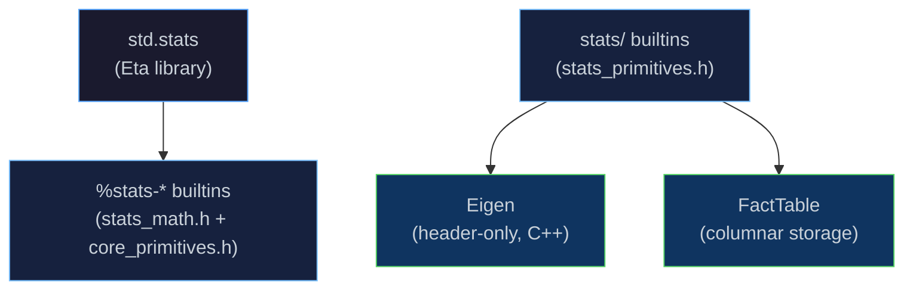

# Eigen: Linear Algebra & Statistics

[← Back to README](../README.md) · [Fact Tables](fact-table.md) ·
[AAD – Finance Examples](aad.md) · [Modules & Stdlib](modules.md) ·
[Runtime & GC](runtime.md) · [Next Steps](next-steps.md)

---

## Overview

Eta ships two complementary statistics layers:

| Layer | What it covers | Where it lives |
|-------|---------------|----------------|
| **`std.stats`** | Descriptive stats, CIs, t-tests, simple OLS — all over plain Eta lists | `stdlib/std/stats.eta` + `stats_math.h` |
| **`stats/` primitives** | Multivariate OLS, covariance/correlation matrices, column quantiles — over `FactTable` columns | `eta/stats/src/eta/stats/stats_primitives.h` backed by Eigen |

The `std.stats` module is part of the prelude; the Eigen-backed `stats/`
builtins are registered alongside it.

```scheme
(import std.stats)     ; descriptive stats on lists
; stats/ols-multi etc. are registered as global builtins (no extra import needed)
```

---

## The `std.stats` Module

All functions in `std.stats` operate on **Eta lists of numbers**.
The underlying `%stats-*` primitives are C++ builtins registered in
`core_primitives.h`; `std.stats` re-exports them under stable names.

```bash
etai examples/stats.eta
```

### Descriptive Statistics

| Function | Signature | Returns |
|----------|-----------|---------|
| `stats:mean` | `(xs)` | Arithmetic mean |
| `stats:variance` | `(xs)` | Sample variance (N-1) |
| `stats:stddev` | `(xs)` | Sample standard deviation |
| `stats:sem` | `(xs)` | Standard error of the mean |
| `stats:percentile` | `(xs p)` | p-th percentile (0 ≤ p ≤ 1) |
| `stats:median` | `(xs)` | 50th percentile |

```scheme
(import std.stats)

(define xs '(2.1 -1.4 3.8 0.5 -2.9 4.2 1.7 -0.8 2.6 3.1))

(stats:mean    xs)    ; => 1.29
(stats:stddev  xs)    ; => 2.397
(stats:median  xs)    ; => 1.9
(stats:percentile xs 0.25)  ; => -0.575
```

### Bivariate Statistics

| Function | Signature | Returns |
|----------|-----------|---------|
| `stats:covariance` | `(xs ys)` | Sample covariance |
| `stats:correlation` | `(xs ys)` | Pearson correlation coefficient |

```scheme
(stats:covariance  xs ys)   ; => -0.211
(stats:correlation xs ys)   ; => -0.287
```

### Confidence Intervals

`stats:ci` uses the t-distribution with N-1 degrees of freedom.  Returns a
`(lower . upper)` pair.

| Function | Signature | Returns |
|----------|-----------|---------|
| `stats:ci` | `(xs level)` | `(lower . upper)` pair for the mean |
| `stats:ci-lower` | `(ci)` | Lower bound |
| `stats:ci-upper` | `(ci)` | Upper bound |

```scheme
(let ((ci (stats:ci xs 0.95)))
  (display (stats:ci-lower ci))   ; e.g. -0.279
  (display (stats:ci-upper ci)))  ; e.g.  2.629
```

### Two-Sample Welch t-Test

`stats:t-test` performs Welch's two-sample t-test (unequal variances).
Returns a four-element list `(t-stat p-value df mean-diff)`.

| Function | Signature | Returns |
|----------|-----------|---------|
| `stats:t-test` | `(xs ys)` | `(t p df diff)` |
| `stats:t-test-stat` | `(result)` | t-statistic |
| `stats:t-test-pvalue` | `(result)` | two-tailed p-value |
| `stats:t-test-df` | `(result)` | Welch-Satterthwaite degrees of freedom |
| `stats:t-test-mean-diff` | `(result)` | mean(xs) – mean(ys) |

```scheme
(let ((r (stats:t-test xs ys)))
  (display (stats:t-test-stat   r))    ; t-statistic
  (display (stats:t-test-pvalue r))    ; p-value
  (if (< (stats:t-test-pvalue r) 0.05)
      (display "significant")
      (display "not significant")))
```

### T-Distribution Utilities

| Function | Signature | Returns |
|----------|-----------|---------|
| `stats:t-cdf` | `(t df)` | CDF of the t-distribution |
| `stats:t-quantile` | `(p df)` | Inverse CDF (quantile function) |

### Simple OLS Regression

`stats:ols` fits a univariate linear model `y = slope*x + intercept`.
Returns a ten-element list with coefficients, standard errors, t-statistics,
and p-values for both slope and intercept.

| Function | Signature | Returns |
|----------|-----------|---------|
| `stats:ols` | `(xs ys)` | `(slope intcpt r2 se-slope se-intcpt t-slope t-intcpt p-slope p-intcpt)` |
| `stats:ols-slope` | `(r)` | Slope coefficient |
| `stats:ols-intercept` | `(r)` | Intercept coefficient |
| `stats:ols-r2` | `(r)` | Coefficient of determination R² |
| `stats:ols-se-slope` | `(r)` | Standard error of slope |
| `stats:ols-se-intercept` | `(r)` | Standard error of intercept |
| `stats:ols-t-slope` | `(r)` | t-statistic for slope |
| `stats:ols-t-intercept` | `(r)` | t-statistic for intercept |
| `stats:ols-p-slope` | `(r)` | p-value for slope |
| `stats:ols-p-intercept` | `(r)` | p-value for intercept |

```scheme
(let ((r (stats:ols xs ys)))
  (display (stats:ols-slope     r))   ; slope
  (display (stats:ols-intercept r))   ; intercept
  (display (stats:ols-r2        r)))  ; R-squared
```

### Summary Helper

`stats:summary` returns a labelled alist of key statistics:

```scheme
(stats:summary xs)
; => ((n 10) (mean 1.29) (stddev 2.397) (sem 0.758)
;     (median 1.9) (min -2.9) (max 4.2) (ci-95 (-0.42 . 3.0)))
```

---

## Eigen-Backed Multivariate Primitives

The `stats/` builtins operate on [`FactTable`](fact-table.md) objects
and use **Eigen** for numerically stable linear algebra.

> [!NOTE]
> Eigen is a header-only C++ template library for linear algebra.  It is
> fetched automatically at CMake configure time via `FetchEigen.cmake`.
> No system installation is required.

### Column Selection

All `stats/` primitives accept a **list of column indices** (0-based integers)
to select which `FactTable` columns to operate on.

```scheme
;; columns 0 and 2 of a fact-table ft
(stats/mean-vec ft '(0 2))
```

### Column-Wise Means

```scheme
(stats/mean-vec fact-table col-index-list)
```

Returns a list of means — one value per selected column.

```scheme
(define ft (make-fact-table 3))
;; ... populate ft with rows ...
(stats/mean-vec ft '(0 1 2))   ; => (mean0 mean1 mean2)
```

### Column-Wise Variances

```scheme
(stats/var-vec fact-table col-index-list)
```

Returns a list of sample variances (N-1 denominator).

### Covariance Matrix

```scheme
(stats/cov fact-table col-index-list)
```

Returns the sample covariance matrix as a list-of-lists.
Computed via `(X-mu)^T (X-mu) / (n-1)` using Eigen dense matrices.

```scheme
(let ((cov (stats/cov ft '(0 1 2))))
  ;; cov is ((c00 c01 c02) (c10 c11 c12) (c20 c21 c22))
  (display (caar cov)))   ; variance of column 0
```

### Correlation Matrix

```scheme
(stats/cor fact-table col-index-list)
```

Returns the Pearson correlation matrix as a list-of-lists.
Diagonal entries are always 1.0.

### Column Quantiles

```scheme
(stats/quantile-vec fact-table col-index-list p)
```

Returns the `p`-th quantile (0 ≤ p ≤ 1) for each selected column.

```scheme
(stats/quantile-vec ft '(0 1) 0.5)   ; medians of columns 0 and 1
(stats/quantile-vec ft '(0 1) 0.95)  ; 95th percentiles
```

### Multivariate OLS

```scheme
(stats/ols-multi fact-table y-col x-col-index-list)
```

Fits the linear model `y = Xβ + ε` where `y` is column `y-col` and `X` is
built from the columns in `x-col-index-list` (plus an implicit intercept
column of 1s).

Uses **Eigen `ColPivHouseholderQR`** for numerical stability.  Returns an
alist with the following keys:

| Key | Value |
|-----|-------|
| `coefficients` | `(β₀ β₁ … βₖ)` — intercept first |
| `std-errors` | `(se₀ se₁ … seₖ)` |
| `t-stats` | `(t₀ t₁ … tₖ)` |
| `p-values` | `(p₀ p₁ … pₖ)` |
| `r-squared` | R² |
| `adj-r-squared` | Adjusted R² |
| `residual-se` | Residual standard error σ̂ |

```scheme
;; Regress column 3 on columns 0, 1, 2
(let ((r (stats/ols-multi ft 3 '(0 1 2))))
  (display (assoc 'coefficients r))
  (display (assoc 'r-squared    r))
  (display (assoc 'p-values     r)))
```

---

## Architecture



The two layers are independent:

- **`std.stats` / `%stats-*`** — operate on plain Eta lists; use hand-rolled
  C++ math in `stats_math.h`.

- **`stats/` / Eigen primitives** — operate on `FactTable` columns; use Eigen
  for numerically stable linear algebra.  Eigen is a header-only library
  fetched automatically at configure time; no system installation is needed.

---

## Example

[`examples/stats.eta`](../examples/stats.eta) demonstrates all of
`std.stats` using two simulated monthly return series (equity and bond):

```bash
etai examples/stats.eta
```

Expected output (abbreviated):

```
============================================================
 Descriptive Statistics
============================================================

Equity fund (monthly %):
  mean   = 1.175
  stddev = 2.28915
  SEM    = 0.660822
  median = 1.9

------------------------------------------------------------
 Two-sample Welch t-test  (H0: equal means)
------------------------------------------------------------
  t-statistic = 1.18636
  p-value     = 0.259546
  => Fail to reject H0 at 5%: insufficient evidence.

------------------------------------------------------------
 OLS Regression:  bond ~ equity
------------------------------------------------------------
  slope       = -0.0403348
  intercept   = 0.430727
  R-squared   = 0.082503
```

---

## Source Locations

| Component | File |
|-----------|------|
| `%stats-mean`, `%stats-variance`, `%stats-t-test-2`, `%stats-ols`, … | [`eta/core/src/eta/runtime/stats_math.h`](../eta/core/src/eta/runtime/stats_math.h) |
| `stats:mean`, `stats:stddev`, `stats:ci`, `stats:t-test`, `stats:ols`, … | [`stdlib/std/stats.eta`](../stdlib/std/stats.eta) |
| `stats/mean-vec`, `stats/cov`, `stats/cor`, `stats/ols-multi`, … | [`eta/stats/src/eta/stats/stats_primitives.h`](../eta/stats/src/eta/stats/stats_primitives.h) |
| Eigen fetch | [`cmake/FetchEigen.cmake`](../cmake/FetchEigen.cmake) |
| Example | [`examples/stats.eta`](../examples/stats.eta) |

