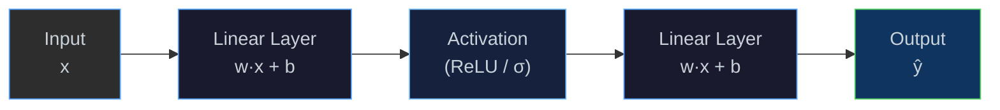
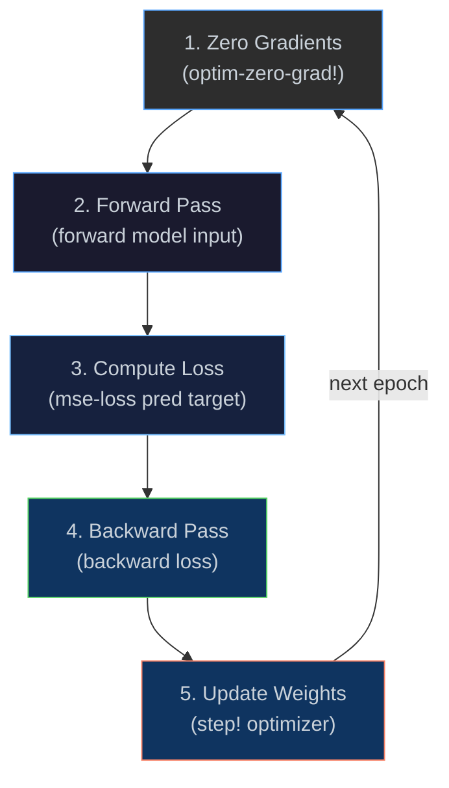
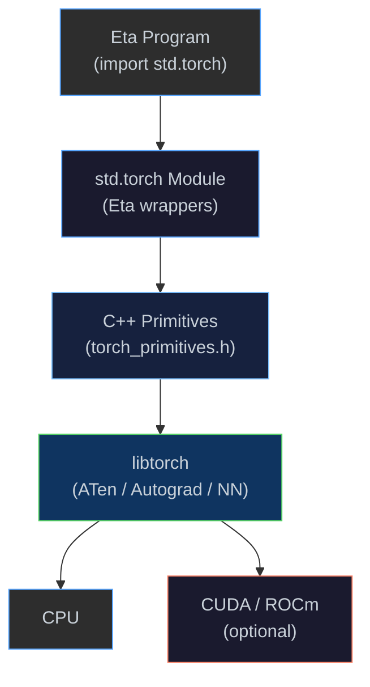
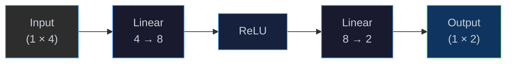
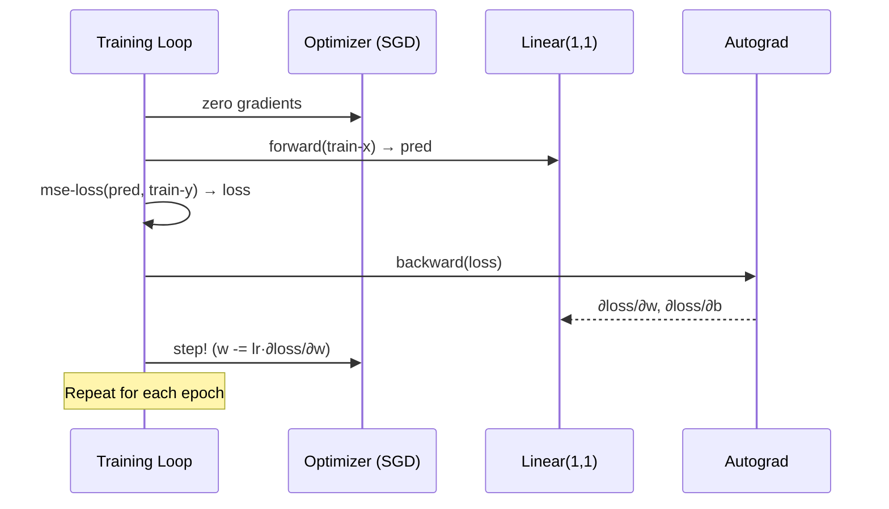

# Neural Networks with libtorch

[← Back to README](../README.md) · [AAD](aad.md) ·
[European Greeks](european.md) · [SABR](sabr.md) ·
[Modules & Stdlib](modules.md) · [Next Steps](next-steps.md)

---

## Overview

Eta integrates with **libtorch** — the C++ backend of PyTorch — to
provide GPU-accelerated tensor operations, automatic differentiation, and
a neural-network API directly from Eta code.  The integration is
implemented as native C++ bindings exposed through the `std.torch` module,
so there is no FFI overhead or marshalling boundary beyond a thin wrapper.

```bash
etai examples/torch.eta
```

> [!NOTE]
> Requires the interpreter to be built with `-DETA_BUILD_TORCH=ON`.
> libtorch is downloaded automatically at configure time (CPU ~200 MB).
> Pass `-DETA_TORCH_BACKEND=cu121` for CUDA support (~2 GB).

---

## What is a Neural Network?

A neural network is a function approximator composed of **layers** of
simple operations.  Each layer applies a linear transformation followed by
a non-linear **activation function**.  By adjusting the parameters
(weights and biases) through **gradient descent**, the network learns to
map inputs to desired outputs.



| Concept | Explanation |
|---------|-------------|
| **Tensor** | An n-dimensional array of numbers — the fundamental data structure for inputs, weights, and outputs. |
| **Linear Layer** | Computes `y = W·x + b` where **W** (weights) and **b** (bias) are learnable parameters. |
| **Activation** | A non-linear function (e.g. ReLU, sigmoid) applied element-wise, giving the network the power to learn non-linear mappings. |
| **Loss Function** | Measures how far the network's prediction is from the target (e.g. MSE, cross-entropy). |
| **Backpropagation** | Computes ∂loss/∂parameter for every parameter in one backward pass through the computation graph. |
| **Optimizer** | Updates parameters using the computed gradients (e.g. SGD, Adam). |

---

## Training Loop

Training a neural network repeats a fixed cycle until the loss converges:



Eta's `train-step!` helper wraps all five steps into a single call:

```scheme
(define loss (train-step! model optimizer loss-fn input target))
```

---

## Architecture — How Eta Talks to libtorch



Three new heap object kinds manage native libtorch resources through the
garbage collector:

| Heap Kind | Wraps | GC Behaviour |
|-----------|-------|--------------|
| **`TensorPtr`** | `torch::Tensor` | Reference-counted via libtorch's `intrusive_ptr`; destructor releases storage. |
| **`NNModulePtr`** | `torch::nn::Module` | Shared pointer to the module; destructor releases parameters. |
| **`OptimizerPtr`** | `torch::optim::Optimizer` | Shared pointer to the optimizer state. |

---

## Quick Start — Tensor Basics

```scheme
(module tensor-demo
  (import std.core)
  (import std.io)
  (import std.torch)
  (begin
    ;; Create tensors
    (define a (ones '(3)))           ;; [1, 1, 1]
    (define b (from-list '(2.0 3.0 4.0)))

    ;; Arithmetic
    (tensor-print (t+ a b))         ;; [3, 4, 5]
    (tensor-print (t* a b))         ;; [2, 3, 4]

    ;; Reductions
    (println (item (tsum b)))       ;; 9.0
    (println (item (mean b)))       ;; 3.0

    ;; Matrix multiply
    (define m1 (ones '(2 3)))
    (define m2 (ones '(3 4)))
    (println (shape (matmul m1 m2)))  ;; (2 4)
  ))
```

---

## Autograd — Automatic Differentiation

libtorch's autograd engine records operations on tensors that have
`requires-grad` enabled, building a computation graph that is traversed
in reverse by `backward` to compute gradients.

```scheme
;; y = x² at x = 3  →  dy/dx = 2x = 6
(define x (from-list '(3.0)))
(requires-grad! x #t)
(define y (t* x x))
(backward y)
(println (item (grad x)))          ;; 6.0
```

```scheme
;; Multivariate: f(x,y) = x·y at (2, 3)
;;   → ∂f/∂x = 3,  ∂f/∂y = 2
(define xa (from-list '(2.0)))
(define ya (from-list '(3.0)))
(requires-grad! xa #t)
(requires-grad! ya #t)
(backward (t* xa ya))
(println (item (grad xa)))         ;; 3.0
(println (item (grad ya)))         ;; 2.0
```

---

## Building a Neural Network

### Single Linear Layer

```scheme
(define layer (linear 4 2))       ;; 4 inputs → 2 outputs
(println (module? layer))          ;; #t
(println (length (parameters layer)))  ;; 2  (weight + bias)

(define out (forward layer (randn '(1 4))))
(println (shape out))              ;; (1 2)
```

### Multi-Layer Network

Stack layers with `sequential`:

```scheme
(define net (sequential
              (linear 4 8)
              (relu-layer)
              (linear 8 2)))

(define out (forward net (randn '(1 4))))
(println (shape out))              ;; (1 2)
```

This builds the following network:



---

## Complete Training Example — Learning y = 2x + 1

This example trains a single linear layer to approximate the function
**y = 2x + 1** using gradient descent with MSE loss.

```scheme
(module train-demo
  (import std.core)
  (import std.io)
  (import std.torch)
  (begin
    ;; ── Training data ────────────────────────────────────────────
    (define train-x (reshape (from-list '(1.0 2.0 3.0 4.0 5.0)) '(5 1)))
    (define train-y (reshape (from-list '(3.0 5.0 7.0 9.0 11.0)) '(5 1)))

    ;; ── Model: y ≈ w·x + b ──────────────────────────────────────
    (define model (linear 1 1))
    (define opt   (sgd model 0.01))

    ;; ── Training loop ────────────────────────────────────────────
    (display "epoch |   loss\n")
    (display "------+-----------\n")
    (letrec ((loop (lambda (epoch)
               (if (> epoch 200) 'done
                   (let ((loss (train-step! model opt mse-loss
                                            train-x train-y)))
                     (if (= (modulo epoch 50) 0)
                         (begin (display epoch)
                                (display "   |  ")
                                (println loss)))
                     (loop (+ epoch 1)))))))
      (loop 1))

    ;; ── Test predictions ─────────────────────────────────────────
    (define test-x (reshape (from-list '(6.0 7.0 10.0)) '(3 1)))
    (println (to-list (reshape (forward model test-x) '(3))))
    ;; Expected: values close to (13.0 15.0 21.0)
  ))
```

**What happens during training:**



---

## Optimizers

Eta exposes two optimizers from libtorch:

| Optimizer | Constructor | Description |
|-----------|------------|-------------|
| **SGD** | `(sgd model lr)` | Stochastic gradient descent — simple, robust, well-understood. |
| **Adam** | `(adam model lr)` | Adaptive moment estimation — maintains per-parameter learning rates; often converges faster. |

```scheme
;; SGD with learning rate 0.01
(define opt (sgd model 0.01))

;; Adam with learning rate 0.1
(define opt (adam model 0.1))
```

Both optimizers support the same interface:

```scheme
(optim-zero-grad! opt)   ;; clear accumulated gradients
(step! opt)              ;; apply one parameter update
(optimizer? opt)         ;; → #t
```

---

## Loss Functions

| Function | Eta Name | Formula |
|----------|----------|---------|
| **Mean Squared Error** | `mse-loss` | `(1/n) Σ (pred − target)²` |
| **L1 (Mean Absolute Error)** | `l1-loss` | `(1/n) Σ \|pred − target\|` |
| **Cross-Entropy** | `cross-entropy-loss` | `−Σ target · log(pred)` |

```scheme
(define pred   (from-list '(1.0 2.0 3.0)))
(define target (from-list '(2.0 2.0 2.0)))
(println (item (mse-loss pred target)))   ;; 0.666…
(println (item (l1-loss pred target)))    ;; 0.666…
```

---

## Device Management (GPU)

Tensors and modules can be moved between CPU and GPU:

```scheme
(println (gpu-available?))       ;; #t if CUDA is present
(println (gpu-count))            ;; number of GPUs

;; Move a tensor to GPU and back
(define t (ones '(3 3)))
(define t-gpu (to-gpu t))
(println (device t-gpu))         ;; "cuda:0"
(define t-cpu (to-cpu t-gpu))

;; Move an entire model to GPU
(nn-to-gpu model)
```

---

## `std.torch` API Reference

### Tensor Creation

| Function | Signature | Description |
|----------|-----------|-------------|
| `tensor` | `(val [requires-grad?])` | Scalar or list → tensor |
| `ones` | `(shape)` | Tensor filled with 1.0 |
| `zeros` | `(shape)` | Tensor filled with 0.0 |
| `randn` | `(shape)` | Tensor from normal distribution |
| `arange` | `(start end step)` | Range tensor |
| `linspace` | `(start end n)` | Evenly spaced points |
| `from-list` | `(list)` | Flat list → 1-D tensor |

### Arithmetic

| Function | Description |
|----------|-------------|
| `t+`, `t-`, `t*`, `t/` | Element-wise arithmetic |
| `matmul` | Matrix multiplication |
| `dot` | Dot product (flattened) |

### Unary Operations

| Function | Description |
|----------|-------------|
| `neg`, `tabs` | Negation, absolute value |
| `texp`, `tlog`, `tsqrt` | exp, log, √ |
| `relu`, `sigmoid`, `ttanh` | Activation functions |
| `softmax` | `(t dim)` — softmax along dimension |

### Shape Operations

| Function | Signature | Description |
|----------|-----------|-------------|
| `shape` | `(t)` | Shape as a list of fixnums |
| `reshape` | `(t shape)` | Reshape tensor |
| `transpose` | `(t d0 d1)` | Swap two dimensions |
| `squeeze` / `unsqueeze` | `(t [dim])` | Remove / add size-1 dimension |
| `cat` | `(tensor-list dim)` | Concatenate along dimension |

### Reductions

| Function | Description |
|----------|-------------|
| `tsum`, `mean` | Sum, mean of all elements |
| `tmax`, `tmin` | Maximum, minimum |
| `argmax`, `argmin` | Index of max / min |

### Conversion

| Function | Description |
|----------|-------------|
| `item` | Scalar tensor → Eta number |
| `to-list` | Flat tensor → Eta list |
| `numel` | Number of elements |

### Autograd

| Function | Description |
|----------|-------------|
| `requires-grad!` | `(t flag)` — enable/disable gradient tracking |
| `requires-grad?` | `(t)` — query gradient tracking |
| `detach` | `(t)` — detach from computation graph |
| `backward` | `(t)` — run backpropagation |
| `grad` | `(t)` — read accumulated gradient |
| `zero-grad!` | `(t)` — reset gradient to zero |

### Neural Network Layers

| Function | Description |
|----------|-------------|
| `linear` | `(in out)` — fully connected layer |
| `sequential` | `(layer ...)` — stack layers |
| `relu-layer` | `()` — ReLU activation module |
| `sigmoid-layer` | `()` — Sigmoid activation module |
| `dropout` | `(rate)` — dropout regularisation |
| `forward` | `(module tensor)` — forward pass |
| `parameters` | `(module)` — list of parameter tensors |
| `train!` / `eval!` | `(module)` — set training / evaluation mode |

### Serialization

| Function | Description |
|----------|-------------|
| `tensor-save` | `(t path)` — save tensor to file |
| `tensor-load` | `(path)` — load tensor from file |
| `tensor-print` | `(t)` — display tensor to stdout |

---

## Building with Torch Support

### CMake Options

```bash
cmake -B build -DETA_BUILD_TORCH=ON          # CPU-only (auto-downloads libtorch)
cmake -B build -DETA_BUILD_TORCH=ON -DETA_TORCH_BACKEND=cu121  # CUDA 12.1
```

| Option | Default | Description |
|--------|---------|-------------|
| `ETA_BUILD_TORCH` | `OFF` | Enable libtorch integration |
| `ETA_TORCH_BACKEND` | `cpu` | `cpu`, `cu118`, `cu121`, or `cu124` |
| `ETA_LIBTORCH_VER` | `2.5.1` | libtorch version to download |

If libtorch is not found by `find_package(Torch)`, the build system
automatically downloads the official pre-built archive from
`download.pytorch.org`.  The download is cached in the build directory, so
re-configures do not re-download.

### Manual libtorch

If you prefer to manage libtorch yourself:

```bash
cmake -B build -DETA_BUILD_TORCH=ON -DTorch_DIR=/path/to/libtorch/share/cmake/Torch
```

---

## Implementation Notes

The integration is structured as three layers:

1. **`eta/torch/`** — C++ header-only library
   ([`torch_primitives.h`](../eta/torch/src/eta/torch/torch_primitives.h))
   that registers ~60 builtins with the VM's `BuiltinEnvironment`.

2. **`stdlib/std/torch.eta`** — Eta wrapper module that re-exports the
   builtins under clean names (`t+`, `matmul`, `forward`, etc.) and
   provides the `train-step!` helper.

3. **`examples/torch.eta`** — End-to-end example covering tensor creation,
   autograd, network construction, and training with both SGD and Adam.

The C++ primitives handle type marshalling between NaN-boxed `LispVal`
values and libtorch's `torch::Tensor` / `torch::nn::Module` /
`torch::optim::Optimizer` types through three dedicated heap object kinds
(`TensorPtr`, `NNModulePtr`, `OptimizerPtr`), each with a destructor that
runs when the GC collects the wrapper.

